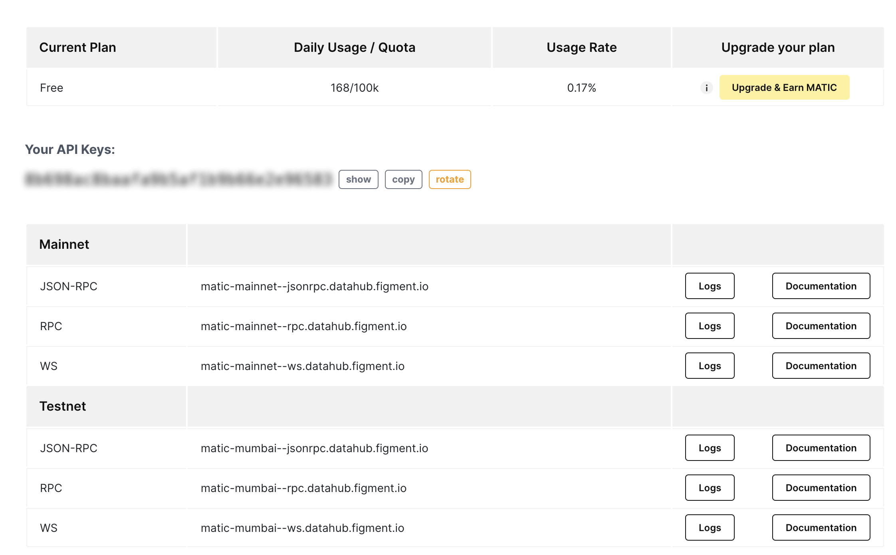
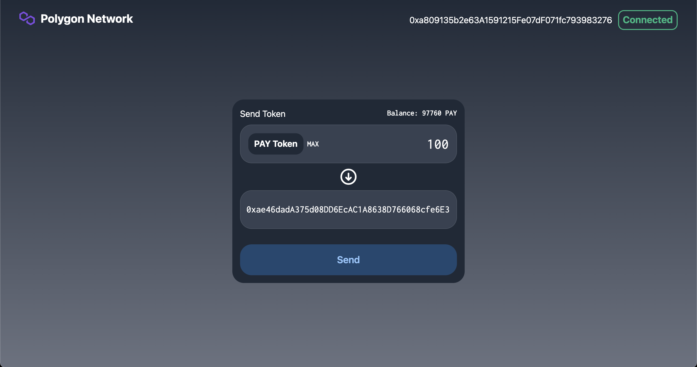

## Introduction

This tutorial will learn how to create a Peer-to-Peer payment dApp and deploy our smart contract on Polygon Network. We will first create an ERC20 token smart contract and use this token in our payment dApp to send to other addresses.

This is part one of a two-part tutorial. In this part, we will learn how to send payments using a single token. The second part will cover how to add other tokens to our payment dApp.

This is what the dApp we will be creating looks like:


## Prerequisites

To successfully follow this tutorial, you will need fundamental knowledge and understanding of Blockchain technology, Solidity programming language, and ERC20 tokens.

We will be using [web3.js](https://web3js.readthedocs.io/en/v1.5.2/) to connect to Polygon and the [Next.js](https://nextjs.org/) framework for the frontend. It's recommended to learn the basics of Next.js before continuing.

## Requirements

[Truffle](https://github.com/trufflesuite/truffle) - Truffle provides a local development environment for creating and testing blockchain applications.
[Metamask](https://metamask.io) - You will need Metamask wallet installed in your browser.
[NodeJs](https://nodejs.org/en/) - You must have a recent version of Node.js installed. We recommend using v14.17.6 LTS.
[Figment DataHub](https://figment.io/datahub/) account - We will be using DataHub's Polygon RPC URL to deploy the smart contract.

Topics covered in this tutorial:

- Setting up development for Solidity and NextJs.
- Creating an ERC20 token smart contract.
- Deploying the smart contract to Polygon Testnet.
- Linking smart contract to frontend using web3js
- Creating UI using TailwindCSS.

## Project Setup

Run the following commands in the terminal to install required packages and create project directories.

```text
npm install -g truffle
npx create-next-app --typescript payment-dapp
cd payment-dapp
truffle init
yarn add @openzeppelin/contracts @truffle/hdwallet-provider web3 dotenv tailwindcss
```

The command `npx create-next-app` will create a basic Next.js project with typescript support, and `truffle init` will scaffold a Truffle project.

The code libraries `@openzeppelin/contracts`, `@truffle/hdwallet-provider`, and `web3` will be used to create, deploy and integrate our smart contract. `dotenv` is for dealing with environment variables, and `tailwindcss` is used for UI styling.

## Creating a smart contract

Create a new file called `PaymentToken.sol` in the `contracts` directory and add the following code:

```javascript
// SPDX-License-Identifier: GPL-3.0
pragma solidity ^0.8.6;
import "@openzeppelin/contracts/token/ERC20/ERC20.sol";

contract PaymentToken is ERC20 {
    address public owner;

    constructor() ERC20("Payment Token", "PAY") {
        owner = msg.sender;
        _mint(msg.sender, 100000 * 10**18);
    }

    function mint(address to, uint256 amount) external {
        require(msg.sender == owner, "Only owner can mint");
        _mint(to, amount);
    }
}
```

We create a new ERC20 token using the OpenZeppelin ERC20 contract called **Payment Token**. This is the token we will use to make payments in our peer-to-peer payment dApp.

In the constructor of our contract, we are minting and sending **100,000** PAY tokens to the contract's **owner**, the account deploying the contract.

Since `PaymentToken` is an ERC20 token and we are using OpenZeppelin's ERC20 contract, we have a few ready-made functions like `transfer`, `approve`, `allowance`, etc. We will be looking into the `transfer` function in our dApp, and come back to this when we start our frontend.

## Compiling and deploying with Truffle

Now that we have our ERC20 token ready, we have to make few changes to compile and deploy our token.

Go to the `migrations` directory, create a new file `2_payment_token_migration.js` and add the following code:

```javascript
const PaymentToken = artifacts.require('PaymentToken');

module.exports = function (deployer) {
  deployer.deploy(PaymentToken);
};
```

Before running the deployment command, we need to get a Polygon RPC URL and API key from DataHub. Create an account on [DataHub](https://datahub.figment.io/), head over to the Polygon section, and copy your API key.



Create a `.env` file in the root directory of your project (`/payment-dapp/`) and paste the key after the name of the environment variable as shown below:

```text
DATAHUB_POLYGON_API=paste your API key here
```

Now we need to get the Secret Recovery Phrase (mnemonic) of the account we will be using to deploy the smart contract. Go to your Metamask extension and get your account's mnemonic; if you don't know how to get your mnemonic, [follow this tutorial](https://metamask.zendesk.com/hc/en-us/articles/360015290032-How-to-reveal-your-Secret-Recovery-Phrase).

Once you have your mnemonic, create a file called `.secret` in the project root directory (`/payment-dapp/.secret`) and paste your mnemonic there. Make sure you add `.secret` to your `.gitignore` file so that your mnemonic is not added into your `git` history or uploaded to GitHub by accident.

To deploy our contract to Polygon testnet, we need to have some MATIC tokens in our account to pay for gas fees. To get some testnet MATIC tokens, go to the [Polygon Faucet](https://faucet.polygon.technology/) to get 0.1 MATIC in your account, which is more than enough to deploy the contract as gas fees are very cheap on the Polygon network.

Next, open `truffle-config.js`, delete the existing content and then add the following code:

```js
const HDWalletProvider = require('@truffle/hdwallet-provider');
const fs = require('fs');
const mnemonic = fs.readFileSync('.secret').toString().trim();
require('dotenv').config();

module.exports = {
  networks: {
    development: {
      host: 'localhost',
      port: 7545,
      network_id: '*',
    },
    matic: {
      provider: () =>
        new HDWalletProvider(
          mnemonic,
          `https://matic-mumbai--rpc.datahub.figment.io/apikey/${process.env.DATAHUB_POLYGON_API}}/`,
        ),
      network_id: 80001,
      confirmations: 2,
      timeoutBlocks: 200,
      skipDryRun: true,
      chainId: 80001,
    },
  },
  contracts_directory: './contracts',
  contracts_build_directory: './abis',
  compilers: {
    solc: {
      version: '^0.8.6',
      optimizer: {
        enabled: true,
        runs: 200,
      },
    },
  },

  db: {
    enabled: false,
  },
};
```

We use `@truffle/hdwallet-provider` and `mnemonic` to use our funded testnet account and pay for gas fees. Truffle's wallet provider allows us to use the same account that we have in our Metamask using either a private key or mnemonic.

Next, we are creating a provider with RPC URL, chain ID, and Truffle provider. Chain ID and other information relevant to the Polygon network can be found [here](https://docs.polygon.technology/docs/develop/metamask/config-polygon-on-metamask).

To compile and deploy the smart contract run the following command,

```text
truffle compile

truffle deploy --network matic
```

## Create the frontend and integrate the smart contract

Now that we are done with the smart contract and have created our token, it's time to develop the frontend and integrate our contract using web3js.

We will create a context for the contract calls and provide all the data and functions through it. Create a file called `DataContext.tsx` inside `context` directory.

`context/DataContext.tsx`

```javascript
declare let window: any;
import { createContext, useContext, useState } from "react";
import Web3 from "web3";
import PaymentToken from "../abis/PaymentToken.json";

interface DataContextProps {
  account: string;
  loading: boolean;
  loadWallet: () => Promise<void>;
  sendPayment: ({
    amount,
    toAddress,
  }: {
    amount: any;
    toAddress: any;
  }) => Promise<any>;
  balance: number;
}

const DataContext = createContext<DataContextProps | null>(null);

export const DataProvider: React.FC = ({ children }) => {
  const data = useProviderData();

  return <DataContext.Provider value={data}>{children}</DataContext.Provider>;
};

export const useData = () => useContext<DataContextProps | null>(DataContext);
```

Here we create an interface for our context and an `useData` function to easily use context in our components.

```javascript
export const useProviderData = () => {
  const [loading, setLoading] = useState(true);
  const [account, setAccount] = useState<string>();
  const [paymentToken, setPaymentToken] = useState<any>();
  const [balance, setBalance] = useState<number>();

  const loadWallet = async () => {
    if (window.ethereum) {
      window.web3 = new Web3(window.ethereum);
      await window.ethereum.enable();
      const web3 = window.web3;
      var allAccounts = await web3.eth.getAccounts();
      setAccount(allAccounts[0]);

      const paymentTokenData = PaymentToken.networks["80001"];
      if (paymentTokenData) {
        var paymentTokenInstance = new web3.eth.Contract(
          PaymentToken.abi,
          paymentTokenData.address
        );
        setPaymentToken(paymentTokenInstance);
        var bal = await paymentTokenInstance.methods
          .balanceOf(allAccounts[0])
          .call();
        setBalance(bal);
      } else {
        window.alert("TestNet not found");
      }
      setLoading(false);
    } else {
      window.alert("Non-Eth browser detected. Please consider using MetaMask.");
    }
  };

  const sendPayment = async ({ amount, toAddress }) => {
    try {
      const amountInWei = window.web3.utils.toWei(amount, "ether");
      var bal = await paymentToken.methods.balanceOf(account).call();
      if (bal < amountInWei) {
        return "You don't have enough balance";
      }
      const txHash = await paymentToken.methods
        .transfer(toAddress, amountInWei)
        .send({
          from: account,
        });
      var bal = await paymentToken.methods.balanceOf(account).call();
      setBalance(bal);
      return "Payment success";
    } catch (e) {
      return e.message;
    }
  };

  return {
    account,
    loading,
    loadWallet,
    sendPayment,
    balance,
  };
};
```

In `useProviderData` we are creating two functions - `loadWallet` and `sendPayment`.
In `loadWallet`, we are fetching all the accounts present in our web3 provider (Metamask in our case).
Create an instance of the `PaymentToken` contract instance using the ABI from the `abis` directory.
Then we will fetch the balance of the logged-in account using the `balanceOf` function available in ERC20 tokens.

> You can also see the token balance in Metamask. Click on the `Add Token` button and enter the `PaymentToken` contract address. You can get the address of the deployed contract either from contract ABI or from the terminal when you deployed the contract.

In `sendPayment`, we accept the amount to tokens and the receiver address as a parameter and convert the amount into Wei.
Get the user's current balance and check if the balance is greater than the amount requested to transfer.
If the balance is greater than the amount requested, we call the `transfer` function on our smart contract instance and pass in receiver address and amount in Wei.
Since this is a transaction, we need to call the `send` function on the `transfer` call and pass in the `from` parameter to pay the gas fees for the transaction.

## Creating UI with TailwindCSS

First, we will create the Navbar, which will contain a button to connect to the Metamask wallet and show the current address from Metamask. Create a file called `Navbar.tsx` in `components` directory.

```javascript
import React from 'react';
import { useData } from '../contexts/DataContext';

function Navbar() {
  const { account, loadWallet } = useData();
  return (
    <>
      <header className="flex md:flex-row flex-col px-3 lg:px-10 justify-between items-center pt-5 space-y-2">
        <div className="flex flex-row items-center">
          
          <span className="text-2xl font-bold text-white">Polygon Network</span>
        </div>
        {account ? (
          <div className="flex flex-row space-x-3 items-center text-white text-lg">
            <span>{account}</span>
            <div className="px-2 py-1 border-2 border-green-500 rounded-xl cursor-pointer text-center">
              <span className="text-xl font-bold text-green-500">
                Connected
              </span>
            </div>
          </div>
        ) : (
          <div
            className="px-2 py-1 border-2 border-red-500 rounded-xl cursor-pointer text-center"
            onClick={() => {
              loadWallet();
            }}
          >
            <span className="text-xl font-bold text-red-500">Connect</span>
          </div>
        )}
      </header>
    </>
  );
}

export default Navbar;
```

Here, we check to see if we have an account address, then show the address; otherwise, we offer the connect button to connect Metamask.

To create the main UI, open `pages/index.tsx` and add the following code.

```javascript
import Head from 'next/head';
import { useState } from 'react';
import Web3 from 'web3';
import Navbar from '../components/Navbar';
import { useData } from '../contexts/DataContext';

export default function Home() {
  const { account, loadWallet, sendPayment, balance } = useData();

  const [toAddress, setToAddress] = useState('');
  const [amount, setAmount] = useState('');
  const [error, setError] = useState('');
  const [button, setButton] = useState('Send');

  return (
    <div className="flex flex-col min-h-screen justify-start bg-gradient-to-b from-gray-800  to-gray-500">
      <Head>
        <title>Peer-to-Peer Payment dApp</title>
        <link rel="icon" href="/favicon.ico" />
      </Head>
      <Navbar />

      <main className="mt-36 flex justify-center items-start">
        <div className="w-full md:w-2/6 bg-gray-800 rounded-3xl p-4 mx-3">
          <div className="flex flex-col items-center space-y-2">
            <div className="w-full flex flex-row justify-between">
              <span className="text-white text-lg text-start">Send Token</span>
              <span className="text-white text-base text-start font-bold font-inconsolata">
                {balance &&
                  `Balance: ${Web3.utils.fromWei(
                    balance.toString(),
                    'ether',
                  )} PAY`}
              </span>
            </div>
            <div className="bg-gray-700 h-20 w-full my-1 border border-gray-600 rounded-3xl flex flex-row justify-between items-center px-4">
              <div className="flex flex-row items-center space-x-2">
                <div className="px-3 py-2 bg-gray-800 rounded-2xl flex flex-row items-center">
                  <span className="text-white text-lg font-bold">
                    PAY Token
                  </span>
                </div>
                <span
                  className="text-white text-base font-bold font-inconsolata cursor-pointer"
                  onClick={() => {
                    setAmount(
                      Web3.utils
                        .fromWei(balance.toString(), 'ether')
                        .toString(),
                    );
                  }}
                >
                  MAX
                </span>
              </div>
              <input
                className="font-inconsolata text-3xl text-white bg-transparent w-2/4 text-right outline-none"
                placeholder="0.0"
                value={amount}
                onChange={e => {
                  setAmount(e.target.value);
                }}
              />
            </div>
            <svg
              xmlns="http://www.w3.org/2000/svg"
              className="h-10 w-10"
              fill="none"
              viewBox="0 0 24 24"
              stroke="#fff"
            >
              <path
                strokeLinecap="round"
                strokeLinejoin="round"
                strokeWidth={2}
                d="M15 13l-3 3m0 0l-3-3m3 3V8m0 13a9 9 0 110-18 9 9 0 010 18z"
              />
            </svg>
            <div className="bg-gray-700 h-20 w-full my-1 border border-gray-600 rounded-3xl flex flex-row justify-between items-center px-3">
              <input
                className="w-full font-inconsolata text-xl text-white bg-transparent outline-none"
                placeholder="Destination Address"
                value={toAddress}
                onChange={e => {
                  setToAddress(e.target.value);
                }}
              />
            </div>
            <div className="h-4" />
            <div
              className="h-16 w-full rounded-3xl flex justify-center items-center cursor-pointer"
              style={{ backgroundColor: '#214770' }}
              onClick={async () => {
                setError('');
                if (!account) {
                  setError('Please connect your wallet');
                } else if (amount === '') {
                  setError('Please set amount');
                } else if (toAddress === '') {
                  setError('Please set destination address');
                } else {
                  setButton('Sending...');
                  var msg = await sendPayment({ amount, toAddress });
                  if ((await msg) === 'Payment success') {
                    setAmount('');
                    setToAddress('');
                    setButton('Payment Success');
                    setTimeout(() => {
                      setButton('Send');
                    }, 1000);
                    setError('');
                  } else {
                    setError(msg);
                  }
                }
              }}
            >
              <span className="font-semibold text-xl text-blue-300">
                {button}
              </span>
            </div>
            {error && <span className="text-red-600 font-bold">*{error}</span>}
          </div>
        </div>
      </main>
    </div>
  );
}
```

Here we are creating two text fields and a button. One text field accepts the number of tokens to transfer, and the other text field accepts the receiver's address. We also show the current balance of the account above the text field and a button to select the max amount of tokens available in the wallet.

When the user clicks on the **Send** button, we call the `sendPayment` function from our context, which will send the token to the receiver's address and update the new balance of the current account in the UI.

We are finished with the UI now, and this is how the payment gateway should look:



## Conclusion

Congratulations on finishing the tutorial! Thank you for taking the time to complete it. In this tutorial, we learned how to create an ERC20 token, deploy it to Polygon testnet and make a frontend dApp for payment gateway. In the next part of this tutorial, we will see how to extend the capabilities of this dApp and add more already existing tokens on the Polygon network to our payment dApp.

## About the author

I'm Viral Sangani, a tech enthusiast working on blockchain projects & love the Web3 community. Feel free to connect with me on [GitHub](https://github.com/viral-sangani).
