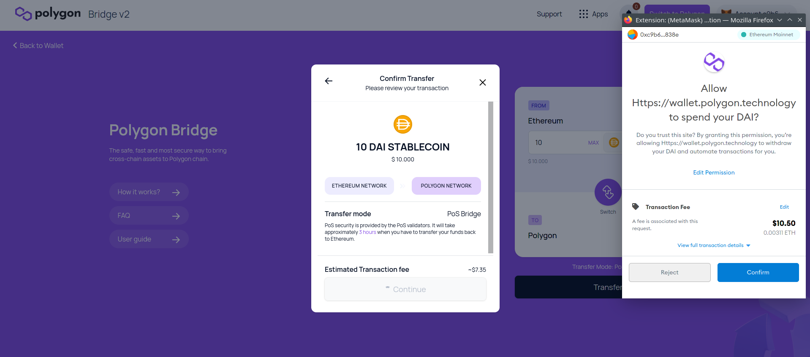

# Introduction

In this tutorial, we will go through the process of transferring an ERC-20 custom token to the Polygon (Matic) chain, using the Polygon PoS SDK.\
We will use the **Ethereum Goerli** testnet and **Polygon Mumbai** testnet, and a custom ERC-20 token that has been deployed and had its source code verified on Etherscan. There is [a step by step guide](https://github.com/mlibre/blockchain/tree/master/Ethereum/ERC20) written by the author of this tutorial.\
The Polygon Proof of Stake (PoS) Bridge is a mechanism and set of contracts on both Ethereum and Polygon that will help us in moving assets between the **root** chain and **child** chain.\
In contrast with the [Plasma Bridge](https://docs.matic.network/docs/develop/ethereum-matic/plasma/getting-started/), the Polygon PoS bridge is much faster and makes it a better option for dApps that are looking for faster withdrawals.

# Prerequisites

In this tutorial, We will use Metamask as our wallet. If you are not familiar with it or don't know how to use it, check [this video on youtube](https://www.youtube.com/watch?v=Af_lQ1zUnoM).\
When you are creating a Metamask wallet, it gives you a Secret Recovery Phrase (Seed). With this seed, you can recover **all** of your accounts in Metamask.\
We will use this seed later in this tutorial. here is an article about [How to reveal your Secret Recovery Phrase](https://metamask.zendesk.com/hc/en-us/articles/360015290032-How-to-reveal-your-Secret-Recovery-Phrase)

# Requirements

- [**Metamask**](https://metamask.io/)
- [**Nodejs**](https://nodejs.org/en/download/) v14.17.6 LTS or higher installed
- [**Geth**](https://geth.ethereum.org/docs/install-and-build/installing-geth): version 1.10.8

# Getting started

In order to transfer assets between **root** (Ethereum) and **child** (Polygon) contracts, they should be mapped first. This is a process by which an existing token contract is mirrored between the root and child chain.\
If the token you intend to transfer already exists on **Polygon**, this means you don't need to perform the **mapping**. Check the [official docs](https://docs.matic.network/docs/develop/ethereum-matic/submit-mapping-request) to learn about the mapping process.

Now that contracts are mapped. it's time to transfer the assets. We can either use the [Polygon Wallet UI](https://wallet.polygon.technology/login/) or the [Polygon SDK](https://polygon.technology/polygon-sdk/)

- We use the SDK for our ERC-20 token that is deployed on the **Goerli** testnet
- We use the [Polygon Wallet UI](https://wallet.polygon.technology/login/) for tokens that are deployed on Ethereum mainnet

# Setting up Metamask

Before we get into the details of moving the tokens, let's set up **Metamask** so we can check our **ETH**, **MATIC** and **MLB** token balances.

## Goerli

The Goerli testnet is pre-configured in Metamask's list of available networks. You can select it from the dropdown list at the top of the Metamask interface.

You can fund your account with testnet Ether from the [Goerli Authenticated faucet](https://faucet.goerli.mudit.blog/) as long as you are willing to make a post on a valid Twitter or Facebook account. If this is not something you wish to do, there is an alternative faucet at [goerli-faucet.slock.it](https://goerli-faucet.slock.it/)

## Mumbai

You can either open [mumbai.polygonscan.com](https://mumbai.polygonscan.com/) and click on "Add Mumbai Network" in the footer at the bottom of the page, _or_ add it manually using the following information:

- **Network Name:** Polygon Mumbai testnet
- **RPC URL:** https://rpc-mumbai.maticvigil.com/
- **Chain ID:** 80001
- **Currency Symbol:** MATIC
- **Block Explorer URL:** https://mumbai.polygonscan.com/


You can fund your **Mumbai** account with MATIC [here](https://faucet.polygon.technology)

# MLB ERC20 Contract

**MLB** is the symbol of the token (deployed on the Goerli testnet) that we'll map and transfer, which is a standard OpenZeppelin ERC-20 token.\
You can find a step by step guide to creating an ERC-20 token [here](https://github.com/mlibre/blockchain/tree/master/Ethereum/ERC20)

Token info:

```text
Name: Mlibre
Symbol: MLB
Owner: 0xD8f24D419153E5D03d614C5155f900f4B5C8A65C
Contract Address: 0xd2d40892B3EebdA85e4A2742A97CA787559BF92f
Goerli etherscan: https://goerli.etherscan.io/address/0xd2d40892B3EebdA85e4A2742A97CA787559BF92f
```

Gather this information for the token you intend to map.

# Mapping

Now that everything is ready. Let's map our `MLB` token.

- Go to [mapper.matic.today](https://mapper.matic.today/map/) and complete the form

- Make sure the token you want to map has had its [contract verfied](https://etherscan.io/verifyContract) on Etherscan

- Choose **Gorli Testnet -> Mumbai testnet**

  

- At this time the mapping process is not immediate, it can take up to 3 days to be confirmed.

Then open [mapper.matic.today](https://mapper.matic.today/), and enter the contract address to see if it has been added.


As you may notice, the contract address in Goerli and Mumbai are not the same. Let's remember to add it to Metamask so it shows up when we are connected to Mumbai as well.

1.  Open Metamask
2.  Select the Mumbai testnet from the list of available networks
3.  Add Token
4.  Paste the contract address there (`0x0F6886ca4476D3aAb965F2D1b9185F2dd857E653`)

Now it should be something like:


We don't yet have any MLB tokens on Mumbai. We can transfer some across the bridge and check our Metamask balance again afterward.

# Transfer using SDK

Let's take a look at the workflow for transferring tokens with the SDK:

1.  **Approve:** The owner of the token has to approve the **Ethereum Predicate Contract** which will **lock** the amount of token they want to transfer to Polygon.
2.  **Deposit:** Then a function has to be called on the `RootChainManger` contract which will trigger the `ChildChainManager` contract on the Mumbai testnet. The `ChildChainManager` contract will then call the **deposit** function of the `Child token` contract.\
    **Child** contract is the copy of the **Goerli** token contract in **Mumbai**.

## Providers

To Interact with **Goerli** and **Mumbai** we can either run a local node (which is slightly more difficult) or use the RPC endpoints of infrastructure providers like DataHub or Infura (which is much simpler).

For **Goerli**, we will run a local Geth node. You can also use [infura](https://infura.io).\
For **Mumbai**, we will use [DataHub](https://datahub.figment.io/)

### Goerli

[Install the Geth client](https://geth.ethereum.org/docs/install-and-build/installing-geth), if you have not installed it already, then run:

```text
geth --goerli --http --syncmode=light --http.api="eth,net,web3,personal,txpool" --allow-insecure-unlock  --http.corsdomain "*"
```

The default endpoint is `127.0.0.1:8545`.\
You can get attached and see if everything is fine:

```text
geth attach http://127.0.0.1:8545
eth.getBalance("0xD8f24D419153E5D03d614C5155f900f4B5C8A65C")
```

### Mumbai

- Sign up for a [DataHub](https://datahub.figment.io/)
- Choose the Polygon service from the [DataHub Services Dashboard](https://datahub.figment.io/services/Polygon/)
- Scroll down to see the Polygon endpoint URLs
- Copy the Mumbai Testnet JSONRPC URL. It is probably located [here](https://datahub.figment.io/services/Polygon/matic-mumbai--jsonrpc)
- Form the URL like so, replacing the text YOUR_API_KEY with the API key you got from DataHub:
  `https://matic-mumbai--jsonrpc.datahub.figment.io/apikey/YOUR_API_KEY/`

# Installing helpers

Now that we have the information we need and the other important pieces in place, we can write some useful code using the maticjs client library and the HDWalletProvider class from Truffle.\
We will need to install both of these packages on the commandline with the node package manager. Use these commands to install the packages and save them in the project manifest, `package.json`:

```text
npm install @maticnetwork/maticjs --save
npm install @truffle/hdwallet-provider --save
```

# Approve ERC20 for deposit

To **approve** the **Ethereum Predicate Contract** we just need to call the `approveERC20ForDeposit` function. The code for this is straightforward:

```javascript
await maticPOSClient.approveERC20ForDeposit(rootToken, amount.toString(), {
  from,
  gasPrice: '10000000000',
});
```

# Deposit ERC20

Next, we would call the `depositERC20ForUser` function of the **Ethereum Predicate Contract**:

```javascript
await maticPOSClient.depositERC20ForUser(rootToken, from, amount.toString(), {
  from,
  gasPrice: '10000000000',
});
```

To bring it all together in JavaScript that can be executed either in a web browser or on the commandline, we can add some constants and use an external file to hold the sensitive API keys and wallet seed phrases. This is a complete example of how to use maticjs and the HDWalletProvider class to communicate with a deployed smart contract on Polygon. Use the following code as a guide for building your own solution!

```javascript
// main.js
import { HDWalletProvider } from '@truffle/hdwallet-provider';
import { MaticPOSClient } from '@maticnetwork/maticjs');
import { secrets } from './secrets.json'

const from = "0xD8f24D419153E5D03d614C5155f900f4B5C8A65C";
const rootToken = "0xd2d40892B3EebdA85e4A2742A97CA787559BF92f";
const amount = 999 * (10 ** 18);

const parentProvider = new HDWalletProvider(secrets.seed, 'http://127.0.0.1:8545'); // Local Geth client address
const maticProvider = new HDWalletProvider(secrets.seed, secrets.mumbai)  // DataHub Mumbai Testnet JSONRPC URL

const maticPOSClient = new MaticPOSClient({
  network: "testnet",
  version: "mumbai",
  parentProvider,
  maticProvider,
});

(async () => {
  try {
    let result = await maticPOSClient.approveERC20ForDeposit(
      rootToken,
      amount.toString(),
      {
        from,
        gasPrice: "10000000000",
      }
    );
    let result_2 = await maticPOSClient.depositERC20ForUser(
      rootToken,
      from,
      amount.toString(),
      {
        from,
        gasPrice: "10000000000",
      }
    );
    console.log(result);
    console.log(result_2);
  } catch (error) {
    console.log(error);
  }
})();
```

Expected output for **approveERC20ForDeposit** is something like this:

```javascript
{
  blockHash: '0x9616fab5f19fb93580fe5dc71da9062168f1f1f5a4a5297094cad0b2b3e2dceb',
  blockNumber: 5513011,
  contractAddress: null,
  cumulativeGasUsed: 46263,
  effectiveGasPrice: '0x2540be400',
  from: '0xd8f24d419153e5d03d614c5155f900f4b5c8a65c',
  gasUsed: 46263,
  logsBloom: '0x0000000000000000000000000000000000000000000000800000000000000000000080000000000000000000000000000000000000000000000000000000000000010000000000000000000000000000000000000010000000000000000000000',
  status: true,
  to: '0xd2d40892b3eebda85e4a2742a97ca787559bf92f',
  transactionHash: '0x3aba80ae8938ed1abbb18560cb061f4915d202a731e5e2ec443aded67169e28a',
  transactionIndex: 0,
  type: '0x0',
  events: {
    Approval: {
      address: '0xd2d40892B3EebdA85e4A2742A97CA787559BF92f',
      blockNumber: 5513011,
      transactionHash: '0x3aba80ae8938ed1abbb18560cb061f4915d202a731e5e2ec443aded67169e28a',
      transactionIndex: 0,
      blockHash: '0x9616fab5f19fb93580fe5dc71da9062168f1f1f5a4a5297094cad0b2b3e2dceb',
      logIndex: 0,
      removed: false,
      id: 'log_0e714fbf',
      returnValues: [Result],
      event: 'Approval',
      signature: '0x8c5be1e5ebec7d5bd14f71427d1e84f3dd0314c0f7b2291e5b200ac8c7c3b925',
      raw: [Object]
    }
  }
}
```

And for **depositERC20ForUser**:

```javascript
{
  blockHash: '0x622989e0d1097ea59c557663bf4fa19b3064cfb858706021a6eecb11bb1c19b2',
  blockNumber: 5513012,
  contractAddress: null,
  cumulativeGasUsed: 89761,
  effectiveGasPrice: '0x2540be400',
  from: '0xd8f24d419153e5d03d614c5155f900f4b5c8a65c',
  gasUsed: 89761,
  logsBloom: '0x0200000000000000000000000000000800000040000000800000000000000000000080000000000000040008000000000000200000000000008000100020000000000000000000001000000a000000000000000000000100000000000000000000000000000008000000000400000014000000000000000000000010200000000000000000000000000000000200000000000000000000000000020000080000020000000200008000000000000000040000000000000800000000000000000000000002000000000000000000000002000000140000000000200000000000000010000000000000000000000000000000000000010000000000000000000000',
  status: true,
  to: '0xbbd7cbfa79faee899eaf900f13c9065bf03b1a74',
  transactionHash: '0x58a7f01edc2b9772f87fca57789f0912152615813e6231ab137e4759c8f6415f',
  transactionIndex: 0,
  type: '0x0',
  events: {
    '0': {
      address: '0xdD6596F2029e6233DEFfaCa316e6A95217d4Dc34',
      blockNumber: 5513012,
      transactionHash: '0x58a7f01edc2b9772f87fca57789f0912152615813e6231ab137e4759c8f6415f',
      transactionIndex: 0,
      blockHash: '0x622989e0d1097ea59c557663bf4fa19b3064cfb858706021a6eecb11bb1c19b2',
      logIndex: 0,
      removed: false,
      id: 'log_20b9b372',
      returnValues: Result {},
      event: undefined,
      signature: null,
      raw: [Object]
    },
    '1': {
      .
      .
      .
```

Just a few things to mention:

- `secrets.json`: contains **Seed**, **privateKey** of the address (0xd8f2). And **Mumbai API URL**. ex:

```json
{
  "privateKey": "This should be the private key of an account specifically made for use on the Goerli testnet",
  "seed": "This should be a Secret Recovery Phrase from Metamask and ONLY used on Ethereum testnets",
  "mumbai": "https://matic-mumbai--jsonrpc.datahub.figment.io/apikey/YOUR_API_KEY/"
}
```

- `@truffle/hdwallet-provider`: Handles signing transactions proccess
- `from`: The Goerli address we created token and want to send transactions with
- `rootToken`: The ERC-20 contract address on the Goerli testnet
- `amount`: the amount of **token** we want transfer. By default, **open zeppelin** V4 `ERC20` contract uses a value of **18** for **decimals**. That is why **999** is multiplied by **(10 \*\* 18)**

# Potential errors

**Not able to run main.js**

If you are facing an error message like this:

```text
Error: execution reverted: ERC20: approve to the zero address
```

The contract probably has not mapped yet.

\*\* Geth not running\*\*

If you have not run Geth, you will get an error like this:

```text
(node:3962) UnhandledPromiseRejectionWarning: Unhandled promise rejection. This error originated either by throwing inside of an async function without a catch block, or by rejecting a promise which was not handled with .catch(). To terminate the node process on unhandled promise rejection, use the CLI flag `--unhandled-rejections=strict` (see https://nodejs.org/api/cli.html#cli_unhandled_rejections_mode). (rejection id: 1)
(node:3962) [DEP0018] DeprecationWarning: Unhandled terminate the Node.js process with a non-zero exit code.
node_modules/safe-event-emitter/index.js:74
      throw err
      ^

Error: PollingBlockTracker - encountered an error while attempting to update latest block:
Error: connect ECONNREFUSED 127.0.0.1:8545
```

**No peers available**

If you get an error like this:

```javascript
{
  code: -32000,
  message: 'getDeleteStateObject (0000000000000000000000000000000000000000) error: no suitable peers available'
}
```

Wait a few minutes and try again.

# Sync & Confirmation

It takes up to 5 minutes for Mumbai to read data from the Goerli chain and sync itself. Once it has synced, then we can check the token balance in Metamask.


# Transfer using Web UI

Transferring assets through **Web UI** is pretty simple.\
**Note** that we can't use **Goerli** to **Mumbai** here. Because **Web UI** only supports Ethereum and Polygon **mainnets**.\
So I am going to transfer some **real tokens** from my **Ethereum** account to **Polygon** and pay the fees. You may just follow the images below to see how the process works.

1.  Open [wallet.polygon.technology](https://wallet.polygon.technology/login)

2.  Make sure Ethereum Mainnet is selected in Metamask

    

3.  Click on **Metamask**. first login option

4.  You will be asked to sign a **Signature Request** to make sure you have access to the wallet. It costs no fees

    

5.  I chose `DAI` token from Ethereum

    

6.  Click on **Transfer**

7.  Then review the transaction details, like gas fees and the smart contract you are sending tokens to - before clicking on **Confirm**

    

8.  Once the transaction is mined, the process is complete! It takes about 7 minutes to complete the transfer, as mentioned before Polygon needs about 5 minutes to sync.

# Conclusion

Congratulations! By completing this tutorial you learned how to use the **Polygon PoS Bridge**. We have configured **Metamask** and **Geth**, to communicate with the **Goerli** testnet and the **Mumbai** testnet. We then **mapped** an **ERC-20** token between the networks so it can be transferred via the bridge. Finally, we called functions on the PoS Bridge contracts, and moved our assets from Ethereum to Polygon.

# About The Author

I'm mlibre, a random guy from the solar galaxy. I am interested in blockchain tech and find it very useful in lots of things.\
Feel free to check my [Github](https://github.com/mlibre)
