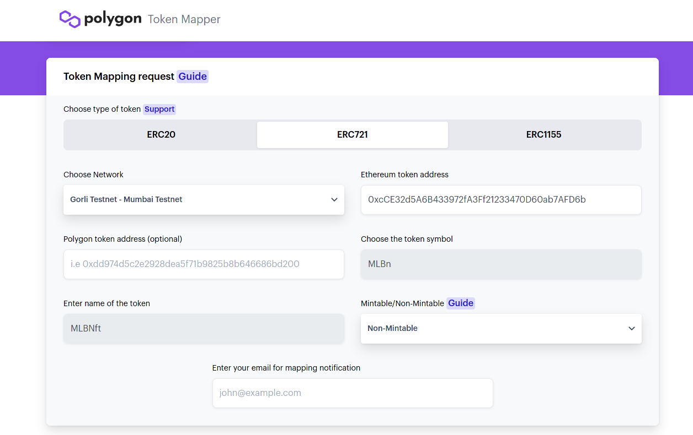
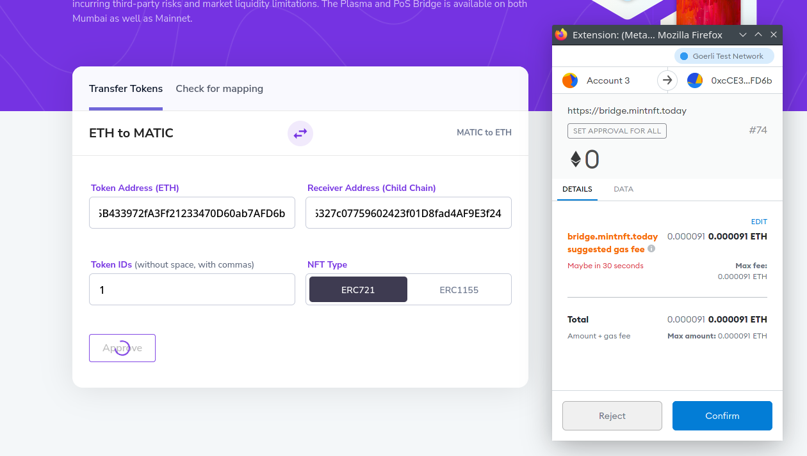

# Introduction

In this tutorial, we will go through the process of transferring ERC-1155 and ERC-721 tokens to the Polygon (Matic) chain, and from Polygon to Ethereum using the Polygon PoS SDK.\
We will use the **Ethereum Goerli** testnet and **Polygon Mumbai** testnet, and ERC tokens that have been deployed and their source code have been verified on Etherscan.
The Polygon Proof of Stake (PoS) Bridge is a mechanism and a set of contracts on both Ethereum and Polygon that will help us in moving assets between the **root** chain and **child** chain.
In contrast to the [Plasma Bridge](https://docs.matic.network/docs/develop/ethereum-matic/plasma/getting-started/), the Polygon PoS bridge is much faster, making it a better choice for dApps that are looking for faster withdrawals.

# Prerequisites

In this tutorial, we will use Metamask as our wallet. If you are not familiar with it or don't know how to use it, check [this video on YouTube](https://www.youtube.com/watch?v=Af_lQ1zUnoM).

When you are creating a Metamask wallet, it gives you a Secret Recovery Phrase. With this phrase, you can recover **all** of your accounts in Metamask. We will use it later in this tutorial. Here is an article about [How to reveal your Secret Recovery Phrase](https://metamask.zendesk.com/hc/en-us/articles/360015290032-How-to-reveal-your-Secret-Recovery-Phrase).

# Requirements

- [**Metamask**](https://metamask.io/)
- [**Nodejs**](https://nodejs.org/en/download/) v14.17.6 LTS or higher installed
- [**Geth**](https://geth.ethereum.org/docs/install-and-build/installing-geth): version 1.10.8

# Setting up Metamask

Before we get into the details of moving the tokens, let's set up **Metamask** so we can check our **ETH**, **MATIC**, and ERC tokens balance.

> Note: At the time of writing this tutorial, Metamask desktop version is not supporting ERC-1155 very well. It does not show the balance but provides a link to the balance. So we will check balances using `web3js`.

## Goerli

The Goerli testnet is pre-configured in Metamask's list of available networks. You can select it from the dropdown list at the top of the Metamask interface.

You can fund your account with testnet Ether from the [Goerli Authenticated faucet](https://faucet.goerli.mudit.blog/) as long as you are willing to make a post on a valid Twitter or Facebook account. If this is not something you wish to do, there is an alternative faucet at [goerli-faucet.slock.it](https://goerli-faucet.slock.it/)


## Mumbai

You can either open [mumbai.polygonscan.com](https://mumbai.polygonscan.com/) and click on "Add Mumbai Network" in the footer at the bottom of the page _or_ add it manually using the following information:

- **Network Name:** Polygon Mumbai testnet
- **RPC URL:** https://rpc-mumbai.maticvigil.com/
- **Chain ID:** 80001
- **Currency Symbol:** MATIC
- **Block Explorer URL:** https://mumbai.polygonscan.com/


You can fund your **Mumbai** account with MATIC [here](https://faucet.polygon.technology)

# MLBs ERC-1155 Contract

> You can find a step-by-step guide to creating your own ERC-1155 token [here](https://github.com/mlibre/blockchain/tree/master/Ethereum/ERC1155).

ERC-1155 is a token standard where you can have multiple fungible and non-fungible tokens in **one** smart contract. `MLBs` is the contract we have already deployed on the Goerli testnet. It is a standard OpenZeppelin ERC-1155.\
This contract only contains two tokens:

- `MLBFun` which is a fungible token with id 0.
- `MLBNFun` which is a non-fungible token with id 1.

We'll map the following contract and transfer some tokens. This is the contract info:

```text
Name: MLBs
Tokens: MLBFun, MLBNFun
Owner: 0xD8f24D419153E5D03d614C5155f900f4B5C8A65C
Contract Address: 0x11C47A4F19cc52923b9C495080ADB441ADe38883
Goerli etherscan: https://goerli.etherscan.io/address/0x11C47A4F19cc52923b9C495080ADB441ADe38883
```

Gather this information for the contract you intend to map.

## ERC-1155 balance using Web3js

ERC-1155 contracts have a `balanceOf` function. It takes two arguments:

- Wallet Address: The address, for example, the contract owner (`0xD8f24D419153E5D03d614C5155f900f4B5C8A65C`).
- TokenID: The token ID. For example, **0** refers to the `MLBFun` token in our ERC-1155 contract.

If you have already configured a provider and the Truffle hdwallet-provider, you can use this function to check your ERC-1155 tokens:

```javascript
async function getTokenBalance(web3, address, contractABI, contractAddress) {
  let contractInstance = new web3.eth.Contract(contractABI, contractAddress);
  let result = await contractInstance.methods.balanceOf(address, 0).call(); // 0 is a tokenID
  console.log(`TokenID ${0}:`, result);

  result = await contractInstance.methods.balanceOf(address, 1).call(); // 1 is a tokenID
  console.log(`TokenID ${1}:`, result);
}
```

The `balanceOf` output for our contract in Goerli would be like:

```text
TokenID 0: 7000000000000000000
TokenID 1: 1
```

And for Mumbai:

```text
TokenID 0: 0
TokenID 1: 0
```

The full source code is:

```javascript
const Web3 = require('web3');
const HDWalletProvider = require('@truffle/hdwallet-provider');
const secrets = require('./secrets.json');

let address = '0xD8f24D419153E5D03d614C5155f900f4B5C8A65C'; // The address to check balance of

let contractAddressInMumbai = '0x7242B6E18F85DB7b2A19d027e0b81Dcf6637C68b'; // Mumbai Contract Address
let contractABIMumbai = [
  {
    inputs: [
      {
        internalType: 'uint256',
        name: 'MLBF.......',
      },
    ],
  },
];

let contractAddressGoerli = '0x11C47A4F19cc52923b9C495080ADB441ADe38883'; // Goerli Contract Address
let contractABIGoerli = [
  {
    inputs: [
      {
        internalType: 'uint256',
        name: 'MLBF.......',
      },
    ],
  },
];

// Mumbai Provider
const provider = new HDWalletProvider(secrets.privateKey, secrets.mumbai);

// Goerli Provider
// const provider = new HDWalletProvider(secrets.privateKey, secrets.localGeth);

const web3 = new Web3(provider);

(async () => {
  try {
    await getBalance();
  } catch (e) {
    console.log(e);
  }
})();

async function getBalance() {
  let contractInstance = new web3.eth.Contract(
    contractABIMumbai,
    contractAddressInMumbai,
  );
  let result = await contractInstance.methods.balanceOf(address, 0).call();
  console.log(`TokenID ${0}:`, result);

  result = await contractInstance.methods.balanceOf(address, 1).call();
  console.log(`TokenID ${1}:`, result);
}
```

`secrets.json`: contains **Seed**, **privateKey** of the address (0xd8f2). And **Mumbai API URL**. ex:

```json
{
  "privateKey": "This should be the private key of an account specifically made for use on the Goerli testnet",
  "seed": "This should be a Secret Recovery Phrase from Metamask and ONLY used on Ethereum testnets",
  "mumbai": "https://matic-mumbai--jsonrpc.datahub.figment.io/apikey/YOUR_API_KEY/",
  "localGeth": "http://127.0.0.1:8545"
}
```

# MLBn ERC-721 Contract

> You can find a step-by-step guide to creating your own ERC-721 token [here](https://github.com/mlibre/blockchain/tree/master/Ethereum/ERC721).

**ERC-721** is a standard for representing ownership of non-fungible tokens. A non-fungible token can represent a piece of data stored somewhere, in a blockchain, decentralized storage, or ...\
`MLBNft` is the contract we have already deployed on the Goerli testnet. It is a standard OpenZeppelin ERC-721.\
This contract has a `MLBn` NFT, which was only minted once with TokenID 1.

We'll map the following contract and transfer the NFT. This is the contract info:

```text
Name: MLBNft
Token: MLBn
Balance: 1
TokenID: 1
Owner: 0xD8f24D419153E5D03d614C5155f900f4B5C8A65C
Contract Address: 0xcCE32d5A6B433972fA3Ff21233470D60ab7AFD6b
goerli etherscan https://goerli.etherscan.io/address/0xcCE32d5A6B433972fA3Ff21233470D60ab7AFD6b
```

Gather this information for the contract you intend to map.

## ERC-721 balance using Web3js

ERC-721 contracts have a `balanceOf` function. It takes **Wallet Address** as an argument and returns the balance.

If you have already configured a provider and the truffle-hdwallet-provider, you can use this function to check your ERC-721 token info and balance.

```javascript
async function getBalance(web3, contract, contractAddress) {
  let contractInstanse = new web3.eth.Contract(ABI, contractAddress);
  let result = await contractInstanse.methods.balanceOf(address).call();
  console.log(`Balance:`, result);
}
```

The `balanceOf` output for our contract in Goerli would be like:

```text
Balance: 1
```

And for Mumbai:

```text
Balance: 0
```

The full source code is:

```javascript
const Web3 = require("web3");
const HDWalletProvider = require("@truffle/hdwallet-provider")
const secrets = require('./secrets.json')

let address = "0xD8f24D419153E5D03d614C5155f900f4B5C8A65C"; // The address to check balance of

let contractAddressGoerli = "0xcCE32d5A6B433972fA3Ff21233470D60ab7AFD6b"; // Goerli Contract Address
let contractAddressInMumbai = "0xf6320326327c07759602423f01D8fad4AF9E3f24"; // Mumbai Contract Address
let ABI = [{"inputs":[],"s..."}]

// const provider = new HDWalletProvider(secrets.privateKey, secrets.localGeth); // Goerli Provider
const provider = new HDWalletProvider(secrets.privateKey, secrets.mumbai); // mumbai Provider

const web3 = new Web3(provider);

(async () => {
  try
  {
    await getBalance()
  }
  catch (e)
  {
    console.log(e)
  }
})()

async function getBalance() {
  let contractInstanse = new web3.eth.Contract(ABI, contractAddressInMumbai);
  let result = await contractInstanse.methods.balanceOf(address).call()
  console.log(`Balance` , result);
}
```

`secrets.json`: contains **Seed**, **privateKey** of the address (0xd8f2). And **Mumbai API URL**. ex:

```json
{
  "privateKey": "This should be the private key of an account specifically made for use on the Goerli testnet",
  "seed": "This should be a Secret Recovery Phrase from Metamask and ONLY used on Ethereum testnets",
  "mumbai": "https://matic-mumbai--jsonrpc.datahub.figment.io/apikey/YOUR_API_KEY/",
  "localGeth": "http://127.0.0.1:8545"
}
```

# Getting started

1.  In order to transfer assets between **root** (Ethereum) and **child** (Polygon) contracts, they should be mapped first. This is a process by which an existing token contract is mirrored between the root and child chain.\
    If the token you intend to transfer already exists on **Polygon**, this means you don't need to perform the **mapping**.\
    Check the [official docs](https://docs.polygon.technology/docs/develop/ethereum-matic/submit-mapping-request/) to learn about the mapping process.
2.  After we mapped the contract, it's time to transfer the assets. We use [Polygon SDK](https://polygon.technology/polygon-sdk/) to transfer tokens. In addition, we will transfer ERC-721 and ERC-1155 tokens with the [Mintnft](https://bridge.mintnft.today/).

# Mapping

Now that everything is ready. Let's map our contracts.

- Go to [mapper.matic.today](https://mapper.matic.today/map/) and complete the form

- Make sure the token you want to map has had its [contract verified](https://etherscan.io/verifyContract) on Etherscan

- Choose **Goerli Testnet -> Mumbai testnet**

  - ERC-1155

    

  - ERC-721

    

- At this time the mapping process is not immediate. It can take up to 3 days to be confirmed.

Then open [mapper.matic.today](https://mapper.matic.today/), and enter the contract address to see if it has been added.


As you may notice, the contract addresses on Goerli and Mumbai are different. Let's remember to add it to Metamask so it shows up when we are connected to Mumbai as well.

1.  Open Metamask.
2.  Select the Mumbai testnet from the list of available networks.
3.  Add Token.
4.  Paste the contract address there
    - ERC-1155: `0x7242B6E18F85DB7b2A19d027e0b81Dcf6637C68b`
    - ERC-721: `0xf6320326327c07759602423f01D8fad4AF9E3f24`

Now it should be something like:


We don't yet have any tokens in Mumbai. We can transfer some across the bridge and check our balance again afterward.

# Transfer using SDK

Let's take a look at the workflow for transferring tokens with the SDK:

1.  **Approve:** The owner of the token has to approve the **Ethereum Predicate Contract** which will **lock** the amount of token they want to transfer to Polygon.
2.  **Deposit:** Then a function has to be called on the **RootChainManger** contract which will trigger the **ChildChainManager** contract on the Mumbai testnet. The **ChildChainManager** contract will then call the **deposit** function of the **Child token** contract.\
    The **Child** contract is a copy of the **Goerli** testnet token contract in **Mumbai** testnet.

## Providers

To interact with **Goerli** and **Mumbai** we can either run a local node (which is slightly more difficult) or use the RPC endpoints of infrastructure providers like DataHub or Infura (which is much simpler).

For **Goerli**, we will run a local Geth node. You can also use [Infura](https://infura.io).\
For **Mumbai**, we will use [DataHub](https://datahub.figment.io/).

**Goerli**:

[Install the Geth client](https://geth.ethereum.org/docs/install-and-build/installing-geth), if you have not installed it already, then run:

```text
geth --goerli --http --syncmode=light --http.api="eth,net,web3,personal,txpool" --allow-insecure-unlock  --http.corsdomain "*"
```

The default endpoint is `127.0.0.1:8545`.\
You can get attached and see if everything is fine:

```text
geth attach http://127.0.0.1:8545
eth.getBalance("0xD8f24D419153E5D03d614C5155f900f4B5C8A65C")
```

**Mumbai**:

- Sign up for a [DataHub account](https://datahub.figment.io/)
- Choose the Polygon service from the [DataHub Services Dashboard](https://datahub.figment.io/services/Polygon/)
- Scroll down to see the Polygon endpoint URLs
- Form the URL like so, replacing the text YOUR_API_KEY with the API key you got from DataHub:
  `https://matic-mumbai--jsonrpc.datahub.figment.io/apikey/YOUR_API_KEY/`

## Installing helpers

Now that we have the information we need and the other important pieces in place, we can write some useful code using the maticjs client library and the HDWalletProvider class from Truffle.\
We will need to install both of these packages on the commandline with the Node package manager. Use these commands to install the packages and save them in the project manifest, `package.json`:

```text
npm install @maticnetwork/maticjs --save
npm install @truffle/hdwallet-provider --save
```

## Transferring ERC-1155

In order to transfer ERC-1155 tokens, we call the `approveERC1155ForDeposit` and `depositSingleERC1155ForUser` functions respectively.

## Approve

To **approve** the **Ethereum Predicate Contract** we just need to call the `approveERC1155ForDeposit` function. The code for this is straightforward:

```javascript
let result = await maticPOSClient.approveERC1155ForDeposit(rootToken, {
  from: user,
  gasPrice: '10000000000',
});
```

## Deposit

Next, we would call the `depositSingleERC1155ForUser` function of the **Ethereum Predicate Contract**:

```javascript
let result_2 = await maticPOSClient.depositSingleERC1155ForUser(
  rootToken,
  user,
  tokenId.toString(),
  amount,
  data,
  {
    from: user,
    gasPrice: '10000000000',
  },
);
```

To bring it all together in JavaScript that can be executed either in a web browser or on the commandline, we can add some constants and use an external file to hold the sensitive API keys and wallet seed phrases. This is a complete example of how to use maticjs and the HDWalletProvider class to communicate with a deployed smart contract on Polygon. Use the following code as a guide for building your own solution!

```javascript
// main.js
const HDWalletProvider = require('@truffle/hdwallet-provider');
const { MaticPOSClient } = require('@maticnetwork/maticjs');
const secrets = require('./secrets.json');

let user = '0xD8f24D419153E5D03d614C5155f900f4B5C8A65C';
let rootToken = '0x11C47A4F19cc52923b9C495080ADB441ADe38883'; // Goerli Contract Address
let amount = 999; // Amount of token we want to transfer
let tokenId = 0; // Token ID
let data = '0x0'; // Additional data

const parentProvider = new HDWalletProvider(
  secrets.seed,
  'http://127.0.0.1:8545',
); // // Local Geth client address
const maticProvider = new HDWalletProvider(secrets.seed, secrets.mumbai); // DataHub Mumbai Testnet JSONRPC URL

const maticPOSClient = new MaticPOSClient({
  network: 'testnet',
  version: 'mumbai',
  parentProvider,
  maticProvider,
});

(async () => {
  try {
    let result = await maticPOSClient.approveERC1155ForDeposit(rootToken, {
      from: user,
      gasPrice: '10000000000',
    });
    let result_2 = await maticPOSClient.depositSingleERC1155ForUser(
      rootToken,
      user,
      tokenId.toString(),
      amount,
      data,
      {
        from: user,
        gasPrice: '10000000000',
      },
    );
    console.log(result);
    console.log(result_2);
  } catch (error) {
    console.log(error);
  }
})();
```

The expected output for **approveERC1155ForDeposit** is something like this:

```javascript
{
  blockHash: '0xc6b7b5a0ace622ca73abb20923fd1995976f8fbff0ea2b92111f72924288c204',
  blockNumber: 5571533,
  contractAddress: null,
  cumulativeGasUsed: 26780,
  effectiveGasPrice: '0x2540be400',
  from: '0xd8f24d419153e5d03d614c5155f900f4b5c8a65c',
  gasUsed: 26780,
  logsBloom: '0x00000000000000000000000000000000000000000000000000000000000000000000000000000000000000000000000000000000000000000000008000000',
  status: true,
  to: '0x11c47a4f19cc52923b9c495080adb441ade38883',
  transactionHash: '0x2627a28ff17a57565445bb4222b5ccf99389e325c3b388ba21c8293288bea1e7',
  transactionIndex: 0,
  type: '0x0',
  events: {
    ApprovalForAll: {
      address: '0x11C47A4F19cc52923b9C495080ADB441ADe38883',
      blockNumber: 5571533,
      transactionHash: '0x2627a28ff17a57565445bb4222b5ccf99389e325c3b388ba21c8293288bea1e7',
      transactionIndex: 0,
      blockHash: '0xc6b7b5a0ace622ca73abb20923fd1995976f8fbff0ea2b92111f72924288c204',
      logIndex: 0,
      removed: false,
      id: 'log_c2ae5ce3',
      returnValues: [Result],
      event: 'ApprovalForAll',
      signature: '0x17307eab39ab6107e8899845ad3d59bd9653f200f220920489ca2b5937696c31'
    }
  }
}
```

And for **depositSingleERC1155ForUser**:

```javascript
{
  blockHash: '0x1a95b0e2633ea2691841c358ad87811ad0413e6e60d3c1a1dd0b738fbf4bb0e0',
  blockNumber: 5571535,
  contractAddress: null,
  cumulativeGasUsed: 497826,
  effectiveGasPrice: '0x2540be400',
  from: '0xd8f24d419153e5d03d614c5155f900f4b5c8a65c',
  gasUsed: 125838,
  logsBloom: '0x0000000000000210000000000000000000000000000000000020000000080000000000000000000000040008000000000000008000000000000000000',
  status: true,
  to: '0xbbd7cbfa79faee899eaf900f13c9065bf03b1a74',
  transactionHash: '0xfd107f2ce76b183153eaff4bccaff6873386ef89e6e5937bf30aa153612757ee',
  transactionIndex: 1,
  type: '0x0',
  events: {
    '0': {
      address: '0xB19a86ba1b50f0A395BfdC3557608789ee184dC8',
      blockNumber: 5571535,
      transactionHash: '0xfd107f2ce76b183153eaff4bccaff6873386ef89e6e5937bf30aa153612757ee',
      transactionIndex: 1,
      blockHash: '0x1a95b0e2633ea2691841c358ad87811ad0413e6e60d3c1a1dd0b738fbf4bb0e0',
      logIndex: 1,
      removed: false,
      id: 'log_6fa41672',
      returnValues: Result {},
      event: undefined,
      signature: null
    },
    '1': {
      address: '0x11C47A4F19cc52923b9C495080ADB441ADe38883',
     .
     .
     .
  }
}
```

Just a few things to mention:

- `secrets.json`: contains **Seed**, **privateKey** of the address (0xd8f2). And **Mumbai API URL**. ex:

```json
{
  "privateKey": "This should be the private key of an account specifically made for use on the Goerli testnet",
  "seed": "This should be a Secret Recovery Phrase from Metamask and ONLY used on Ethereum testnets",
  "mumbai": "https://matic-mumbai--jsonrpc.datahub.figment.io/apikey/YOUR_API_KEY/",
  "localGeth": "http://127.0.0.1:8545"
}
```

- `@truffle/hdwallet-provider`: Handles the process of signing transactions.
- `from`: The Goerli address where we hold the token and want to send transactions with.
- `rootToken`: The ERC-1155 contract address on the Goerli testnet.
- `amount`: The amount of **token** we want to transfer.

## Transferring ERC-721

In order to transfer ERC-1155 tokens, we call the `approveERC721ForDeposit` and `depositERC721ForUser` functions respectively.

### Approve

To **approve** the **Ethereum Predicate Contract** we just need to call the `approveERC721ForDeposit` function. The code for this is straightforward:

```javascript
await maticPOSClient.approveERC721ForDeposit(rootToken, tokenId, {
  from: user,
});
```

### Deposit

Next, we would call the `depositERC721ForUser` function of the **Ethereum Predicate Contract**:

```javascript
await maticPOSClient.depositERC721ForUser(rootToken, user, tokenId.toString(), {
  from: user,
});
```

This is a complete example of how to use maticjs and the HDWalletProvider class to communicate with a deployed smart contract on Polygon. Use the following code as a guide for building your own solution!

```javascript
// main.js
const HDWalletProvider = require('@truffle/hdwallet-provider');
const { MaticPOSClient } = require('@maticnetwork/maticjs');
const secrets = require('./secrets.json');

let user = '0xD8f24D419153E5D03d614C5155f900f4B5C8A65C';
let rootToken = '0xcCE32d5A6B433972fA3Ff21233470D60ab7AFD6b'; // Goerli Contract Address
let childToken = '0xf6320326327c07759602423f01D8fad4AF9E3f24'; // Goerli Contract Address
let tokenId = 3; // Token ID

const parentProvider = new HDWalletProvider(
  secrets.seed,
  'http://127.0.0.1:8545',
); // // Local Geth client address
const maticProvider = new HDWalletProvider(secrets.seed, secrets.mumbai); // DataHub Mumbai Testnet JSONRPC URL

const maticPOSClient = new MaticPOSClient({
  network: 'testnet',
  version: 'mumbai',
  parentProvider,
  maticProvider,
});

(async () => {
  try {
    let result = await maticPOSClient.approveERC721ForDeposit(
      rootToken,
      tokenId,
      {
        from: user,
        gasPrice: '10000000000',
      },
    );
    console.log(result);
    let result_2 = await maticPOSClient.depositERC721ForUser(
      rootToken,
      user,
      tokenId.toString(),
      {
        from: user,
        gasPrice: '10000000000',
      },
    );
    console.log(result_2);
  } catch (error) {
    console.log(error);
  }
})();
```

The expected output for **approveERC721ForDeposit** is something like this:

```javascript
{
  blockHash: '0xc20d22a31da707a97930a0277dfdc64c4d1fdabe619ee8d5c30e8ec4429de8a7',
  blockNumber: 5611016,
  contractAddress: null,
  cumulativeGasUsed: 29345,
  effectiveGasPrice: '0x87ffb64b',
  from: '0xd8f24d419153e5d03d614c5155f900f4b5c8a65c',
  gasUsed: 29345,
  logsBloom: '0x00000000000000000000000000000000000000000000000000000000000000000000000000000000000000000100000000000000000000000000000000000',
  status: true,
  to: '0xcce32d5a6b433972fa3ff21233470d60ab7afd6b',
  transactionHash: '0xe397fe030e14402ecfd4920a2e4dc32f3adb7b2cd8baa6df2cb7fa22decd4b8c',
  transactionIndex: 0,
  type: '0x0',
  events: {
    Approval: {
      address: '0xcCE32d5A6B433972fA3Ff21233470D60ab7AFD6b',
      blockNumber: 5611016,
      transactionHash: '0xe397fe030e14402ecfd4920a2e4dc32f3adb7b2cd8baa6df2cb7fa22decd4b8c',
      transactionIndex: 0,
      blockHash: '0xc20d22a31da707a97930a0277dfdc64c4d1fdabe619ee8d5c30e8ec4429de8a7',
      logIndex: 0,
      removed: false,
      id: 'log_3c37d4f8',
      returnValues: [Result],
      event: 'Approval',
      signature: '0x8c5be1e5ebec7d5bd14f71427d1e84f3dd0314c0f7b2291e5b200ac8c7c3b925'
    }
  }
}
```

And for **depositERC721ForUser**:

```javascript

{
  blockHash: '0xb353ae7b47953a6bec8c2a0d01852dbb917d4b018cf3d8243d1fd69cdde3ee56',
  blockNumber: 5611018,
  contractAddress: null,
  cumulativeGasUsed: 268430,
  effectiveGasPrice: '0x87ffb64b',
  from: '0xd8f24d419153e5d03d614c5155f900f4b5c8a65c',
  gasUsed: 111868,
  logsBloom: '0x000000000000000000000000000000000',
  status: true,
  to: '0xbbd7cbfa79faee899eaf900f13c9065bf03b1a74',
  transactionHash: '0x5167f0d875aeeb0b9a695be6acbcfe568039f7e43084d58f6211dbf14ec8336f',
  transactionIndex: 2,
  type: '0x0',
  events: {
    '0': {
      address: '0x74D83801586E9D3C4dc45FfCD30B54eA9C88cf9b',
      blockNumber: 5611018,
      transactionHash: '0x5167f0d875aeeb0b9a695be6acbcfe568039f7e43084d58f6211dbf14ec8336f',
      transactionIndex: 2,
      blockHash: '0xb353ae7b47953a6bec8c2a0d01852dbb917d4b018cf3d8243d1fd69cdde3ee56',
      logIndex: 2,
      removed: false,
      id: 'log_bed4a03e',
      returnValues: Result {},
      event: undefined,
      signature: null
    },
    '1': {
      address: '0xcCE32d5A6B433972fA3Ff21233470D60ab7AFD6b',
      blockNumber: 5611018,
      transactionHash: '0x5167f0d875aeeb0b9a695be6acbcfe568039f7e43084d58f6211dbf14ec8336f',
      transactionIndex: 2,
      blockHash: '0xb353ae7b47953a6bec8c2a0d01852dbb917d4b018cf3d8243d1fd69cdde3ee56',
      .
      .
```

# Potential errors and solutions

**Not able to run main.js**

If you are facing an error message like

```text
Error: execution reverted: RootChainManager: TOKEN_NOT_MAPPED
```

The contract has not been mapped yet.

**Geth not running**

If your local Geth node is not running, you will get an error like this:

```text
Error: PollingBlockTracker - encountered an error while attempting to update latest block:
Error: connect ECONNREFUSED 127.0.0.1:8545
```

**No peers available**

If you get an error like this

```text
{
  code: -32000,
  message: 'getDeleteStateObject (0000000000000000000000000000000000000000) error: no suitable peers available'
}
```

Wait a bit and try again

# Sync & Confirmation

It takes up to 5 minutes for Mumbai to read data from the Goerli chain and sync itself. Once it has synced, then we can check the token balance via `web3js`.

The **balanceOf** output for our ERC-1155 contract in Goerli would be like:

```text
TokenID 0: 6999999999999998935
TokenID 1: 1
```

And for Mumbai:

```text
TokenID 0: 999
TokenID 1: 0
```

And Metamask is something like:


# Transfer using Web UI

Transferring assets through a **Web UI** is pretty simple. Just like the SDK, there are the **Approve** and **Deposit** steps:

1.  Open [MintNFT Bridge](https://bridge.mintnft.today/)
2.  Make sure Goerli Testnet is selected in Metamask


3.  Enter the contract address in Goerli and Mumbai, and ID of the token you want to transfer.

4.  Click on **Approve**



5.  Then review the transaction details, like gas fees and the smart contract you are sending tokens to - before clicking on **Confirm**
6.  Now, wait until you receive confirmations. Metamask and the website both will send a notification.
7.  Now Click on **Deposit**


8.  Once the transaction is mined, the process is complete! It takes about 7 minutes to complete the transfer. As mentioned before Polygon needs about 5 minutes to sync.


# Withdrawing ERC-721 using SDK

Now if we want to transfer our tokens from Mumbai to Goerli, similar before, we can call `burnERC721` and `exitERC721` functions in order.\
Let's take a look at the workflow for withdrawing tokens with the SDK:

1.  We will call the **burn** function of the **Child token** contract, which will burn the tokens.
2.  We will call the **exit** function of the **RootChainManager** contract, that submit the proof of burn and transfer the tokens.

## Burn

To **burn** the tokens we just need to call the `burnERC721` function. The code for this is straightforward:

```javascript
let result = await maticPOSClient.burnERC721(childToken, tokenId, {
  from: user,
});
```

The expected output is something like this:

```javascript
{
  blockHash: '0x5e259cb402d7537b3d030e511865ab5e0aeb13416c72a52846fcceb2785788d8',
  blockNumber: 19748463,
  contractAddress: null,
  cumulativeGasUsed: 1088161,
  effectiveGasPrice: '0xb2d05e00',
  from: '0xd8f24d419153e5d03d614c5155f900f4b5c8a65c',
  gasUsed: 35319,
  logsBloom: '0x00000000000000001000',
  status: true,
  to: '0xf6320326327c07759602423f01d8fad4af9e3f24',
  transactionHash: '0x09400584a1eabdf85fc491bbbfbc9d5283905478e76fd6a5d7d22bb63e0510fa',
  transactionIndex: 4,
  type: '0x0',
  events: {
    '0': {
      address: '0x0000000000000000000000000000000000001010',
      blockNumber: 19748463,
      transactionHash: '0x09400584a1eabdf85fc491bbbfbc9d5283905478e76fd6a5d7d22bb63e0510fa',
      transactionIndex: 4,
      blockHash: '0x5e259cb402d7537b3d030e511865ab5e0aeb13416c72a52846fcceb2785788d8',
      removed: false,
      id: 'log_8aa0a436',
      returnValues: Result {},
      event: undefined,
      signature: null
    },
    Approval: {
      address: '0xf6320326327c07759602423f01D8fad4AF9E3f24',
      blockNumber: 19748463,
      transactionHash: '0x09400584a1eabdf85fc491bbbfbc9d5283905478e76fd6a5d7d22bb63e0510fa',
      transactionIndex: 4,
      blockHash: '0x5e259cb402d7537b3d030e511865ab5e0aeb13416c72a52846fcceb2785788d8',
      id: 'log_a24d5618',
      returnValues: [Result],
      event: 'Approval',
      signature: '0x8c5be1e5ebec7d5bd14f71427d1e84f3dd0314c0f7b2291e5b200ac8c7c3b925'
    },
    Transfer: {
      address: '0xf6320326327c07759602423f01D8fad4AF9E3f24',
      blockNumber: 19748463,
      transactionHash: '0x09400584a1eabdf85fc491bbbfbc9d5283905478e76fd6a5d7d22bb63e0510fa',
      transactionIndex: 4,
      blockHash: '0x5e259cb402d7537b3d030e511865ab5e0aeb13416c72a52846fcceb2785788d8',
      id: 'log_eb4348bf',
      returnValues: [Result],
      event: 'Transfer',
      signature: '0xddf252ad1be2c89b69c2b068fc378daa952ba7f163c4a11628f55a4df523b3ef'
    }
  }
}
```

Keep the `transactionHash` value. We should pass it to the `exit` function.

## Exit

Once the **checkpoint** has been submitted, we can call the `exitERC721` function with the transaction hash we got by calling `burnERC721`:

> Note that it may take some time for the checkpoint to get submitted and included. You can check if it is included or not by sending the block number to this API: https://apis.matic.network/api/v1/mumbai/block-included/THE\_BLOCK\_NUMBER

```javascript
await maticPOSClient.exitERC721(
  burnTxHash, // transactionHash: 0x09400584a1eabdf85fc491bbbfbc9d5283905478e76fd6a5d7d22bb63e0510fa
  { from: user },
);
```

The expected output is something like this:

```javascript
{
  from: '0xD8f24D419153E5D03d614C5155f900f4B5C8A65C',
  gas: 285406,
  gasLimit: 285406,
  gasPrice: '10000000000',
  nonce: 74,
  chainId: 5,
  value: 0,
  to: '0xBbD7cBFA79faee899Eaf900F13C9065bF03B1A74',
  data: '0x3805550f0d0b901a037f448de982f4a254613497c08d7cb1f8e445d73e51ba1b6d9045
  .
  .
}
```

The full source code is:

```javascript
// main.js
const HDWalletProvider = require('@truffle/hdwallet-provider');
const { MaticPOSClient } = require('@maticnetwork/maticjs');
const secrets = require('./secrets.json');

let user = '0xD8f24D419153E5D03d614C5155f900f4B5C8A65C';
let rootToken = '0xcCE32d5A6B433972fA3Ff21233470D60ab7AFD6b'; // Goerli Contract Address
let childToken = '0xf6320326327c07759602423f01D8fad4AF9E3f24'; // Mumbai Contract Address
let tokenId = 4; // Token ID

const parentProvider = new HDWalletProvider(secrets.seed, secrets.goerli); // Goerli provider address
const maticProvider = new HDWalletProvider(secrets.seed, secrets.mumbai); // DataHub Mumbai Testnet JSONRPC URL

const maticPOSClient = new MaticPOSClient({
  network: 'testnet',
  version: 'mumbai',
  parentProvider,
  maticProvider,
});

(async () => {
  try {
    // let result = await maticPOSClient.burnERC721(childToken, tokenId, {
    // 	from: user
    // })
    // console.log(result)
    let burnTxHash =
      '0x09400584a1eabdf85fc491bbbfbc9d5283905478e76fd6a5d7d22bb63e0510fa'; // result.transactionHash
    let result_2 = await maticPOSClient.exitERC721(burnTxHash, {
      from: user,
      encodeAbi: true,
      gasPrice: '10000000000',
    });
    console.log(result_2);
  } catch (error) {
    console.log(error);
  }
})();
```

# Conclusion

Congratulations! By completing this tutorial you learned how to use the **Polygon PoS Bridge**. We have configured **Metamask** and **Geth**, to communicate with the **Goerli** testnet and the **Mumbai** testnet. We then **mapped** **ERC** contracts between the networks so it can be transferred via the bridge. Finally, we called functions on the PoS Bridge contracts and moved our assets from Ethereum to Polygon.

# About The Author

I'm mlibre, a random guy from the solar galaxy. I am interested in blockchain tech and find it very useful for lots of things. Feel free to check my [Github](https://github.com/mlibre)
