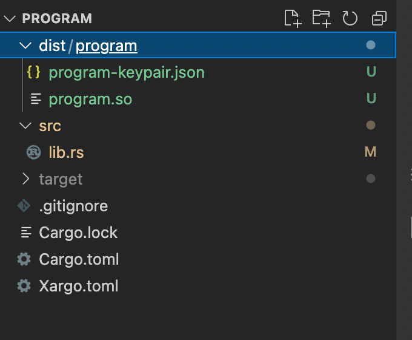

# Introduction

We are going to make a CrowdFunding platform like GoFundMe, Kickstarter, and Indiegogo. Our DApp will let people create campaings, Donate SOL to existing campaings and payout to the compaign creator.
We are going to make a Solana program and connect it with our front-end application.

# Prerequisites

- React
- Javascript

# Requirements

The following software is required to complete this tutorial:

- Git, install it from [HERE](https://git-scm.com/downloads).
- Solana CLI, install it from [HERE](https://docs.solana.com/cli/install-solana-cli-tools#use-solanas-install-tool).
- The Rust toolchain, install it from [HERE](https://www.rust-lang.org/tools/install).
- Node.js (v14.18.1+), install it from [HERE](https://nodejs.org/en/download/).

> If you already have good knowledge of the Rust programming language, you can skip the `Introduction to Rust` section. I would still recommend having a quick look at all the code blocks.

# Introduction to Rust

Rust is a multi-paradigm, high-level, general-purpose programming language designed for performance and safety, especially safe concurrency.

Rust code uses snake case as the conventional style for function and variable names.

## Installing Rust on your system

You can follow this this [link](https://doc.rust-lang.org/book/ch01-01-installation.html) for your operating system.

> **Note**: If you are using Visual Studio Code (VSCode) you should install the extension `matklad.rust-analyzer`. I have found it to work better than `Rust-lang.rust` for code analysis, auto-completion and snippets.

Before we start the tutorial, we need to understand some basics of Rust. I have added the link to the [Rust book](https://doc.rust-lang.org/book/ch00-00-introduction.html) pages if you want to read more about any topic.

## Basics Data types in Rust

Rust has four primary scalar types: integers, floating-point numbers, Booleans, and characters.
Integers are `u8`,`u32`, `i32`, `i64`, `usize`, and the list goes on here basically `u` prefix suggests that we have an unsigned integer and the suffix number tell the number of bits. So `u8` is an unsigned 8-bit number(0 to 255).
|Length| Signed| Unsigned|
|------- |-------|-------|
|8-bit| i8| u8|
|16-bit| i16| u16|
|32-bit| i32 |u32|
|64-bit| i64| u64|
|128-bit |i128| u128|
|arch| isize| usize|

We have `f32` and `f64` for floating-point numbers. `bool` for booleans, and `char` for characters.
Rust has 2 types for strings, `str` and `String`. `String` is a growable, heap-allocated data structure. `str` is an immutable fixed-length string somewhere in memory.

Read more on [Rust book](https://doc.rust-lang.org/book/ch03-02-data-types.html).

## Creating a variable and mutability

We can create a variable with the `let` keyword

```rust
// The compiler identifies the Rvalue as i32, so it sets the type of variable to i32
let a=0;
```

we can also set the data type for a variable, eg.

```rust
let a :u8 = 0;
```

In Rust, all the variables are immutable by default. Which means their value can not be changed once set.
And here comes the `mut` keyword. We can initialize the variable with `let mut` to have a mutable variable. eg.

```rust
// This program will compile
let mut a = 0;
a=a+1;
a=100;
```

Read more on [Rust book](https://doc.rust-lang.org/book/ch03-01-variables-and-mutability.html).

## Control flow

We can use `if` `else` statement in Rust just like we can do in other language, here is a small program for us to understand the syntax.

```rust
fn main(){
    let a=99;
    if a%2==0{
        println!("Even");
    }
    else{
        println!("Odd");
    }
}
```

We also have loops in Rust. We can create a loop with 3 keywords `loop`, `for`, and `while`. Since `for` is most common. Here is an example of it. You can checkout example for `loop` and `while` [here](https://doc.rust-lang.org/book/ch03-05-control-flow.html#repeating-code-with-loop).

```rust
fn main() {
    for i in 0..7 { // 0..7 is range expression including 0 excluding 7.
        println!("variable `i` is : {}", i);
    }
}
```

Read more on [Rust book](https://doc.rust-lang.org/book/ch03-05-control-flow.html).

## Functions and Macros

Function definitions in Rust start with fn and have a set of parentheses after the function name. The curly brackets tell the compiler where the function body begins and ends.

```rust
fn main() {
    another_function(5);
    another_function_with_x_and_y(1,2);
}

fn another_function(x: i32) {// input paramter and type
    println!("The value of x is: {}", x);
}
fn another_function_with_x_and_y(x: i32,y:i32) {
    println!("The value of x is: {} {}", x, y);
}
```

For this tutorial, we can assume macros are also functions. They end with `!`, like `println!` macro, `format!` macro, and `msg!` macro.

Read more about functions on [Rust book](https://doc.rust-lang.org/book/ch03-03-how-functions-work.html).

## Enums and the match syntax

Rust has enums. They are more than simple enums other languages provide. In Rust, we can even store data in the enums.
Here is the example of `Result enum`.
We are going to make use of the `Result` enum in our program.

```rust
// Here the pub keyword means it is public.
// We have used generics T and E for data and error type
pub enum Result<T, E> {
    Ok(T),
    Err(E),
}
```

Read more about enums on [rust book](https://doc.rust-lang.org/book/ch06-01-defining-an-enum.html).

Here is an enum and match example with an explanation of each line:

```rust
enum Coin {
    Penny,
    Nickel,
    Dime,
    Custom(i32),
}
// Creating a coin enums
// notice how some values have no parameter
// and how we can have an i32 value stored in `Custom`

let coin=Coin::Custom(30);
let coin2 =Coin::Nickel;
// We can create instances like this

let a = match coin {
        Coin::Penny => 1,
        Coin::Nickel => 5,
        Coin::Dime => 10,
        Coin::Custom(e) => e,
    };
// We can use the match syntax to know what type of coin we have
// and set a corresponding value to the variable `a`.

assert_eq!(a,30);
// In this case a will be equal to 30 because coin is Custom with value 30.
```

Read more about match syntax in the [Rust book](https://doc.Rust-lang.org/book/ch06-02-match.html).

## Cargo and Borsh

Cargo is the Rust package manager. We use it to build our program and get dependencies. It also makes adding packages(crates) very easy. Read more about Cargo in the [Rust book](https://doc.Rust-lang.org/book/ch01-03-hello-cargo.html)

Borsh stands for Binary Object Representation Serializer for Hashing. It is meant to be used in security-critical projects as it prioritizes consistency, safety, speed, and comes with a strict specification.
We are using it for data serialization and deserialization. Read more about the carte on [crates.io](https://crates.io/crates/borsh).

This is all the Rust we would need to get started with our Solana program.

# Solana program

## Setup

1.  We create a React app. Open your projects directory in the terminal and run

```text
npx create-react-app crowd-funding
```

This creates a React app for us.

2.  Now, we will create our program.
    In your projects directory.

```text
cd crowd-funding
cargo new program --lib
```

This will create a new directory called `program`, which is a new Rust project generated by cargo.

3.  We will discuss the front-end side of the project later. Now we can open the `program` folder in VSCode.

4.  Create `Xargo.toml` in the program directory.
    In your `Xargo.toml`

```toml
[target.bpfel-unknown-unknown.dependencies.std]
features = []
```

5.  Update your `Cargo.toml`

```toml
[package]
name = "program"
version = "0.1.0"
edition = "2018"

[dependencies]
solana-program = "1.7.14"
borsh = "0.9.1"
borsh-derive = "0.9.1"

[features]
no-entrypoint = []

[dev-dependencies]
solana-program-test = "1.7.14"
solana-sdk = "1.7.14"

[lib]
crate-type = ["cdylib", "lib"]
```

We have added all the dependencies we are going to need for our program. Run `cargo check` to get all the dependencies. We can now start working in `src/lib.rs` and start coding our program for the Solana blockchain.

## What do we want in our program?

Before we start writing the code, let us discuss what entry points our crowdfunding app should have.

- Create a Crowdfunding Campaign.
  We would need an entry point that anyone can use to create a crowdfunding campaign on our platform. We can have a name, description, and admin fields for it.

- Withdraw from the Campaign.
  We would need an entry point for campaign administrators only, so they can withdraw funds.

- Donate to a Campaign.
  We would need an entry point that can be invoked by anyone to donate to a specific Campaign.

These are all the entry points we are going to need for our project. Let us discuss how we will be creating these.

## Where can we store data?

Before we start we have to understand Solana programs don't have storage(`contract storage` you might be familiar with). Then how and where should we store our data.

**Program accounts**
In Solana, data can only be stored in accounts. So we can create program-owned accounts to save the data.

> Note: The total number of bytes of data an account can have is fixed when we create an account.

One way to deal with this is to create an Account with very large storage. However if we do that, the maximum data limit for an account is 10 megabytes. If we have enough users, we would eventually run out of storage space. We must think of a way to increase the amount of storage we can use.

We can create as many program-owned accounts as we want, so the idea here is that we will have a size limit for every element in our map. And whenever we want to add a new element we will create a new program-owned account. Program-owned accounts are also called PDA(program-derived accounts).

## Coding the program

Now that we have discussed what we want to create. Let start coding.
Go ahead and open up the `program` folder in VSCode or your favorite IDE.
File structure in the `program` directory should look like this.


Go ahead and open up the `lib.rs` file in your code editor, and let us add some boilerplate code first.

You can see the completed code on [github](https://github.com/SushantChandla/solana-crowd-funding/blob/main/program/src/lib.rs).

> Note: In Rust, we can pass variables as a reference with `&` and get the value of a reference with `*` Operator.

```rust
// First we include what we are going to need in our program.
// This  is the Rust style of importing things.
// Remember we added the dependencies in cargo.toml
// And from the `solana_program` crate we are including  all the required things.
use solana_program::{
    account_info::{next_account_info, AccountInfo},
    entrypoint,
    entrypoint::ProgramResult,
    msg,
    program_error::ProgramError,
    pubkey::Pubkey,
    rent::Rent,
    sysvar::Sysvar,
};


// Every solana program has one entry point
// And it is a convention to name it `process_instruction`.
// It should take in program_id, accounts, instruction_data as parameters.
fn process_instruction(
    // program id is nothing but the id of this program on the solana network.
    program_id: &Pubkey,
    // When we invoke our program we can
    // give meta data of all the account we
    // want to work with.
    // As you can see it is a array of AccountInfo.
    // We can provide as many as we want.
    accounts: &[AccountInfo],
    // This is the data we want to process our instruction for.
    // It is a list of 8 bitunsigned integers(0..255).
    instruction_data: &[u8],

    // Here we specify the return type.
    // If you know a little bit of typescript.
    // This was of writing types and returns types might we familiar to you.
) -> ProgramResult {

    // And then since we can't return null in Rust we pass `Ok(())` to make it compile
    // It means the program executed successfully.
    Ok(())
}


// Then we call the entry point macro to add `process_instruction` as our entry point to our program.
entrypoint!(process_instruction);
```

> Note: In Rust, if the last line doesn't end with `;` means our function is return-ing that.
> Here the line `Ok(())` is equivalent to `return Ok(());`

In the code, I have mentioned there is only one entry point in the Solana program.
But we want three as we discussed in the "What do we want in our program?" section. Let's fix this issue.
Have you noticed there is no limit to the instruction_data array? We are going to take advantage of that fact. We use the first element of the array to know what entry point we want to call.
Notice we can have 256 entry points like this in a single program (`u8` has a value of 0..255). Realistically we never do that if in case we want that many entry points for a project. It is better to deploy more programs.

Okay, let's do more coding...

```rust
fn process_instruction(
    program_id: &Pubkey,
    accounts: &[AccountInfo],
    instruction_data: &[u8],
) -> ProgramResult {
    // We check if We have a instruction_data len greater than 0 if it is not we do not want to procced.
    // So we return Error with InvalidInstructionData message.
     if instruction_data.len() == 0 {
        return Err(ProgramError::InvalidInstructionData);
    }
    /// Now we just check and call the function for each of them.
    // I have choosen 0 for create_campaign,
    // 1 for withdraw
    // 2 for donate.
    if instruction_data[0] == 0 {
        return create_campaign(
            program_id,
            accounts,
            /// Notice we pass program_id and accounts as they where
            // but we pass a reference to slice of [instruction_data].
            /// we do not want the first element in any of our functions.
            &instruction_data[1..instruction_data.len()],
        );
    } else if instruction_data[0] == 1 {
        return withdraw(
            program_id,
            accounts,
            &instruction_data[1..instruction_data.len()],
        );
    } else if instruction_data[0] == 2 {
        return donate(
            program_id,
            accounts,
            &instruction_data[1..instruction_data.len()],
        );
    }

    /// If instruction_data doesn't match we give an error.
    // Note I have used msg!() macro and passed a string here.
    // It is good to do this as this would
    // also get printed in the console window
    // if a program fails.
    msg!("Didn't find the entrypoint required");
    Err(ProgramError::InvalidInstructionData)
}

entrypoint!(process_instruction);


/// Here, I have created the function for every action we want to do in our program.
/// They take in the same parameters as process_intruction and also have the same return type.

fn create_campaign(
    program_id: &Pubkey,
    accounts: &[AccountInfo],
    instruction_data: &[u8],
) -> ProgramResult {
    Ok(())
}

fn withdraw(
    program_id: &Pubkey,
    accounts: &[AccountInfo],
    instruction_data: &[u8],
) -> ProgramResult {
    Ok(())
}

fn donate(
    program_id: &Pubkey,
    accounts: &[AccountInfo],
    _instruction_data: &[u8]
) -> ProgramResult {
    Ok(())
}
```

## CampaignDetails struct

We will create a struct in Rust. We have not discussed structs above so, I will explain them here. In Rust, we do not have class. If we want to store more than 1 variable (group variables) we create a struct.

```rust
/// For an example, let us create human struct.
#[derive(Debug)]
struct Human {
    /// we can add all the fields in our struct here.
    /// we also have to specify the type of each variable.
    /// Like the [eyes_color] here is a `String` type object.
    pub eyes_color: String,
    pub name: String,
    pub height: i32,
}
```

Now you must be wondering what is the meaning of `#[derive(Debug)]`. It is interesting to note that we can derive some traits for our struct.

[Traits](https://doc.rust-lang.org/rust-by-example/trait.html) : A trait in Rust is a group of methods that are defined for a particular type.

Now let's code our `CampaignDetails` struct.
I have added the fields name, admin, description, image_link,amount_donated for our Campaign.

```rust
#[derive(BorshSerialize, BorshDeserialize, Debug)]
struct CampaignDetails {
    pub admin: Pubkey,
    pub name: String,
    pub description: String,
    pub image_link: String,
    /// we will be using this to know the total amount
    /// donated to a campaign.
    pub amount_donated: u64,
}
```

We need to derive both BorshSerialize and BorshDeserialize. BorshSerialize is used to convert the struct into an **array of u8**, which is the data we can store in Solana accounts. It is also the data we have in `instruction_data` so we can deserialize that to a struct with the help of `BorshDeserialize`.

**Code**:
At the top of the file import `BorshSerialize` and `BorshDeserialize` from the `Borsh` Crate.

```rust
use borsh::{BorshDeserialize, BorshSerialize};
```

Now let's add the code of our `create_campaign` function and the `CampaignDetails` Struct.
I have added an explanation to each line in the code.

```rust
entrypoint!(process_instruction);

/// We are creating the struct;.
#[derive(BorshSerialize, BorshDeserialize, Debug)]
struct CampaignDetails {
    pub admin: Pubkey,
    pub name: String,
    pub description: String,
    pub image_link: String,
    pub amount_donated: u64,
}
// All the fields are public, which means we can use the `.`  Operator to get/set the values of the fields.

fn create_campaign(
    program_id: &Pubkey,
    accounts: &[AccountInfo],
    instruction_data: &[u8],
) -> ProgramResult {

    /// We create a iterator on accounts
    /// accounts parameter is the array of accounts related to this entrypoint
    let accounts_iter = &mut accounts.iter();
```

We can use the `next_account_info` function to get an account from the array. This function returns a result enum. We can use `?` Operator on the result enum to get the value. If in case of an error the `?` Operator will chain the error, and our program will return the same error which was returned by next_account_info.

Solana programs can only write data on a program-owned account. Note that writing_account is a program-owned account.

```rust
    /// Writing account or we can call it program account.
    /// This is an account we will create in our front-end.
    /// This account should br owned by the solana program.
    let writing_account = next_account_info(accounts_iter)?;

    /// Account of the person creating the campaign.
    let creator_account = next_account_info(accounts_iter)?;

    // Now to allow transactions we want the creator account to sign the transaction.
    if !creator_account.is_signer {
        msg!("creator_account should be signer");
        return Err(ProgramError::IncorrectProgramId);
    }
    /// We want to write in this account so we want its owner by the program.
    if writing_account.owner != program_id {
        msg!("writing_account isn't owned by program");
        return Err(ProgramError::IncorrectProgramId);
    }
```

By deriving the trait `BorshDeserialize` in our `CampaignDetails` struct we have added a method `try_from_slice` which takes in the parameter array of u8 and creates an object of CampaignDetails with it.
It gives us an enum of type results. We will use the `expect` method on result enums to and pass in the string which we can see in case of error.

```rust
    let mut input_data = CampaignDetails::try_from_slice(&instruction_data)
        .expect("Instruction data serialization didn't worked");

    // Now I want that for a campaign created the only admin should be the one who created it.
    // You can add additional logical here to check things like
    // The image url should not be null
    // The name shouldn't be smaller than some specific length...
    if input_data.admin != *creator_account.key {
        msg!("Invaild instruction data");
        return Err(ProgramError::InvalidInstructionData);
    }
```

Solana accounts can have data, but size has to be specified when it is created. We need to have a minimum balance to make it rent exempt. For this project, we create an account that already has a balance equal to the minimum balance.
You can read more about solana account and rent exemption [here](https://docs.solana.com/developing/programming-model/accounts#rent-exemption).

```rust
    /// get the minimum balance we need in our program account.
    let rent_exemption = Rent::get()?.minimum_balance(writing_account.data_len());
    /// And we make sure our program account (`writing_account`) has that much lamports(balance).
    if **writing_account.lamports.borrow() < rent_exemption {
        msg!("The balance of writing_account should be more then rent_exemption");
        return Err(ProgramError::InsufficientFunds);
    }
    // Then we can set the initial amount donate to be zero.
    input_data.amount_donated=0;
```

If all goes well, we will write the `writing_account`. Here on our `input_data` variable (of type `CampaignDetails`), we have a method serialize. this is because of the `BorshSerialize` derivation. We will use this to write the data in a `writing_account`. At the end of the program, we can return `Ok(())`.

```rust
    input_data.serialize(&mut &mut writing_account.data.borrow_mut()[..])?;

    Ok(())
}
```

Hurry! We are done with the first `create_campaign` function.
Let's continue writing the contract and write the withdraw function next.

## Withdraw function implementation.

For the withdraw function also, we create a struct to get the input data. In this case, input data is only the amount we want to withdraw.

```rust
#[derive(BorshSerialize, BorshDeserialize, Debug)]
struct WithdrawRequest {
    pub amount: u64,
}
```

Now let us write the function.

```rust
fn withdraw(
    program_id: &Pubkey,
    accounts: &[AccountInfo],
    instruction_data: &[u8],
) -> ProgramResult {
```

For the withdraw also we will create iterator and get `writing_account` (which is the program owned account) and `admin_account`.

```rust
    let accounts_iter = &mut accounts.iter();
    let writing_account = next_account_info(accounts_iter)?;
    let admin_account = next_account_info(accounts_iter)?;

    // We check if the writing account is owned by program.
    if writing_account.owner != program_id {
        msg!("writing_account isn't owned by program");
        return Err(ProgramError::IncorrectProgramId);
    }
    // Admin account should be the signer in this trasaction.
    if !admin_account.is_signer {
        msg!("admin should be signer");
        return Err(ProgramError::IncorrectProgramId);
    }
```

Now we will get the data of campaign from the `writing_account`. Note that we stored this when we created the campaign with `create_campaign` function.

> Note: We are currently thinking of a scenario where a campaign is created and we want to withdraw some money from it.

```rust
    // Just like we used the try_from_slice for
    // instruction_data we will use it for the
    // writing_account's data.
    let campaign_data = CampaignDetails::try_from_slice(*writing_account.data.borrow())
        .expect("Error deserializing data");

    // Then we check if the admin_account's public key is equal to
    // the public key we have stored in our campaign_data.
    if campaign_data.admin != *admin_account.key {
        msg!("Only the account admin can withdraw");
        return Err(ProgramError::InvalidAccountData);
    }


    // Here we make use of the struct we created.
    // We will get the amount of lamports admin wants to withdraw
    let input_data = WithdrawRequest::try_from_slice(&instruction_data)
        .expect("Instruction data serialization didn't worked");
```

We do not want the campaign to get deleted after a withdrawal. We want it to always have a minimum balance, So we calculate the `rent_exemption` and consider it.

```rust
    let rent_exemption = Rent::get()?.minimum_balance(writing_account.data_len());

    /// We check if we have enough funds
    if **writing_account.lamports.borrow() - rent_exemption < input_data.amount {
        msg!("Insufficent balance");
        return Err(ProgramError::InsufficientFunds);
    }

    /// Transfer balance
    /// We will decrease the balance of the program account, and increase the admin_account balance.
    **writing_account.try_borrow_mut_lamports()? -= input_data.amount;
    **admin_account.try_borrow_mut_lamports()? += input_data.amount;
    Ok(())
}
```

> Note: We can only decrease the balance of a program-owned account.

## Donate to a campaign

We want to donate to a campaign, however we can't decrease the balance of an account not owned by our program in our program. This means we can't just transfer the balance as we did in the withdraw function.
[Solana policies](https://docs.solana.com/developing/programming-model/runtime#policy) state: "An account not assigned to the program cannot have its balance decrease."

So for this, we will create a program-owned account in our front-end and then perform the SOL token transaction.

```rust
fn donate(
    program_id: &Pubkey,
    accounts: &[AccountInfo],
    _instruction_data: &[u8],
) -> ProgramResult {
    let accounts_iter = &mut accounts.iter();
    let writing_account = next_account_info(accounts_iter)?;
    let donator_program_account = next_account_info(accounts_iter)?;
    let donator = next_account_info(accounts_iter)?;
```

We get 3 accounts here, first is the program-owned account containing the data of campaign we want to donate to.
Then we have a `donator_program_account` which is also the program-owned account that only has the Lamport we would like to donate.
Then we have the account of the `donator`.

> Note: When we will create it in our front-end, although we do not want to store anything in it we will assign it some size. That is so it gets automatically deleted after the SOL token has been transferred. Then we want the donator account to sign this transaction.

```rust
  if writing_account.owner != program_id {
        msg!("writing_account isn't owned by program");
        return Err(ProgramError::IncorrectProgramId);
    }
    if donator_program_account.owner != program_id {
        msg!("donator_program_account isn't owned by program");
        return Err(ProgramError::IncorrectProgramId);
    }
    if !donator.is_signer {
        msg!("donator should be signer");
        return Err(ProgramError::IncorrectProgramId);
    }
```

Here we get the `campaign_data` and we will increment the `amount_donated`, as the total amount of data donated to this campaign will increase.

```rust
 let mut campaign_data = CampaignDetails::try_from_slice(*writing_account.data.borrow())
        .expect("Error deserializing data");

    campaign_data.amount_donated += **donator_program_account.lamports.borrow();
```

Then we do the actual transaction. Note that the `donator_program_account` is owned by program so it can decrease its Lamports.

```rust
 **writing_account.try_borrow_mut_lamports()? += **donator_program_account.lamports.borrow();
 **donator_program_account.try_borrow_mut_lamports()? = 0;
```

Then at the end of the program we will write the new updated `campaign_data` to the `writing_account`'s data field and return the result `Ok(())`.

```rust
    campaign_data.serialize(&mut &mut writing_account.data.borrow_mut()[..])?;

    Ok(())
}
```

Hooray, We have completed our Solana program, Now we can go ahead and deploy it.

## Deploy Solana program.

We are going to deploy the program on Devnet.

Solana Programs work on a [BPF system](https://docs.solana.com/developing/on-chain-programs/overview#berkeley-packet-filter-bpf), so we will compile our program into a compatible format.

We can use the handy package manager cargo to do this:

```text
cargo build-bpf --manifest-path=Cargo.toml --bpf-out-dir=dist/program
```

We can use this command to create a build. In this command, the manifest-path should be the path of your `Cargo.toml` file.
This will output the compiled program in Shared Object format (.so) in the `dist/program` directory.

> If you run this command in the `program` directory, you will see the `dist/program` directory is created automatically if it does not already exist.



Now that we have compiled our program we can deploy it.

You will need the [Solana CLI](https://docs.solana.com/cli/install-solana-cli-tools#use-solanas-install-tool) installed.

We will create a new Solana account to deploy the program. Run the following command:

```text
solana-keygen new -o keypair.json
```

The command will prompt you for a passphrase to secure the recovery seed phrase:

```text
Generating a new keypair

For added security, enter a BIP39 passphrase

NOTE! This passphrase improves security of the recovery seed phrase NOT the
keypair file itself, which is stored as insecure plain text

BIP39 Passphrase (empty for none):
```

You can choose a passphrase or leave it empty. Continuing will provide both the public key of the account and the seed phrase used to create the private key:

```text
Wrote new keypair to keypair.json
=====================================================================
pubkey: 7WQDnydTTtyb2DsTuuFpeu2bDxQdpZMRc4R6qja1UzP
=====================================================================
Save this seed phrase and your BIP39 passphrase to recover your new keypair:
lemon avoid all erase chair acid fire govern glue outside wheel clock
=====================================================================
```

Once complete you will have the `keypair.json` file, containing the private and public key of a new Solana account. It is important to keep your keypair safe. Do not commit this file to a remote code repository. It is best to add this file to a `.gitignore` to prevent this from happening.

Now we are going to request an airdrop of SOL tokens on the Solana Devnet. This command will add 1 SOL token to the account:

```text
solana airdrop 1 <YourPublicKey> --url https://api.devnet.solana.com
```

Example

```text
solana airdrop 1 7WQDnydTTtyb2DsTuuFpeu2bDxQdpZMRc4R6qja1UzP --url https://api.devnet.solana.com
```

> If you are getting an error: "**RPC request error**: cluster version query failed: error sending request for url (https://api.devnet.solana.com/): error trying to connect: dns error: failed to lookup address information: nodename nor servname provided, or not known." - Please consider switching your primary DNS server over to one of Google, DNSWatch, OpenDNS, SAFEDNS, Dyn, Yandex, AdGuard, or Cloudflare.

If you get **insufficient balance** while deploying, you can re-run the command to airdrop funds on Devnet.

Now we will use the following command to deploy. Note that the path of `keypair.json` and `dist/program/program.so` might be different in your case. Please check and then run the command.

```text
solana deploy --keypair keypair.json dist/program/program.so --url https://api.devnet.solana.com
```

Hooray! we have deployed our program.
We will get the program id as output.

```text
Program Id: 286rapsUbvDe1ZgBeNhp37YHvEPwWPTr4Bkce4oMpUKT
```

We can verify this by checking on the [Solana Explorer for Devnet.](https://explorer.solana.com/?cluster=devnet).
We can search our program id here.

Hooray! We have completed everything to do with Rust for this tutorial and successfully deployed our program. Now, let us move forward and build the React app.

# Front-end with Solana web3.js

We have created a React app, so we can open the `crowd-funding` directory in our code editor.
This is not a React tutorial, so we will not go into the details of React. But I will be explaining what we are going to do.

Let's first clean our project. We will remove `setupTests.js`, `reportWebVitals.js`, `logo.svg` and `app.test.js`. Also remove the usage of `reportWebVitals.js` in index.js. Now the project should look like:


We will create a basic UI for the app. I have used sementic-ui to do that.

If you want the UI part only and continue on with integrating the Solana web3.js library, you can use the UI template I created for you from this [GitHub branch](https://github.com/SushantChandla/solana-crowd-funding/tree/ui).

**@solana/web3.js**
Let us add the `@solana/web3.js` package.

```text
yarn add @solana/web3.js
```

We will also use the `@project-serum/sol-wallet-adapter` package to connect our app with sollet wallet.

```text
yarn add @project-serum/sol-wallet-adapter
```

And we will also need borsh for serialization and deserialization.

```text
yarn add borsh
```

Let us create a new directory named `solana` in our `crowd-funding/src` directory. We will write all the Solana related code in this folder for easy reference.

Create a new file in the `solana` directory, `index.js`, and add the following code:

```js
import Wallet from '@project-serum/sol-wallet-adapter';
import {
  Connection,
  SystemProgram,
  Transaction,
  PublicKey,
  TransactionInstruction,
} from '@solana/web3.js';
import { deserialize, serialize } from 'borsh';
```

Solana calls its networks **clusters**, if you have by any chance deployed the program on testnet/mainnet, you will need to change the cluster variable to the URL for that cluster.
Also update the programId, this should be the public key you got after deploying your program.

```js
const cluster = 'https://api.devnet.solana.com';
const connection = new Connection(cluster, 'confirmed');
const wallet = new Wallet('https://www.sollet.io', cluster);
const programId = new PublicKey('286rapsUbvDe1ZgBeNhp37YHvEPwWPTr4Bkce4oMpUKT');
```

Next, create two helper functions: `setPayerAndBlockhashTrasaction` and `signAndSendTrasaction`.
The `setPayerAndBlockhashTransaction` takes in `instructions` as parameters. `instructions` will contain all the instructions we want to perform in this transaction.

> Note: If any of the instructions fails with a program error, all the instructions in the transaction fail.

```js
export async function setPayerAndBlockhashTransaction(instructions) {
  const transaction = new Transaction();
  instructions.forEach(element => {
    transaction.add(element);
  });
  transaction.feePayer = wallet.publicKey;
  let hash = await connection.getRecentBlockhash();
  transaction.recentBlockhash = hash.blockhash;
  return transaction;
}
```

`setPayerAndBlockhashTransaction` returns the `transaction` object containing the instructions and we can pass it to the `signAndSendTransaction` function to make our transaction.

```js
export async function signAndSendTransaction(transaction) {
  try {
    console.log('start signAndSendTransaction');
    let signedTrans = await wallet.signTransaction(transaction);
    console.log('signed transaction');
    let signature = await connection.sendRawTransaction(
      signedTrans.serialize(),
    );
    console.log('end signAndSendTransaction');
    return signature;
  } catch (err) {
    console.log('signAndSendTransaction error', err);
    throw err;
  }
}
```

## Writing a function to invoke create_campaign instruction.

We need to write a JavaScript implementation for the Rust struct `CampaignDetails`. We have created a class and we will call it `CampaignDetails`. For deserialization and serialization we have to create a schema for our class. We will create map, and match the types of each field. Note that `PubKey` type is nothing but a u8 array with length 32.

```js
class CampaignDetails {
  constructor(properties) {
    Object.keys(properties).forEach(key => {
      this[key] = properties[key];
    });
  }
  static schema = new Map([
    [
      CampaignDetails,
      {
        kind: 'struct',
        fields: [
          ['admin', [32]],
          ['name', 'string'],
          ['description', 'string'],
          ['image_link', 'string'],
          ['amount_donated', 'u64'],
        ],
      },
    ],
  ]);
}
```

Now we can write our `createCampaign` function.
This function takes `name`,`description` and `image_link` as input parameters.

The first thing we will do it to add a call to `checkWallet` function.

```js
export async function createCampaign(
    name, description, image_link
) {
     await checkWallet();
```

checkWallet function:

We will check if the wallet is connected or not, and connect if it isn't.

```js
async function checkWallet() {
  if (!wallet.connected()) {
    await wallet.connect();
  }
}
```

We will create a pubkey for our program account which will contain the data of a campaign, this is `writing_account` we have used in our program.

```js
const SEED = 'abcdef' + Math.random().toString();
let newAccount = await PublicKey.createWithSeed(
  wallet.publicKey,
  SEED,
  programId,
);
```

Now we have created a publicKey. Note that we have not given an instruction to create an account yet.

Let us setup the campaignDetails we want to send to our program.

```js
let campaign = new CampaignDetails({
  name: name,
  description: description,
  image_link: image_link,
  admin: wallet.publicKey.toBuffer(),
  amount_donated: 0,
});
```

Convert the data to `Uint8Array`. Note that all the programs have the `instruction_data` datatype, an array of u8.
And before we send this data remember we want the first element in our instruction_data to be (0,1,2) for calling different entry points.
We will set it to 0. As we want to call `create_campaign` instruction.

```js
let data = serialize(CampaignDetails.schema, campaign);
let data_to_send = new Uint8Array([0, ...data]);
```

Now we have the data we want to send to our program.

We will fund it with the minimum number of lamports required to make it rent Exempt.
So we calculate the lamports required like this.

```js
const lamports = await connection.getMinimumBalanceForRentExemption(
  data.length,
);
```

Here we create the instruction to create our account we will pass in the pub key, the size of data it needs to store, initial lamports, and other parameters.
This is the first instruction we will create.

> Note: Only system program can create accounts. We are writing instruction for system program here and not our deployed program.

```js
const createProgramAccount = SystemProgram.createAccountWithSeed({
  fromPubkey: wallet.publicKey,
  basePubkey: wallet.publicKey,
  seed: SEED,
  newAccountPubkey: newAccount,
  lamports: lamports,
  space: data.length,
  programId: programId,
});
```

Now we can create the 2nd instruction. We invoke our program that would write the data to the program account we just created in the above instruction.

In the keys parameter we will pass all accounts we want to send and in data (`instruction_data` for our program) we want to send, we will pass the programId we want to invoke. Note we have created programId global variable in this file already.

```js
const instructionTOOurProgram = new TransactionInstruction({
  keys: [
    { pubkey: newAccount, isSigner: false, isWritable: true },
    { pubkey: wallet.publicKey, isSigner: true, isWritable: false },
  ],
  programId: programId,
  data: data_to_send,
});
```

Now we have created the instructions we want. We will pass them to our helper function `setPayerAndBlockhashTransaction` which would create a instance `Transaction` for our `instructions` which we can then pass to `signAndSendTransaction`.

```js
const trans = await setPayerAndBlockhashTransaction([
  createProgramAccount,
  instructionTOOurProgram,
]);
const signature = await signAndSendTransaction(trans);
```

Now that is done we can confirm our transaction by passing the `signature` in `confirmTransaction` function.

```js
    const result = await connection.confirmTransaction(signature);
    console.log("end sendMessage", result);
}
```

Now we can go ahead and connect this function to our front-end with our Form.

So in our `form.js`, we can have an on submit. On calling this function we will see a sollet dialog. Which would ask us to sign the transaction.

```js
const onSubmit = async e => {
  e.preventDefault();
  await createCampaign(name, description, image);
  setRoute(0); // we are updated this to change the ui.
};
```

See the final [`form.js`](https://github.com/SushantChandla/solana-crowd-funding/blob/main/src/components/Form.js) file for reference.
Now we can add campaigns.

## Fetch all Campaigns

We have implemented a function to add campaigns, but we do not have any function to fetch all the campaigns. Let's make that.

We know we have added all the data in program accounts, so we can fetch all the program accounts by using `getProgramAccounts` on connection.
This will return us a list of accounts and their public keys. Now we can deserialize the data of an account by using the borsh package and convert the data into a desirable list and return it.

```js
export async function getAllCampaigns() {
  let accounts = await connection.getProgramAccounts(programId);
  let campaigns = [];
  accounts.forEach(e => {
    try {
      let campData = deserialize(
        CampaignDetails.schema,
        CampaignDetails,
        e.account.data,
      );
      campaigns.push({
        pubId: e.pubkey,
        name: campData.name,
        description: campData.description,
        image_link: campData.image_link,
        amount_donated: campData.amount_donated,
        admin: campData.admin,
      });
    } catch (err) {
      console.log(err);
    }
  });
  return campaigns;
}
```

Then we can use this in `app.js`, we can render cards with this data. Add this code to `app.js`:

```js
useEffect(() => {
  getAllCampaigns().then(val => {
    setCards(val);
    console.log(val);
  });
}, []);
```

See the final [`app.js`](https://github.com/SushantChandla/solana-crowd-funding/blob/main/src/App.js) file for reference.


## The donate function

For donating, we will again create an program account and we will fund it with the amount we want to donate. As we discussed while writing our program it is not possible to decrease the balance of an account that is not owned by our program.

Our function will take in the `campaignPubKey`, and `amount` as parameters.

- `amount`: the amount of Solana token we want to donate.
- `campaignPubKey`: public key of the account we want to send tokens to. This is the same account where the data related to this campaign is stored.

```js
export async function donateToCampaign(
    campaignPubKey, amount
) {
    await checkWallet();

    const SEED = "abcdef" + Math.random().toString();
    let newAccount = await PublicKey.createWithSeed(
        wallet.publicKey,
        SEED,
        programId
    );

    const createProgramAccount = SystemProgram.createAccountWithSeed({
        fromPubkey: wallet.publicKey,
        basePubkey: wallet.publicKey,
        seed: SEED,
        newAccountPubkey: newAccount,
        lamports: amount,
        space: 1,
        programId: programId,
    });
```

This is similar to `createCampaign` function.
Here I have set the space as `1`, because I want the account to get deleted when its balance becomes zero. And we are setting the initial lamports equal to the number of Solana tokens we want to donate.

Then we will pass 3 keys (Accounts) as our program needs 3 accounts (see `donate` function implementation in the program).

We are sending data as an array, \[2], because we want call the donate function in the program and we have mapped it to the 2 value of the first element in the `instruction_data` array.

```js
   const instructionTOOurProgram = new TransactionInstruction({
        keys: [
            { pubkey: campaignPubKey, isSigner: false, isWritable: true },
            { pubkey: newAccount, isSigner: false, },
            { pubkey: wallet.publicKey, isSigner: true, }
        ],
        programId: programId,
        data:new Uint8Array([2])
    });

    const trans = await setPayerAndBlockhashTransaction(
        [createProgramAccount, instructionTOOurProgram]
    );
    const signature = await signAndSendTransaction(trans);
    const result = await connection.confirmTransaction(signature);
    console.log("end sendMessage", result);
}
```

We have created instructions to our program and then called the `setPayerAndBlockhashTransaction`, `signAndSendTransaction` and `confirmTransaction` to send and confirm the transaction just like we did in the `createCampaign` function.

We can connect this function with the UI. In `card.js`, update the `onDonate` function:

```js
const onDonate = async e => {
  e.preventDefault();
  await donateToCampaign(data.id, amount);
  let newCards = await getAllCampaigns();
  setCards(newCards);
};
```

See the final [`card.js`](https://github.com/SushantChandla/solana-crowd-funding/blob/main/src/components/Card.js) file for reference.


## The withdraw function

Now we will write the withdraw function. For withdrawls, we don't have to create a program account, and we will only pass one instruction. Since we are using a `WithdrawRequest` struct in our program, we will have to create a class and schema for borsh serialization. Let's set that up now:

```js
class WithdrawRequest {
  constructor(properties) {
    Object.keys(properties).forEach(key => {
      this[key] = properties[key];
    });
  }
  static schema = new Map([
    [
      WithdrawRequest,
      {
        kind: 'struct',
        fields: [['amount', 'u64']],
      },
    ],
  ]);
}
```

We have created the schema with the amount as `u64` which is the datatype of the variable in Rust. Now let us write the actual function. Our function will take in the parameter `campaignPubKey` and the `amount` we want to withdraw. Then we will serialize the data. First, we will create the `WithdrawRequest` object, and then with the help of the schema, we have as a static member in `WithdrawRequest` class.

```js
export async function withdraw(
    campaignPubKey, amount
) {
    await checkWallet();

 let withdrawRequest = new WithdrawRequest({ amount: amount });
    let data = serialize(WithdrawRequest.schema, withdrawRequest);
    let data_to_send = new Uint8Array([1, ...data]);
```

Then we will create the instruction and pass the data. Note that we are inserting `1` in our `data_to_send` before sending.

```js
const instructionTOOurProgram = new TransactionInstruction({
  keys: [
    { pubkey: campaignPubKey, isSigner: false, isWritable: true },
    { pubkey: wallet.publicKey, isSigner: true },
  ],
  programId: programId,
  data: data_to_send,
});
```

This part of the code is same as the `donate` and `createCampaign` functions.

```js
    const trans = await setPayerAndBlockhashTransaction(
        [instructionTOOurProgram]
    );
    const signature = await signAndSendTransaction(trans);
    const result = await connection.confirmTransaction(signature);
    console.log("end sendMessage", result);
}
```

Connect the functions with the UI in `card.js`:

```js
const onWithdraw = async e => {
  e.preventDefault();
  try {
    await withdraw(data.id, amount);
    alert('Withdraw successful!');
  } catch (e) {
    console.log(e);
    alert('only admin can withdraw');
  }
  let newCards = await getAllCampaigns();
  setCards(newCards);
};
```

See the final [`card.js`](https://github.com/SushantChandla/solana-crowd-funding/blob/main/src/components/Card.js) file.

And we're done!

You can see the whole project on [github](https://github.com/SushantChandla/solana-crowd-funding).

# Conclusion

In this tutorial, you learned how to build a Crowd Funding app on Solana. We covered the on-chain program's code using the Rust programming language. We built the User Interface with React.

# About the Author

This tutorial was created by [Sushant Chandla](https://github.com/SushantChandla).
