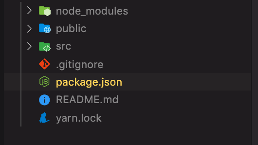
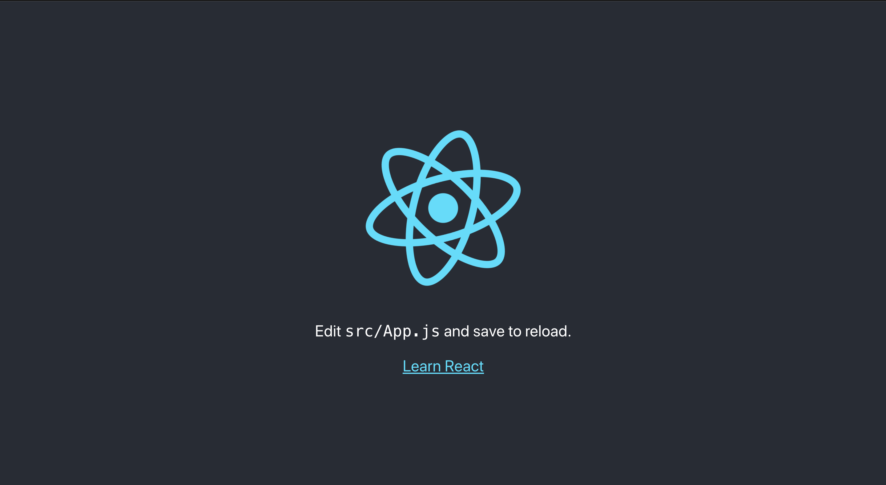
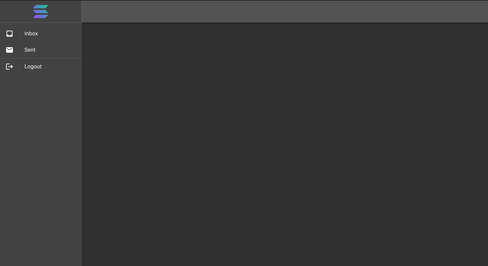
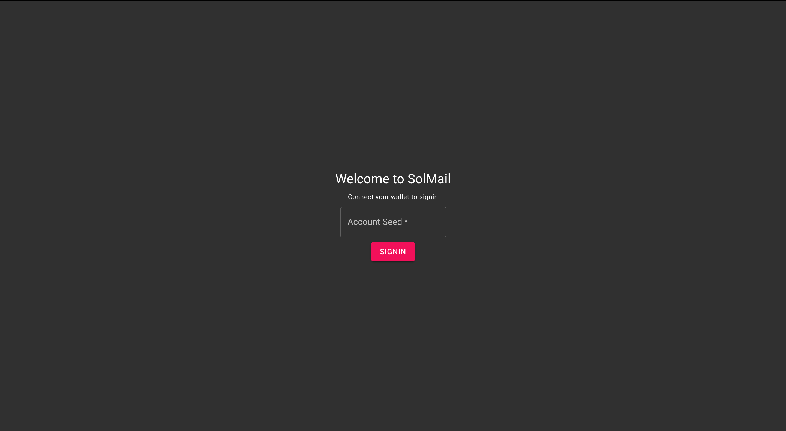
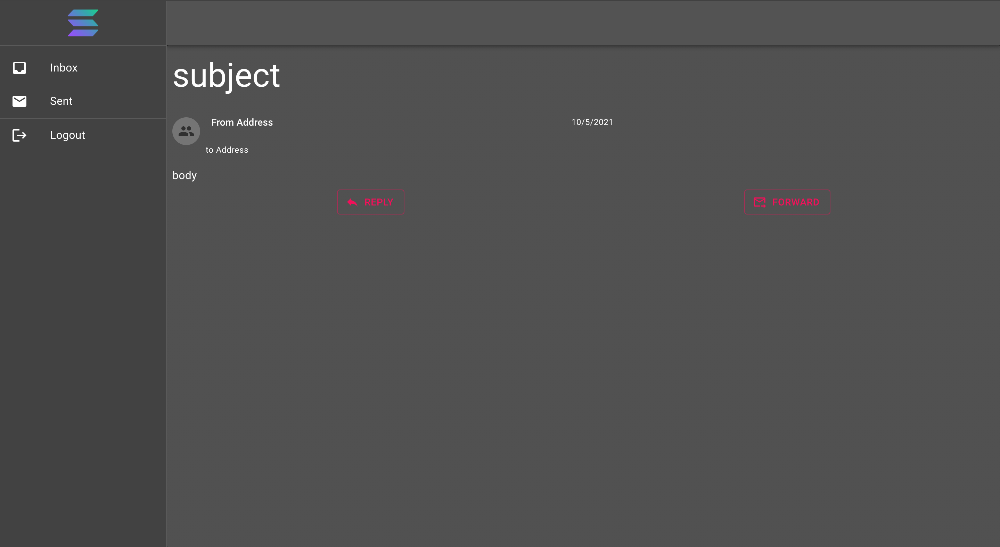

# Introduction

Solana is a decentralized blockchain built to enable scalable, user-friendly apps for the world at $0.00025 average cost per transaction. In this tutorial, we are going to build a decentralized mail app to showcase the potential of Solana, we will build the on-chain program with [Rust](https://www.rust-lang.org/) and the web UI with [React](https://reactjs.org/) and [MaterialUI](https://material-ui.com/). We'll go through the code together, building the program and web UI step by step.

You can find the final code to the on-chain program [here](https://github.com/Segun-Ogundipe/solana-mail) and the UI [here](https://github.com/Segun-Ogundipe/solana-mail-web)

# Prerequisites

A good understanding of the Rust programming language and React is very important to grasping the contents of this tutorial. I suggest a primer on both following the links provided in the introduction section.

# Requirements

- Install rust from [HERE](https://rustup.rs/)
- [Git](https://git-scm.com/downloads) and
- Solana CLI [HERE](https://docs.solana.com/cli/install-solana-cli-tools#use-solanas-install-tool)

# Building the mail program

# Project setup

Head over to [this template](https://github.com/mvines/solana-bpf-program-template) on Github and click on **Use this template** button, which will allow you to create a new repository. Give your repo a new name and check the 'Include all branches' box, then click on **Create repository from template** button. Now clone the repository to your local machine with your preferred method, or simply by using `git clone https://github.com/<your Github username>/<what you named the repo>`.

Open `Cargo.toml` in your favourite editor and remove the crates under `[dev-dependencies]`. It should now look like this:

```toml
[package]
name = "solana-mail"
version = "0.1.0"
edition = "2018"
license = "WTFPL"
publish = false

[dependencies]
solana-program = "=1.7.10"

[features]
test-bpf = []

[lib]
crate-type = ["cdylib", "lib"]
```

# entrypoint, programs, and accounts

Open `lib.rs` in the `src` folder. It currently contains:

```rust
use solana_program::{
  account_info::AccountInfo, entrypoint, entrypoint::ProgramResult, msg, pubkey::Pubkey,
};

entrypoint!(process_instruction);
fn process_instruction(
  program_id: &Pubkey,
  accounts: &[AccountInfo],
  instruction_data: &[u8],
) -> ProgramResult {
  msg!(
    "process_instruction: {}: {} accounts, data={:?}",
    program_id,
    accounts.len(),
    instruction_data
  );
  Ok(())
}

#[cfg(test)]
mod test {
  use {
    super::*,
    assert_matches::*,
    solana_program::instruction::{AccountMeta, Instruction},
    solana_program_test::*,
    solana_sdk::{signature::Signer, transaction::Transaction},
  };

  #[tokio::test]
  async fn test_transaction() {
    let program_id = Pubkey::new_unique();

    let (mut banks_client, payer, recent_blockhash) = ProgramTest::new(
      "bpf_program_template",
      program_id,
      processor!(process_instruction),
    )
    .start()
    .await;

    let mut transaction = Transaction::new_with_payer(
      &[Instruction {
        program_id,
        accounts: vec![AccountMeta::new(payer.pubkey(), false)],
        data: vec![1, 2, 3],
      }],
      Some(&payer.pubkey()),
    );
    transaction.sign(&[&payer], recent_blockhash);

    assert_matches!(banks_client.process_transaction(transaction).await, Ok(()));
  }
}
```

The crates used by this file are brought into scope with the [use](https://doc.rust-lang.org/stable/book/ch07-04-bringing-paths-into-scope-with-the-use-keyword.html) keyword. Then the `entrypoint!` [macro](https://doc.rust-lang.org/stable/book/ch19-06-macros.html) is used to declare `process_instruction` as the [entrypoint](https://docs.solana.com/developing/on-chain-programs/developing-rust#program-entrypoint) to the program. As the name suggests, entrypoint is our program's point of entry, all calls to the program goes through the `process_instruction` function.

The function takes three arguments:

- `program_id` - This is the [public key](https://docs.solana.com/terminology#public-key-pubkey) of our program, the program's identifier
- `accounts` - Solana programs are stateless, the programs themselves don't store data between transactions. To store state, we use [accounts](https://docs.solana.com/developing/programming-model/accounts)
- `instruction_data` - This is the data passed to the program by the calling code

# Code structure

We are going to structure our code using the following format:

```text
├─ src
│  ├─ lib.rs -> registering modules
│  ├─ entrypoint.rs -> entrypoint to the program
│  ├─ instruction.rs -> program API, (de)serializing instruction data
│  ├─ processor.rs -> program logic
│  ├─ state.rs -> program objects, (de)serializing state
│  ├─ error.rs -> program specific errors
├─ .gitignore
├─ Cargo.lock
├─ Cargo.toml
├─ Xargo.toml
```

Using this structure, our program's flow will look like this:

1.  `entrypoint` forwards incoming calls to the `processor`
2.  The `processor` decodes the `instruction_data` using functions from `instruction.rs`
3.  After decoding the data, the `processor` will then use one of the prepared functions to handle the request
4.  `state.rs` contains models of the data used in the project.

For example, say Alice creates an account on our program. What that means for us is to generate a [Program Derived Address (PDA)](https://docs.solana.com/developing/programming-model/calling-between-programs#program-derived-addresses) from her wallet's public key, a seed phrase, and our program's public key. The PDA will act as Alice's account id which she will use to send and receive mails. The PDA doesn't only act as her account id but also as a store for her data, this is where all the mail she has sent and received will be stored.

<Hint type="info">
  Accounts in Solana are owned by programs. A program can only manipulate the
  data in an account that it owns, hence the need for generating a PDA account
  owned by our program as our user's account id.
</Hint>

If Alice wants to send a mail to Bob, she sends the mail data as a request to our program, the program's `entrypoint` function fowards the request and all its data to the `processor`. Then the `processor` decodes the data with the help of `instruction.rs` and the decoding logic in `state.rs`. Finally the `processor` calls a function to save the mail data sent in the request to the inbox of the receiver's account (which was sent along with the request).

Create the following files in the src folder:

- entrypoint.rs
- error.rs
- instruction.rs
- processor.rs
- state.rs

# State, part 1

Open the file `lib.rs`, remove the existing content then add the following code, which defines the modules we will use:

```rust
pub mod entrypoint;
pub mod error;
pub mod instruction;
pub mod processor;
pub mod state;
```

The next thing we need to do here is open `state.rs` and declare our models. In the file `state.rs`, add the following struct:

```rust
pub struct Mail {
  pub id: String,
  pub from_address: String,
  pub to_address: String,
  pub subject: String,
  pub body: String,
  pub sent_date: String,
}
```

What we just did here is declare a struct that will represent our mail objects. Each mail object will have a `from_address` and `to_address`, fields of type String that hold a base58 representations of the sender's and receiver's public key. A `subject` field representing the subject of the mail, a `body` field that is the content of the mail and finally `sent_Date`, the date the mail was sent. We are using the `String` data-type for the `sent_date` field because the date we will really be saving is going to be the string value of the specified date.

One other thing to note here is that data in accounts are stored in `Uint8Array` format. What this means is, if we want to store the string "Solana is awesome" in an account's data, we will need to serialize the string. We do this by converting each character in the string to decimals following the [UTF-8](https://en.wikipedia.org/wiki/UTF-8) format. In this case, the string "Solana is awesome" will be serialized into a `Uint8Array` as "\[83, 111, 108, 97, 110, 97, 32, 105, 115, 32, 97, 119, 101, 115, 111, 109, 101]"

Keeping this in mind, we now know we need to serialize our mail data before we can store it on the network. For this we will need to use the [Borsh](https://borsh.io/) crate. Open `Cargo.toml` and add the following dependencies:

```toml
...
[dependencies]
solana-program = "=1.7.10"
borsh = "0.9.1"
borsh-derive = "0.9.1"
...
```

<Hint type="info">
  Three dots ... on a line by themselves indicate the presence of other code
  which we have trimmed for display purposes.
</Hint>

Then add the following code to `state.rs`

```rust
use borsh::{BorshDeserialize, BorshSerialize};

#[derive(BorshDeserialize, BorshSerialize, Debug)]
pub struct Mail{
...
```

What we just did here is provide basic implementations for `BorshDeserialize`, `BorshSerialize`, and the `Debug` traits using the `derive` macro. The `Debug` trait allows us to print the content of a mail object to the console using the `"{:?}" debug `formatter. `BorshDeserialize`adds an associated method named`try_from_slice()`that we can use to construct a Mail object from a reference to a slice of `u8`. Finally, `BorshSerialize` provides a basic implementation of a method named `serialize()`, this allows us to serialize the content of a Mail object into a slice of `u8`.

Now that we have a `struct` that we can build mail objects from, lets add another `struct` that will serve as the state of our user's Account data. This `struct` will have two fields, `inbox` and `sent`, the two fields will be vectors of `Mail` representing the lists of mails the user has in their Account.

Still in `state.rs`, add the following after the Mail struct declaration:

```rust
#[derive(BorshDeserialize, BorshSerialize, Debug)]
pub struct MailAccount {
  pub inbox: Vec<Mail>,
  pub sent: Vec<Mail>,
}
```

With this, we are done with `state.rs` for now.

# Entrypoint

Open the file `entrypoint.rs` in the editor and paste the following:

```rust
use crate::processor::Processor;
use solana_program::{
  account_info::AccountInfo, entrypoint, entrypoint::ProgramResult, pubkey::Pubkey,
};

entrypoint!(process_instruction);
fn process_instruction(
  program_id: &Pubkey,
  accounts: &[AccountInfo],
  instruction_data: &[u8],
) -> ProgramResult {
  Processor::process(program_id, accounts, instruction_data)
}
```

The first two lines here import the `Processor` struct from the processor module which we will declare soon and `AccountInfo`, `entrypoint`, `ProgramResult`, and `Pubkey` from the `solana_progam` crate.

The `process_instruction()` serves as the entrypoint of our program, every request sent to the program will be handled by this function. The function takes as arguments:

- `program_id` - As mentioned before, this is a reference to a public key of the deployed program which acts as a way to identify the program
- `accounts` - This a reference to a slice of `AccountInfo`
- `instruction_data` - This is a reference to a slice of `u8` containing the data passed to the program to be processed, this will contain the mail object among other things.

In the body of the `process_instruction()` function, we have just one line of code, a call to a yet to be declared function, `process()`, of the `Processor` struct from the processor module. This function is going to be handling all the requests that come to our program.

# Instruction, part 1

The `instruction.rs` module will contain the API definition of our program. The first endpoint we are going to define here is the `InitAccount` endpoint.

```rust
#[derive(Debug)]
pub enum MailInstruction {
  /// Initialize a new account
  ///
  /// Accounts expected
  ///
  /// 1. `[writable]` The AccountInfo of the account to be initialized
  InitAccount,
}
```

The `instruction` module defines an enum `MailInstruction`. This enum currently declares one endpoint, `InitAccount`. The comment above it indicates that it takes a writable `account` which is the PDA generated for the user. We'll see how this works when we start building the UI.

```rust
use crate::error::MailError::InvalidInstruction;
use solana_program::program_error::ProgramError;
...
impl MailInstruction {

  pub fn unpack(input: &[u8]) -> Result<Self, ProgramError> {
    let (tag, rest) = input.split_first().ok_or(InvalidInstruction)?;

    Ok(match tag {
      0 => Self::InitAccount,
      _ => return Err(InvalidInstruction.into()),
    })
  }
}
```

Still in the instruction module, we add an associated method to the MailInstruction enum named `unpack()`. The method expects a reference to a slice of `u8` - this will be the `instruction_data` argument passed to our entrypoint function.

In the first line of the `unpack()` method, we call the [split_first()](https://doc.rust-lang.org/std/primitive.slice.html#method.split_first) method on the slice of `u8`. The `split_first()` method returns an [Option()](https://doc.rust-lang.org/std/option/enum.Option.html) enum with the first and all the rest of the elements of the slice. The first element serves as a tag that determines how we decode the rest of the instruction. Note the [ok_or()](https://doc.rust-lang.org/std/option/enum.Option.html#method.ok_or) call on the returned `Option()` from the `split_first()` call? You should look up the methods yourself to get a deeper understanding of what's going on with the calls. What's most important here is that you understand that we provide a custom error `InvalidInstruction` to `ok_or()` method in case the call to `split_first()` fails.

This code won't compile because we have yet to define the custom error.

# Error

In the `error.rs` module:

```rust
use thiserror::Error;

#[derive(Error, Debug, Copy, Clone)]
pub enum MailError {
  /// Invalid Instruction
  #[error("Invalid Instruction")]
  InvalidInstruction,
}
```

Update the dependencies in `Cargo.toml` with:

```rust
thiserror = "1.0.24"
```

We [defined an error type](https://doc.rust-lang.org/rust-by-example/error/multiple_error_types/define_error_type.html) in `error.rs` and then use the `Error` trait from the [thiserror](https://docs.rs/thiserror/latest/thiserror/) library to implement `fmt::Display` for our custom error.

Still one more thing left to do here. We are not completely done with our error module just yet. If you look at our `unpack()` method in `instruction.rs`, it's supposed to return a `ProgramError` in case of an error but the error we just declared is not implemented for `ProgramError`. Let's take care of that with:

```rust
use solana_program::program_error::ProgramError;

impl From<MailError> for ProgramError {
  fn from(e: MailError) -> Self {
    ProgramError::Custom(e as u32)
  }
}
```

Here, we implement the [From](https://doc.rust-lang.org/std/convert/trait.From.html) trait which the `?` operator uses to return an error.

Now that we have a basic setup for our error, entrypoint and instruction, we are now ready to code `processor.rs`

# Processor, part 1

In the `processor.rs` module, paste:

```rust
use crate::instruction::MailInstruction;
use solana_program::{
  account_info::AccountInfo,
  entrypoint::ProgramResult,
  msg,
  pubkey::Pubkey,
};

pub struct Processor;
impl Processor {
    pub fn process(
      program_id: &Pubkey;
      accounts: &[AccountInfo],
      instruction_data: &[u8],
    ) -> ProgramResult {
    let instruction = MailInstruction::unpack(instruction_data)?;

    match instruction {
      MailInstruction::InitAccount => {
        msg!("Instruction: InitAccount");
        Self::process_init_account(accounts, program_id)
      }
    }
  }
}
```

Back in our `entrypoint.rs` module, we said the `process()` method was going to handle every request sent to our program. This is how we accomplish it. We pass the reference to the slice holding the `instruction_data` from the `process_instruction()` function in the `entrypoint.rs` module to the `unpack()` method of `MailInstruction`. We then use `match` to decide which request we are responding to, and the right method to call using the enum returned from the call to `unpack()`. In the case of `InitAccount` we call the `process_init_account()` function:

```rust
/// inside the Processor implementation, right after the process function
...

fn process_init_account(
    account: &AccountInfo,
    program_id: &Pubkey
  ) -> ProgramResult {

  Ok(())
}
```

This is the declaration of the `process_init_account` method, it takes a reference to an `AccountInfo` - the account info of the PDA address of the user, and a reference to a `Pubkey` - the program id, the reason we need the program id will soon become clear.

To initialize an account, we are only going to send a welcome mail to the account. This serves to show that our setup works. Before we go aheaad to actually compose a mail object and then add the instance to the user's inbox, we need to validate the account to make sure we can write to it and that it belongs to this program.

```rust
use crate::error::MailError::NotWritable;
use crate::instruction::MailInstruction;
use solana_program::{
  account_info::AccountInfo,
  entrypoint::ProgramResult,
  msg,
  program_error::ProgramError,
  pubkey::Pubkey,
};

...

fn process_init_account(
    account: &AccountInfo,
    program_id: &Pubkey
  ) -> ProgramResult {
  if !account.is_writable {
    return Err(NotWritable.into());
  }

  if account.owner != program_id {
    return Err(ProgramError::IncorrectProgramId);
  }

  Ok(())
}
```

The first `if statement` checks whether the account is writable and returns an error if it's not. `NotWritable` is a custom error and should be added to the `MailError` struct in the `error.rs` module. You should do that before moving on.

The second `if statement` confirms that the account owner is the same as program id. If they are not the same, it will return an error.

Update the import section in `proessor.rs`:

```rust
use crate::error::MailError::NotWritable;
use crate::instruction::MailInstruction;
use crate::state::{Mail, MailAccount};
use borsh::BorshSerialize;
use solana_program::{
  account_info::AccountInfo,
  entrypoint::ProgramResult,
  msg,
  program_error::ProgramError,
  pubkey::Pubkey,
};
```

Next, we compose a welcome mail and add it to the accounts data. Inside the `process_init_account` method, right after the two if statements, add:

```rust
...
let welcome_mail = Mail {
  id: String::from("00000000-0000-0000-0000-000000000000"),
  from_address: program_id.to_string(),
  to_address: account.key.to_string(),
  subject: String::from("Welcome to SolMail"),
  body: String::from("This is the start of your private messages on SolMail
  Lorem, ipsum dolor sit amet consectetur adipisicing elit. Quos ut labore, debitis assumenda, dolorem nulla facere soluta exercitationem excepturi provident ipsam reprehenderit repellat quisquam corrupti commodi fugiat iusto quae voluptates!"),
  sent_date: "9/29/2021, 3:58:02 PM"
};

let mail_account = MailAccount {
  inbox: vec![welcome_mail],
  sent: Vec::new(),
};

mail_account.serialize(&mut &mut account.data.borrow_mut()[..])?;
...
```

We instantiated an instance of the `Mail` struct, and then filled in data for its fields. We also instantiated a `MailAccount` object, added the welcome mail instance to the inbox field using the `vec!` macro and then assigned an empty vector object to the sent field. In the last line, we serialized the mail_account instance and then write the serialized data to the user's account data by calling the `serialize()` method of the `mail_account` instance with a mutably borrowed data from the user's account data.

You might notice the tricky `&mut &mut account.data.borrow_mut()[..]` expression. The `serialize()` method takes a reference to a mutable slice of `u8` as an argument, the `borrow_mut()` method returns a `RefMut`. We can't pass `RefMut` to a method that expects a slice, so we take a mutable slice of `RefMut` which returns a mutable slice of `u8`. The [repo](https://github.com/Segun-Ogundipe/solana-mail) on Github has some sanity test for the methods here.

We are done with our account initialization, we can now move on to adding the logic to handle requests for sending mails between two accounts.

# Instruction, part 2

In the `instruction.rs` module, we stopped at:

```rust
impl MailInstruction {
  use crate::error::MailError::InvalidInstruction;
  use solana_program::program_error::ProgramError;

#[derive(Debug)]
pub enum MailInstruction {
  /// Initialize a new account
  ///
  /// Accounts expected
  ///
  /// 1. `[writable]` The account to be initialized
  InitAccount,
}

impl MailInstruction {
  pub fn unpack(input: &[u8]) -> Result<Self, ProgramError> {
    let (tag, rest) = input.split_first().ok_or(InvalidInstruction)?;

    Ok(match tag {
      0 => Self::InitAccount,
      _ => return Err(InvalidInstruction.into()),
    })
  }
}
```

We had one endpoint, the InitAccount endpoint. We now need to add another endpoint, the `SendMail` endpoint. This endpoint will be responsible for deserializing a mail instance and returning it to the `process` method.

Update the `MailInstruction` enum declaration to:

```rust
#[derive(Debug)]
pub enum MailInstruction {
  /// Initialize a new account
  ///
  /// Accounts expected
  ///
  /// 1. `[writable]` The AccountInfo of the account to be initialized
  InitAccount,
  /// Send a mail to an account.
  ///
  /// Accounts expected:
  ///
  /// 1. `[writable]` The AccountInfo of the sender
  /// 2. `[writable]` The AccountInfo of the receiver
  SendMail { mail: Mail },
}
```

We added a new enum `SendMail` - a struct like enum that has a mail field. The endpoint takes two writable PDA accounts, the sender and and receiver's accounts respectively.

Update the code in the `match` expression of the `unpack()` method to:

```rust
Ok(match tag {
  0 => Self::InitAccount,
  1 => Self::SendMail {
    mail: Mail::try_from_slice(&rest)?,
  },
  _ => return Err(InvalidInstruction.into()),
})
```

This case matches instances where the value of the first element of the instruction data is `1`. If the value is `1`, the function returns a `SendMail` enum with the mail instance that was deserialized from the rest of the `data`.

# Processor, part 2

In the `process()` method, add another case to the match expression:

```rust
MailInstruction::SendMail { mail } => {
  msg!("Instruction: SendMail");
  Self::process_send_mail(accounts, mail, program_id)
}
```

The case gets the mail instance from the `MailInstruction` enum then call the associated `process_send_mail()` method. The method is responsible for writing the mail instance to the inbox array of mails already in the `inbox` field of the receiver's account data, do the same for the sender's account data but to the `sent` field instead.

Inside the `process()` method, right after the `process_init_account` method, declare:

```rust
fn process_send_mail(accounts: &[AccountInfo], mail: &Mail, program_id: &Pubkey) -> ProgramResult {
  Ok(())
}
```

The method takes a reference to a slice of `AccountInfo`, a reference to a `Mail` instance and the program_id as arguments.

Paste this into the body of the method right before `Ok(())`:

```rust
...
let sender_account = &accounts[0];

if !sender_account.is_writable {
  return Err(NotWritable.into());
}

if sender_account.owner != program_id {
  return Err(ProgramError::IncorrectProgramId);
}

let receiver_account = &accounts[1];

if !receiver_account.is_writable {
  return Err(NotWritable.into());
}

if receiver_account.owner != program_id {
  return Err(ProgramError::IncorrectProgramId);
}
...
```

As declared by the endpoint in `MailInstruction`, the endpoint takes two `AccountInfo` objects as arguments, the `sender` and `receiver` respectively.

To start this method, we validate the accounts. Same as we did at the start of the `process_init_account()` method. Next, update the import section:

```rust
use crate::error::MailError::NotWritable;
use crate::instruction::MailInstruction;
use crate::state::{Mail, MailAccount};
use borsh::{BorshDeserialize, BorshSerialize};
use solana_program::{
  account_info::AccountInfo,
  entrypoint::ProgramResult,
  msg,
  program_error::ProgramError,
  pubkey::Pubkey,
}
`
```

Then, right after the last code in the `process_send_mail()` method just before `Ok(())`, add:

```rust
...
let sender_data = MailAccount::try_from_slice(&sender_account.data.borrow()[..]);
sender_data.sent.push(mail.clone());
sender_data.serialize(&mut &mut sender_account.data.borrow_mut()[..])?;

receiver_data = MailAccount::try_from_slice(&receiver_account.data.borrow()[..])?;
receiver_data.inbox.push(mail.clone());
receiver_data.serialize(&mut &mut receiver_account.data.borrow_mut()[..])?;
...
```

Here, we used the `try_from_slice()` associated method we got from implementing the `BorshDeSerialize` trait on the `MaiAccount` struct. `try_from_slice()` constructs and returns an instance of the object it was called on from the serialized slice it was passed.

We then add the mail instance that was deserialized from the request data to the `sent` field of the `MailAccount` instance of the sender, serialized and write the sender's `MailAccount` instance back to their accounts data.

In the last part of the code, we used the same pattern as we did above to add the `mail` instance to the receiver's `inbox` field then write the data back to their account.

Notice the `clone()` call on the mail reference?, `mail` is a reference to a `mail` instance, not an instance itself. The `push()` method takes a mail instance argument and not a refernce to one, and that is why we called `clone()` on the reference. The `clone()` method returns a copy of the mail instance that mail references. There's still a problem though, we need to implement the `Clone` trait for the `Mail` struct for us to be able to make this call. You should figure out how to do this yourself.

With this, users will be able to send and receive mails to/from other users.

The `process_send_mail()` method will fail if we were to leave it in its current state and here's why: The `serialize()` method that we called on the `mail_account` instance is derived from implementing `BorshSerialize` in the `MailAccount's` struct declaration. The method takes a reference to a slice of `u8` argument, serializes the data of the instance it's called on (`mail_account` in our case), then writes the serialized data to the slice it was called with. The method will try to read all the bytes in the slice it was passed. The method will fail to construct an object from the slice if the slice has more bytes in total than the actual bytes of the object.

To better understand this, let's shift our focus from this project to the following example:

```rust
/// Declare a de/serializable struct with just one field
#[derive(BorshDeserialize, BorshSerialize, Debug)]
struct DataLength {
  pub length: u32,
}

/// Instantiate a DataLength instance
let data_length = DataLength {
  length: 5
};

/// Assigns a length 8 array filled with 0 to temp_slice
let temp_slice = [0; 8];
/// Serialize data_length and write it to temp_slice
data_length.serialize(&mut &mut temp_slice[..]);
/// Will print [5, 0, 0, 0, 0, 0, 0, 0]
msg!("{:?}", temp_slice);

/// The piece of code above should execute without any error.
/// On the next line, we try to deserialize a DataLength instance from temp_slice
let data_length = DataLength::try_from_slice(&temp_slice);
msg!("{:?}", data_length);
/// The above line will fail with: Err(Custom { kind: InvalidData, error: "Not all bytes read" })
/// The try_from_slice() method tried to read all 8 bytes from the slice when it only needed to read 4 bytes to construct a valid DataLength instance.
/// To fix the above bug, we need to pass a slice of the bytes try_from_slice() needs to construct a valid object as its argument.
/// Change the last line to
let data_length = DataLength::try_from_slice(&temp_slice[..4]);
msg!("{:?}", data_length);
/// What we just did is pass a reference of the first four bytes of temp_slice to try_from_slice()
/// The exact bytes that holds the serialized data for a DataLength instance.
/// With this edit, the code should print Ok(DataLength { length: 5 })
```

With the above example in mind, lets focus back on our program. We now know the reason the `process_send_mail()` method will fail, we need to pass a slice that holds only the bytes of a serialized `MailAccount` struct instance to the `try_from_slice()`. To do this, we need to store the length of the `MailAccount` instance in a user's account.

# State, part 2

We need to add another struct to the state module:

```rust
#[derive(BorshDeserialize, BorshSerialize, Debug)]
pub struct DataLength {
  pub length: u32,
}
```

This struct has one `u32` field, `length`. We will use an instance of this struct to store the length of the serialized `MailAccount` instance stored in the user's account data every time we update the data

# Processor, part 3

By adding the `DataLength` struct, we now have what we need to fix the bug in `process_send_mail()`. Update the `process_send_mail()` method from the **processor part 2** section to:

```rust
/// Update the import
use crate::error::MailError::NotWritable;
use crate::instruction::MailInstruction;
use crate::state::{DataLength, Mail, MailAccount};
use borsh::{BorshDeserialize, BorshSerialize};
use solana_program::{
  account_info::AccountInfo, borsh::get_instance_packed_len, entrypoint::ProgramResult, msg,
  program_error::ProgramError, pubkey::Pubkey,
};
use std::convert::TryFrom;
...
fn proess_send_mail(
  accounts: &[AccountInfo],
  mail: &Mail,
  program_id: &Pubkey,
) -> ProgramResult {
  ...
  /// right after the if statements:
  let offset: usize = 4;

  let data_length = DataLength::try_from_slice(&sender_account.data.borrow()[..offset])?;

  let mut sender_data;
  if data_length.length > 0 {
    let length = usize::try_from(data_length.length + u32::try_from(offset).unwrap()).unwrap();
    sender_data = MailAccount::try_from_slice(&sender_account.data.borrow()[offset..length])?;
  } else {
    sender_data = MailAccount {
      inbox: Vec::new(),
      sent: Vec::new(),
    };
  }

  sender_data.sent.push(mail.clone());
  let data_length = DataLength {
    length: u32::try_from(get_instance_packed_len(&sender_data)?).unwrap(),
  };
  data_length.serialize(&mut &mut sender_account.data.borrow_mut()[..offset])?;
  sender_data.serialize(&mut &mut sender_account.data.borrow_mut()[offset..])?;

  let data_length = DataLength::try_from_slice(&receiver_account.data.borrow()[..offset])?;

  let mut receiver_data;
  if data_length.length > 0 {
    let length = usize::try_from(data_length.length + u32::try_from(offset).unwrap()).unwrap();
    receiver_data = MailAccount::try_from_slice(&receiver_account.data.borrow()[offset..length])?;
  } else {
    receiver_data = MailAccount {
      inbox: Vec::new(),
      sent: Vec::new(),
    }
  }
  receiver_data.inbox.push(mail.clone());

  let data_length = DataLength {
    length: u32::try_from(get_instance_packed_len(&receiver_data)?).unwrap(),
  };
  data_length.serialize(&mut &mut receiver_account.data.borrow_mut()[..offset])?;
  receiver_data.serialize(&mut &mut receiver_account.data.borrow_mut()[offset..])?;
}
```

If you compare this edit to the one in the **process part 2** section, you should see the changes we made. We are storing two struct instances in the user's account data now, the user's `MailAccount` instance and the `DataLength` of the `MailAccount` instance.

The state of a user account data would now look like:

```rust
[data_length, mail_account, 0, 0, 0, 0, 0, ..];
```

A `data_length` instance is 4 bytes in length so the `MailAccount` instance will start from the third index of the array. We initialized the `offset` variable to `4` with `let offset = 4`, we made the type of the variable `usize` because that's the type we need to index into a slice.

We grabbed the `data_length` instance from the account's data making sure to pass only the required slice with `let data_length = DataLength::try_from_slice(&sender_account.data.borrow()[..offset])?;`. With an if statement, we checked the length of the data instance is more than `0`. If true, we get the length of the `MailAccount` instance and then deserialize it from the data:

```rust
let length = usize::try_from(data_length.length + u32::try_from(offset).unwrap()).unwrap();
sender_data = MailAccount::try_from_slice(&sender_account.data.borrow()[offset..length])?;
```

On the other hand, if length is not greater than `0`, we only instantiate a `MailAccount` object and assigned it to `sender_data`:

```rust
sender_data = MailAccount {
  inbox: Vec::new(),
  sent: Vec::new(),
};
```

Next, we added the `mail` instance to the sender account's `MailAccount` instance, got the length of the serialized form of the instance with the [get_instance_packed_len()](https://docs.rs/solana-program/1.7.3/solana_program/borsh/fn.get_instance_packed_len.html) method, used that to instantiate a new `DataLength` object. We then proceeded to serialize and write both instances to the user's data:

```rust
sender_data.sent.push(mail.clone());
let data_length = DataLength {
    length: u32::try_from(get_instance_packed_len(&sender_data)?).unwrap(),
  };
data_length.serialize(&mut &mut sender_account.data.borrow_mut()[..offset])?;
sender_data.serialize(&mut &mut sender_account.data.borrow_mut()[offset..])?;
```

We did the same for the logic that handles the addition of the mail instance to the receiver's account.

With this change in how our code works, we need to edit our `process_init_account()` method, specificaly the part that reads and write data. In the `process_init_account()` method, edit:

```rust
let mail_account = MailAccount {
  inbox: vec![welcome_mail],
  sent: Vec::new(),
};

mail_account.serialize(&mut &mut account.data.borrow_mut()[..])?;
```

to:

```rust
let mail_account = MailAccount {
  inbox: vec![welcome_mail],
  sent: Vec::new(),
};

let data_length = DataLength {
  length: u32::try_from(get_instance_packed_len(&mail_account)?).unwrap(),
};

let offset: usize = 4;
data_length.serialize(&mut &mut account.data.borrow_mut()[..offset])?;
mail_account.serialize(&mut &mut account.data.borrow_mut()[offset..])?;
```

# Build and Deploy the program

Now that we are done building the on-chain program, we should build and deploy it. We will deploy the program to a local cluster so lets set that up. Open up your console and type:

```text
solana config set --url localhost
```

This command sets the RPC URL value of Solana CLI's config file to localhost. The result of executing the command should look like this:

```text
Config File: /Users/mac/.config/solana/cli/config.yml
RPC URL: http://localhost:8899
WebSocket URL: ws://localhost:8900/ (computed)
Keypair Path: /Users/mac/.config/solana/id.json
Commitment: confirmed
```

Next, execute:

```text
solana-test-validator
```

This command starts up a local Solana cluster that we can use to deploy and test our program. The result of executing the command should look like this:

```text
Ledger location: test-ledger
Log: test-ledger/validator.log
Identity: BzSSj1gq6MpMp32sxXb6H8jzKjAzrcLL7P9KPix3nHcp
Genesis Hash: FAsmX5bCAo9ZvAVzy33dWNeZb6p6wQrYYZKD16wyXscS
Version: 1.7.10
Shred Version: 58949
Gossip Address: 127.0.0.1:1024
TPU Address: 127.0.0.1:1027
JSON RPC URL: http://127.0.0.1:8899
⠐ 00:00:14 | Processed Slot: 27 | Confirmed Slot: 27 | Finalized Slot: 0 | Snaps
```

Now that we have a local cluster we can deploy our program on, we should build and deploy the program. Open up your console and change its directory to the project's directory. Execute:

```text
cargo build-bpf
```

This command builds our program and save the files resulting from the build process to the `target` directory. After running the command a `target` directory should be created at the root of the project. Locate the `deploy` directory inside the `target` directory, this directory contains the shared object (.so) file for our program and the on-chain program's keypair string. Next execute:

```text
solana program deploy target/deploy/<name-of-the-program>.so
```

This command deploys the program to our local cluster. The `deploy` command takes the path to the the program's shared object file as argument. The result of running this command should be the program id of the deployed program.

Note: The code in the Github repo won't be an exact match of the code in the tutorial as some edits have been made to clean up the program. Please have a look at the Github repo for the latest code!

# Building the web UI

We are going to build the web client for our on-chain program in this chapter. We will build the project with React and MaterialUI.

# Project setup

Install React with:

```text
npx create-react-app <the-name-of-the-project>
```

This command creates and configures a basic react project in the `<the-name-of-the-project>` directory. After the command is done running, move into the directory in your terminal with:

```text
cd /path/to/<the-name-of-the-project>
```

The project directory structure should look like:

Now let's see what we've done so far. Run:

```text
yarn start
```

This command starts your project and then loads it up on your favorite browser:


Now that we have setup react successfully, let us also set up MaterialUI:

```text
yarn add @mui/material @mui/icons-material @emotion/react @emotion/styled
```

What we just did here is we added three libraries to our project from [npm](https://www.npmjs.com/):

- @mui/material - MUI component library
- @mui/icons-material - Google material icons compoent library
- @emotion/react - Simple Styling library. Required by MUI
- @emotion/styled - Styled API for @emotion/react

MUI was designed with the Roboto font so let's add that. Open the `index.html` file in the `public` directory, locate the `<head>` tag and add:

```html
<link
  rel="stylesheet"
  href="https://fonts.googleapis.com/css?family=Roboto:300,400,500,700&display=swap"
/>
```

MUI lets you configure the theming system, to suit your use case. Let's add a new file to set up our theme. Add a new file to the `src` directory and name it `theme.js` then copy and paste the code:

```javascript
import { createTheme, responsiveFontSizes } from '@mui/material';

let theme = createTheme({
  palette: {
    mode: 'dark',
    primary: {
      main: '#3f51b5',
      light: 'rgb(101, 115, 195)',
      dark: 'rgb(44, 56, 126)',
      contrastText: '#fff',
    },
    secondary: {
      main: '#f50057',
      light: 'rgb(247, 51, 120)',
      dark: 'rgb(171, 0, 60)',
      contrastText: '#fff',
    },
    background: {
      default: '#303030',
      paper: '#424242',
    },
    text: {
      primary: '#fff',
      secondary: 'rgba(255, 255, 255, 0.7)',
      disabled: 'rgba(255, 255, 255, 0.5)',
      hint: 'rgba(255, 255, 255, 0.5)',
    },
    error: {
      main: '#f44336',
      light: '#e57373',
      dark: '#d32f2f',
      contrastText: '#fff',
    },
    warning: {
      main: '#ff9800',
      light: '#ffb74d',
      dark: '#f57c00',
      contrastText: 'rgba(0, 0, 0, 0.87)',
    },
    info: {
      main: '#2196f3',
      light: '#64b5f6',
      dark: '#1976d2',
      contrastText: '#fff',
    },
    success: {
      main: '#4caf50',
      light: '#81c784',
      dark: '#388e3c',
      contrastText: 'rgba(0, 0, 0, 0.87)',
    },
    divider: 'rgba(255, 255, 255, 0.12)',
  },
  typography: {
    fontSize: 14,
    fontWeightLight: 300,
    fontWeightRegular: 400,
    fontWeightMedium: 500,
    fontWeightBold: 700,
    htmlFontSize: 16,
  },
  spacing: 8,
});

theme = responsiveFontSizes(theme);

export default theme;
```

Here, we imported `createTheme` and `responsiveFontSizes` from `@mui/material`.

- createTheme - Used to generate a custom theme
- responsiveFontSizes - Used to generate a theme with responsive typography

After the imports, we declared a `theme` variable and then used the `createTheme()` function to configure our custom theme. The last thing we did in this file is used the `responsiveFontSizes()` to return a new theme object with responsive typography and then exported the theme object.

Edit the code in the `App.js` file in the `src` directory to match:

```jsx
import React from 'react';
import { CssBaseline, ThemeProvider } from '@mui/material';

import theme from './theme';

function App() {
  return (
    <ThemeProvider theme={theme}>
      <CssBaseline />
    </ThemeProvider>
  );
}

export default App;
```

We exported the `App()` function from `App.js`. This function is going to serve as our main entry point. For now, it returns the [ThemeProvider](https://mui.com/styles/api/#themeprovider) component. The `ThemeProvider` component injects the theme object passed as a prop to it into our application. This allows us to use our custom theme in any of our components. The `CssBaseline` component adds a consistent CSS baseline to the project.

Let's finish setting up our project by removing some unnecessary files. Remove `App.css`, `index.css` and `logo.svg` from the `src` directory. Lastly, remove the `import './index.css';` line from `index.js`. Also, change the `App.js` file extension to `jsx` by renaming the file to `App.jsx`:

```text
mv ./src/App.js ./src/App.jsx
```

Now that we're done setting up our project, let's start building the pages.

# Drawer menu and Navbar

The first component we are going to write here is the `Navbar` component. Add a new directory to the `src` directory and name it `components`. In the `components` directory, add a new file and name it `Navbar.jsx`. Open the file in the editor and paste:

```jsx
import React from 'react';
import { Box } from '@mui/material';

export function Navbar(props) {
  return <Box></Box>;
}
```

The file imports the [Box](https://mui.com/components/box/) component from the `@mui/material` component library, declared and exported the `Navbar` function. The `Navbar` function returns the `<Box>` component to be rendered. Open the `App.jsx` file and edit it to match:

```jsx
import React from 'react';
import { CssBaseline, ThemeProvider } from '@mui/material';

// Import Navbar from the Navbar component
import { Navbar } from './components/Navbar';

import theme from './theme';

function App() {
  return (
    <ThemeProvider theme={theme}>
      <CssBaseline />
      {/* Render the component*/}
      <Navbar />
    </ThemeProvider>
  );
}

export default App;
```

Now we can see real-time changes in the browser as we edit the `Navbar` component.

Let's add the [Appbar](https://mui.com/components/app-bar/) component from MUI component library to our project. Edit `Navbar.jsx`:

```jsx
import React, { useState } from 'react';
import { AppBar, Box, IconButton, Toolbar } from '@mui/material';
import { Menu as MenuIcon } from '@mui/icons-material';

export function Navbar(props) {
  const [mobileOpen, setMobileOpen] = useState(false);

  const handleDrawerToggle = () => {
    setMobileOpen(!mobileOpen);
  };
  return (
    <Box sx={{ display: 'flex' }}>
      <AppBar
        position="fixed"
        sx={{
          width: { sm: `calc(100% - ${drawerWidth}px)` },
          ml: { sm: `${drawerWidth}px` },
        }}
      >
        <Toolbar>
          <IconButton
            color="inherit"
            aria-label="open-drawer"
            edge="start"
            onClick={handleDrawerToggle}
            sx={{ mr: 2, display: { sm: 'none' } }}
          >
            <MenuIcon />
          </IconButton>
        </Toolbar>
      </AppBar>
    </Box>
  );
}
```

What we just did here is add the `Appbar`, [IconButton](https://mui.com/components/buttons/) and [Toolbar](https://mui.com/api/toolbar/) components from MUI then used the components to render a prebuilt `Appbar`. In the `Navbar` function, we declared a `mobileOpen` state variable, this state variable will help us handle opening and closing the sidebar on small screen devices.

Next, we are going to add a left drawer to render the links. Still inside `Navbar.jsx`, edit the import section to:

```jsx
import React, { useState } from 'react';
import {
  AppBar,
  Box,
  Divider,
  IconButton,
  List,
  ListItemButton,
  ListItemIcon,
  ListItemText,
  Toolbar,
} from '@mui/material';
import {
  Inbox as InboxIcon,
  Logout as LogoutIcon,
  Mail as MailIcon,
  Menu as MenuIcon,
} from '@mui/icons-material';

...
```

Right after the import section, just before the start of the `Navbar` function declaration, add:

```jsx
...

const drawerWidth = 240;
const menuItems = [
  {
    link: '/mail/inbox',
    name: 'Inbox',
    icon: <InboxIcon />,
  },
  {
    link: '/mail/sent',
    name: 'Sent',
    icon: <MailIcon />,
  },
];

...
```

Here, we initialized `drawerWidth` to `240`, this will be the width of our drawer. We also declared a `menuItems` variable, this variable holds an array of two objects. A menu item is an object with 3 fields:

- link - The path the menu links to
- name - The name that will be displayed to the menu
- icon - The icon that will be rendered along with the name

Inside the `Navbar` function, just before the `handleDrawerToggle()` function, right after the `useState()` declaration, add:

```jsx
...

const menu = (
  <div>
    <Toolbar
      sx={{
        display: 'flex',
        justifyContent: 'center',
        height: { sm: 64, xs: 48 },
      }}
    >
      
    </Toolbar>
    <Divider />
    <List>
      {menuItems.map((el, index) => (
        <ListItemButton>
          <ListItemIcon>{el.icon}</ListItemIcon>
          <ListItemText primary={el.name} />
        </ListItemButton>
      ))}
      <Divider />
      <ListItemButton>
        <ListItemIcon>
          <LogoutIcon />
        </ListItemIcon>
        <ListItemText primary='Logout' />
      </ListItemButton>
    </List>
  </div>
);

...
```

Here, we wrote the necessary code needed to render our menu. The code renders a list of menu items from the `menuItems` we declared earlier. An image is used as the project's logo, be sure to add the logo you want to use to the `public` directory and then edit this line `` to reference the image.

Next, edit the content of the return statement in the function to:

```jsx
...
// Right before the return statement, add
const container = props.window !== undefined ? () => props.window().document.body : undefined;

return (
  <Box sx={{ display: 'flex' }}>
    <AppBar
      position='fixed'
      sx={{
        width: { sm: `calc(100% - ${drawerWidth}px)` },
        ml: { sm: `${drawerWidth}px` },
      }}
    >
      <Toolbar>
        <IconButton
          color='inherit'
          aria-label='open-drawer'
          edge='start'
          onClick={handleDrawerToggle}
          sx={{ mr: 2, display: { sm: 'none' } }}
        >
          <MenuIcon />
        </IconButton>
      </Toolbar>
    </AppBar>
    <Box
      component='nav'
      sx={{ width: { sm: drawerWidth }, flexShrink: { sm: 0 } }}
      aria-label='mailbox folders'
    >
      <Drawer
        container={container}
        variant='temporary'
        open={mobileOpen}
        onClose={handleDrawerToggle}
        ModalProps={{ keepMounted: true }}
        sx={{
          display: { xs: 'block', sm: 'none' },
          '& .MuiDrawer-paper': { boxSizing: 'border-box', width: drawerWidth },
        }}
      >
        {menu}
      </Drawer>
      <Drawer
        variant='permanent'
        sx={{
          display: { xs: 'none', sm: 'block' },
          '& .MuiDrawer-paper': { boxSizing: 'border-box', width: drawerWidth },
        }}
        open
      >
        {menu}
      </Drawer>
    </Box>
  </Box>
);
```

Here, we used the [Drawer](https://mui.com/components/drawers/) component to render our side menu. The addition to this code is the `Drawer` component. We used two of these to render the menu component we declared earlier twice, one for large screen devices and the other for small screen devices. After this, the UI should look like this:


# Signin page

Now that we have a side menu, we need to configure navigation. Let's add [react-router-dom](https://reactrouter.com/web/guides/quick-start):

```text
yarn add react-router-dom
```

After adding the `react-router-library`, the next thing we need to do here is wrap our app's entry point with the `BrowserRouter` component from `react-router-dom`. Edit the `App.jsx` file:

```jsx
// Update the import sction
import React from 'react';
import { BrowserRouter as Router, Switch, Route } from 'react-router-dom';
import { CssBaseline, ThemeProvider } from '@mui/material';

import { Navbar } from './components/Navbar';
import theme from './theme';

...

// Update the return statement
return (
  <Router>
    <ThemeProvider theme={theme}>
      <CssBaseline />
      <Switch>
        <Route path='/' component={Navbar} />
      </Switch>
    </ThemeProvider>
  </Router>
);

...
```

The new update to this file adds new imports from the `react-router-dom` library. We used the `BrowserRouter` component to wrap our code so `react-router-dom` can manage navigation for us. Then added the `Switch` component to match `Routes` to different paths and render the right component for each path. For now, we are only rendering the `Navbar` component at `/`. Let's change that.

What we are going to do next is add a sign-in page. Create a new directory in the `src` directory and name it `pages`. This will be where the files for our pages will live. Inside the `pages` directory, add another directory and name it `loggedout`. In the `loggedout` directory, create a new file and name it `Signin.jsx`. Add the following to the `Signin.jsx` file:

```jsx
import React from "react";
import { Box, Stack, TextField, Typography } from "@mui/material";
import { LoadingButton } from "@mui/lab";

export function Signin(props) {

  const handleSignin = async () => {
    props.history.push('/mail/inbox');
  };

  return (
    <Box sx={{
      display: 'flex',
      justifyContent: 'center',
      alignItems: 'center',
      height: '100vh',
      }}>
      <Stack direction='column' justifyContent='center' alignItems='center' spacing={1}>
        <Typography variant='h5'>Welcome to SolMail</Typography>
        <Typography variant='caption'>Connect your wallet to signin</Typography>
        <TextField
          id='account-seed'
          label='Account Seed'
          required
        />
        <LoadingButton
          variant='contained'
          size='medium'
          color='secondary'
          onClick={handleSignin}
        >
          Signin
        </LoadingButton>
      </Stack>
    </Box>
  );
```

We need two things from a user to either register or sign them in. A seed phrase and the user's public key. We will write the code that gets their wallet's public key in a later section, for now, we'll just send them to the inbox page when they click on the `SIGNIN` button. The `LoadingButton` component is part of the `@mui/labs` library so be sure to add that with:

```text
yarn add @mui/lab
```

Back in the `App.jsx` file, import the `Signin.jsx` page we just created and change the value of the `component` prop of the `Route` declaration from `Navbar` to `Signin`. You should end up with:

```jsx
<Route path="/" component={Signin} />
```

The user interface should look like this now:



# Inbox page

Next, add a new directory to the `pages` directory and name it `loggedin`. Then create an `index.jsx` file in the `loggedin` directory. Inside the `index.jsx` file, add:

```jsx
import React, { Fragment } from 'react';
import { Route, Switch } from 'react-router-dom';
import { Box, useTheme } from '@mui/material';

import { Navbar } from '../../components';
import { Inbox } from './Inbox';

export function Main(props) {
  const theme = useTheme();

  return (
    <Fragment>
      <Navbar />

      <Box
        sx={{
          width: { sm: 'calc(100% - 240px)' },
          mt: { sm: theme.spacing(8), xs: theme.spacing(7) },
          ml: { sm: theme.spacing(30) },
        }}
      >
        <Switch>
          <Route path="/mail/inbox" component={Inbox} />
        </Switch>
      </Box>
    </Fragment>
  );
}
```

Here, we added the `Main` component, this component will render different pages based on the value of the current URL path. For now, the component only renders the yet to be declared `Inbox` component at path `/mail/inbox`. Let's go back to the `App.jsx` file and add a route for our new component.

In the `App.jsx file, add another `Route`to the`Switch` component. The`Switch`component should have two`Route\` components now:

```jsx
<Switch>
  <Route path="/mail" component={Main} />
  <Route path="/" component={Signin} />
</Switch>
```

Don't forget to import the `Main` component. Now, let's create the `Inbox` component we used in the `Main` component. Add `Inbox.jsx` file to the `loggedin` directory and fill it with:

```jsx
import React, { Fragment } from 'react';
import { Fab } from '@mui/material';
import { Edit as EditIcon } from '@mui/icons-material';

export function Inbox(props) {
  return (
    <Fragment>
      <Fab
        variant="extended"
        size="large"
        color="secondary"
        aria-label="compose mail"
        onClick={() => props.history.push('send')}
        sx={{
          position: 'absolute',
          bottom: 48,
          right: 16,
        }}
      >
        <EditIcon sx={{ mr: 1 }} />
        Send Mail
      </Fab>
    </Fragment>
  );
}
```

The inbox page only renders a floating action button for now. What we'll do next is add a table to display the user's inbox. The sent page is pretty much the same as the inbox page so we won't be looking into that here. Again, the complete code can be found at the [Gihub repo](https://github.com/Segun-Ogundipe/solana-mail-web).

# Navbar

Before we move on to building our table, let's wire up navigation into the drawer menu. In the `Navbar` component, right where we used the `List` component to render our `menuItems` objects, wrap the `ListItemButton` component and its children with the `Link` component from `react-router-dom`:

```jsx
<List>
  {menuItems.map((el, index) => (
    <Link
      to={el.link}
      style={{ textDecoration: 'none', color: theme.palette.text.primary }}
      key={index}
      ref={node => (links.current[index] = node)}
    >
      <ListItemButton onClick={handleLogout}>
        <ListItemIcon>{el.icon}</ListItemIcon>
        <ListItemText primary={el.name} />
      </ListItemButton>
    </Link>
  ))}
  <Divider />
  <ListItemButton onClick={handleLogout}>
    <ListItemIcon>
      <LogoutIcon />
    </ListItemIcon>
    <ListItemText primary="Logout" />
  </ListItemButton>
</List>
```

We also passed `handleLogout` to the `onClick` prop of the `ListItemButon` component right after the `Divider` component. You should add the function to the `Navbar` component:

```jsx
const handleLogout = async () => {
  props.history.push('/');
};
```

For now, the function only sends the user back to the sign-in page. What we should do now is add a table component to render the list of mails in the user's inbox.

# Inbox Table

The first thing we are going to do here is to add a table head component. Create a new file in the `components` directory and name it `MailTableHead.jsx`. Paste the following code into the file:

```jsx
import React from 'react';
import { Checkbox, TableCell, TableHead, TableRow } from '@mui/material';

const headCells = [
  { id: 'sender', label: 'Sender' },
  { id: 'subject', label: 'Subject' },
];

export function MailTableHead(props) {
  const { onSelectAllClick, numSelected, rowCount } = props;

  return (
    <TableHead>
      <TableRow>
        <TableCell padding="checkbox">
          <Checkbox
            color="primary"
            indeterminate={numSelected > 0 && numSelected < rowCount}
            checked={rowCount > 0 && numSelected === rowCount}
            onChange={onSelectAllClick}
            inputProps={{
              'aria-label': 'select all mail',
            }}
          />
        </TableCell>
        {headCells.map(headCell => (
          <TableCell key={headCell.id} align="left" padding="normal">
            {headCell.label}
          </TableCell>
        ))}
      </TableRow>
    </TableHead>
  );
}
```

We declared a function that returns a customized MUI [TableHead](https://mui.com/components/tables/) component. The `MailTableHead` component will render a table head with two columns, `Sender` and `Subject` columns. Add another file in the `components` directory and name it `MailTable.jsx`. Open the `MailTable.jsx` file and paste:

```jsx
import React, { useState } from "react";
import { Box, Checkbox, Paper, Table, TableBody, TableCell, TablePagination, TableRow, TableContainer, Typography } from "@mui/material";

import { MailTableHead, MailToolbar } from ".";

export function MailTable(props) {

  ...

  return (
    <Box sx={{ width: '100%', height: { sm: 'calc(100vh - 64px)', xs: 'calc(100vh - 56px)' } }}>
      <Paper sx={{ width: '100%' }}>
        <MailToolbar numSelected={selected.length} />
        <TableContainer sx={{ height: { sm: 'calc(100vh - 180px)', xs: 'calc(100vh - 160px)' }}}>
          <Table stickyHeader aria-label="sticky table" size='medium'>
            <MailTableHead
              numSelected={selected.length}
              onSelectAllClick={handleSelectAllClick}
              rowCount={data.length}
              rowsPerPage={rowsPerPage}
              page={page}
              handleChangePage={handleChangePage}
              handleChangeRowsPerPage={handleChangeRowsPerPage}
            />
            <TableBody>
              {data.slice(page * rowsPerPage, page * rowsPerPage + rowsPerPage).map((row, index) => {
                const isItemSelected = isSelected(row.id);
                const labelId = `enhanced-table-checkbox-${index}`;

                return (
                  <TableRow
                    hover
                    role='checkbox'
                    aria-checked={isItemSelected}
                    tabIndex={-1}
                    key={row.id}
                    selected={isItemSelected}
                  >
                    <TableCell padding='checkbox'>
                      <Checkbox
                        color="primary"
                        checked={isItemSelected}
                        inputProps={{
                          'aria-labelledby': labelId,
                        }}
                        onChange={event => handleChange(event, row.id)}
                      />
                    </TableCell>
                    <TableCell
                      component="th"
                      id={labelId}
                      scope="row"
                      padding="checkbox"
                      onClick={event => handleRowClick(row)}
                    >
                      <Typography sx={{
                        textOverflow: 'ellipsis',
                        overflow: 'hidden',
                        width: { sm: 168, xs: 100 }
                        }}
                      >
                        {row.fromAddress}
                      </Typography>
                    </TableCell>
                    <TableCell
                      onClick={event => handleRowClick(row)}
                    >
                      <Typography sx={{ width: { sm: 800, xs: 250 }, overflow: 'hidden', whiteSpace: 'nowrap', textOverflow: 'ellipsis' }}>
                        {row.subject} - {row.body.substring(0, 90)}
                      </Typography>
                    </TableCell>
                  </TableRow>
                );
              })}
              {emptyRows > 0 && (
                <TableRow
                  style={{
                    height: 53 * emptyRows,
                  }}
                >
                  <TableCell colSpan={6} />
                </TableRow>
              )}
            </TableBody>
          </Table>
        </TableContainer>
        <TablePagination
          rowsPerPageOptions={[5, 10, 25]}
          component="div"
          count={data.length}
          rowsPerPage={rowsPerPage}
          page={page}
          onPageChange={handleChangePage}
          onRowsPerPageChange={handleChangeRowsPerPage}
        />
      </Paper>
    </Box>
  );
}
```

Just like we did for the `MailTableHead` component, we used the [Table](https://mui.com/components/tables/) component to render a table with three columns of variable-length rows. Each row represents a mail object. The content of this file was reduced here for brevity, the file can be found on the Github repo. Back in the `Inbox.jsx` page, add the `MailTable` component right before the `Fab` component:

```jsx
return (
  <Fragment>
    <MailTable data={[]} history={props.history} />
    <Fab
      variant="extended"
      size="large"
      color="secondary"
      aria-label="compose mail"
      onClick={() => props.history.push('send')}
      sx={{
        position: 'absolute',
        bottom: 48,
        right: 16,
      }}
    >
      <EditIcon sx={{ mr: 1 }} />
      Send Mail
    </Fab>
  </Fragment>
);
```

We passed an empty array to the data props of the `MailTable` component. This will be changed to an array of mail objects when we fetch that data from the user's account. Now that we are done with the inbox component, let's add the file for the send mail page.

# Send Mail page

Create a new file in the `pages` directory and name it `SendMail.jsx`, this will be the file that will be rendered when a user wants to send a new mail. Open the file and paste:

```jsx
import React from 'react';
import { Box, Paper, TextField, useTheme } from '@mui/material';
import { Send as SendIcon } from '@mui/icons-material';
import { LoadingButton } from '@mui/lab';

export function SendMail(props) {
  const theme = useTheme();

  return (
    <Box
      component="form"
      sx={{
        display: 'flex',
        justifyContent: 'center',
        alignItems: 'center',
        height: { sm: 'calc(100vh - 64px)', xs: 'calc(100vh - 56px)' },
        '& .MuiTextField-root': { m: theme.spacing(1), width: '90%' },
      }}
      autoComplete="off"
    >
      <Paper
        sx={{
          display: 'flex',
          flexDirection: 'column',
          alignItems: 'center',
          pt: theme.spacing(1),
          width: '80%',
          height: '80%',
        }}
        elevation={3}
      >
        <TextField id="to-address" label="To" required />
        <TextField id="subject" label="Subject" />
        <TextField id="body" label="Body" multiline rows={15} required />

        <Box
          sx={{
            display: 'flex',
            width: '90%',
            justifyContent: 'flex-end',
          }}
        >
          <LoadingButton
            color="secondary"
            variant="outlined"
            type="submit"
            startIcon={<SendIcon />}
            loadingPosition="start"
          >
            Send
          </LoadingButton>
        </Box>
      </Paper>
    </Box>
  );
}
```

The `SendMail` page is going to be a form with three fields

- to-address - The mail account address the user wants to send the mail to. The address must be one generated for the user by the dApp.
- subject - The subject of the mail
- body - The content of the mail.

What we should do now is add the `SendMail` page as a route in the `index.jsx` file of the `loggedin` directory. Open `index.jsx` in the `loggedin` directory and update the `switch` statement to:

```jsx
<Switch>
  <Route path="/mail/inbox" component={Inbox} />
  <Route path="/mail/send" component={SendMail} />
</Switch>
```

One more thing, in the inbox section, I said we won't be writing the `Sent` page here since it's very similar to the `Inbox` page. We still need it so go ahead and add a `Sent.jsx` file to the `loggedin` directory, paste the content of the `Inbox.jsx` file into it and edit where needed. Then also update the `switch` statement in the `index.jsx` of the `loggedin` directory to add the `Sent` page as a route:

```jsx
<Switch>
  <Route path="/mail/inbox" component={Inbox} />
  <Route path="/mail/sent" component={Inbox} />
  <Route path="/mail/send" component={SendMail} />
</Switch>
```

The last page we will write here before we move on to connecting the User Interface with the on-chain program is the `ViewMail` page.

# View Mail page

Add a new file to the `loggedin` directory and name it `ViewMail.jsx`, open it and paste:

```jsx
import React, { useEffect } from 'react';
import {
  Avatar,
  Box,
  Button,
  List,
  ListItem,
  ListItemAvatar,
  ListItemText,
  Paper,
  Typography,
  useTheme,
} from '@mui/material';
import {
  Reply as ReplyIcon,
  ForwardToInbox as ForwardToInboxIcon,
  People as PeopleIcon,
} from '@mui/icons-material';

export function ViewMail(props) {
  const theme = useTheme();

  return (
    <Box
      sx={{
        display: 'flex',
        height: { sm: 'calc(100vh - 64px)', xs: 'calc(100vh - 56px)' },
        '& .MuiTypography-root': { m: 1, width: '90%' },
      }}
      autoComplete="off"
    >
      <Paper
        sx={{
          display: 'flex',
          flexDirection: 'column',
          alignItems: 'flex-start',
          pt: theme.spacing(1),
          width: '100%',
        }}
        elevation={3}
      >
        <Typography variant="h3">subject</Typography>

        <List sx={{ width: '100%', p: 0 }}>
          <ListItem sx={{ p: 0, pl: 1 }}>
            <ListItemAvatar sx={{ minWidth: 40 }}>
              <Avatar>
                <PeopleIcon />
              </Avatar>
            </ListItemAvatar>
            <ListItemText
              primary={
                <Box
                  sx={{
                    display: 'flex',
                    alignItems: 'center',
                  }}
                >
                  <Typography variant="subtitle2">From Address</Typography>
                  <Typography variant="caption">
                    {new Date().toLocaleDateString()}
                  </Typography>
                </Box>
              }
              secondary={<Typography variant="caption">to Address</Typography>}
            />
          </ListItem>
        </List>

        <Typography sx={{ textAlign: 'justify', overflowWrap: 'break-word' }}>
          body
        </Typography>

        <Box
          sx={{
            display: 'flex',
            width: '100%',
            justifyContent: 'space-around',
            mb: 1,
          }}
        >
          <Button
            color="secondary"
            variant="outlined"
            type="submit"
            startIcon={<ReplyIcon />}
          >
            Reply
          </Button>
          <Button
            color="secondary"
            variant="outlined"
            startIcon={<ForwardToInboxIcon />}
          >
            Forward
          </Button>
        </Box>
      </Paper>
    </Box>
  );
}
```

In this file, we used the [Typography](https://mui.com/components/typography/) component to render the `from address`, `to address`, `subject`, and `body` fields of the current mail being viewed. Next, update the `Switch` component of the `index.jsx` file in the `loggedin` directory to:

```jsx
<Switch>
  <Route path="/mail/inbox" component={Inbox} />
  <Route path="/mail/sent" component={Inbox} />
  <Route path="/mail/send" component={SendMail} />
  <Route path="/mail/view/:id" component={ViewMail} />
</Switch>
```

The `ViewMail` page should look like this:



Now that we are done with the pages, let's connect the User Interface with the on-chain program.

# Redux

To connect User Inteface with the program, we have to fetch the data the program stores in the user's generated PDA account and also send transactions to the program's endpoints. To send the transactions, we will need to sign them with the user's private key. To sign the transactions with the user's private key, we will need a wallet. For this project, we will use the [sollet](https://www.sollet.io/) wallet to get the user's public key and also sign transactions. To connect to sollet from our project, we will need the [sol-wallet-adapter](https://github.com/project-serum/sol-wallet-adapter) library so let's add that:

```text
yarn add @project-serum/sol-wallet-adapter
```

We will also need Solana's [web3](https://github.com/solana-labs/solana-web3.js) library:

```text
yarn add @solana/web3.js
```

Next, let's add [redux](https://redux.js.org/) for state management:

```text
yarn add redux react-redux redux-logger redux-thunk
```

As mentioned in the `State, part 1` section, the data stored in a user's account is serialized and we'll need to deserialize the data before we can read it. For this, we are going to use the [borsh](https://github.com/near/borsh-js) library so let's add it:

```text
yarn add borsh
```

# Models

Now that we have added the required libraries, let's write the model classes that we'll use to represent the state objects from our on-chain program. Add a new directory in the `src` directory and name it `models`. In the `models` directory, add an `index.js` file.

To deserialize the data stored in a user's account using `borsh`, we need to write data classes to model the stored data and also a `SCHEMA`. Open the `index.js` file from the `models` directory and add:

```javascript
import { deserialize, serialize } from 'borsh';

class Assignable {
  constructor(properties) {
    Object.keys(properties).forEach(key => {
      this[key] = properties[key];
    });
  }

  encode() {
    return serialize(SCHEMA, this);
  }
}
```

Here, we declared a class named `Assignable`. The class has one constructor and an instance method named `encode`. This class will be the parent of our model classes. We use its constructor to initialize our model classes, we wrote it here so we won't have to write the same constructor for all our models. It also declares an instance function, `encode`, which immediately returns a call to the `serialize` function from the `borsh` library. The `serialize` function takes a `SCHEMA` and the object to be serialized then returns a `Uint8Array` containing the serialized object. Note that the `SCHEMA variable be passed to the `serialize\` function hasn't yet been declared, we will as soon as we are done writing our models.

Still inside the `index.js` file, add:

```javascript
export class Mail extends Assignable {
  static decode(bytes) {
    return deserialize(SCHEMA, Mail, bytes);
  }
}

export class MailAccount extends Assignable {
  static decode(bytes) {
    const dataLengthBuffer = Buffer.alloc(4);
    bytes.copy(dataLengthBuffer, 0, 0, 4);

    const dataLength = DataLength.decode(dataLengthBuffer);

    const accountDataBuffer = Buffer.alloc(dataLength.length);
    bytes.copy(accountDataBuffer, 0, 4, dataLength.length);
    return deserialize(SCHEMA, MailAccount, accountDataBuffer);
  }
}

export class DataLength extends Assignable {
  static decode(bytes) {
    return deserialize(SCHEMA, DataLength, bytes);
  }
}
```

Here, we added three models to represent the structs from the `state.rs` module of our on-chain program. The three classes have their implementation of the `decode` static method. What `decode` does is take an array containing a serialized instance of an object, deserializes it and then returns the instance. The `decode` method in the `MailAccount` model is not as straightforward as the ones in the other models, let's have a look into why that is.

We mentioned in the on-chain chapter that we store two object instances in the user's account, `DataLength` and `MailAccount`. To deserialize a `MailAccount` instance from a user's data, we need to first deserialize the account's `DataLength` instance:

```javascript
const dataLengthBuffer = Buffer.alloc(4);
bytes.copy(dataLengthBuffer, 0, 0, 4);

const dataLength = DataLength.decode(dataLengthBuffer);
```

And that's what we did with the above. We allocated a new 4-bytes buffer on the first line, copied the serialized `DataLength` instance from the `bytes` argument passed to the method into the `dataLengthBuffer` variable, we then decoded and returned the instance on the last line.

```javascript
const accountDataBuffer = Buffer.alloc(dataLength.length);
bytes.copy(accountDataBuffer, 0, 4, dataLength.length);
return deserialize(SCHEMA, MailAccount, accountDataBuffer);
```

In the last three lines of the method, we used the value gotten from `dataLength` to allocate a new variable-sized buffer, copied the `MailAccount` instance from `bytes` into `accountDataBuffer`, and then finally deserialized and returned the instance.

The last thing we need to write in this file is the `SCHEMA` declaration:

```javascript
const SCHEMA = new Map([
  [
    Mail,
    {
      kind: 'struct',
      fields: [
        ['id', 'string'],
        ['fromAddress', 'string'],
        ['toAddress', 'string'],
        ['subject', 'string'],
        ['body', 'string'],
        ['sentDate', 'string'],
      ],
    },
  ],
  [
    MailAccount,
    {
      kind: 'struct',
      fields: [
        ['inbox', [Mail]],
        ['sent', [Mail]],
      ],
    },
  ],
  [DataLength, { kind: 'struct', fields: [['length', 'u32']] }],
]);
```

The `SCHEMA` declaration maps each model to its struct counterpart and its fields.

# Action Types

Add a new directory to the `src` directory and name it `store`. This directory will contain the redux code for our state management. In the `store` directory, add another directory and name it `action_types`, the action types will be defined in this directory. Add a new file to the `action_types` directory and name it `accountTypes.js`, open it and paste:

```javascript
export const accountTypes = {
  CREATE_REQUEST: 'CREATE_ACCOUNT_REQUESTED',
  CREATE_SUCCESS: 'CREATE_ACCOUNT_SUCCESSFUL',
  CREATE_FAILURE: 'CREATE_ACCOUNT_FAILED',
};
```

Account actions will hae three types:

- CREATE_REQUEST - Dispatched when account creation is requested
- CREATE_SUCCESS - Dispatched when account creation is successful
- CREATE_FAILURE - Dispatched when account creation fails

# Reducers

Create a new directory in the `store` directory and name it `reducers`. In the `reducers` directory, create a new file and name it `AccountReducer.js`. Open the file and paste:

```javascript
import { Keypair } from '@solana/web3.js';
import { accountTypes } from '../action_types/accountTypes';

const programSecretKeyString = '[...]';
const programSecretKey = Uint8Array.from(JSON.parse(programSecretKeyString));
const programKeypair = Keypair.fromSecretKey(programSecretKey);

const initialState = {
  loading: false,
  isError: false,
  errMsg: null,
  wallet: null,
  accountId: '',
  programId: programKeypair.publicKey,
};
```

Here, imported `Keypair` from the `@solana/web3` library and the `accountTypes` we declared earlier. As you will soon see, we will need our program's public key so we can send transactions to the program. To get this we constructed `programKeypair` from the secret key that will be generated from deploying the program. You should fill in the value for the `programSecretKeyString` with the on-chain program's secret key. You can find it inside the `deploy` of the program from the first chapter.

The `initialState` variable contains the fields in our `account` state and also some default values.

```javascript
export function account(state = initialState, action) {
  switch (action.type) {
    case accountTypes.CREATE_REQUEST:
      return {
        ...state,
        isError: false,
        errMsg: null,
        loading: true,
      };
    case accountTypes.CREATE_SUCCESS:
      return {
        ...state,
        loading: false,
        wallet: action.payload.wallet,
        accountId: action.payload.derivedAddress,
      };
    case accountTypes.CREATE_FAILURE:
      return {
        ...state,
        loading: false,
        isError: true,
        errMsg: action.payload.error,
      };
    default:
      return state;
  }
}
```

The account reducer updates the state with the values gotten from dispatched actions of the types declared in the `accountTypes.js` file. Now that we have our reducer, let's define the actions that go with it

# Actions

Create a directory in the `store` directory and name it `actions`. In the new `actions` directory add a new file and name it `accountActions.js`. The `accountActions` file will contain the code that allows us to connect to the sollet wallet, get the user's public key and also sign transactions.

In the `accountActions` file, paste:

```javascript
import {
  Connection,
  PublicKey,
  SystemProgram,
  Transaction,
  TransactionInstruction,
} from '@solana/web3.js';
import Wallet from '@project-serum/sol-wallet-adapter';
import { accountConstants } from '../constants';

export function connectWallet(seed) {
  return async (dispatch, getState) => {
    dispatch(request());

    try {
      const programId = getState().account.programId;
      const { derivedAddress, wallet } = await createOrGetAccount(
        seed,
        programId,
      );

      dispatch(success({ derivedAddress, wallet }));
    } catch (error) {
      dispatch(failed({ error }));
    }
  };

  function request() {
    return { type: accountConstants.CREATE_REQUEST };
  }
  function success(payload) {
    return { type: accountConstants.CREATE_SUCCESS, payload };
  }
  function failed(payload) {
    return { type: accountConstants.CREATE_FAILURE, payload };
  }
}
```

Here, we declared a function named `connectWallet`. The function takes one argument, `seed`. As explained in the program's chapter, to create a user's mail account, we'll need the user's public key and a seed phrase. Our `connectWallet` function is an action creator that returns another function used to perform asynchronous dispatch. The function declares three inner functions: `request()`, `success()`, and `failed()`. The three inner functions are action creators used to dispatch the three action types declared in the `accountTypes` file. At the start of the returned function in `connectWallet`, we dispatched the `request()` action creator, get the program id from the state, then get `derivedAddress` and `wallet` from the call to the `createOrGetAccount()` call. The `creatOrGetAccount()` function is responsible for connecting to the user's wallet and also sending a transaction to the `InitAccount` endpoint of the on-chain program:

```javascript
const connection = new Connection('http://localhost:8899');

async function createOrGetAccount(seed, programId) {
  let providerUrl = 'https://www.sollet.io';
  let wallet = new Wallet(providerUrl);

  await wallet.connect();

  const derivedAddress = await PublicKey.createWithSeed(
    wallet.publicKey,
    seed,
    programId,
  );

  const mailAccount = await connection.getAccountInfo(derivedAddress);

  if (mailAccount === null) {
    const lamports = await connection.getMinimumBalanceForRentExemption(
      1000000,
    );

    const createAccountInstruction = SystemProgram.createAccountWithSeed({
      fromPubkey: wallet.publicKey,
      basePubkey: wallet.publicKey,
      seed,
      newAccountPubkey: derivedAddress,
      lamports,
      space: 1000000,
      programId: programId,
    });

    const initAccountInstruction = new TransactionInstruction({
      keys: [{ pubkey: derivedAddress, isSigner: false, isWritable: true }],
      programId,
      data: Buffer.from([0]),
    });

    const transaction = new Transaction();
    transaction.add(createAccountInstruction).add(initAccountInstruction);

    let { blockhash } = await connection.getRecentBlockhash();
    transaction.recentBlockhash = blockhash;
    transaction.feePayer = wallet.publicKey;

    let signed = await wallet.signTransaction(transaction);
    let txid = await connection.sendRawTransaction(signed.serialize());

    await connection.confirmTransaction(txid);
  }

  return {
    derivedAddress,
    wallet,
  };
}
```

Right before the `createOrGetAccount` function declaration, we instantiated a new `Connection` object. The `Connection` class comes from the `@solana/web3` library and we will rely on it to connect to a Solana cluster. The `createOrGetAccount` function creates a new account or gets the details of a previously created account.

In the `createOrGetAccount` function, we started by connecting to the sollet wallet with:

```javascript
let providerUrl = 'https://www.sollet.io';
let wallet = new Wallet(providerUrl);

await wallet.connect();
```

We then generated a PDA with the user's public key, seed and programId:

```javascript
const derivedAddress = await PublicKey.createWithSeed(
  wallet.publicKey,
  seed,
  programId,
);
```

The next line checks if the generated PDA has associated account info. If it doesn't, then it means we have to create a new account on Solana. To achieve this we did:

```javascript
const lamports = await connection.getMinimumBalanceForRentExemption(1000000);

const createAccountInstruction = SystemProgram.createAccountWithSeed({
  fromPubkey: wallet.publicKey,
  basePubkey: wallet.publicKey,
  seed,
  newAccountPubkey: derivedAddress,
  lamports,
  space: 1000000,
  programId: programId,
});

const initAccountInstruction = new TransactionInstruction({
  keys: [{ pubkey: derivedAddress, isSigner: false, isWritable: true }],
  programId,
  data: Buffer.from([0]),
});

const transaction = new Transaction();
transaction.add(createAccountInstruction).add(initAccountInstruction);

let { blockhash } = await connection.getRecentBlockhash();
transaction.recentBlockhash = blockhash;
transaction.feePayer = wallet.publicKey;

let signed = await wallet.signTransaction(transaction);
let txid = await connection.sendRawTransaction(signed.serialize());

await connection.confirmTransaction(txid);
```

Keeping accounts on Solana incurs what Solana calls [rent](https://docs.solana.com/developing/programming-model/accounts#rent). An account can be exempted from rent if it deposits at least two years worth of rent. We want our PDA accounts to be rent exempt so we calculated how much [lamports](https://docs.solana.com/terminology#lamport) it would cost to keep our user's account live on Solana with `1000000` bytes in space:

```javascript
const lamports = await connection.getMinimumBalanceForRentExemption(1000000);
```

Next, we generated a transaction instruction to create an account on Solana for the generated PDA with:

```javascript
const createAccountInstruction = SystemProgram.createAccountWithSeed({
  fromPubkey: wallet.publicKey,
  basePubkey: wallet.publicKey,
  seed,
  newAccountPubkey: derivedAddress,
  lamports,
  space: 1000000,
  programId: programId,
});
```

The account will be created with the lamports required to exempt the account from rent. Note that the lamports will be transfered from the user's main account to their generated PDA account so they must have enough for the trasaction else it will fail. Keep in mind that this is just an instruction, we still need to add it to a transaction and send to the cluster for execution.

To complete initilizing an account, we need to send a transaction to our on-chain program's `InitAccount` endpoint. So we generated another transaction with:

```javascript
const initAccountInstruction = new TransactionInstruction({
  keys: [{ pubkey: derivedAddress, isSigner: false, isWritable: true }],
  programId,
  data: Buffer.from([0]),
});
```

The `InitAccount` endpoint takes the public key of the generated PDA, the program id and the data, which in this case is just `0`. If you go back to our on-chain program’s `instruction.rs` file, we made the first byte of the data sent with a transaction to be the endpoint identifier. Sending `0` as the first byte of the data field means this transaction is meant for the `InitAccount` endpoint.

To complete our account creation process, we initialized a new transaction object and added the two instructions we generated, signed it, and sent it to the cluster with:

```javascript
const transaction = new Transaction();
transaction.add(createAccountInstruction).add(initAccountInstruction);

let { blockhash } = await connection.getRecentBlockhash();
transaction.recentBlockhash = blockhash;
transaction.feePayer = wallet.publicKey;

let signed = await wallet.signTransaction(transaction);
let txid = await connection.sendRawTransaction(signed.serialize());

await connection.confirmTransaction(txid);
```

Now that we've completed our account creation process, let's complete our store and link it with our project. Create a new file inside the `store` directory and name it `index.js`. Open the file and paste:

```javascript
import { applyMiddleware, createStore } from 'redux';
import { createLogger } from 'redux-logger';
import thunkMiddleware from 'redux-thunk';

import rootReducer from './reducers';

const loggerMiddleware = createLogger();

export const store = createStore(
  rootReducer,
  applyMiddleware(thunkMiddleware, loggerMiddleware),
);
```

Here, we created our store with the `createStore` function from the redux library. We also added `redux-thunk` and `redux-logger` as middlewares. `redux-logger` logs our state object to the console for debugging while `redux-thunk` allows us to use async actions. Lastly, open the `App.jsx` file inside the `src` directory and wrap the body of the `return` statement with the `Provider` component from `redux`:

```jsx
// Update the import statements
import { store } from './store';

...

<Provider store={store}>
  <Router>
    <ThemeProvider theme={theme}>
      <CssBaseline />
      <Switch>
        <Route path='/mail' component={Main} />
        <Route path='/' component={Signin} />
      </Switch>
    </ThemeProvider>
  </Router>
</Provider>
```

Now that our store is up and running now with an action creator for creating a new account. Let's go ahead and complete our sign-in page. Open the `Signin.jsx` page from the `loggedout` directory. Update the import section by adding these imports:

```jsx
import { useDispatch, useSelector } from 'react-redux';
import { connectWallet } from '../../store/actions';
```

Right before the `handleSignin` function, paste:

```jsx
const [seed, setSeed] = useState('');

const dispatch = useDispatch();
const loading = useSelector(state => state.account.loading);
```

The `seed` state variable will hold the value of the `account-seed` `TextField`. We need the `useDispatch` function from `redux` to dispatch the `connectWallet` action. We also fetched `loading` from our global state object.

Next, update the `handleSignin` function:

```jsx
const handleSignin = async () => {
  await dispatch(connectWallet(seed));
  props.history.push('/mail/inbox');
};
```

We added a call to the `dispatch` function with the `connectWallet` action we imported at the top of the file as its argument.

Update the `TextField` and `LoadingButton` components in the return statement to:

```jsx
<TextField
  id='account-seed'
  label='Account Seed'
  value={seed}
  onChange={event => setSeed(event.target.value)}
  required
/>
<LoadingButton
  variant='contained'
  size='medium'
  color='secondary'
  onClick={handleSignin}
  loading={loading}
>
  Signin
</LoadingButton>
```

We assigned the `handleSignin` function to the `onClick` prop of the `LoadingButton` component and also sets the value of the `seed` state variable from the input value of the `TextField` component. With the changes we just made to this file, our signin page should now be able to register and login previously registered users.

The only thing left to complete the User Interface is to write the action creator for sending mails. I will leave this as an assignment. If in doubt you can check the repo on Github but I suggest you try it out without checking the repo.

# Conclusion

In this tutorial, you learned how to build a mail dAPP on Solana. We covered the on-chain program's code using the Rust programming language. We built the User Interface with React and MaterialUI then tied everything together with Redux.

There's still a lot of grounds to cover on this project. For instance, data store on Solana is not private,it can be accessed and read by the public. A consequence of this for this project is that mails sent between users are visible to the public. It'll be nice to add end-to-end encryption to the mails sent between two parties, this way users can be sure that their messages can only be read by them. This will make for a nice challenge.

# About the Author

This tutorial was created by [Segun Ogundipe](https://www.linkedin.com/in/segun-ogundipe). You can get in touch with the author on [GitHub](https://github.com/segun-ogundipe)
