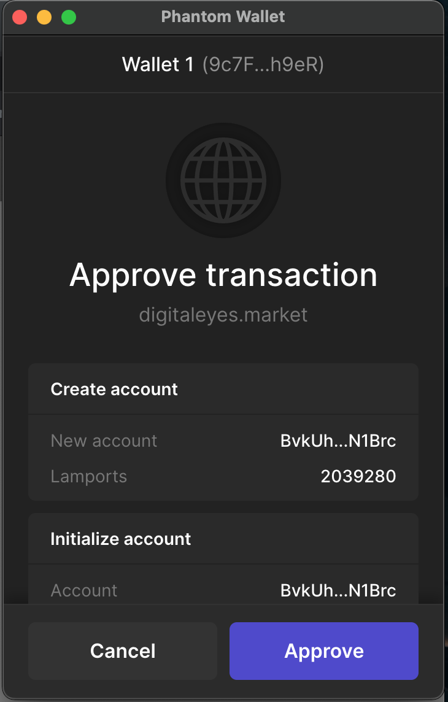

# Introduction

In this tutorial we will be creating a marketplace and a [non-fungible token](https://www.blockchain-council.org/blockchain/a-quick-guide-to-fungible-vs-non-fungible-tokens/), otherwise known as an NFT, using the **Solana** blockchain. Since NFTs can be made as single or multiple editions, they can be used to represent real-world objects like music, art, in-game items and videos.

We are going to create our NFT on our own marketplace. Refer to this [existing marketplace](https://jacobmakarsky.github.io/metaplex#/art/create) I created as an example, built with [Metaplex](https://github.com/metaplex-foundation/metaplex).

Once we create the NFT, we will be able to list it for sale on larger marketplaces such as [DigitalEyes](https://digitaleyes.market/) or [Solanart](https://solanart.io/).

Note: Bullet points in this tutorial are calls to action.

# Prerequisites

- You will need around $2 USD of [SOL](https://coinmarketcap.com/currencies/solana/) accessible, which we will send to a browser wallet. You can get some SOL through an exchange, such as [FTX](https://ftx.com/#a=13426316).
- Something to upload in the NFT, such as an image, video, audio file or an AR/3D file (.glb).
- A [Github account](https://github.com/)
- [Git](https://git-scm.com/) installed

## Create and fund an SOL wallet

We are going to create a wallet on Solana using Phantom wallet. Follow the steps on Phantom's website on [how to create a browser wallet](https://help.phantom.app/hc/en-us/articles/4406388623251-How-to-create-a-new-wallet).

Since minting an NFT on the blockchain causes a change in the data on the blockchain, we will have to pay for the transaction. Solana uses [SOL token](https://coinmarketcap.com/currencies/solana/) to pay for their transactions, so we will need to fund our new phantom wallet with SOL token.

Follow the steps on Phantom's website here on [how to deposit SOL](https://help.phantom.app/hc/en-us/articles/4406393831187-How-to-deposit-SOL).

# Fork and clone the Metaplex repository

We are going to fork the Metaplex repository to our own Github account so that we can host it easily on Github pages.

- Fork the [Metaplex repository](https://github.com/metaplex-foundation/metaplex)


Now, we need to copy all of the Metaplex files over to our computer.

- Create a folder on your desktop called "myNftMarketplace"

- Copy the location of the folder

- Change directory to your marketplace folder in the command line

```text
cd /Users/yourusername/Desktop/myNftMarketplace
```

- Clone the repository to your marketplace folder

```text
git clone https://github.com/yourusername/metaplex.git
```

All of the files from the Metaplex repository will now be downloaded into our folder.

# Change the default addresses

When we deploy the website, we want it to save in the Metaplex repository we forked on Github. This will allow us to easily get our own live marketplace online.

- Change the deployment address to your Github username


Notice where my name is. This should be where our Github username goes. Make sure to follow the path taken, on the left of the picture, to get to the `package.json` file.

- Change the store's wallet address


This is where we add the public address of our browser wallet, so the store knows who to give administrative access. Make sure to follow the path taken, on the left of the picture, to get to the `.env` file.

# Setup and deploy our store

We are in the final stages of making our store live! Now, we will download all of the necessary packages that will allow us to deploy our marketplace website.

- Change directory to the `js` folder in the command line

```text
cd metaplex/js
```

We should still have our terminal open from before, when we changed directory into our marketplace folder. Now, we changed directory to the `js` folder.

- Run the following command to install all of the dependencies:

```text
yarn
```

This command will begin downloading all of the dependencies that are required to work with the code. When we cloned the Metaplex repository, it didn't download the packages for us, it only downloaded the code that says what packages/dependencies are required.

The command will take a moment to finish downloading everything. When it is complete, it will output `Done` at the end.

- Run the following command to check that all of the dependencies are working:

```text
yarn bootstrap
```

We can now test our new NFT marketplace locally before we upload it to Github Pages.

- Run the following command to check that all the dependencies are in place and working as intended:

```text
yarn start
```

It may take several minutes for everything to compile. Once the terminal says `compiled successfully`, we can visit `http://localhost:3000/#/` to view our brand new marketplace! But, this is only good for browsing around. Wait until we get it live online to connect a wallet and mint something.

- Run the following command to build the project files:

```text
yarn build
```


When it is complete, we should see it output `Done`, indicating the build has finished. We will now be able to see the `build` folder that was created inside the `js` folder.

- Change directory to the `web` folder

```text
cd packages/web
```

- Run the following command while inside the `packages/web` folder to deploy:

```text
yarn deploy
```

Once complete, we should again see the output `Done`, indicating the deployment has finished. This command has deployed the marketplace site to our Github repository, which means... our marketplace is live! Now we can go check out the fresh new NFT marketplace operating on Solana, hosted on Github Pages.

Congratulations! The URL for our marketplace will most likely be located at `https://yourusername.github.io/metaplex#/`, unless you changed the URL for your website in the Github repository's settings. For example, my marketplace is located at `https://jacobmakarsky.github.io/metaplex#/`.

Now, we can move on to creating our own NFT on Solana by using the marketplace UI.

# Mint an NFT on a marketplace

There are many marketplaces on Solana for listing NFT's, but only very recently was a tool created that allows the everyday user to mint their own NFT, called [Metaplex](https://www.metaplex.com/).

Metaplex allows us to create our own NFT marketplace, but does not have one general NFT marketplace for everyone to use. I made a marketplace for us to use in this tutorial [under my github here](https://jacobmakarsky.github.io/metaplex#/art/create).

- Head over to the "My Items" tab


- Click "Create" at the top


Now we should be on the "Category" section.

- Choose which kind of NFT we are creating.

I created an AR file that people could interact with on [Vecteezy](https://www.vectary.com/3d-modeling-news/create-ar-content-ARkit-ios12/). If you take this route to make something quick, make sure you export to .obj file type, and then convert the 2 files given after conversion to .glb [here](https://products.aspose.app/3d/conversion/obj-to-glb). Making an AR file gives us the ability to interact with and spin our NFT around.

- On the "Upload" section, follow the instructions and upload what's required depending on the category of the NFT you chose. **_Make sure your filename does not have spaces in it._**

- Press "Continue to Mint".


- Go ahead and give the NFT a cool title and a description about what it is.

Feel free to stick in a link or any info that would help someone understand what the NFT is. Or, leave the description empty and mysterious.

The maximum supply is the number of prints that would be created of the NFT, with each NFT being a numbered edition. The creator can set the “Maximum Supply” of the master edition just like a regular mint on Solana, with the main difference being that each print is a numbered edition created from it. - [Metaplex Developer Guide](https://docs.metaplex.com/)

The attributes, for example, would be "background: blue", "eyes: closed", "mouth: smoking" etc.

- Press "Continue to Royalties".


Metaplex allows us to modify the royalties and amount to split of the initial sale.

- Set a royalties percentage, so the creators will recieve part of every future sale that happens of the NFT.

Make sure to add creators if anyone else had taken part in creating the NFT.


It's time to launch our NFT!

- Make sure there is enough SOL in your browser wallet and click "Pay with SOL".

It will take up to a few minutes for the NFT to upload, as the metadata (title, description, attributes etc.) is being saved on [Arweave](https://www.arweave.org/). This is a blockchain tool for storing data eternally. Storing data on the Solana chain itself would be too expensive, so our non-fungible token on Solana contains a link to where the NFT information is stored on Arweave.


Wooo! Your new NFT should be finished minting. Congratulations, you now have an accessible NFT on the Solana network. What can we do with it now?


- Check the "My Items" tab for your NFT


You should be able to see your NFT on the [My Items](https://jacobmakarsky.github.io/metaplex#/artworks) page.

If you've been using a Phantom browser wallet, go ahead and check your "Collectibles" tab. Your brand new NFT should appear in your wallet! It may take some time for the images and metadata to be synced around.


# BONUS: List the NFT for sale

Awesome, we now have our own NFT that we can view inside our wallet. We certainly don't have to list our fresh NFT for sale if we don't want to, but for the sake of education, let's go ahead and try listing it.

- Go to [DigitalEyes](https://digitaleyes.market/)

I wouldn't recommend listing the NFT on the marketplace I made for us (even though I do plan to make it cool in the future), so for now DigitalEyes is the best option.

- Connect your wallet


- Go to the "Sell" tab


- Click on the NFT you want to sell

- Choose the amount you want to sell it for and list the NFT


- Approve the transaction to list the NFT

The transaction cost me 0.1 SOL, so make sure you have enough SOL in your wallet to list the NFT.



Now we should be able to see our NFT listed on the marketplace! Search for the "Unverifeyed" collection in the search bar, and scroll to your NFT. The marketplaces are still in development, so hopefully it'll be much easier to search for the NFT's soon.


Go ahead and click on the NFT that's listed. You'll see the option to unlist it and some labels saying "Unverifeyed". This is just because DigitalEyes has not verified our NFT, so they aren't sure if it's a fake copy of an exisiting collection. For any questions about DigitalEyes, such as getting your NFT verified, [go here](https://digitaleyes.market/faq).

# Conclusion

Woohoo! If you made it through all the steps, you have successfully created your own NFT marketplace and NFT on the Solana blockchain. If you completed the bonus, you now have an NFT on a popular worldwide marketplace 👍

# Next Steps

In this tutorial, we created our own NFT marketplace and NFT on the Solana blockchain, using Metaplex for minting and DigitalEyes for listing. Feel free to continue experimenting by attempting to mint more NFT's, listing them on our own marketplace, sending the token around to other wallets, creating a collection, etc.

# About the author

This tutorial was created by Jacob Makarsky. He can be found on [Github](https://github.com/jacobmakarsky).

# References

- [James Bachini](https://www.youtube.com/watch?v=_36JcJRAHHI)
- [Solana's Blog](https://solana.blog/solana-metaplex-tutorial-deploy-your-own-store-mint-nfts-and-setup-auctions/)
