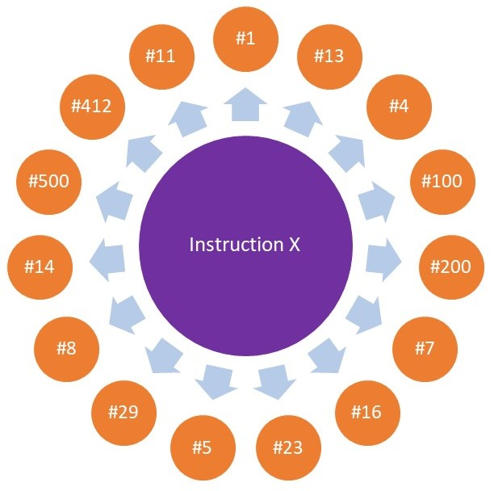

# Introduction

Think of a world where people can pay each other without the help of a bank or a third-party service. Users' data is not getting sold for commercial purposes. Decentralized markets exist where users and producers interact and make P2P payments without unfair market owner commissions.

That's just a glance at the financial utopia. The concept of decentralized finance and a "Web 3" where users own their data is alluring - But what makes a blockchain the right one to build next-generation apps on?

Well, it needs to be:

- Fast
- Secure
- Scalable
- Affordable
- Resistant to censorship

In the current climate of the blockchain environment, it can be difficult to find one with all the above. Some may provide fast transactions, another providing cheap transactions, but very few can claim they're providing all of the features above.

Solana is a blockchain that offers all the above. That makes it an attractive platform for all sorts of decentralized apps.

Solana has handled up to **65,000 transactions per second** at its peak, with a **block time of 400ms** - that's nearly **3 blocks per second!**

Transactions on Solana are quite affordable. **The average cost of a transaction is $0.00025**.

**It supports smart contracts**. Developers can deploy their apps to Solana and take advantage of its features.

All of these features are mind-blowing 🤯! I'm sure you are curious how all of these are possible without a trade-off or a pain point. Don't worry, We'll go over the answers to your questions😅!

There are several key innovations Solana has introduced to the blockchain world. These innovations are:

1.  Proof of history
2.  Tower BFT
3.  Turbine
4.  Gulf Stream
5.  Archivers
6.  Sea Level
7.  Pipelining
8.  Cloudbreak

# Proof of History

Proof of History (PoH) is the core innovation of Solana. For a blockchain to work, participant nodes need to reach an agreement on time. Traditional blockchains like Bitcoin function by proof of work. Solana has revolutionized their consensus model, called PoH.

PoH is a verifiable delay function. This function produces unique output from an input. It uses the hashing algorithm SHA-256 so one can't reverse the function and calculate input from the output. The nature of the verifiable delay function makes fast verification possible on Solana.

The whole philosophy behind it is:

- Running the function takes some time
- Running the function is the only way to produce the output
- With the known input and output of the function, the only way of evaluating the output is to re-execute the function with the provided input

This guarantees that when an output is valid for an input, some time has passed for producing that output. This is the magic behind Solana's Proof of History!

The ledger in Solana is a chain of blocks. Each block contains some amount of transactions, making the size of a block 10MB.

Besides input and output hashes, some other metadata is attached to each block like the number of transactions and events it contains. When a node claims that it has created a new block to add to the ledger, this claim is verifiable by other nodes. The node that generated the block is called the **Leader** and the other nodes which perform the verification are called **Validators**.

Validators run the verifiable delay function (VDF) for the number of transactions existing in the block and compare those outputs with the outputs provided by the Leader node.

When proposing a new block, nodes can reference one of the recently confirmed hashes in the ledger. This way they are proving that their block is generated after the referenced hash.

**Ok, it sounds a bit abstract! here is an example:**

Imagine you have traveled in time to the year 2200! You're telling people that you're coming from the past but they are just laughing and calling you a liar. You are angry like 😡 but suddenly an idea comes into your brain.

You show them a 100$ bill from your wallet minted in the year 2000. First, they suspect that it's a fake bill so they start analyzing it in their lab. After they have ascertained you're telling the truth by careful analysis, they cuddle you and trust you!

An adorable story to be sure, but let's map its elements to PoH:

- The time traveller in the story is the Leader node that generated a new Block
- The claim of coming from the past is equivalent to the newly generated block
- The 100$ bill is equivalent to a referenced hash from the ledger
- Analyzing the bill in a lab is equivalent to a Validator node validating the block

# Tower BFT

The Byzantine Generals is an old problem discussing the issue of deciding upon a solution for a question where there is more than one solution or proposal with a different number of votes for each solution.

Tower BFT is Solana’s custom implementation of Practical Byzantine Fault Tolerance (PBFT), which takes advantage of PoH as a global clock to reduce message overhead and latency. This implementation uses Proof of History as a reliable source of time and the exponentially-increasing time-outs to select the most valid forks.

In the chart below we see a conflict over Hash number 4. Both Hashes claim to be a valid child for Hash number 3, but only one can be accepted.

After performing validation of a block, Validators submit their vote for that block (referred to as the hash).

For each hash in the ledger, Validators can submit their votes for that specific hash at a vote stack dedicated for it. In the example above, both hashes are trying to get confirmed and become Hash #4. both of them have a vote stack. In the end, the one with the largest vote stack is going to win this competition, and Validators who voted on the winner are going to be rewarded.

This mechanism of reward for votes on the right hash encourages Validators to vote on the fork with the largest vote stack since it’s much likelier to be the valid one.

The slot is the number of hashes that represent about 400ms. Every 400ms, the network has a potential rollback phase. Considering each vote, every subsequent vote coming after it doubles the amount of real-time the network needs to wait to unroll it from the votes stack.

**We love examples, so let’s examine this rule with an example:**

Assume that Validators started validating the orange hash from figure above and a vote stack has been created as below:

It looks like a pyramid because votes are different depending on the order of their entrance to the stack.

We measure time in slots for the vote stack. Let's assume the first vote gets submitted by a Validator to the stack at time 1. Then the vote stack would be as below:

The expiry time is the time that the submitted vote gets popped out of the stack along with all votes being submitted after it (i.e. votes above the popped out vote with a higher vote index).

Expiry time for a vote is calculated by "**Vote time + current lockout in the stack**".

1 slot (~400ms) later another vote gets submitted, so the new vote stack would be:

Now we are familiar with the math and logic of voting. A vote gets submitted at time 5. At time 5, vote number 2 is expired and popped out of the stack. So now, the vote stack would be:

Although a new vote gets submitted to the stack, it doesn’t double the lockout time for vote 1 because doubling in lockout times happens only when votes need to move to larger positions in the pyramid.

At time 6, vote 1 gets expired and gets popped out along with all votes submitted after it (including vote 3). So our vote stack is empty again.

Now that we are familiar with the logic of it let's travel in time to 18 and take a look at the vote stack:

At 19 we have 4 votes in stack and vote 7 is about to expire but another vote gets submitted:

As more votes get submitted by Validators, the stack grows in size and the expiry time for older votes increases as well. When the stack size reaches 32, the lockout number for the oldest vote is 2^32 slots which is around 54 years! With a high chance, almost an absolute certainly, this vote would never be rolled back.

To reward Validators who voted on the right hash, when a new vote is being submitted to a stack with 32 votes in it, the oldest one would be de-queued from the stack (i.e. first in, first out) and its Validator receives a reward.

This mechanism sounds similar to what happens with Proof of Stake on other blockchains, but they are distinct in one important aspect: In Tower BFT, when 2/3 of Validators vote on a PoH hash it would be considered as confirmed and cannot be rolled back.

Another advantage of this approach is that every participant in the network can compute the timeouts for every other participant without any P2P communications. This makes Tower BFT asynchronous.

# Turbine

Is it just me or the man in the meme looks like the CEO of Solana Anatoly Yakovenko 😂

Scalability is a hard problem to solve, since adding to the number of nodes in the network results in more time needed for nodes to propagate data between each other.

Consider a leader trying to share 64MB of data (around 250,000 transactions assuming each transaction around 256 bytes) with other 20,000 validators. The very naïve approach would require the Leader to send the data to all other nodes at the network by P2P communication. And that simply means the Leader should have a unique connection with each one of validators and send 64MB of data to each one separately.

That is neither fast nor efficient! That’s why Solana came up with Turbine to solve this issue. Turbine is a protocol used by Solana to propagate blocks through the network fast and securely.

Turbine establishes a random path per data packet through the network, when a Leader node is streaming data to other nodes in the network.

The Leader splits the block into packets up to 64KB in size. For a 64MB block (around 250,000 transactions considering each transaction around 256 bytes) the leader produces 1,000 x 64KB packets, and transmits each packet to a different Validator.

In turn, each Validator node re-transmits the packet to a group of peers that is called a **neighborhood**. You can think of the network as a tree of neighborhoods which allows the network to grow beyond 1,000 Validators:

Each node in a neighborhood is responsible for transmitting the data it receives to other nodes in its neighborhood, thus propagating a portion of its data to a small set of nodes in other neighborhoods.

For simplicity, the diagrams above have assumed each neighborhood consists of 2 nodes. In Turbine there is a parameter called `DATA_PLANE_FANOUT` which specifies the maximum number of nodes in any neighborhood. With that being said, so far we have seen diagrams with `DATA_PLANE_FANOUT = 2`. This parameter also determines the shape of the tree.

Consider the following pseudo-code to help you think of network tree creation:

    LAYER = 0
    NEIGHBORHOOD = 0
    // Run until all nodes are allocated to a layer and neighborhood
    While ( NODES_IN_NETWORK > 0 ) {

      // If maximum amount of neighborhoods in a layer is reached, moves to next layer
      If ( NEIGHBORHOOD+1 > DATA_PLANE_FANOUT^LAYER ) {
        LAYER = LAYER + 1
      }

      // If there were equal or more nodes than DATA_PLANE_FANOUT the create a full neighborhood
      If (NODES_IN_NETWORK > DATA_PLANE_FANOUT ) {
        NODES_IN_NETWORK = NODES_IN_NETWORK - DATA_PLANE_FANOUT
        Create the Neighborhood number [NEIGHBORHOOD] at layer [LAYER] with [DATA_PLANE_FANOUT] nodes
        NEIGHBORHOOD = NEIGHBORHOOD + 1
      }

      // If there were less nodes than DATA_PLANE_OUT create the last neighborhood with remaining nodes
      Else {
        NODES_IN_NETWORK = 0
        Create the Neighborhood number [NEIGHBORHOOD] at layer [LAYER] with [NODES_IN_NETWORK] nodes
      }
    }

So for `DATA_PLANE_FANOUT = 3`, `NODES_IN_NETWORK = 39` the tree is like below:

In a network with DATA_PLANE_FANOUT = 200, a Leader at the top can reach up to 40,000 (200\*200) Validators in 2 jumps in the tree. Which takes 200ms assuming each link inside the network resolves in 100ms on average.

With fast propagation of data comes security concerns. A malicious node may choose to not rebroadcast the data it receives or even rebroadcast incorrect data to other nodes. To address this issue, the Leader creates Reed-Solomon erasure codes. Erasure codes allow each Validator to reconstruct the entire block without receiving all the packets.

If the Leader sends 30% of packets as erasure codes, then the network can drop any 30% of the packets without losing the block. Leaders can even adjust this number based on network conditions. These adjustments are made by the Leaders’ observed packet drop rate from previous blocks.

# Gulf Stream

Gulf stream is Solana’s mempool management solution. A mempool (i.e. memory pool) is a set of transactions which haven’t yet been processed in the blockchain and are waiting to be picked up by the network.

For instance you can take a look at bitcoin's mempool (a link is provided in the References section at the end of this document).

At the time of writing this tutorial, 21 September 2021, the size of the Bitcoin mempool is 1.362M. which demonstrates the number of transactions in bytes waiting to be processed by Bitcoin miners.
The size of a mempool depends on the supply and demand in block space. The more demand grows, the more transactions would be submitted and roughly with the same supply, mempool size grows.

With the increase of mempool size, the required time for processing a transaction (on average) rises as well and users say “this blockchain is slow!”. The very naïve solution to this may be increasing the throughput of the network by scaling it and utilizing stronger hardware. But this needs a huge amount of resources to be spent and makes the network harder to manage and keep safe.

Solana has addressed this issue by using a technique they call Gulf Stream. Assuming Solana network’s throughput is 50,000 it can handle 100,000 sized mempool in a matter of seconds.

Each Validator knows the order of upcoming Leaders due to Solana's architecture. So clients and Validators forward transactions to upcoming Leaders before they act as a Leader in the network. This allows Validators to start processing transactions ahead of time. This results in fewer transactions cached in Validators’ memory and faster confirmations. You can take a look at leader rotation and other details of Solana network at solanabeach (there is a link in the References section).

Clients, such as wallets, sign transactions that reference a specific block hash. Clients select a roughly recent block hash that has been fully confirmed by the network.
From the Tower BFT section, we know how a block gets confirmed and finalized in the network. It takes 2 slots or around ~800ms for a block to be proposed. As we have seen in the Tower BFT section, proposed blocks either fail or get confirmed after 32 subsequent blocks.

Once a transaction is forwarded to any Validator, that Validator forwards the transaction to one of the upcoming Leaders. Once the network moves past the rollback point such that the referenced block hash has expired, clients have a guarantee that the transaction is now invalid and will never be executed on-chain.

So that all being said what distinguishes Solana in terms of speed under heavy load of transactions ?!🤔 Utilizing the Gulf Stream results in 2 privileges for the Solana network.

1.  Under load, Validators can process transactions ahead of time and discard any which fail.
2.  A Leader can prioritize executing transactions based on the position of the Validator forwarding the transaction, in the network tree (which means a transaction forwarded from a Validator in layer n is prior to another one forwarded from layer n+1)

These two privileges together help the network to degrade and keep working even under a huge DoS attack.

# Archivers

When running at full capacity, Solana will produce 1 Gigabit per second. In just 1024 seconds (~17 minutes), the data produced would be 1 Terrabit and in a year it would catch up to 4 Petabytes (32 Petabits). A tremendous amount of data to be stored!

If each node in the network was required to store that much data, a limited group of participants who could afford and manage that kind of storage, could join the network and this makes the network centralized.

To avoid that and do it in a decentralized way, the Solana team built their version of PoRep. PoRep stands for proof of replication and it’s a system introduced by Filecoin initially in which a prover defends a publicly verifiable claim that it is dedicating unique resources to storing one or more retrievable replicas of a data file. Solana's version of PoRep leverages the PoH technology to make validating proof of replication fast.

The nodes responsible for storing the ledger are archivers. They don’t participate in consensus and have lower hardware requirements than validators and leaders.
In an overview replicators work like below:

Archivers signal to the network that they have X bytes of space available for storing data. Frequently the network divides the ledger history into chunks to keep up sending ledger history to archivers with a replication rate. Then archivers download their respective data from the network.

Occasionally, the network will ask/challenge the archivers to prove they’re doing their job of storing data and at this point, archivers should complete PoRep. To reward archivers they would get 3% of inflation for their efforts.

# Sealevel

Sealevel is Solana’s runtime for smart contracts. Running smart contracts in parallel and using all available computational resources of validators efficiently makes the Sealevel as one of the core innovations of Solana.

Sealevel is much more efficient and faster than single-threaded runtimes like EVM for the Ethereum or EOS-VM for the EOS. The reason for that is single-threaded runtimes can run one contract at a time but with Sealevel, tens of thousands of transactions can be running in parallel using all available cores of the Validator machine.

Solana transactions are composed of instructions. Each instruction contains the program ID it invokes, program instruction, and a list of accounts that the transaction needs to write or read.

This enables Sealevel to sort and classify transactions by those reading the same data from accounts or those which can be processed without overlapping (i.e. not overwriting the same state at the same time).

Each instruction tells the VM which accounts it wants to read and write ahead of time. So the VM prefetches and prepares that data. This is the first optimization Sealevel does by organizing transactions, but the general optimization occurs at the hardware level.

Assume tons of transactions have been organized and classified into different groups and the same instruction from a program (aka smart contract) is being invoked by 1000 different transactions. How we can take advantage of CPU and GPU architecture to run the instruction over these multiple data streams?

A SIMD CPU (Single instruction, multiple data) can run an instruction over multiple data sources, so Sealevel does the next optimization by sorting all the instructions in a group by their program ID and then runs the program over all the data streams with all cores available in the CPU.

The same SIMD implementation exists in GPUs, and Solana nodes use GPUs. A modern Nvidia GPU has 4000 cores and about 50 multiprocessors. A multiprocessor can execute only a single program instruction at a time but over 80 different inputs in parallel since it can use 4000 / 50 = 80 cores.

Now considering the previous step in which Sealevel classified instructions by program ID, this GPU can run the program over all the data streams specified by instructions concurrently. For SIMD optimizations to be possible, a trade-off on the structure of instructions is necessary. Instructions should be composed of a small number of branches and should all take the same branch.

Sealevel does an impressive amount of optimization and again takes Solana one step further towards claiming the top spot in comparison to other blockchains with single-threaded runtimes like Ethereum.

# Pipelining

For processing a transaction an optimization system has been designed which enables the validator or the leader node to keep working on incoming transactions without waiting for previous ones to be processed completely.

This technique is called pipelining and is common in systems with a stream of entries and consecutive processing steps. Imagine a kitchen in a popular restaurant. Since the restaurant has a constant flow of customers, the kitchen is always busy serving food for customers ASAP. The overall process of food preparation is like below.

- Washing and cleaning raw material
- cooking the food
- plating of the food
- serving food to the customers

For maximum efficiency kitchen staff works like below:

First, some raw materials (e.g. carrots🥕, onions🧅, fish🐟, etc.) enter to Washing part. Workers do their job and pass the result to the next part, which is cooking. Now the washing section can start working on the next set of materials. After both parts (washing and cooking) finished their job they can pass their result to the next part. So now the cooking part can work on the second set washed by washing part and designing part on the first set of ingredients cooked by cooking part. Now the washing part can start working on the third set of ingredients. The animation below shows how this process works.

The same paradigm has been implemented in Solana. Both Processing and validating a transaction consist of different stages. For a transaction to be processed by a leader node there are four steps:

Let's see what does each part do:

- Fetching: Fetching is similar to the washing part of the kitchen example. It fetches transactions created by clients (e.g. CLI client, web-based wallets, etc.) and passes them to the next section.

- Signature verification: This section is similar to the cooking food part of the kitchen example. It verifies whether the account ( or public key) sending the transaction has signed it or not.

- Banking: this section is similar to the plating section of the kitchen example. It transfers credits among accounts associated with a transaction and attaches a recently created hash from PoH to the transaction.

- Broadcasting: This section is similar to serving part of the kitchen example. It broadcasts a block of processed transactions to other nodes to validate it.

To process a transaction quickly, each stage is handled by a different processing unit. Kernel Space handles Fetching and Broadcasting. The CPU handles banking and the GPU handles signature verification.

In the kitchen example, cooking may be the slowest step and in transaction processing, the signature verifying requires the most computation and time. That's why signature verification is handled by the GPU.

A node in the Solana network runs two pipelined processes, a transaction processing unit (TPU) when it acts as a leader and a transaction validation unit (TVU) when it acts as a validator. The hardware being used for processes and network input and output is the same but the process happening in each pipeline is different.

# Cloud Break

Some blockchains like Ethereum use the technique of sharding to scale the network, which means the blockchain's database gets split. This way the load of transactions gets spread over these smaller chains (shards).

Cloud Break is a data structure that made it possible to read from and write to the database simultaneously. It uses memory-mapped files and can handle concurrent reads and writes between 32 threads, with support for modern SSDs.

# Conclusion

Solana is a revolutionary blockchain with fundamental innovations expressed above. It has all it takes to be an outstanding Blockchain.

That's not just my idea! Many developers have built a variety of projects and dApps on Solana: Serum, a decentralized exchange; Audius, a music streaming platform; Metaplex,an NFT marketplace; and Chainlink, just to name a few. You can find more details and apps in the ecosystem section of the Solana website.

as my final words I want to say "SOLANA IS THE FUTURE". thanks for reading my article and I hope it shed some light on parts you may had difficulty to understand.

# About The Author

I'm Mahdi Mostafavi a web developer and I'm learning about Solana so that I can build an amazing project on it which I have in my head. my github: [@mmostafavi](https://github.com/mmostafavi)

in case you found any misinformation in the article or had any suggestions to improve the article please comment on it or you can find me on Twitter: [@mahdi_ftp](http://twitter.com/mahdi_ftp).

# References

Bitcoin mempool : <https://www.blockchain.com/charts/mempool-size>

Solanabeach website : <https://solanabeach.io>

An overview to solana ecosystem on official website: <https://solana.com/ecosystem>

Solanians's Twitter : <https://twitter.com/solanians_>
