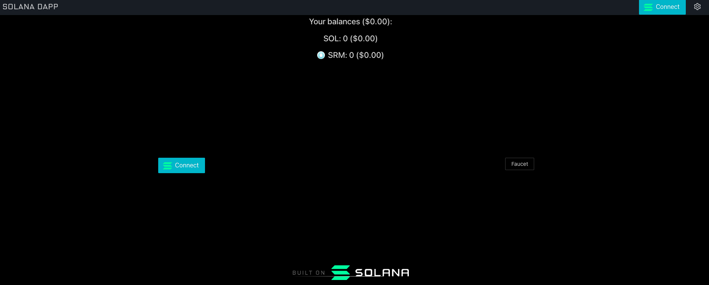
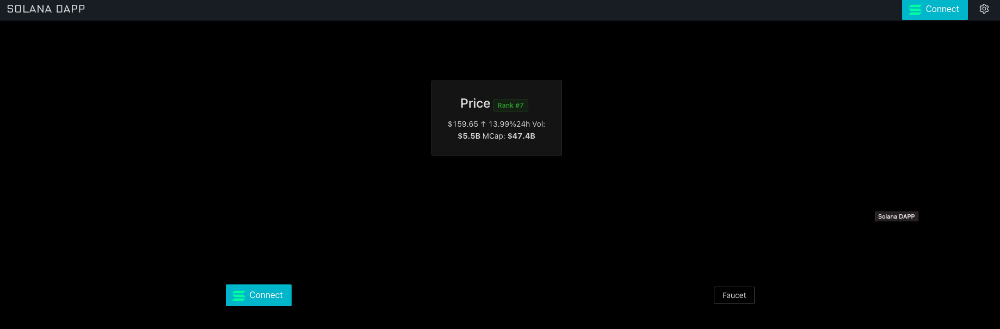
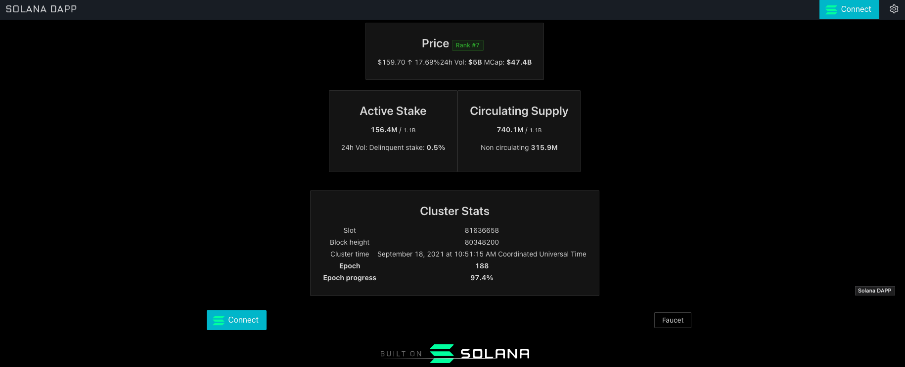
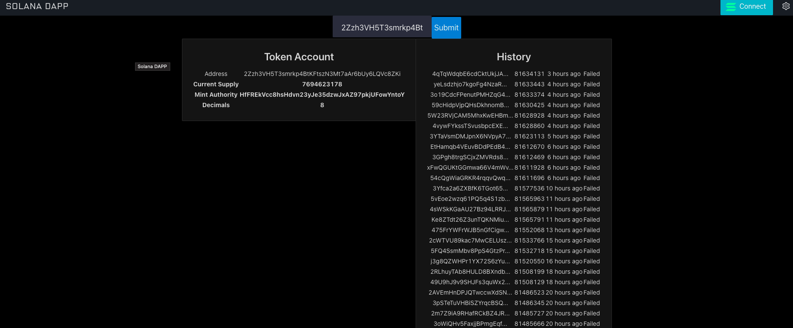

# Introduction

Solana is a public blockchain platform. It is open-source and decentralized, with consensus achieved using proof of stake and proof of history. Starting with Solana explorer could be overwhelming. In this tutorial we are going to build a Solana Explorer using the open-source dApp Scaffold.

We are going to build a very simplified clone of [Solana Explorer](https://github.com/solana-labs/explorer).


# Prerequisites

- Basic familiarity with javascript and reactjs.
- Complete the [Solana 101 Pathway](https://learn.figment.io/protocols/solana)

# Requirements

- [dApp Scaffold](https://github.com/solana-labs/dapp-scaffold).
- [GitHub account](https://github.com/)
- [Git](https://git-scm.com/book/en/v2/Getting-Started-Installing-Git) installed

# Get started

1.  First clone the dApp Scaffold repo [dapp scaffold](https://github.com/solana-labs/dapp-scaffold.git).

```text
git clone https://github.com/solana-labs/dapp-scaffold.git
```

```text
cd dapp-scaffold
```

2.  To install dependencies run `npm install` or `yarn`.

3.  `npm run start` or `yarn start` to run the dapp on localhost.


We should have dapp-scaffold running in localhost:3000.



We are going to build the basic stats that we can see in the [Solana explorer](https://explorer.solana.com/), we break it up into more basic steps. We are going to fetch the price, the stats and search for the address.

# Get Solana Price

<Embed url="https://youtu.be/0ly3cU5kPns" caption="Get Price" />

As a first step, we will get the price from Coingecko. Under components create a new folder called PriceCard and inside create a file called `index.tsx`.

The full path: `src/components/PriceCard/index.tsx`.

Copy and paste the following code:

```tsx
import { useState } from 'react';
import { abbreviatedNumber } from '../../utils/utils';
import React, { useEffect } from 'react';
import { Typography, Tag, Card } from 'antd';
const { Title, Text } = Typography;

// Create Interfaces for Coingecko API
export interface CoinInfo {
  price: number;
  volume_24: number;
  market_cap: number;
  price_change_percentage_24h: number;
  market_cap_rank: number;
  last_updated: Date;
}

export enum CoingeckoStatus {
  Success,
  FetchFailed,
  Loading,
}

export type CoinGeckoResult = {
  coinInfo?: CoinInfo;
  status: CoingeckoStatus;
};

export interface CoinInfoResult {
  market_data: {
    current_price: {
      usd: number;
    };
    total_volume: {
      usd: number;
    };
    market_cap: {
      usd: number;
    };
    price_change_percentage_24h: number;
    market_cap_rank: number;
  };
  last_updated: string;
}

export default function PriceCard() {
  const [coinInfo, setCoinInfo] = useState<CoinGeckoResult>();

  const coinId = 'solana';
  useEffect(() => {
    getPrice();
  }, []);

  // Use Coingecko API
  function getPrice() {
    fetch(`https://api.coingecko.com/api/v3/coins/${coinId}`)
      .then(res => res.json())
      .then((info: CoinInfoResult) => {
        setCoinInfo({
          coinInfo: {
            price: info.market_data.current_price.usd,
            volume_24: info.market_data.total_volume.usd,
            market_cap: info.market_data.market_cap.usd,
            market_cap_rank: info.market_data.market_cap_rank,
            price_change_percentage_24h:
              info.market_data.price_change_percentage_24h,
            last_updated: new Date(info.last_updated),
          },
          status: CoingeckoStatus.Success,
        });
      })
      .catch((error: any) => {
        setCoinInfo({
          status: CoingeckoStatus.FetchFailed,
        });
      });
  }

  // Display Solana price
  return (
    <Card
      hoverable
      style={{
        display: 'inline-flex',
        justifyContent: 'center',
        alignItems: 'center',
      }}
    >
      {coinInfo?.coinInfo && (
        <>
          <Title level={3}>
            Price{' '}
            <Tag color="green">Rank #{coinInfo.coinInfo.market_cap_rank}</Tag>
          </Title>
          <Text>
            ${coinInfo.coinInfo.price.toFixed(2)}{' '}
            {coinInfo.coinInfo.price_change_percentage_24h > 0 && (
              <span color="green">
                &uarr;{' '}
                {coinInfo.coinInfo.price_change_percentage_24h.toFixed(2)}%
              </span>
            )}
            {coinInfo.coinInfo.price_change_percentage_24h < 0 && (
              <span color="red">
                &darr;{' '}
                {coinInfo.coinInfo.price_change_percentage_24h.toFixed(2)}%
              </span>
            )}
            {coinInfo.coinInfo.price_change_percentage_24h === 0 && (
              <span>0%</span>
            )}
          </Text>
          <Text>
            24h Vol: <em>${abbreviatedNumber(coinInfo.coinInfo.volume_24)}</em>
            MCap: <em>${abbreviatedNumber(coinInfo.coinInfo.market_cap)}</em>
          </Text>
        </>
      )}
    </Card>
  );
}
```

Here we have fetched the price from Coingecko API inside the `getPrice()` function. We also have used `abbreviateNumber` to show the volume and market cap. We save the returned value into the state with `setCoinInfo`. If `coinInfo` contains data, we show it in the component.

Go to `utils.ts` and the function `abbreviateNumber` at the end. We use this function to show a user-friendly number.

Now go to `src/views/home/index.tsx` and import `PriceCard`

```tsx
import PriceCard from '../../components/PriceCard';
```

And add inside return the `PriceCard` to show the price components.

```tsx
return (
  <Row gutter={[16, 16]} align="middle" justify="center">
    {/* Add Solana price card to homepage */}
    <Col span={24}>
      <PriceCard />
    </Col>

    <Col span={12}>
      <WalletMultiButton type="ghost" />
    </Col>
    <Col span={12}>
      <Link to="/faucet">
        <Button>Faucet</Button>
      </Link>
    </Col>
    <Col span={24}>
      <div className="builton" />
    </Col>
  </Row>
);
```

Save all the files. Save all and reload. Now you should be able to see the price.



# Get Supply Stats

<Embed url="https://youtu.be/wNgtUQqIwEk" caption="Get Supply Stats" />

Let's dive in with Solana web3js. `Web3js` offers a complete set of calls that allow us to get on-chain data. You can go deeper with the [documentation](https://solana-labs.github.io/solana-web3.js/)
Create a new folder called `SupplyCard` with an index file inside: `src/components/SupplyCard.tsx/index.tsx`.

Paste this code:

```tsx
// Import Types and Connection from web3
import {
  Supply,
  Connection,
  clusterApiUrl,
  VoteAccountStatus,
} from '@solana/web3.js';
import { useEffect, useState } from 'react';

// Import formatters for better visualization
import { abbreviatedNumber, lamportsToSol } from '../../utils/utils';
import React from 'react';

import { Typography, Row, Card } from 'antd';
const { Title, Paragraph } = Typography;

// Convert lamports ( A fractional native token ) in more human readable format
function displayLamports(value: number) {
  return abbreviatedNumber(lamportsToSol(value));
}

export default function SupplyCard() {
  const [supply, setSupply] = useState<Supply>();
  const [voteAccounts, setVoteAccounts] = useState<VoteAccountStatus>();
  useEffect(() => {
    getSupply();
  }, []);

  // Use connection to get the supply and the number of vote accounts
  async function getSupply() {
    const url = clusterApiUrl('devnet').replace('api', 'explorer-api');
    const connection = new Connection(url, 'finalized');
    const supply: Supply = (await connection.getSupply()).value;
    const voteAccounts = await connection.getVoteAccounts();
    setVoteAccounts(voteAccounts);
    setSupply(supply);
  }

  // Get delinquent or inactive validators
  const delinquentStake = React.useMemo(() => {
    if (voteAccounts) {
      return voteAccounts.delinquent.reduce(
        (prev, current) => prev + current.activatedStake,
        0,
      );
    }
  }, [voteAccounts]);

  // Get active validators
  const activeStake = React.useMemo(() => {
    if (voteAccounts && delinquentStake) {
      return (
        voteAccounts.current.reduce(
          (prev, current) => prev + current.activatedStake,
          0,
        ) + delinquentStake
      );
    }
  }, [voteAccounts, delinquentStake]);

  // Get the percentage of stake that are in delinquent
  let delinquentStakePercentage;
  if (delinquentStake && activeStake) {
    delinquentStakePercentage = ((delinquentStake / activeStake) * 100).toFixed(
      1,
    );
  }

  return (
    <Row gutter={[16, 16]} align="top" justify="center">
      {/* Show Active Stake */}
      <Card
        hoverable
        style={{
          display: 'inline-flex',
          justifyContent: 'center',
          alignItems: 'center',
        }}
      >
        <Title level={3}>Active Stake</Title>
        {activeStake && supply && (
          <>
            <Paragraph>
              <em>{displayLamports(activeStake)}</em> /{' '}
              <small>{displayLamports(supply.total)}</small>
            </Paragraph>
            {delinquentStakePercentage && (
              <Paragraph>
                24h Vol: Delinquent stake: <em>{delinquentStakePercentage}%</em>
              </Paragraph>
            )}
          </>
        )}
      </Card>

      {/* Show Circulating Supply */}
      <Card
        hoverable
        style={{
          display: 'inline-flex',
          justifyContent: 'center',
          alignItems: 'center',
        }}
      >
        <Title level={3}>Circulating Supply</Title>
        {activeStake && supply && (
          <>
            <Paragraph>
              <em>{displayLamports(supply.circulating)}</em> /{' '}
              <small>{displayLamports(supply.total)}</small>
            </Paragraph>
            <Paragraph>
              Non circulating <em>{displayLamports(supply.nonCirculating)}</em>
            </Paragraph>
          </>
        )}
      </Card>
    </Row>
  );
}
```

At the end of `utils.ts` add:

```ts
// utils.ts
import { LAMPORTS_PER_SOL } from '@solana/web3.js';

export function lamportsToSol(lamports: number): number {
  return Math.abs(lamports) / LAMPORTS_PER_SOL;
}
```

Import and add the `SupplyCard` to home screen `src/views/home/index.tsx`

```tsx
import SupplyCard from '../../components/SupplyCard';

//...

return (
  <Row gutter={[16, 16]} align="middle" justify="center">
    <Col span={24}>
      <PriceCard />
    </Col>

    {/* Add Supply data to homepage */}
    <Col span={24}>
      <SupplyCard />
    </Col>

    <Col span={12}>
      <WalletMultiButton type="ghost" />
    </Col>
    <Col span={12}>
      <Link to="/faucet">
        <Button>Faucet</Button>
      </Link>
    </Col>
    <Col span={24}>
      <div className="builton" />
    </Col>
  </Row>
);
```

Let’s go back to `SupplyCard.tsx` and see what we have done. Import `Supply` and `VoteAccountStatus` types from `web3.js` as we are using typescript. We have created an URL for the Devnet with `clusterApiUrl`, once created a new connection and finally used the connection to fetch the supply with `getSupply()` and the vote accounts with `getVoteAccounts()`. Then set the `voteAccounts` and `Supply` to state.

Save all and let’s look into it.
At this point you should see Active Stake and Circulating Supply in the frontend.


# Get Cluster Stats

<Embed url="https://youtu.be/LlXaPZTBHc4" caption="Get Cluster Stats" />

To challenge yourself to see if you know how to get data from web3js now we are going to create another file where you have to substitute `undefined` with the correct call to get the data.
Create a new folder `StatsCard.tsx` with an index file inside.

```tsx
import { Connection, clusterApiUrl } from '@solana/web3.js';
import React, { useEffect, useState } from 'react';
import { displayTimestampUtc } from '../../utils/utils';

import { Typography, Card } from 'antd';
const { Title } = Typography;

export const SAMPLE_HISTORY_HOURS = 6;

// Create type for clusterStats state
export type ClusterStats = {
  absoluteSlot: number;
  blockHeight: number | undefined;
  blockTime: number;
  currentEpoch: string;
  epochProgress: string;
};

export default function StatsCard() {
  const [clusterStats, setClusterStats] = useState<ClusterStats>();
  useEffect(() => {
    getClusterStats();
  }, []);

  // Complete the code where is marked as TODO
  async function getClusterStats() {
    const url = undefined; // TODO 1: Retrieve the RPC API URL for the devnet
    const connection = new Connection(url);

    const epochInfo = await undefined; // TODO 2: get the epoch
    const blockTime = await connection.getBlockTime(epochInfo.absoluteSlot);
    const { blockHeight, absoluteSlot } = epochInfo;
    const currentEpoch = epochInfo.epoch.toString();
    const { slotIndex, slotsInEpoch } = epochInfo;
    const epochProgress = ((100 * slotIndex) / slotsInEpoch).toFixed(1) + '%';

    // Set the state with cluster stats
    if (blockTime !== null) {
      const clusterStatsData = {
        absoluteSlot,
        blockHeight,
        blockTime: blockTime * 1000,
        currentEpoch,
        epochProgress,
      };
      setClusterStats(clusterStatsData);
    }
  }

  // Show the card with cluster stats
  return (
    <Card
      hoverable
      style={{
        display: 'inline-flex',
        justifyContent: 'center',
        alignItems: 'center',
      }}
    >
      <Title level={3}>Cluster Stats</Title>
      {clusterStats ? (
        <table>
          <tr>
            <td>Slot</td>
            <td>{clusterStats.absoluteSlot}</td>
          </tr>
          {clusterStats.blockHeight !== undefined && (
            <tr>
              <td>Block height</td>
              <td>{clusterStats.blockHeight}</td>
            </tr>
          )}
          {clusterStats.blockTime && (
            <tr>
              <td>Cluster time</td>
              <td> {displayTimestampUtc(clusterStats.blockTime)}</td>
            </tr>
          )}
          <tr>
            <th>Epoch</th>
            <th>{clusterStats.currentEpoch}</th>
          </tr>
          <tr>
            <th>Epoch progress</th>
            <th>{clusterStats.epochProgress}</th>
          </tr>
        </table>
      ) : (
        <p>No Data</p>
      )}
    </Card>
  );
}
```

In the utils file add:

```tsx
// utils.ts
// Convert timestamp to human readable
export function displayTimestampUtc(
  unixTimestamp: number,
  shortTimeZoneName = false,
): string {
  const expireDate = new Date(unixTimestamp);
  const dateString = new Intl.DateTimeFormat('en-US', {
    year: 'numeric',
    month: 'long',
    day: 'numeric',
    timeZone: 'UTC',
  }).format(expireDate);
  const timeString = new Intl.DateTimeFormat('en-US', {
    hour: 'numeric',
    minute: 'numeric',
    second: 'numeric',
    timeZone: 'UTC',
    timeZoneName: shortTimeZoneName ? 'short' : 'long',
  }).format(expireDate);
  return `${dateString} at ${timeString}`;
}
```

Import to the home page.

```tsx
import StatsCard from '../../components/StatsCard';

// ... add the stats card inside return
<Col span={24}>
  <StatsCard />
</Col>;
```

This time inside `StatsCard` the URL and `epochInfo` are **omitted** for you to complete them. At the end of this tutorial, you will find the final repo where you can check for the answer or you can also follow the video tutorial.
Once completed the missing info you will have this:



# Search for accounts and transactions

<Embed url="https://youtu.be/RYZRRcIBBJM" caption="Search for accounts" />

You have done a great job, now you know how to fetch data with Solana `web3js`. We will continue with how to search for an account and list the historical transactions and also we are going to fetch details from a transaction. To show the time we will need to install react `moment`:

```text
npm i -D react-moment
```

Create a new folder `SearchCard` with an `index.tsx` file and paste:

```tsx
import './style.css';
import bs58 from 'bs58';
import React, { useState } from 'react';

import AccountDetailsCard from './AccountDetailsCard';
import TxDetailsCard from './TxDetailsCard';

export type Query = { searchValue?: string; searchType?: string };

export default function SearchCard() {
  const [query, setQuery] = useState<Query>();

  // Set searched value to state
  function handleChange(event: any) {
    const { value } = event.target;
    console.log(value);
    setQuery({ searchValue: value });
  }

  // Set search type to address or signature
  function handleSubmit(event: any) {
    event.preventDefault();
    console.log(event.target);
    if (query?.searchValue !== undefined) {
      const decoded = bs58.decode(query?.searchValue);
      if (decoded.length === 32) {
        setQuery({ searchValue: query?.searchValue, searchType: 'address' });
        console.log(decoded);
      } else if (decoded.length === 64) {
        setQuery({ searchValue: query?.searchValue, searchType: 'signature' });
        console.log(decoded);
      } else {
        console.log('Input not correct');
      }
      event.preventDefault();
    }
  }

  // Show search input and the result
  return (
    <>
      <form onSubmit={handleSubmit}>
        <label>
          <input
            className="input"
            type="text"
            value={query?.searchValue}
            onChange={handleChange}
          />
        </label>
        <input className="submit" type="submit" value="Submit" />
      </form>

      {query?.searchType === 'signature' && <TxDetailsCard query={query} />}

      {query?.searchType === 'address' && <AccountDetailsCard query={query} />}
    </>
  );
}
```

Create `style.css` in the same folder and add:

```css
.submit {
  background-color: #08d;
  border-radius: 2px;
  border: 0;
  box-sizing: border-box;
  color: #eee;
  cursor: pointer;
  font-size: 18px;
  height: 50px;
  outline: 0;
  text-align: center;
}

.submit:active {
  background-color: #06b;
}

.input {
  background-color: #303245;
  border-radius: 2px;
  border: 0;
  box-sizing: border-box;
  color: #eee;
  font-size: 18px;
  height: 50px;
  outline: 0;
  padding: 4px 20px 0;
}
```

In the index file, we have decoded the input into base 58 encoding. Check the length so we can know if it is an address or a transaction. You can see it in `decoded.length === 32` for address and `decoded.length === 64` for signature.
In the same folder, `SearchCard`, we add following files:
`AccountDetailsCard.tsx`

```tsx
import { PublicKey } from '@solana/web3.js';
import { Connection, clusterApiUrl } from '@solana/web3.js';
import React, { useEffect, useState } from 'react';

import HistoryCard from './HistoryCard';

import { Typography, Card } from 'antd';
const { Title } = Typography;

export type Query = { searchValue?: string; searchType?: string };

// Type for account details data
export type DataDetails = {
  program: string;
  parsed: {
    info: {
      decimals?: number;
      freezeAuthority?: string;
      isInitialized?: boolean;
      mintAuthority?: string;
      supply?: string;
      isNative?: false;
      mint?: string;
      owner?: string;
      state?: string;
      tokenAmount?: {
        amount: string;
        decimals: number;
        uiAmount: number;
        uiAmountString: string;
      };
    };
    type: string;
  };
};

export type Data = {
  pubkey: PublicKey;
  lamports: number;
  details?: {
    space: number;
    executable: boolean;
    owner: PublicKey;
    data?: DataDetails;
  };
};

export function AccountHeader({ data }: { data?: Data }) {
  const [detailsData, setDetailsData] = useState<DataDetails>();

  useEffect(() => {
    setDetailsData(data?.details?.data);
    console.log('detatailsData', detailsData);
  }, [data]);

  // Check if is token account
  const isToken =
    detailsData?.program === 'spl-token' && detailsData?.parsed.type === 'mint';

  // Show Token Account
  if (isToken) {
    return (
      <Card
        hoverable
        style={{
          display: 'inline-flex',
          justifyContent: 'center',
          alignItems: 'center',
        }}
      >
        <Title level={3}>Token Account</Title>
        <table>
          <tr>
            <td>Address</td>
            <td>{data?.pubkey.toBase58()}</td>
          </tr>
          <tr>
            <th>Current Supply</th>
            <th>{detailsData?.parsed.info.supply}</th>
          </tr>
          <tr>
            <th>Mint Authority</th>
            <th>{detailsData?.parsed.info.mintAuthority}</th>
          </tr>
          <tr>
            <th>Decimals</th>
            <th>{detailsData?.parsed.info.decimals}</th>
          </tr>
        </table>
      </Card>
    );
  }

  // Show account
  return (
    <Card
      hoverable
      style={{
        display: 'inline-flex',
        justifyContent: 'center',
        alignItems: 'center',
      }}
    >
      <Title level={3}>Account</Title>
      <table>
        <tr>
          <td>Address</td>
          <td>{data?.pubkey.toBase58()}</td>
        </tr>
        <tr>
          <th>Mint</th>
          <th>{detailsData?.parsed.info.mint}</th>
        </tr>
        <tr>
          <th>Owner</th>
          <th>{detailsData?.parsed.info.owner}</th>
        </tr>
        <tr>
          <th>State</th>
          <th>{detailsData?.parsed.info.state}</th>
        </tr>
      </table>
    </Card>
  );
}

export default function AccountDetailsCard({ query }: { query: Query }) {
  const [data, setData] = useState<Data>();
  let pubkey: PublicKey | undefined;

  useEffect(() => {
    getData();
  }, [query.searchValue]);

  async function getData() {
    // Get explorer url and connect
    const url = clusterApiUrl('devnet').replace('api', 'explorer-api');
    const connection = new Connection(url, 'finalized');

    try {
      if (query.searchValue !== undefined) {
        // Create public key from search string
        pubkey = new PublicKey(query.searchValue);
        // Get account data
        const result = (await undefined).value; // TODO: Get the account info

        let lamports, details;
        if (result === null) {
          lamports = 0;
        } else {
          // Get account lamports
          lamports = result.lamports;

          // Space used by account data
          let space: number;
          if (!('parsed' in result.data)) {
            space = result.data.length;
          } else {
            space = result.data.space;
          }

          // Set result data to the variable details
          let data: DataDetails | undefined;
          if ('parsed' in result.data) {
            data = {
              program: result.data.program,
              parsed: result.data.parsed,
            };
            details = {
              space,
              executable: result.executable,
              owner: result.owner,
              data,
            };
          } else {
            details = {
              space,
              executable: result.executable,
              owner: result.owner,
            };
          }
        }

        // Set all the data to the state
        setData({ pubkey, lamports, details });
        console.log('address', query.searchValue);
      }
    } catch (err) {}
  }

  // Return the account header and the component that shows the history.
  return (
    <>
      {!data?.pubkey ? (
        <p>Not valid pubkey</p>
      ) : (
        <>
          <AccountHeader data={data} />
          <HistoryCard pubkey={data.pubkey} />
        </>
      )}
    </>
  );
}
```

We used `clusterApiUrl` to get the URL and connection to fetch the data passing the Pubkey to get the account details. In this file, figure out which function we called to get the account info.
Create `HistoryCard.tsx` with the following code:

```tsx
import {
  Connection,
  clusterApiUrl,
  PublicKey,
  ConfirmedSignatureInfo,
} from '@solana/web3.js';
import React, { useEffect, useState } from 'react';
import Moment from 'react-moment';

import { Typography, Card } from 'antd';
const { Title } = Typography;

export type History = {
  fetched: ConfirmedSignatureInfo[];
};

export default function HistoryCard({ pubkey }: { pubkey: PublicKey }) {
  const [history, setHistory] = useState<History>();
  useEffect(() => {
    getHistory();
  }, [pubkey]);

  async function getHistory() {
    // Get API URL and create the connection
    const url = clusterApiUrl('devnet').replace('api', 'explorer-api');
    const connection = new Connection(url);

    // Limit the maximum amounts of returned signatures
    const options = {
      limit: 25,
    };
    const fetched = undefined; //TODO: Get confirmed signatures for provided address

    setHistory({ fetched });
    console.log(fetched);
  }

  // Show the history
  return (
    <Card
      hoverable
      style={{
        display: 'inline-flex',
        justifyContent: 'center',
        alignItems: 'center',
      }}
    >
      <Title level={3}>History</Title>
      {history?.fetched ? (
        <>
          <table>
            {history.fetched.map((item, i) => (
              <tr key={i}>
                <td>{item.signature.substr(0, 20)}...</td>
                <td>{item.slot}</td>

                <td>
                  {item?.blockTime ? (
                    <Moment date={item.blockTime * 1000} fromNow />
                  ) : (
                    ''
                  )}
                </td>
                <td>{item?.err ? 'Failed' : 'Success'}</td>
                <td>{item?.memo ? item.memo : ''}</td>
              </tr>
            ))}
          </table>
        </>
      ) : (
        <p> No History </p>
      )}
    </Card>
  );
}
```

Here we need to fetch the signatures of a provided address. We have used Moment to show the time passed from now.
And the file for the transaction info. `TxDetailsCard.tsx`

```tsx
import { Connection, clusterApiUrl } from '@solana/web3.js';
import React, { useEffect, useState } from 'react';

import { Typography, Card } from 'antd';
const { Title } = Typography;

// Create types for the transaction details
export type Query = { searchValue?: string; searchType?: string };

export type Confirmations = number | 'max';
export type Timestamp = number | 'unavailable';

export type Data = {
  signature: string;
  info: {
    slot: number;
    timestamp: Timestamp;
    confirmations: Confirmations;
    confirmationStatus: 'processed' | 'confirmed' | 'finalized' | undefined;
    result: {
      err: string | {} | null;
    };
  } | null;
};

export default function TxDetailsCard({ query }: { query: Query }) {
  const [txData, setTxData] = useState<Data>();

  useEffect(() => {
    getData();
  }, []);

  async function getData() {
    // Get API URL and create the connection
    const url = clusterApiUrl('devnet').replace('api', 'explorer-api');
    const connection = new Connection(url, 'finalized');

    let data;
    try {
      // Get the signature status
      if (query.searchValue !== undefined) {
        const { value } = await connection.getSignatureStatus(
          query.searchValue,
          {
            searchTransactionHistory: true,
          },
        );

        // If status is not null. Get transaction details
        let info = null;
        if (value !== null) {
          let confirmations: Confirmations;
          if (typeof value.confirmations === 'number') {
            confirmations = value.confirmations;
          } else {
            confirmations = 'max';
          }

          let blockTime = null;
          try {
            blockTime = await connection.getBlockTime(value.slot);
          } catch (error) {
            console.log(error);
          }
          let timestamp: Timestamp =
            blockTime !== null ? blockTime : 'unavailable';

          info = {
            slot: value.slot,
            timestamp,
            confirmations,
            confirmationStatus: value.confirmationStatus,
            result: { err: value.err },
          };
        }
        console.log('info', info);
        data = { signature: query.searchValue, info };
        setTxData(data);
      }
    } catch (error) {
      console.log(error);
    }
  }

  // Show transaction details
  return (
    <Card
      hoverable
      style={{
        display: 'inline-flex',
        justifyContent: 'center',
        alignItems: 'center',
      }}
    >
      <Title level={3}>Transaction</Title>
      <table>
        <tr>
          <td>Signature</td>
          <td>{query.searchValue?.substr(0, 20)}...</td>
        </tr>
        <tr>
          <td>Result</td>
          <td>{txData?.info?.result.err ? 'Failed' : 'Success'}</td>
        </tr>
        <tr>
          <td>Timestamp</td>
          <td>
            {txData?.info?.timestamp !== 'unavailable' ? (
              <p>{txData?.info?.timestamp}</p>
            ) : (
              <p>Unavailable</p>
            )}
          </td>
        </tr>
        <tr>
          <td>Confirmation Status</td>
          <td>{txData?.info?.confirmationStatus || 'Unknown'}</td>
        </tr>
        <tr>
          <td>Confirmations</td>
          <td>{txData?.info?.confirmations}</td>
        </tr>
        <tr>
          <td>Block</td>
          <td>{txData?.info?.slot}</td>
        </tr>
      </table>
    </Card>
  );
}
```

We have used the connection to check the signature status first. If it is not null, we get the block time and pass it all to `txData`.
On home page import the component.

```tsx
import SearchCard from '../../components/SearchCard';
// ...
// Add search card
<Col span={24}>
  <SearchCard />
</Col>;
```

Try it by searching an address, you should something similar to this:



Congratulations! We made it. 👍

# Conclusion

In this tutorial, we built a simple blockchain explorer using Solana dapp-scaffold and the key features of Solana explorer. We have learnt how to fetch Price data from Coingecko, fetch general statistics with @solana/web3.js, search historical transactions from an account and get details for a transaction.

If you have any difficulty following this tutorial or simply want to discuss Solana tech with us you can [join our community today](https://figment.io/devchat)!

# Next Steps

Dapp-scaffold allows you to connect to your wallet, you can move forward by creating a personal dashboard by fetching all the data from the connected account.

# About the author

This tutorial was created by Giovanni Fu. He can be found on [Github](https://github.com/aeither).

# References

- [Dapp Scaffold](https://github.com/solana-labs/dapp-scaffold)
- [Solana Explorer](https://github.com/solana-labs/explorer)
- [Solana web3](https://github.com/solana-labs/solana-web3.js)
- [ant design](https://ant.design/)

Finished project source

- [End Project](https://github.com/aeither/dapp-scaffold-explorer-tutorial)
