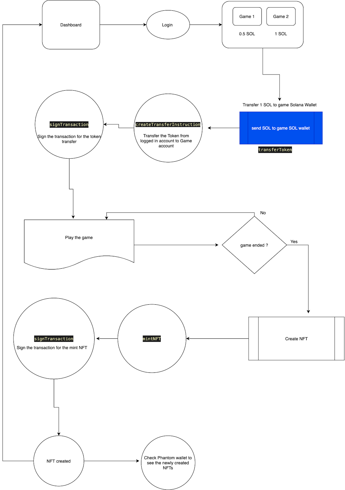

# Introduction

Blockchains are constantly evolving with every release and there are lots of Layer 1 blockchains which are now solving real world problems.
Solana is one of the fastest blockchains in terms of transaction rate per second and it has low transaction fees. These features make Solana a perfect blockchain to build applications which can scale up in terms of traffic, while keeping transactions affordable to end users.

Considering these factors we are going to build a decentralized gaming platform where users will be able to play the game by paying SOL to a wallet and will be able to create a Non-Fungible Token (NFT) for their game scores.

This tutorial does not cover any actual gameplay, it focuses on the creation of a React application that requires users to pay using the Phantom wallet for Solana before using the application.

# Prerequisites

Although the tutorial doesn’t require you to know everything about Solana or be an experienced developer, having some basic knowledge of JavaScript, React, Web3.js and the Solana blockchain will be useful.

# Requirements

- A code editor like Visual Studio Code (VSCode) to follow along with this tutorial
- Install the Phantom wallet browser extention from <https://phantom.app>

# Features

The decentralized application (DApp) will include the following features:

1.  Phantom wallet connection
2.  SOL transaction to a wallet
3.  Game play (We will be able to pick any open source game and copy the code)
4.  NFT creation for the game play high score

# Folder structure

The complete code for this tutorial can be found at <https://github.com/solanauniversity/solana-games>

Our App name is "solana-games" for the purposes of this tutorial. If you wish to clone the repository and work from there, you can run the following terminal command:

```text
git clone https://github.com/solanauniversity/solana-games
```

This will download the project onto your local drive and allow you to modify and run the DApp.

**Folder structure expected of the React app to run this tutorial**:

- `solana-games`
  - node_modules
  - public
  - src
    - assets
      - images
        - stack.png
    - games
      - stack
        - Stack.jsx
        - Styles.css
    - pages
      - CreateNFT.jsx
    - utils
      - transferToken.js
      - nftCreation.js
      - sleepUtil.js
      - walletUtils.js
      - programIds.js
    - App.js
    - App.css
    - index.js
  - package.json

# Flowchart of the DApp



Keeping this in mind, we will go over the details of the code and how it operates:

# Accept fees from the game player

The DApp (Decentralised Application) which we are building accepts the payment in the form of SOL tokens and lets users play the game after they have paid.
The tokens which we receive can be interpreted as a game fee. The same model can be applied to any DApp which can provide service after receiving the payment.
To make the payment to the DApp possible, we will first integrate the Phantom wallet which will enable users to send the payment.

## Connect to the Phantom wallet

To transfer the SOL from your wallet to the game's wallet, you first need to connect to the wallet. Without the connection, you will not be able to transfer SOL and move forward. This is accomplished within the file `src/App.js`.

- First we need to get the "solana" variable from the window object, if the solana variable is present that means the Phantom wallet is installed as a browser extension.
- Once we have the provider, then we are calling the "connect" function to connect with the Phantom wallet. It will open a popup to ask the user for their Phantom password. Once they provide the correct password, it will connect the wallet to the application.
- Phantom provides a way to listen to the connected or disconnected events by using hooks like "connect" and "disconnect". Once Phantom is successfully authorised then it will trigger the "connect" method and we can use this method to start our DApp functionality

```javascript
// src/App.js

// ...

/**
 * React will call this useEffect everytime there is an update in the provider variable.
 * Phantom provider provides 2 methods to listen on
 * 1. connect -> This method gets triggered when the wallet connection is successful
 * 2. disconnect -> This callback method gets triggered when the wallet gets disconnected from the application
 */

useEffect(() => {
  if (provider) {
    provider.on('connect', async () => {
      console.log('wallet got connected', provider.publicKey);
      setProviderPub(provider.publicKey);
    });
    provider.on('disconnect', () => {
      console.log('Disconnected from wallet');
    });
  }
}, [provider]);

/**
 * React will call this useEffect only one time after page the loads
 * We will check if the browser has Phantom wallet installed or not.
 * If a phantom wallet is installed then it provides a "solana" variable on the window object.
 */
useEffect(() => {
  if ('solana' in window && !provider) {
    console.log('Phantom wallet present');
    setProvider(window.solana);
  }
}, []);
```

Now that the `provider` is set, we can use the `provider` instance for all subsequent transactions. When the user connects their wallet, then it becomes important to assign the `provider` which can be used throughout the DApp to sign transactions.

## Signing transactions

**Once we are ready to send a transaction, it must be signed** - the signTransaction function from `@solana/web3.js` is used.

```javascript
// src/utils/transferToken.js

// ...

const createTransferTransaction = async (
  ownerPubkey,
  connection,
  fromTokenAccountPubkey,
  toTokenAccountPubkey,
  tokenToTransferLamports,
) => {
  let transaction = new Transaction().add(
    SystemProgram.transfer({
      fromPubkey: fromTokenAccountPubkey,
      toPubkey: toTokenAccountPubkey,
      lamports: tokenToTransferLamports,
    }),
  );
  transaction.feePayer = ownerPubkey;
  console.log('Getting recent blockhash');
  transaction.recentBlockhash = (
    await connection.getRecentBlockhash()
  ).blockhash;
  return transaction;
};
```

In the code above, we are preparing the transaction object to get signed and added to the Solana blockchain. To make the transaction valid, below are a few important properties which are required:

- **transaction.recentBlockhash** : As solana works on **proof of history**, hence every transaction in the solana blockchain requires the latest blockhash to be associated with the new transaction. Without the getRecentBlockhash, the validators will not be able to verify the transaction.

- **transaction.feePayer** : This variable denotes the fee payer of the transaction which will pay the fees to sign the transaction and send it for validation.

**Proof of history**: Proof of History is a sequence of computation that can provide a way to cryptographically verify the passage of time between two events. Validator nodes "timestamp" blocks with cryptographic proofs that some duration of time has passed since the last proof. All data hashed into the proof most certainly have occurred before the proof was generated. The node then shares the new block with validator nodes, which are able to verify those proofs. The blocks can arrive at validators in any order or even could be replayed years later. With such reliable synchronization guarantees, Solana is able to break blocks into smaller batches of transactions called _entries_. Entries are streamed to validators in realtime, before any notion of block consensus.
This is very different and efficient from the **Proof of Work** model where the energy consumption is high as every node in the blockchain has to perform the action to validate a transaction. The winner gets the reward but other validator’s work gets wasted in the process.

## Connection provider to the Phantom Wallet

In the utility function below, we are attempting to connect to the wallet if it is not connected already. The function will alert the user if there is no Phantom Wallet present as a browser extension.

The Phantom wallet browser extension injects the `solana` property in the global window object of the browser. We check for the presence of a wallet by checking the existence of a solana property on the window object.

```javascript
// src/utils/nftCreation.js

/**
 * Helper function to detect whether Phantom wallet extension is installed or not
 * @param {*} connectToWallet
 * @returns
 */
export const connectOrGetPhantomProvider = connectToWallet => {
  if ('solana' in window) {
    const provider = window.solana;
    if (connectToWallet && !window.solana.isConnected) {
      window.solana.connect();
    }
    if (provider.isPhantom) {
      return provider;
    }
  } else if (connectToWallet) {
    alert(`Please install the Phantom wallet from https://phantom.app/`);
  }
};
```

## Transfer SOL from user wallet to Games wallet

To transfer the SOL from the user’s wallet to our game wallet we need to create a new transaction which will hold the information about the sender of the SOL, receiver of the SOL and the amount of the SOL.

Once we have this information then we have to sign the transaction using the `createTransferTransaction` function from above.

As a safety check we have also added the `if` condition which will not let the transaction process in case the SOL amount is less than 0.

```javascript
// src/utils/transferToken.js

/**
 * This utility function will transfer the token from one user wallet to another user's wallet
 * @param {*} provider : provider of the Phantom wallet
 * @param {*} connection : connection to the Solana cluster
 * @param {*} tokenToTransfer : tokens to be transferred in lamports
 * @param {*} fromTokenAccountPubkey : sender of the token
 * @param {*} toTokenAccountPubkey : receiver of the token
 * @return {object}
 * { status: true, signature: "transaction signature hash"} in case of success
 * { status: false, error: "error message"} in case of failure
 */

export const transferCustomToken = async (
  provider,
  connection,
  tokenToTransfer,
  fromTokenAccountPubkey,
  toTokenAccountPubkey,
) => {
  if (tokenToTransfer <= 0) {
    return {
      status: false,
      error:
        'You can not transfer, Token to transfer should be greater than 0.',
    };
  }
  const tokenToTransferLamports = tokenToTransfer * 1000000000;
  const transaction = await createTransferTransaction(
    provider.publicKey,
    connection,
    fromTokenAccountPubkey,
    toTokenAccountPubkey,
    tokenToTransferLamports,
  );

  if (transaction) {
    try {
      let signed = await provider.signTransaction(transaction);
      console.log('Got signature, submitting transaction');

      let signature = await connection.sendRawTransaction(signed.serialize());
      console.log(
        'Submitted transaction ' + signature + ', awaiting confirmation',
      );

      await connection.confirmTransaction(signature);
      console.log('Transaction ' + signature + ' confirmed');

      return { status: true, signature };
    } catch (e) {
      console.warn(e);
      console.log('Error: ' + e.message);
      return { status: false, error: e.message };
    }
  }
  return {
    status: false,
    error: 'No transaction found',
  };
};
```

- **provider.publicKey** is going to use the public key of the currently selected account in the Phantom wallet.

# How to create the NFT on Solana

A non-fungible token (NFT) is a unique and non-interchangeable unit of data stored on a blockchain, a form of digital ledger. So to make ourselves proud by possessing the one and only scorecard of our gameplay we will convert our scores into a NFT. Once we convert it to an NFT, then we can claim the highest score made while playing the game.

Let's dive into the NFT creation process for Solana.

## Create NFT utility functions

NFT stands for non-fungible token, which basically means that it's a one-of-a-kind digital asset that belongs to you and you only. The most popular NFTs right now include artwork and music, but can also include videos and even tweets.

NFT metadata can include links to images/videos/audio files. All the metadata needs to be stored somewhere on the internet, and generally the NFT metadata will include links to the uploaded files rather than storing the files on the blockchain itself. The reason for this is that storing large amounts of data on the blockchain is computationally expensive. Storing a few bytes for a URL is much easier than storing an entire JPEG. Because of this, it is important to use durable file storage such as Arweave or IPFS to maintain the metadata files of an NFT.

We will use Arweave, a blockchain based data hosting service which is decentralized and distributed across the network.

In this code snippet we will examine the different libraries which are needed to work with SPL tokens.

```javascript
// src/utils/nftCreation.js

import { BinaryReader, BinaryWriter } from 'borsh';
import base58 from 'bs58';
import * as splToken from '@solana/spl-token';
import crypto from 'crypto';
import BN from 'bn.js';
import { serialize } from 'borsh';
import {
  Keypair,
  PublicKey,
  Transaction,
  clusterApiUrl,
  SystemProgram,
  SYSVAR_RENT_PUBKEY,
  TransactionInstruction,
} from '@solana/web3.js';

export const TOKEN_PROGRAM_ID = new PublicKey(
  'TokenkegQfeZyiNwAJbNbGKPFXCWuBvf9Ss623VQ5DA',
);
const SPL_ASSOCIATED_TOKEN_ACCOUNT_PROGRAM_ID = new PublicKey(
  'ATokenGPvbdGVxr1b2hvZbsiqW5xWH25efTNsLJA8knL',
);

const METADATA_PROGRAM_ID = 'metaqbxxUerdq28cj1RbAWkYQm3ybzjb6a8bt518x1s';

const MEMO_ID = new PublicKey('MemoSq4gqABAXKb96qnH8TysNcWxMyWCqXgDLGmfcHr');

const programIds = {
  token: TOKEN_PROGRAM_ID,
  associatedToken: SPL_ASSOCIATED_TOKEN_ACCOUNT_PROGRAM_ID,
  metadata: METADATA_PROGRAM_ID,
  memo: MEMO_ID,
};

const sleepUtil = ms => {
  return new Promise(resolve => setTimeout(resolve, ms));
};
export const NETWORK = clusterApiUrl('devnet');
export const AR_SOL_HOLDER_ID = new PublicKey(
  'HvwC9QSAzvGXhhVrgPmauVwFWcYZhne3hVot9EbHuFTm',
);
export const METADATA_PREFIX = 'metadata';
export const EDITION = 'edition';
export const EDITION_MARKER_BIT_SIZE = 248;
export const DEFAULT_TIMEOUT = 15000;
export const RESERVED_TXN_MANIFEST = 'manifest.json';
export const MetadataKey = {
  Uninitialized: 0,
  MetadataV1: 4,
  EditionV1: 1,
  MasterEditionV1: 2,
  MasterEditionV2: 6,
  EditionMarker: 7,
};
export const TOKEN_PROGRAM_ID = programIds.token;
```

- **borsh:** It is a library which provides us the functionality of serialization or deserialization of data.
- **bs58:** It helps to encode the string to base 58 encoding.
- **@solana/spl-token:** It is a library containing all the utility functions to create the token on the Solana blockchain.
- **crypto:** It is an algorithm that performs data encryption and decryption.
- **bn.js:** The BN.js library for calculating with big numbers in JavaScript.
- **@solana/web3.js:** This JavaScript API helps to prepare the instructions for transactions made on Solana.
- **sleepUtil:** This function will help to make setTimeOut work as a synchronous function. With the help of this function we can wait synchronously at any place in the code.
- **NETWORK:** This parameter signifies to which cluster of Solana the application will be connected to.

Other variables mentioned are the predefined standards from Metaplex which internally uses an on-chain program to store all the metadata and artifacts of the NFT. You can find more information on the [Metaplex documentation](https://docs.metaplex.com/).

# On-chain program’s data structures

On-chain programs written in Rust expect the data passed to them to be in 'struct' format.
The class needs to be created to use in Web3 (JavaScript), but to send it through the transaction first the 'class' data structure needs to be converted to 'struct' data structure and then serialized (so it can be sent over the network) via the borsh serializer.

Serialization is important as without it, an on-chain program written in Rust will not be able to deserialize the instruction data and it will return fatal error.

- **CreateMetadataArgs:** This defines the structure of the data which is expected from the Metaplex on-chain programs to perform the NFT creation action.

- **UpdateMetadataArgs:** This defines the structure of the data to update the metadata of the NFT, without which we can not update the metadata of the NFT.

- **CreateMasterEditionArgs:** This defines the structure of the data which needs to create Master Edition of the NFT, which can be minted to other NFTs in the future. Users can set the max supply for the master edition which can be minted.

- **Creator**: This defines the structure of the data for the creator of the NFT. This information will be injected to each NFT which gets minted on the blockchain.

- **Metadata:** This defines the structure of the metadata data which will be associated with each NFT minted on the blockchain. In the metadata we can store the images, videos on the NFT which can be sold on NFT marketplaces.

```javascript
// src/utils/nftCreation.js

/**
 * Classes to be used to create the NFT
 */

class CreateMetadataArgs {
  instruction = 0;
  data;
  isMutable;
  constructor(args) {
    this.data = args.data;
    this.isMutable = args.isMutable;
  }
}

class UpdateMetadataArgs {
  instruction = 1;
  data;
  // Not used by this app, just required for instruction
  updateAuthority;
  primarySaleHappened;
  constructor(args) {
    this.data = args.data ? args.data : null;
    this.updateAuthority = args.updateAuthority ? args.updateAuthority : null;
    this.primarySaleHappened = args.primarySaleHappened;
  }
}

class CreateMasterEditionArgs {
  instruction = 10;
  maxSupply;
  constructor(args) {
    this.maxSupply = args.maxSupply;
  }
}

class Edition {
  key;
  /// Points at MasterEdition struct
  parent;
  /// Starting at 0 for master record, this is incremented for each edition minted.
  edition;
  constructor(args) {
    this.key = MetadataKey.EditionV1;
    this.parent = args.parent;
    this.edition = args.edition;
  }
}

export class Creator {
  address;
  verified;
  share;
  constructor(args) {
    this.address = args.address;
    this.verified = args.verified;
    this.share = args.share;
  }
}

class Data {
  name;
  symbol;
  uri;
  sellerFeeBasisPoints;
  creators;
  constructor(args) {
    this.name = args.name;
    this.symbol = args.symbol;
    this.uri = args.uri;
    this.sellerFeeBasisPoints = args.sellerFeeBasisPoints;
    this.creators = args.creators;
  }
}

class Metadata {
  key;
  updateAuthority;
  mint;
  data;
  primarySaleHappened;
  isMutable;
  editionNonce;
  // set lazy
  masterEdition;
  edition;
  constructor(args) {
    this.key = MetadataKey.MetadataV1;
    this.updateAuthority = args.updateAuthority;
    this.mint = args.mint;
    this.data = args.data;
    this.primarySaleHappened = args.primarySaleHappened;
    this.isMutable = args.isMutable;
    this.editionNonce = args.editionNonce;
  }
  async init() {
    const edition = await getEdition(this.mint);
    this.edition = edition;
    this.masterEdition = edition;
  }
}

class MintPrintingTokensArgs {
  instruction9;
  supply;
  constructor(args) {
    this.supply = args.supply;
  }
}
```

## HTML DOM to Image utility function

To create an NFT which can hold the image as metadata we need to provide the image in the form of a base64 encoded string and from base64 to file object which eventually gets uploaded to Arweave.

To prepare the file object of the image, we write our custom function which can convert any DOM element to base64 string and then base64 to File object:

```javascript
// src/utils/nftCreation.js

/**
 * Helper function to convert base64 to file object
 * @param {*} dataurl
 * @param {*} filename
 * @returns {File} File object.
 */
export const dataURLtoFile = (dataurl, filename) => {
  let arr = dataurl.split(','),
    mime = arr[0].match(/:(.*?);/)[1],
    bstr = atob(arr[1]),
    n = bstr.length,
    u8arr = new Uint8Array(n);
  while (n--) {
    u8arr[n] = bstr.charCodeAt(n);
  }
  return new File([u8arr], filename, { type: mime });
};
```

## Borsh extended functionality

This functionality is provided by the Metaplex team where they added an extra util function to the BinaryReader to make the communication seamless with Metaplex on-chain programs.

Without the appropriate serialization, the NFT creation will not work as the transaction will not be deserialized properly by the on-chain programs.

```javascript
// src/utils/nftCreation.js

/**
 * Utility to add functionality to BinaryReader
 */
export const extendBorsh = () => {
  BinaryReader.prototype.readPubkey = function () {
    const reader = this;
    const array = reader.readFixedArray(32);
    return new PublicKey(array);
  };

  BinaryWriter.prototype.writePubkey = function (value) {
    const writer = this;
    writer.writeFixedArray(value.toBuffer());
  };

  BinaryReader.prototype.readPubkeyAsString = function () {
    const reader = this;
    const array = reader.readFixedArray(32);
    return base58.encode(array);
  };

  BinaryWriter.prototype.writePubkeyAsString = function (value) {
    const writer = this;
    writer.writeFixedArray(base58.decode(value));
  };
};
extendBorsh();
```

- **mintNFT:** It is a utility wrapper function which expects different parameters to create the NFT process. All the required parameters are explained below.

- **createMint:** It is to create the minting address for the NFT with the required parameters.

1.  **Instructions**: It includes all the instructions related to mint creation, associate account creation and metadata upload.
2.  **payer**: This parameter defines the payer of the transaction.
3.  **mintRentExempt**: This parameter is required to enable rent free account on Solana blockchain.
4.  **decimals**: This parameter is required to tell how many decimals will be placed with the mint key. In the case of NFT, where maximum supply needs to be 1 only, then it will be passed as 0.
5.  **owner**: This parameter tells about the owner of the wallet as well as owner of the NFT which will be minted/created.
6.  **freezeAuthority**: This parameter tells who can freeze authority of the NFT created. Freezing authority is a super set of owners and can override the actions of the owner.
7.  **signers**: This parameter tells about the signers of the transaction, of course while creating the NFT, connected wallet will act as a signer.

```javascript
// src/utils/nftCreation.js

export const mintNFT = async function (
  connection,
  provider,
  env,
  files,
  metadata,
) {
  const wallet = provider;
  const metadataContent = {
    name: metadata.name,
    symbol: metadata.symbol,
    description: metadata.description,
    seller_fee_basis_points: metadata.sellerFeeBasisPoints,
    image: metadata.image,
    animation_url: metadata.animation_url,
    external_url: metadata.external_url,
    properties: {
      ...metadata.properties,
      creators: metadata.creators.map(creator => {
        return {
          address: creator.address,
          share: creator.share,
        };
      }),
    },
  };
  const realFiles = [
    ...files,
    new File([JSON.stringify(metadataContent)], 'metadata.json'),
  ];

  const { instructions: pushInstructions, signers: pushSigners } =
    await prepPayForFilesTxn(wallet, realFiles, metadata);

  // Allocate memory for the account
  const mintRent = await connection.getMinimumBalanceForRentExemption(
    splToken.MintLayout.span,
  );

  const payerPublicKey = wallet.publicKey.toBase58();
  const instructions = [...pushInstructions];
  const signers = [...pushSigners];

  // This is only temporarily owned by wallet - transferred to program by createMasterEdition below
  const mintKey = createMint(
    instructions,
    wallet.publicKey,
    mintRent,
    0,
    // Some weird bug with Phantom where its public key doesn't mesh with data encode well
    new PublicKey(payerPublicKey),
    new PublicKey(payerPublicKey),
    signers,
  ).toBase58();

  const recipientKey = (
    await findProgramAddress(
      [
        wallet.publicKey.toBuffer(),
        programIds.token.toBuffer(),
        new PublicKey(mintKey).toBuffer(),
      ],
      programIds.associatedToken,
    )
  )[0];

  createAssociatedTokenAccountInstruction(
    instructions,
    new PublicKey(recipientKey),
    wallet.publicKey,
    wallet.publicKey,
    new PublicKey(mintKey),
  );
  const classData = new Data({
    symbol: metadata.symbol,
    name: metadata.name,
    uri: ' '.repeat(64), // size of url for arweave
    sellerFeeBasisPoints: metadata.sellerFeeBasisPoints,
    creators: metadata.creators,
  });
  const metadataAccount = await createMetadata(
    classData,
    payerPublicKey,
    mintKey,
    payerPublicKey,
    instructions,
    wallet.publicKey.toBase58(),
  );
  const { txid } = await sendTransactionWithRetry(
    connection,
    wallet,
    instructions,
    signers,
  );
  try {
    // return
    await connection.confirmTransaction(txid, 'max');
  } catch {
    // ignore
  }

  await connection.getParsedConfirmedTransaction(txid, 'confirmed');

  const data = new FormData();

  const tags = realFiles.reduce((acc, f) => {
    acc[f.name] = [{ name: 'mint', value: mintKey }];
    return acc;
  }, {});
  data.append('tags', JSON.stringify(tags));
  data.append('transaction', txid);
  realFiles.map(f => data.append('file[]', f));

  const result = await (
    await fetch(
      'https://us-central1-principal-lane-200702.cloudfunctions.net/uploadFile2',
      {
        method: 'POST',
        body: data,
      },
    )
  ).json();

  const metadataFile = result.messages?.find(
    m => m.filename === RESERVED_TXN_MANIFEST,
  );
  let arweaveLink = '';
  if (metadataFile?.transactionId) {
    const updateInstructions = [];
    const updateSigners = [];
    arweaveLink = `https://arweave.net/${metadataFile.transactionId}`;
    await updateMetadata(
      new Data({
        name: metadata.name,
        symbol: metadata.symbol,
        uri: arweaveLink,
        creators: metadata.creators,
        sellerFeeBasisPoints: metadata.sellerFeeBasisPoints,
      }),
      undefined,
      undefined,
      mintKey,
      payerPublicKey,
      updateInstructions,
      metadataAccount,
    );

    updateInstructions.push(
      splToken.Token.createMintToInstruction(
        TOKEN_PROGRAM_ID,
        new PublicKey(mintKey),
        new PublicKey(recipientKey),
        new PublicKey(payerPublicKey),
        [],
        1,
      ),
    );

    await createMasterEdition(
      new BN(1),
      mintKey,
      payerPublicKey,
      payerPublicKey,
      payerPublicKey,
      updateInstructions,
    );

    await sendTransactionWithRetry(
      connection,
      wallet,
      updateInstructions,
      updateSigners,
    );
  }
  return { metadataAccount, arweaveLink, mintKey, account: recipientKey };
};
```

- **prepPayForFilesTxn:** It is used to calculate the fees for the files which need to be uploaded to arweave. It is mentioned in the arweave documentation that you need Tokens to upload onto the arweave platform.
  There are a few storage types which can be used to upload the images and metadata.
  Two of the most common while working with Metaplex and Arweave are

1.  "arweave-sol" : Uploads to arweave but only accepts payment in SOL and only works in mainnet.
2.  "arweave" : Uploads to arweave via Metaplex Google Cloud function. Best to be used in devnet and mainnet.

- **findProgramAddress:** It is to find the account address based on the program id and seed provided. It is a deterministic function, hence it will always provide the address for the same seed and same program id.

Deterministic function is needed because it will help to deduplicate any associated account with the same mintKey.

```javascript
// src/utils/nftCreation.js

const prepPayForFilesTxn = async (wallet, files, metadata) => {
  const memo = programIds.memo;
  const instructions = [];
  const signers = [];
  if (wallet.publicKey)
    instructions.push(
      SystemProgram.transfer({
        fromPubkey: wallet.publicKey,
        toPubkey: AR_SOL_HOLDER_ID,
        lamports: 100000000,
      }),
    );
  //Already uploading files on IPFS, hence no files to be transacted here
  for (let i = 0; i < files.length; i++) {
    const hashSum = crypto.createHash('sha256');
    hashSum.update(await files[i].text());
    const hex = hashSum.digest('hex');
    instructions.push(
      new TransactionInstruction({
        keys: [],
        programId: memo,
        data: Buffer.from(hex),
      }),
    );
  }
  return {
    instructions,
    signers,
  };
};

const findProgramAddress = async (seeds, programId) => {
  const result = await PublicKey.findProgramAddress(seeds, programId);
  return [result[0].toBase58(), result[1]];
};

function createMint(
  instructions,
  payer,
  mintRentExempt,
  decimals,
  owner,
  freezeAuthority,
  signers,
) {
  const account = createUninitializedMint(
    instructions,
    payer,
    mintRentExempt,
    signers,
  );
  instructions.push(
    splToken.Token.createInitMintInstruction(
      TOKEN_PROGRAM_ID,
      account,
      decimals,
      owner,
      freezeAuthority,
    ),
  );
  return account;
}

const createTokenAccount = (
  instructions,
  payer,
  accountRentExempt,
  mint,
  owner,
  signers,
) => {
  const account = createUninitializedAccount(
    instructions,
    payer,
    accountRentExempt,
    signers,
  );
  instructions.push(
    splToken.Token.createInitAccountInstruction(
      TOKEN_PROGRAM_ID,
      mint,
      account,
      owner,
    ),
  );
  return account;
};

function createUninitializedMint(instructions, payer, amount, signers) {
  const account = Keypair.generate();
  instructions.push(
    SystemProgram.createAccount({
      fromPubkey: payer,
      newAccountPubkey: account.publicKey,
      lamports: amount,
      space: splToken.MintLayout.span,
      programId: TOKEN_PROGRAM_ID,
    }),
  );
  signers.push(account);
  return account.publicKey;
}

function createUninitializedAccount(instructions, payer, amount, signers) {
  const account = Keypair.generate();
  instructions.push(
    SystemProgram.createAccount({
      fromPubkey: payer,
      newAccountPubkey: account.publicKey,
      lamports: amount,
      space: splToken.AccountLayout.span,
      programId: TOKEN_PROGRAM_ID,
    }),
  );
  signers.push(account);
  return account.publicKey;
}
```

- **createUninitializedMint:** It is to create the basic mint account to hold the uninitialised token. The token which is just minted but not provided any value. This is needed to attach the metadata with the token before increasing the supply of the token to 1.

- **createUninitializedAccount:** Used to create the associated account to hold the SPL token which is going to be NFT.

- **createAssociatedTokenAccountInstruction:** Used to create the associate token instruction, which will help to create an associate account which can hold the NFT.

```javascript
// src/utils/nftCreation.js

function createAssociatedTokenAccountInstruction(
  instructions,
  associatedTokenAddress,
  payer,
  walletAddress,
  splTokenMintAddress,
) {
  const keys = [
    {
      pubkey: payer,
      isSigner: true,
      isWritable: true,
    },
    {
      pubkey: associatedTokenAddress,
      isSigner: false,
      isWritable: true,
    },
    {
      pubkey: walletAddress,
      isSigner: false,
      isWritable: false,
    },
    {
      pubkey: splTokenMintAddress,
      isSigner: false,
      isWritable: false,
    },
    {
      pubkey: SystemProgram.programId,
      isSigner: false,
      isWritable: false,
    },
    {
      pubkey: programIds.token,
      isSigner: false,
      isWritable: false,
    },
    {
      pubkey: SYSVAR_RENT_PUBKEY,
      isSigner: false,
      isWritable: false,
    },
  ];
  instructions.push(
    new TransactionInstruction({
      keys,
      programId: programIds.associatedToken,
      data: Buffer.from([]),
    }),
  );
}
```

# Transaction which needs to be signed

- **sendTransactionWithRetry:** Used to retry the transaction in case of failure. While performing any transaction on a blockchain there is always a chance of transaction failure and it can lead to bad user experience if it fails in the first go. Hence this function helps to re-initiate the transaction in case of failure.

- **getUnixTs:** Helps to get the correct Unix timestamp in milliseconds.

- **awaitTransactionSignatureConfirmation:** It waits for the transaction’s signature.

- **sendSignedTransaction:** Used to send the signed transaction to the Solana blockchain, which will eventually write the data instruction on the solana blockchain.

- **createMetadata:** Helps to create the metadata for the NFT. A metadata can contain anything from images, gif, urls or any piece of code as well. Hence using it logically with the different use-cases can serve many purposes.

In this step we will be going through the flow of signing the transaction. To complete the mint process we need to write our block to the solana blockchain. To get this transaction on the blockchain it needs to be signed from the wallet owner and sent for the validation.

Few key variables to be used in above function:

- **transaction.recentBlockhash** : As solana works on **proof of history**, hence every transaction in the solana blockchain requires the latest blockhash to be associated with the new transaction. Without the getRecentBlockhash, the validators will not be able to verify the transaction.
  **proof of history**: Proof of History is a sequence of computation that can provide a way to cryptographically verify passage of time between two events. Validator nodes "timestamp" blocks with cryptographic proofs that some duration of time has passed since the last proof. All data hashed into the proof most certainly have occurred before the proof was generated. The node then shares the new block with validator nodes, which are able to verify those proofs. The blocks can arrive at validators in any order or even could be replayed years later. With such reliable synchronization guarantees, Solana is able to break blocks into smaller batches of transactions called _entries_. Entries are streamed to validators in real time, before any notion of block consensus.
  This is very different and efficient from the **Proof of Work** or **Proof of Stake** where the energy consumption is high as every node in the blockchain has to perform the action to validate a node. The winner gets the reward but other validator’s work gets wasted in the process.

- **wallet.publicKey** : Every transaction needs a fee to be paid to the computers who are making the transaction possible. This parameter tells Solana who will be paying the fees for this transaction.
  `wallet.publicKey = provider.publicKey`

- **signers.map** : List of accounts which will be used to sign the ongoing transaction, that is defined by this list of signers. If any action is going to be taken on this account, it requires the signature using the account’s private key. This ensures that the program never updates the account of a user without the permission of the owner of that account.

- **transaction.serialize()** : All the data must be stored on the blockchain. To keep the content format agnostic of the programming language used, the data is serialized before storing.

- **skipPreflight** : It’s a boolean data type
  - true: Skips the preflight transaction checks
  - false: (default value) : Transaction checks for the available methods before sending the transaction, which involves a very little latency.

```javascript
// src/utils/nftCreation.js

const sendTransactionWithRetry = async (
  connection,
  wallet,
  instructions,
  signers,
  commitment = 'singleGossip',
  includesFeePayer = false,
  block,
  beforeSend,
) => {
  let transaction = new Transaction();
  instructions.forEach(instruction => transaction.add(instruction));
  transaction.recentBlockhash = (
    block || (await connection.getRecentBlockhash(commitment))
  ).blockhash;
  if (includesFeePayer) {
    transaction.setSigners(...signers.map(s => s.publicKey));
  } else {
    transaction.setSigners(
      // fee payed by the wallet owner
      wallet.publicKey,
      ...signers.map(s => s.publicKey),
    );
  }
  if (signers.length > 0) {
    transaction.partialSign(...signers);
  }
  if (!includesFeePayer) {
    transaction = await wallet.signTransaction(transaction);
  }
  if (beforeSend) {
    beforeSend();
  }
  const { txid, slot } = await sendSignedTransaction({
    connection,
    signedTransaction: transaction,
  });
  return { txid, slot };
};
const getUnixTs = () => {
  return new Date().getTime() / 1000;
};

async function awaitTransactionSignatureConfirmation(
  txid,
  timeout,
  connection,
  commitment = 'recent',
  queryStatus = false,
) {
  let done = false;
  let status = {
    slot: 0,
    confirmations: 0,
    err: null,
  };
  let subId = 0;
  status = await new Promise(async (resolve, reject) => {
    setTimeout(() => {
      if (done) {
        return;
      }
      done = true;
      console.log('Rejecting for timeout...');
      reject({ timeout: true });
    }, timeout);
    try {
      subId = connection.onSignature(
        txid,
        (result, context) => {
          done = true;
          status = {
            err: result.err,
            slot: context.slot,
            confirmations: 0,
          };
          if (result.err) {
            console.log('Rejected via websocket', result.err);
            reject(status);
          } else {
            console.log('Resolved via websocket', result);
            resolve(status);
          }
        },
        commitment,
      );
    } catch (e) {
      done = true;
      console.error('WS error in setup', txid, e);
    }
    while (!done && queryStatus) {
      // eslint-disable-next-line no-loop-func
      (async () => {
        try {
          const signatureStatuses = await connection.getSignatureStatuses([
            txid,
          ]);
          status = signatureStatuses && signatureStatuses.value[0];
          if (!done) {
            if (!status) {
              console.log('REST null result for', txid, status);
            } else if (status.err) {
              console.log('REST error for', txid, status);
              done = true;
              reject(status.err);
            } else if (!status.confirmations) {
              console.log('REST no confirmations for', txid, status);
            } else {
              console.log('REST confirmation for', txid, status);
              done = true;
              resolve(status);
            }
          }
        } catch (e) {
          if (!done) {
            console.log('REST connection error: txid', txid, e);
          }
        }
      })();
      await sleepUtil(1000);
    }
  });
  //@ts-ignore
  if (connection._signatureSubscriptions[subId])
    connection.removeSignatureListener(subId);
  done = true;
  console.log('Returning status', status);
  return status;
}

async function sendSignedTransaction({
  signedTransaction,
  connection,
  timeout = DEFAULT_TIMEOUT,
}) {
  const rawTransaction = signedTransaction.serialize();
  const startTime = getUnixTs();
  let slot = 0;
  const txid = await connection.sendRawTransaction(rawTransaction, {
    skipPreflight: true,
  });
  console.log('Started awaiting confirmation for', txid);
  let done = false;
  (async () => {
    while (!done && getUnixTs() - startTime < timeout) {
      connection.sendRawTransaction(rawTransaction, {
        skipPreflight: true,
      });
      await sleepUtil(500);
    }
  })();
  try {
    const confirmation = await awaitTransactionSignatureConfirmation(
      txid,
      timeout,
      connection,
      'recent',
      true,
    );
    if (!confirmation)
      throw new Error('Timed out awaiting confirmation on transaction');
    if (confirmation.err) {
      console.error(confirmation.err);
      throw new Error('Transaction failed: Custom instruction error');
    }
    slot = confirmation?.slot || 0;
  } catch (err) {
  } finally {
    done = true;
  }
  console.log('Latency', txid, getUnixTs() - startTime);
  return { txid, slot };
}
```

- **getEdition:** Helps to find the correct edition of the NFT, based on the parameters passed.

- **findProgramAddress:** This utility method is used to find the associated address with the mintkey and the metadata account.

Associated token address is needed to mint the new token and add the metadata to the token.

```javascript
// src/utils/nftCreation.js

async function getEdition(tokenMint) {
  return (
    await findProgramAddress(
      [
        Buffer.from(METADATA_PREFIX),
        new PublicKey(programIds.metadata).toBuffer(),
        new PublicKey(tokenMint).toBuffer(),
        Buffer.from(EDITION),
      ],
      new PublicKey(programIds.metadata),
    )
  )[0];
}
```

# Schema mapping of the required classes

For Solana programs, Rust only supports the struct data structure hence the 'classes' need to be converted to 'struct' to perform valid serialization and deserialization.

```javascript
const METADATA_SCHEMA = new Map([
  [
    CreateMetadataArgs,
    {
      kind: 'struct',
      fields: [
        ['instruction', 'u8'],
        ['data', Data],
        ['isMutable', 'u8'], // bool
      ],
    },
  ],
  [
    UpdateMetadataArgs,
    {
      kind: 'struct',
      fields: [
        ['instruction', 'u8'],
        ['data', { kind: 'option', type: Data }],
        ['updateAuthority', { kind: 'option', type: 'pubkeyAsString' }],
        ['primarySaleHappened', { kind: 'option', type: 'u8' }],
      ],
    },
  ],
  [
    CreateMasterEditionArgs,
    {
      kind: 'struct',
      fields: [
        ['instruction', 'u8'],
        ['maxSupply', { kind: 'option', type: 'u64' }],
      ],
    },
  ],
  [
    MintPrintingTokensArgs,
    {
      kind: 'struct',
      fields: [
        ['instruction', 'u8'],
        ['supply', 'u64'],
      ],
    },
  ],
  [
    MasterEditionV1,
    {
      kind: 'struct',
      fields: [
        ['key', 'u8'],
        ['supply', 'u64'],
        ['maxSupply', { kind: 'option', type: 'u64' }],
        ['printingMint', 'pubkeyAsString'],
        ['oneTimePrintingAuthorizationMint', 'pubkeyAsString'],
      ],
    },
  ],
  [
    MasterEditionV2,
    {
      kind: 'struct',
      fields: [
        ['key', 'u8'],
        ['supply', 'u64'],
        ['maxSupply', { kind: 'option', type: 'u64' }],
      ],
    },
  ],
  [
    Edition,
    {
      kind: 'struct',
      fields: [
        ['key', 'u8'],
        ['parent', 'pubkeyAsString'],
        ['edition', 'u64'],
      ],
    },
  ],
  [
    Data,
    {
      kind: 'struct',
      fields: [
        ['name', 'string'],
        ['symbol', 'string'],
        ['uri', 'string'],
        ['sellerFeeBasisPoints', 'u16'],
        ['creators', { kind: 'option', type: [Creator] }],
      ],
    },
  ],
  [
    Creator,
    {
      kind: 'struct',
      fields: [
        ['address', 'pubkeyAsString'],
        ['verified', 'u8'],
        ['share', 'u8'],
      ],
    },
  ],
  [
    Metadata,
    {
      kind: 'struct',
      fields: [
        ['key', 'u8'],
        ['updateAuthority', 'pubkeyAsString'],
        ['mint', 'pubkeyAsString'],
        ['data', Data],
        ['primarySaleHappened', 'u8'], // bool
        ['isMutable', 'u8'], // bool
      ],
    },
  ],
  [
    EditionMarker,
    {
      kind: 'struct',
      fields: [
        ['key', 'u8'],
        ['ledger', [31]],
      ],
    },
  ],
]);
```

**createMetadata**: In the below util function, we are trying to create the metadata for the mint token which was created earlier. Metadata is going to store the artifacts from the NFT which can be in the form of image/gif/video.

```javascript
// src/utils/nftCreation.js

async function createMetadata(
  data,
  updateAuthority,
  mintKey,
  mintAuthorityKey,
  instructions,
  payer,
) {
  const metadataProgramId = programIds.metadata;
  const metadataAccount = (
    await findProgramAddress(
      [
        Buffer.from('metadata'),
        new PublicKey(metadataProgramId).toBuffer(),
        new PublicKey(mintKey).toBuffer(),
      ],
      new PublicKey(metadataProgramId),
    )
  )[0];

  const value = new CreateMetadataArgs({ data, isMutable: true });

  let txnData = Buffer.from(serialize(METADATA_SCHEMA, value));
  const keys = [
    {
      pubkey: new PublicKey(metadataAccount),
      isSigner: false,
      isWritable: true,
    },
    {
      pubkey: new PublicKey(mintKey),
      isSigner: false,
      isWritable: false,
    },
    {
      pubkey: new PublicKey(mintAuthorityKey),
      isSigner: true,
      isWritable: false,
    },
    {
      pubkey: new PublicKey(payer),
      isSigner: true,
      isWritable: false,
    },
    {
      pubkey: new PublicKey(updateAuthority),
      isSigner: false,
      isWritable: false,
    },
    {
      pubkey: SystemProgram.programId,
      isSigner: false,
      isWritable: false,
    },
    {
      pubkey: SYSVAR_RENT_PUBKEY,
      isSigner: false,
      isWritable: false,
    },
  ];
  instructions.push(
    new TransactionInstruction({
      keys,
      programId: new PublicKey(metadataProgramId),
      data: txnData,
    }),
  );
  return metadataAccount;
}

async function updateMetadata(
  data,
  newUpdateAuthority,
  primarySaleHappened,
  mintKey,
  updateAuthority,
  instructions,
  metadataAccount,
) {
  const metadataProgramId = programIds.metadata;
  metadataAccount =
    metadataAccount ||
    (
      await findProgramAddress(
        [
          Buffer.from('metadata'),
          new PublicKey(metadataProgramId).toBuffer(),
          new PublicKey(mintKey).toBuffer(),
        ],
        new PublicKey(metadataProgramId),
      )
    )[0];

  const value = new UpdateMetadataArgs({
    data,
    updateAuthority: !newUpdateAuthority ? undefined : newUpdateAuthority,
    primarySaleHappened:
      primarySaleHappened === null || primarySaleHappened === undefined
        ? null
        : primarySaleHappened,
  });
  const txnData = Buffer.from(serialize(METADATA_SCHEMA, value));
  const keys = [
    {
      pubkey: new PublicKey(metadataAccount),
      isSigner: false,
      isWritable: true,
    },
    {
      pubkey: new PublicKey(updateAuthority),
      isSigner: true,
      isWritable: false,
    },
  ];
  instructions.push(
    new TransactionInstruction({
      keys,
      programId: new PublicKey(metadataProgramId),
      data: txnData,
    }),
  );
  return metadataAccount;
}
```

The routes and component to display for each route are defined in `src/index.js`:

```javascript
// src/index.js

import React from 'react';
import ReactDOM from 'react-dom';
import { BrowserRouter as Router, Route, Switch } from 'react-router-dom';
import './index.css';
import App from './App';
import StackIt from './games/stack/Stack';
import CreateNFT from './pages/CreateNFT';
import reportWebVitals from './reportWebVitals';

ReactDOM.render(
  <React.StrictMode>
    <Router>
      <Switch>
        <Route exact path="/">
          <App />
        </Route>
        <Route exact path="/stack">
          <StackIt />
        </Route>
        <Route path="/createNFT">
          <CreateNFT />
        </Route>
      </Switch>
    </Router>
  </React.StrictMode>,
  document.getElementById('root'),
);
reportWebVitals();
```

2.  Now we will add the code for the dashboard screen. The code below will act as a front page of the game, we can redirect the user to the main game based on the different conditions like:

- If the user has enough funds to play the game, then redirect user to the game
- If the user does not have the enough funds then prompt them to fund the wallet

The code of the game can be put in any folder, the redirection should be made correctly.

```javascript
// src/App.js

import { useEffect, useState } from 'react';
import stack from './assets/images/stack.png';
import './App.css';
import { useHistory } from 'react-router';
import {
  clusterApiUrl,
  Connection,
  LAMPORTS_PER_SOL,
  PublicKey,
} from '@solana/web3.js';
import { transferCustomToken } from './utils/transferToken';
const NETWORK = clusterApiUrl('devnet');
let lamportsRequiredToPlay = 0.1 * LAMPORTS_PER_SOL;
const gameWalletPublicKey = new PublicKey(
  '62AtDMhgaW1YQZCxv7hGBE7HDTU67L71vs4VQrRVBq3p',
);

function App() {
  const [provider, setProvider] = useState();
  const [providerPubKey, setProviderPub] = useState();
  const history = useHistory();
  /**
   *
   * Connection to the Solana cluster
   */
  const connection = new Connection(NETWORK);

  const playStack = async () => {
    /**
     * Flow to play the game
     * 1. Check if the user is logged in
     * 2. Check the wallet has SOL in it
     * 3. If no SOL then ask him to fund the wallet first
     * 4. If required SOL present the, proceed with the transaction
     */

    // Check if the user is logged in
    if (!providerPubKey) {
      alert('Ooops... Please login via wallet');
      return;
    }

    // Check if the user has SOL in his wallet
    const accountBalance = await connection.getBalance(providerPubKey);
    const balanceInLamports = accountBalance ? parseInt(accountBalance) : 0;
    if (balanceInLamports < lamportsRequiredToPlay) {
      alert('Not enough balance, please fund your wallet');
      return;
    }

    // If user has required SOL in the wallet, then deduct the amount
    lamportsRequiredToPlay = lamportsRequiredToPlay / LAMPORTS_PER_SOL;
    const result = await transferCustomToken(
      provider,
      connection,
      lamportsRequiredToPlay,
      providerPubKey,
      gameWalletPublicKey,
    );

    if (!result.status) {
      alert('Error in sending the SOL tokens, Please try again!!!');
      return;
    }

    // If the status is true, that means transaction was successful and we can proceed
    history.push('/stack');
  };

  const loginHandler = () => {
    if (!provider && window.solana) {
      setProvider(window.solana);
    } else if (!provider) {
      console.log('No provider found');
      return;
    } else if (provider && !provider.isConnected) {
      provider.connect();
    }
  };

  useEffect(() => {
    if (provider) {
      provider.on('connect', async () => {
        console.log('wallet got connected', provider.publicKey);
        setProviderPub(provider.publicKey);
      });
      provider.on('disconnect', () => {
        console.log('Disconnected from wallet');
      });
    }
  }, [provider]);

  useEffect(() => {
    if ('solana' in window && !provider) {
      console.log('Phantom wallet present');
      setProvider(window.solana);
    }
  }, []);

  return (
    <div className="App">
      <header>
        <h2 className="gameHeader">Stack game on Solana</h2>
        {!providerPubKey && (
          <button className="loginButton" onClick={() => loginHandler()}>
            {' '}
            Login
          </button>
        )}
        {providerPubKey && <span>{providerPubKey.toBase58()}</span>}
      </header>
      <div className="gameThumbnail">
        
        <button className="playButton" onClick={() => playStack()}>
          Play Stack
        </button>
      </div>
    </div>
  );
}

export default App;
```

3.  Add the source code for the game you want to integrate with this application.

## Setting up the Phantom wallet

1.  If you do not already have it installed, please install the Phantom wallet extension from <https://phantom.app> - it supports Chrome, Brave, Firefox and Edge browsers.
2.  Add some SOL to the wallet on **devnet** for testing: Go to <https://www.spl-token-ui.com/#/sol-airdrop> and switch to devnet by clicking on the dropdown at the top right of the menu bar (it will show **Mainnet-beta** by default). You can paste your Phantom wallet address and change the amount to 2 SOL to receive an airdrop. Even though the site says you can receive up to 10 SOL per request, attempting to get more than 2 SOL at a time will not work so don't waste your time.

# Conclusion

In this tutorial we learned about:

1.  How to architecture the Web3 app with Phantom wallet
2.  How to integrate the Phantom wallet to sign transactions
3.  Usage of Solana's Web3.js using multiple inbuilt functions like signTransaction
4.  How to transfer SOL from one wallet to another wallet
5.  Importance of signing the transactions
6.  What is a metadata account
7.  What are on-chain programs
8.  What is an NFT and how it is different from regular tokens

# What's Next

- Once you complete this tutorial then you can build a pay-per-use gaming platform on Solana.
- You can provide services for which you can charge some amount of SOL from the users.
- You can extend the Aolana games learning and build your own gaming platform.
- You can use the knowledge of NFT creation and build NFT marketplaces like OpenSea.

# About The Author

This tutorial is written by [Sandeep Ghosh](https://github.com/blocksan). You can connect with him on [LinkedIn](https://www.linkedin.com/in/ersandy/). He is a passionate blockchain engineer, an avid thinker who is currently working on building multiple products in the Solana ecosystem.

# References

1.  [Solgames.fun - Superset of this tutorial](https://solgames.fun/)
2.  [Solana Docs](https://docs.solana.com)
3.  [SPL Token Docs](https://spl.solana.com/token)
4.  [Solana Terminology](https://docs.solana.com/terminology)
5.  [Metaplex Documentation](https://docs.metaplex.com/)
