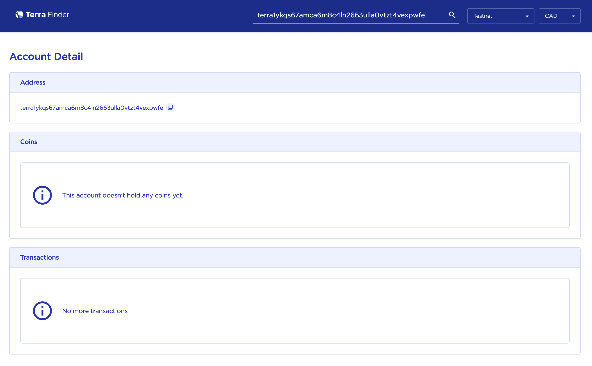
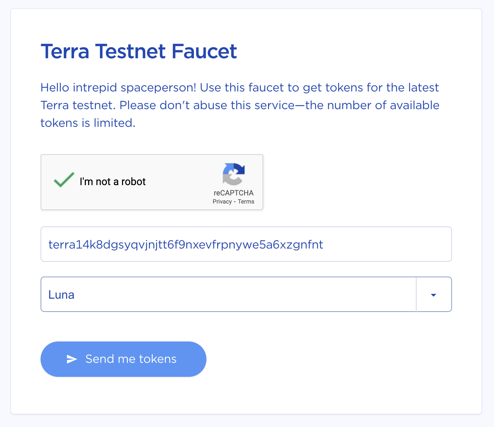
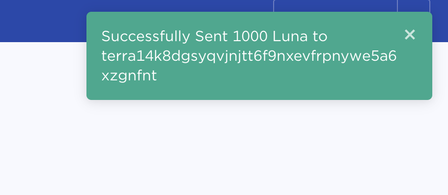

## Introduction

In this tutorial, we will be creating your first Terra account using the Terra SDK and [**DataHub**](https://datahub.figment.io/).

## Prerequisites

Please make sure that you completed the previous tutorial, "Connecting to a Terra node with DataHub" before beginning this one. We will be building on top of the Nodejs application created in the previous tutorial.

## Creating an Account

Time to start building! We are finally ready to jump in and create our Terra account on the Bombay testnet.

Create a file `create_account.js` with the snippet below:

```javascript
const { LCDClient, MnemonicKey } = require('@terra-money/terra.js');
require('dotenv').config();

const main = async () => {
  const terra = new LCDClient({
    URL: process.env.TERRA_NODE_URL,
    chainID: process.env.TERRA_CHAIN_ID,
  });

  const mk = new MnemonicKey();

  console.log('address: ', mk.accAddress);
  console.log('mnemonic: ', mk.mnemonic);
};

main()
  .then(resp => {
    console.log(resp);
  })
  .catch(err => {
    console.log(err);
  });
```

Here is a walkthrough of for the code above:

- Import the Terra SDK and initialize dotenv which will load variables from `.env` file to become available from `process.env.*`
- Create an `LCDClient` using the URL and `chainID` from the `.env` file
- Create a randomly generated mnemonic key which is essentially an account address and a list of secret words associated with this account
- Output mnemonic and `accAddress`. This is important because we will need to store those values in our `.env` file

Once this file is in place, you can run the `create_account.js` script:

```javascript
node create_account.js
```

If everything works, you should see your address and mnemonic in your console. Please make sure that you always backup your mnemonic as this is very sensitive data that allows you to restore your account.

<Hint type="info">
  Never share your mnemonic with anyone. Never commit it to a repo. Remember!
  You can share your account address, but never your mnemonic.
</Hint>

In order to make sure our code doesn't leak sensitive data, we can use our `.env` file where we can store both our account address and our mnemonic. Open up `.env` and add to it the following lines:

```javascript
ADDRESS = '<YOUR ADDRESS>';
MNEMONIC = '<YOUR MNEMONIC>';
```

Great! Now both `ADDRESS` and `MNEMONIC` will be available for use in our Nodejs scripts.

## Getting testnet tokens

Congratulations! You’ve just created your Bombay account.

You can go to this URL <https://finder.terra.money/testnet/> to check your address with the search bar. Once you enter your address, you should see something similar to:



Now that you have an account, how about getting some tokens for testing? Let’s get you set up!

Copy your address to the clipboard and head to [Terra Faucet](https://faucet.terra.money/). Check “I’m not a robot”, paste in your address, select "Luna", and click `Send me tokens`.



After a few seconds you should see a message pop up on the top right corner of the screen:



That's it! Now head back to the Terra Finder app, refresh the page and enjoy the view of 1000 LUNAs in your account.


Great work. You’ve earned it!

## Conclusion

You now have an account on the Terra Bombay-12 testnet and your secret information stored in the `.env` file. You also made sure that your account balance is loaded with testnet LUNAs.

The complete code for this tutorial can be found [**here**](https://github.com/figment-networks/tutorials/blob/main/terra/2_creating_account/create_account.js).

## Next Steps

In the [next tutorial](https://learn.figment.io/tutorials/setting-up-your-first-wallet), we will be looking at different queries we can run against a Terra node to get the information such as:

- Blockchain details
- Account details
- Luna price
- Proposals

If you had any difficulties following this tutorial or simply want to discuss Terra tech with us you can [join our community today](https://discord.gg/devchat)!
