# Introduction

This tutorial explains how to mint fungible tokens on the Tezos blockchain. In this tutorial, we will write a smart contract in SmartPy and deploy it on Granadanet, upload the token metadata to IPFS and then mint the token using better-call.dev. We will also cover how to mint tokens using React and taquito.

# Prerequisites

- Basic Knowledge of SmartPy
- Basic Knowledge of functional components and React Hooks (mainly useState)

# Requirements

- Temple Wallet installed in your browser. Get it from <https://templewallet.com/>
- You will need some XTZs on Granada Testnet in your wallet account. To get them, you can refer to the Faucet and Temple Wallet section in [this tutorial.](https://learn.figment.io/tutorials/using-the-smartpy-ide-to-deploy-tezos-smart-contracts#faucet-and-temple-wallet).
- [NodeJS](https://nodejs.org/en/download/) v14 LTS or higher and npm installed
- [git](https://git-scm.com/downloads) installed

# SmartPy

SmartPy is an intuitive and powerful smart contract development platform for Tezos. It provides a Python library for building and analyzing Tezos smart contracts. With the SmartPy IDE, we can quickly write our code in the browser itself. We can also deploy our code from the browser. No local setup is required. So, Let's get started! Open <https://smartpy.io/ide>


You can explore and look at the template codes given.\
To move to the editor, click CLOSE.

# Token Contract and FA2 Standard

The left panel is where we are going to code.\
We are going to follow the FA2 token standard([TZIP-12](https://tzip.tezosagora.org/proposal/tzip-12/)) for our token.

First, we will import the SmartPy library.

```python
import smartpy as sp
```

Now we will import the FA2 template. Most of the features (mint, transfer) we need have already been implemented in this template.

```python
FA2 = sp.io.import_template("FA2.py")
```

We can use this template and inherit it in our Token class. Since the entrypoints we need for this tutorial are already in the template, we don’t need to change the class, just pass it. This will be our contract.

```python
class Token(FA2.FA2):
    pass
```

Let’s write some tests for our contract.

We need some accounts for testing; let's add two test accounts, Tom and Jerry. We also need to set an admin for our contract as well. For admin, you can use a test account and set your address as admin later from storage JSON while deploying, but I prefer putting it in the test itself.

```python
@sp.add_test(name="tests")
def test():
    jerry = sp.test_account("Jerry")
    tom = sp.test_account("Tom")
    admin = sp.address("tz1aV2DuPYXEK2mEVc4VBhP9o4gguFGxBky4")
```

Change the address being passed to `sp.address` to your address (your wallet account public key).

We need to create `test_scenario` and assign a heading to it using `scenario.h1`.

```python
    scenario = sp.test_scenario()
    scenario.h1("tutorial tests")
```

Now we will originate our Tokens contract. As we inherit the `FA2` template, we need to understand what parameters are required so we can change them according to our needs. We need to send config, admin and metadata to our contract.

The `FA2` template provides us with `FA2_config` which we will be using to configure the token's behaviour. There are multiple options, but the ones we need are `single_asset` and `non_fungible`. As we want our token to be fungible, we will set `non_fungible` to false. We only want the token to be of one type and for that we will set `single_asset` to true.

For the admin, we pass the admin address we created.\
For metadata, we will use `big_map`, in which we set where to look for the metadata - from `tezos-storage:content`. We can understand we need to look for content in the storage, where we will define the metadata as the name and description.

You can refer to [TZIP-16](https://tzip.tezosagora.org/proposal/tzip-16/) for more details on contract metadata.

```python
    token = Token(FA2.FA2_config(single_asset=True), admin=admin, metadata= sp.big_map({"": sp.utils.bytes_of_string("tezos-storage:content"),"content": sp.utils.bytes_of_string("""{"name": "Tutorial Contract", "description": "Fungible Token contract for the tutorial"}""")}))
```

Add the token to scenario.

```python
    scenario += token
```

Test the mint entry point.\
We send three parameters to the mint entry point.

- `token_id`: the token id must always be 0 as single_asset.
- `address`: the address to which we want to mint the token.
- `metadata`: for token metadata, we are using IPFS (will come to it later in this tutorial). The metadata is stored in a `map(string, bytes)` so, we need to convert the strings to IPFS for which `sp.utils.bytes_of_string` is used.\
  For now, use the same IPFS URL (ipfs://bafkreifrve4w57gccc546mnhdzxoyjfcse2pajplxsqe5u3fjnclaakloi)

Here, we are minting one token to Jerry and ten tokens to Tom's address. Remember, only the admin can run the mint query.

```python
    token.mint(token_id=0, address=jerry.address, amount=1, metadata = sp.map({"": sp.utils.bytes_of_string("ipfs://bafkreifrve4w57gccc546mnhdzxoyjfcse2pajplxsqe5u3fjnclaakloi")})).run(sender=admin)
    token.mint(token_id=0, address=tom.address, amount=10, metadata = sp.map({"": sp.utils.bytes_of_string("ipfs://bafkreifrve4w57gccc546mnhdzxoyjfcse2pajplxsqe5u3fjnclaakloi")})).run(sender=admin)
```

Let's test the transfer entry point also. For transfer, we will be using the `batchtransfer` helper defined in the FA2 standard. It will take the `from_` and `txs` arguments. `txs` is the array of transactions which contains the `to_` , `amount` and `token_id`.

Here, we are sending 2 token from tom to jerry.

```python
    token.transfer([
        token.batch_transfer.item(
            from_ = tom.address,
            txs = [
                sp.record(to_=jerry.address, amount=2, token_id=0)
            ])
    ]).run(sender = admin)
```

To check that the transfer went OK, output the data stored in token storage also:

```python
    scenario.show(token.data)
```

That's it for our contract. Here's the full code you can refer to:

```python
import smartpy as sp
FA2 = sp.io.import_template("FA2.py")

class Token(FA2.FA2):
    pass

@sp.add_test(name="tests")
def test():
    jerry = sp.test_account("Jerry")
    tom = sp.test_account("Tom")
    admin = sp.address("tz1aV2DuPYXEK2mEVc4VBhP9o4gguFGxBky4")
    scenario = sp.test_scenario()
    scenario.h1("tutorial tests")
    token = Token(FA2.FA2_config(single_asset=True), admin=admin, metadata= sp.big_map({"": sp.utils.bytes_of_string("tezos-storage:content"),"content": sp.utils.bytes_of_string("""{"name": "Tutorial Contract", "description": "Fungible Token contract for the tutorial"}""")}))
    scenario += token
    token.mint(token_id=0, address=jerry.address, amount=1, metadata = sp.map({"": sp.utils.bytes_of_string("ipfs://bafkreifrve4w57gccc546mnhdzxoyjfcse2pajplxsqe5u3fjnclaakloi")})).run(sender=admin)
    token.mint(token_id=0, address=tom.address, amount=10, metadata = sp.map({"": sp.utils.bytes_of_string("ipfs://bafkreifrve4w57gccc546mnhdzxoyjfcse2pajplxsqe5u3fjnclaakloi")})).run(sender=admin)

    token.transfer([
        token.batch_transfer.item(
            from_ = tom.address,
            txs = [
                sp.record(to_=jerry.address, amount=2, token_id=0)
            ])
    ]).run(sender = admin)

    scenario.show(token.data)
```

Run the code in SmartPy using the RUN button above the left (Editor) panel. You can also use CTRL+Enter on Windows, or CMD+Enter on macOS.

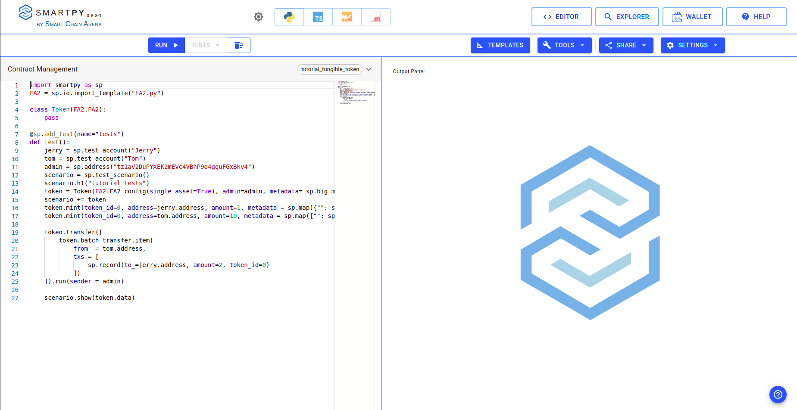

If there are no errors, we will get the output in the right terminal.\
We can check it according to the tests defined. We defined the heading `h1` in tests as “tutorial tests”, so we can see that on the top. Then, we minted one token to Jerry's address and ten tokens to Tom's address; we can see that as well. Then the transfer in which we're transferring two tokens from Tom to Jerry. So this looks perfect, and our contract is working correctly.

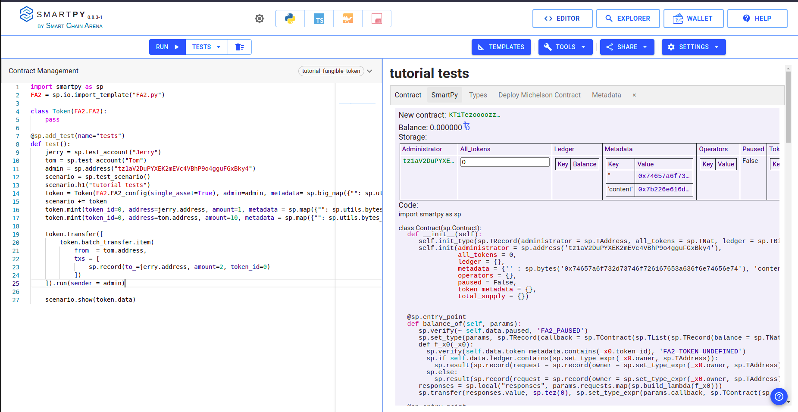

In the end, the contract storage shows that there are eight tokens in Tom's address and three tokens in Jerry's address, which is correct according to our tests.

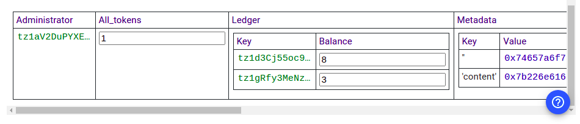

# Deploy Contract

It’s time to deploy this contract. For this tutorial, we are going to deploy the contract on the Granada testnet. We can deploy the contract using the Smartpy IDE itself. After running the tests, we get the option to Deploy Michelson Contract in the output panel.

Click on the Deploy Michelson Contract button.

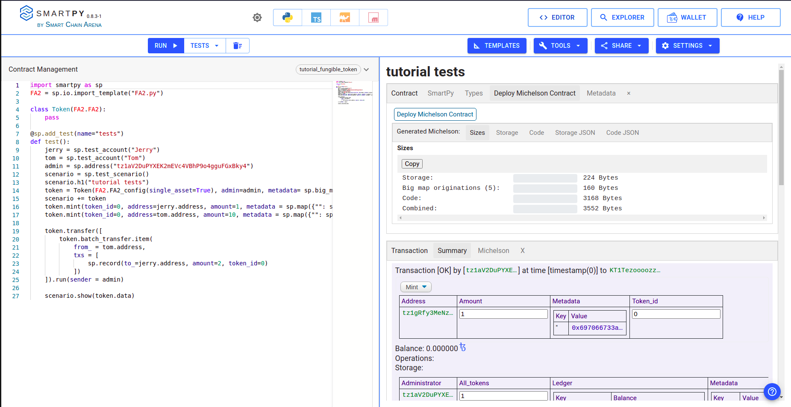

A new tab will open up.

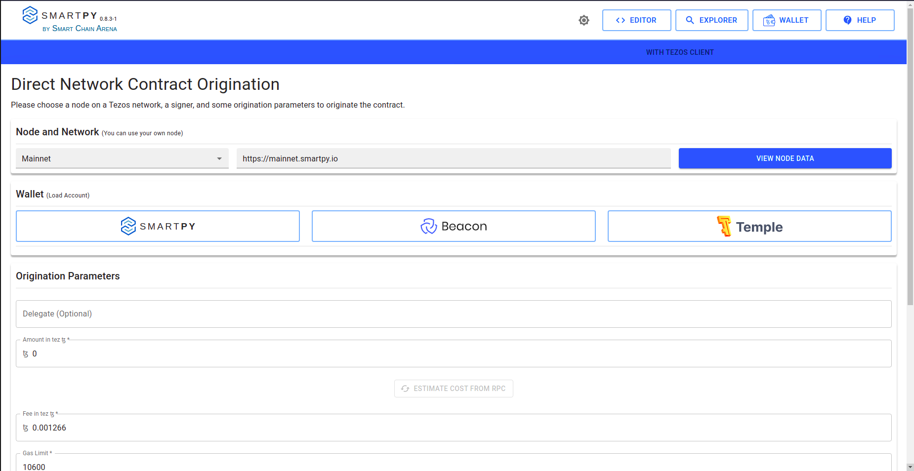

Choose Granadanet in the Node. Now Click on Temple Wallet. Choose one account (if you have multiple). And then press connect.

Account loaded with success will come.
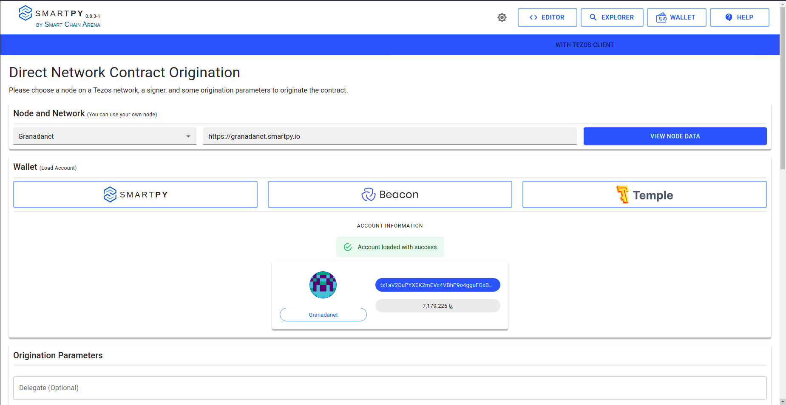

Scroll down below and click on Estimate Cost From RPC. It will refresh the cost. And after that, click on the DEPLOY CONTRACT button.
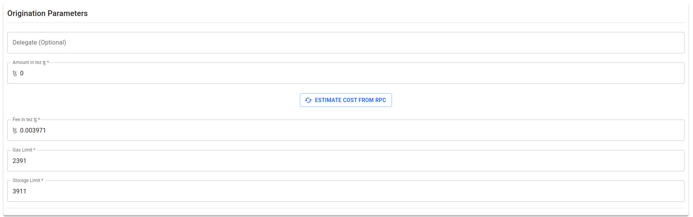

Accept the pre-signature information.

Then your wallet popup will come. Press sign.

Contract Originated Successfully will be shown. Copy the contract address(KT1VUvsQdZdBeRbnFdhfWJTi8tXSCAs5Yexi) and store it.


Hurray, we deployed our contract successfully.

# IPFS

IPFS is a distributed system for storing and accessing files, websites, applications, and data.\
And, we will use IPFS to store the metadata of our tokens. And to upload our files to IPFS, we will use nft.storage.\
In this tutorial, we will upload the token metadata in JSON format to IPFS.

For token metadata, decimals is the required field according to the FA2 standard. name and symbol fields are highly recommended. There are other fields also which can be used. You can read the details of all this in the Tezos Improvement Proposal [TZIP-21](https://tzip.tezosagora.org/proposal/tzip-21/).\
We will be storing the metadata in a JSON file. Create `token.json` and open it in any editor of your choice.

```json
{
  "name": "Tutorial Token",
  "symbol": "TUT",
  "decimals": 0,
  "shouldPreferSymbol": true
}
```

Edit the name, symbol, decimals and shouldPreferSymbol according to the need. If shouldPreferSymbol is set to true symbol is preferred over name in indexers, wallets.

So to upload files, visit [nft.storage](https://nft.storage/).

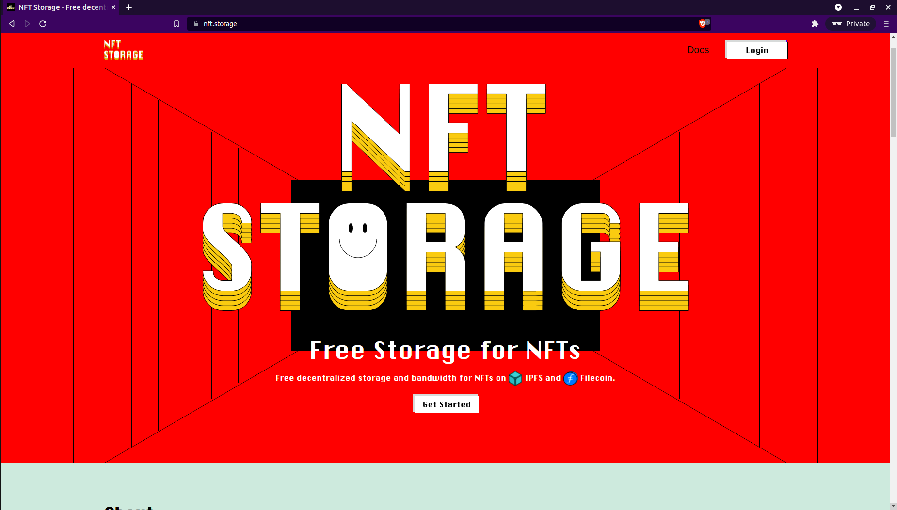

Log in and click on upload and choose the `token.json` and upload.

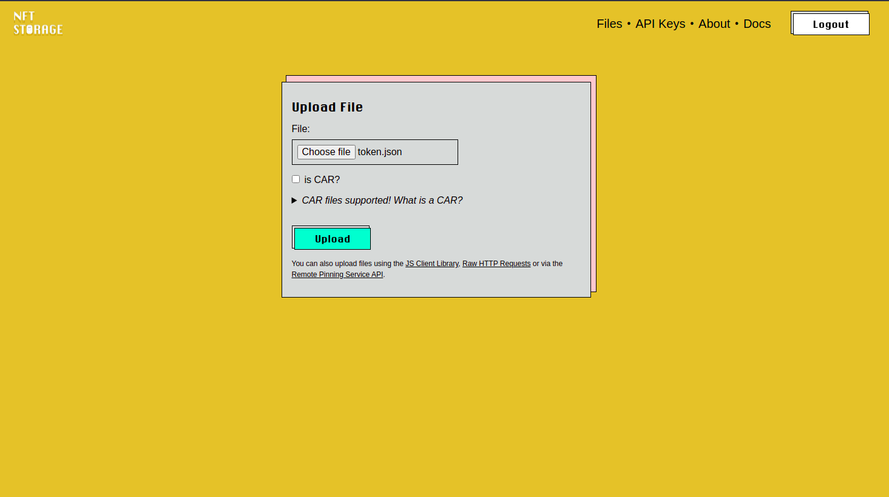

Upload it now.\
The file will get uploaded, and this is your hash.

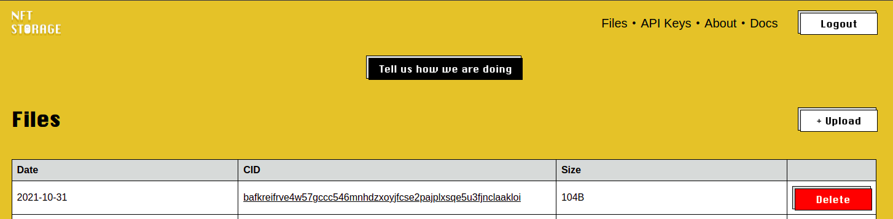

You can view your files visiting ipfs://{hash} - If your browser doesn’t support IPFS, you can use <https://ipfs.io/ipfs/{hash}>

# Mint using better-call.dev

It's time to mint our token. Open up [better-call.dev](https://better-call.dev/).

Move to the interact tab, open mint from the right sidebar.
Put the amount and address you want to mint the token to. The `token_id` should be 0 as our contract is a `single_asset`. And for metadata, we will take the hash of the `token.json` file we uploaded above and use ipfs://{hash} to set the token metadata. But for the token metadata, the ipfs URL needs to be in bytes. You can convert the strings to bytes from [here](https://tutorial-mint-nfts.vercel.app/char2bytes).

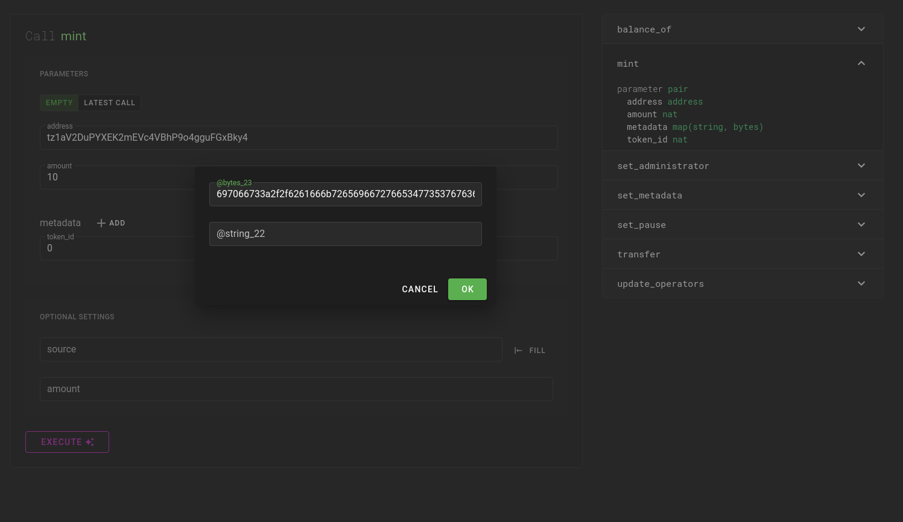

Press Execute and choose the wallet option. From the list of wallets, choose the temple wallet. And then use the account which was set to admin for the contract. This is important; we won’t be able to mint using any other address. Only admin can mint according to our smart contract.

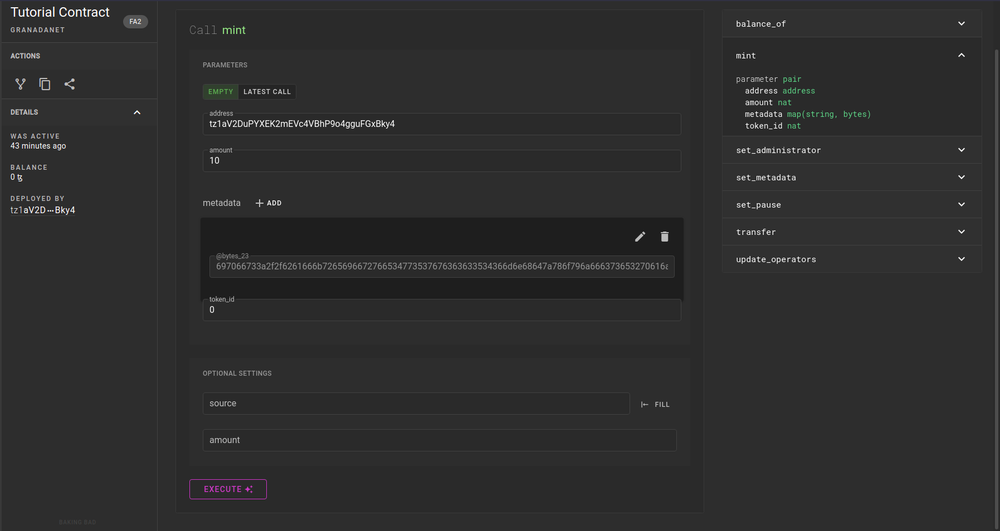

You can check the fees and also explore the operations which wallet is going to send. Then click confirm.

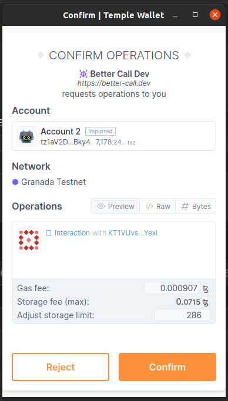

The message will come if it’s successfully sent.

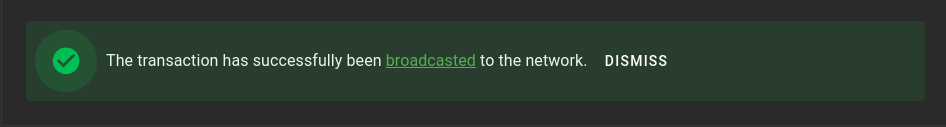

After a few seconds, refresh and move to the operations tab. You can see the mint operation.

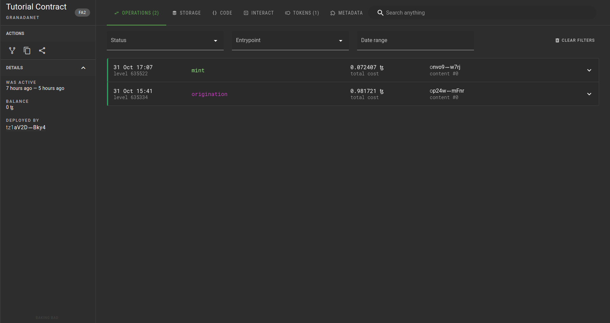

You can look at the metadata of the token in the tokens section.

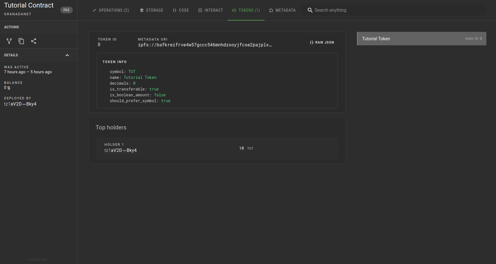

Hurray, we minted our token.

# Frontend

Import this boilerplate code using the following command.

```text
git clone -b boilerplate --single-branch https://github.com/PriyanshuDangi/Tutorial_Fungible_Tokens.git
```

Change into the directory created by the `git clone` command:

```text
cd Tutorial_Fungible_Tokens
```

Install all the dependencies

```text
npm i
```

Try running the app using

```text
npm start
```

And visit localhost:3000 to view the app. There is not much as of now, so let's build it.

The boilerplate has a folder structure and two pages.

- Mint (Form to mint the tokens)
- Transfer (Form to transfer tokens)

Open `src/config/config.js`. This is where we store our configurations.

```js
export const NAME = 'Tutorial'; // the name of the app
export const CONTRACT_ADDRESS = 'KT1VUvsQdZdBeRbnFdhfWJTi8tXSCAs5Yexi';
export const RPC_URL = 'https://granadanet.smartpy.io'; // network rpc url
export const NETWORK = 'granadanet';
```

Change the name and contract address accordingly, and as we deployed to Granada Testnet, we are using that network. If deployed on any other network, it can be changed accordingly.

Let’s import the TezosToolkit and beacon SDK, which we will use to connect to the wallet.
We also need to import our config object and char2Bytes from the Taquito utils.

```js
import { TezosToolkit, MichelsonMap } from '@taquito/taquito';
import { BeaconWallet } from '@taquito/beacon-wallet';
import * as config from '../config/config';
import { char2Bytes } from '@taquito/utils';
```

Next, we will be configuring the beacon wallet options and setting the wallet provider.

```js
const Tezos = new TezosToolkit(config.RPC_URL);

const options = {
  name: config.NAME,
  iconUrl: 'https://tezostaquito.io/img/favicon.png',
  preferredNetwork: config.NETWORK,
};

const wallet = new BeaconWallet(options);

Tezos.setWalletProvider(wallet);
```

Next, we will write functions to connect the wallet (requesting the user permission) and disconnect the wallet.

```js
const connectWallet = async () => {
  await wallet.requestPermissions({
    network: {
      type: config.NETWORK,
    },
  });
  return wallet;
};

const disconnectWallet = async () => {
  await wallet.clearActiveAccount();
};
```

To get the user's Public Key Hash (pkh) and get the contract, use the following functions.

```js
const getPKH = async () => {
  const pkh = await wallet.getPKH();
  return pkh;
};

const getContract = async () => {
  const contract = await Tezos.wallet.at(config.CONTRACT_ADDRESS);
  return contract;
};
```

Now to mint tokens, we need the user to connect their wallet and then sign the mint method. Use the IPFS url of the `token.json` we uploaded above.

```js
const mint = async (address, amount) => {
  await disconnectWallet();
  await connectWallet();
  const token_id = 0;
  let url =
    'ipfs://bafkreifrve4w57gccc546mnhdzxoyjfcse2pajplxsqe5u3fjnclaakloi';
  const contract = await getContract();
  url = char2Bytes(url);
  const op = await contract.methods
    .mint(address, amount, MichelsonMap.fromLiteral({ '': url }), token_id)
    .send();
  return await op.confirmation(3);
};
```

For the transfer function, we need the user to connect their wallet and sign the transfer method.

```js
const transfer = async (address, transactions) => {
  await disconnectWallet();
  await connectWallet();
  const token_id = 0;
  const txs = transactions.map(transaction => {
    return {
      to_: transaction.to,
      amount: transaction.amount,
      token_id: token_id,
    };
  });
  const contract = await getContract();
  const op = await contract.methods
    .transfer([
      {
        from_: address,
        txs: txs,
      },
    ])
    .send();
  return await op.confirmation(3);
};
```

Remember to export the `mint` and `transfer` functions from the file at the end.

```js
export { mint, transfer };
```

This was our `src/utils/wallet.js`.

As we are done with the utils now, we can code the pages to use these utils.

Let's start with our `src/components/mint/Mint.jsx` (remove the already present code).\
Let's import React, useState and our mint util first.

```jsx
import React, { useState } from 'react';

import { mint } from '../../utils/wallet';
```

Now we will set the initial app state with the React hook `useState`:

```jsx
const Mint = () => {
  const [loading, setLoading] = useState(false);
  const [message, setMessage] = useState('');
```

In our submit function, we take the address, amount from the input fields and then we call the mint util.

```jsx
const submit = async event => {
  try {
    event.preventDefault();
    setLoading(true);
    const address = event.target.address.value;
    const amount = event.target.amount.value;

    const op = await mint(address, amount);

    console.log(op);
    setMessage('Minted Successfully!');

    setLoading(false);
  } catch (err) {
    console.log(err);
    setLoading(false);
    setMessage('Error: Not Able to Mint');
  }
};
```

To close the toast, we set the message to empty.

```jsx
const closeMessage = () => {
  setMessage('');
};
```

This is our page code.

```jsx
  return (
    <div className="container">
      {message && (
        <div className="position-fixed top-0 end-0 p-3" style={{zIndex: 11}}>
          <div id="liveToast" className="toast fade show d-flex" role="alert" aria-live="assertive" aria-atomic="true">
            <div className="toast-body">{message}</div>
            <button type="button" className="btn-close me-2 m-auto" onClick={closeMessage}></button>
          </div>
        </div>
      )}
      <form onSubmit={submit}>
        <div className="mb-3">
          <label htmlFor="address" className="form-label">
            Address
          </label>
          <input type="text" className="form-control" id="address" aria-describedby="address" required />
        </div>
        <div className="mb-3">
          <label htmlFor="amount" className="form-label">
            Amount
          </label>
          <input type="number" className="form-control" id="amount" aria-describedby="amount" required min="1" step="1" />
        </div>
        <button type="submit" className="btn btn-primary" disabled={loading}>
          {loading && <span className="spinner-border spinner-border-sm" role="status" aria-hidden="true"></span>}
          Mint
        </button>
      </form>
    </div>
  );
};

export default Mint;
```

Remember to export the `Mint` component as the default export.

Now to make the Transfer component, in `src/components/transfer/Transfer.jsx` (remove the already present code). It will be mostly the same as the Mint component, with just slight changes. Let's import React, useState and our transfer util first:

```jsx
import React, { useState } from 'react';

import { transfer } from '../../utils/wallet';
```

Now we will set the initial app state with the React hook `useState`:

```jsx
const Transfer = () => {
  const [loading, setLoading] = useState(false);
  const [message, setMessage] = useState('');
```

In our `submit` function, we take the address, amount, to from the input fields and then we call the transfer util. Here we are only transferring to one account, but more transfers can be added to the transactions array.

```jsx
const submit = async event => {
  try {
    event.preventDefault();
    setLoading(true);
    const address = event.target.address.value;
    const to = event.target.to.value;
    const amount = event.target.amount.value;

    const transactions = [
      {
        to,
        amount,
      },
    ];

    const op = await transfer(address, transactions);

    console.log(op);
    setMessage('Transfered Successfully!');

    setLoading(false);
  } catch (err) {
    console.log(err);
    setLoading(false);
    setMessage('Error: Not Able to Transfer');
  }
};
```

Same as in Mint, to close the toast, we set the message to empty.

```jsx
const closeMessage = () => {
  setMessage('');
};
```

This is our page code.

```jsx
  return (
    <div className="container">
      {message && (
        <div className="position-fixed top-0 end-0 p-3" style={{zIndex: 11}}>
          <div id="liveToast" className="toast fade show d-flex" role="alert" aria-live="assertive" aria-atomic="true">
            <div className="toast-body">{message}</div>
            <button type="button" className="btn-close me-2 m-auto" onClick={closeMessage}></button>
          </div>
        </div>
      )}
      <form onSubmit={submit}>
        <div className="mb-3">
          <label htmlFor="address" className="form-label">
            From
          </label>
          <input type="text" className="form-control" id="address" aria-describedby="address" required />
        </div>
        <div>
          <div className="mb-3">
            <div className="mb-3">
              <label htmlFor="to" className="form-label">
                To
              </label>
              <input type="text" className="form-control" id="to" aria-describedby="to" required />
            </div>
            <label htmlFor="amount" className="form-label">
              Amount
            </label>
            <input
              type="number"
              className="form-control"
              id="amount"
              aria-describedby="amount"
              required
              min="1"
              step="1"
            />
          </div>
        </div>
        <button type="submit" className="btn btn-primary" disabled={loading}>
          {loading && <span className="spinner-border spinner-border-sm" role="status" aria-hidden="true"></span>}
          Transfer
        </button>
      </form>
    </div>
  );
};

export default Transfer;
```

It has a form in which there are `From`, `To` and `Amount` input fields, `Transfer` button to submit the form. And in the end, we close the Transfer function and default export it.

To start the server so you can view the app in your web browser, run the terminal command:

```text
npm start
```

Open your browser, and navigate to locahost:3000. You can now mint a token from the default page route `/` and transfer tokens on the `/transfer` route.

We completed the frontend. You can checkout the complete code on [Github](https://github.com/PriyanshuDangi/Tutorial_Fungible_Tokens).

# Conclusion

In this tutorial, we learned about coding in SmartPy, deploying a contract on the blockchain, and interacting with the contract using better-call.dev. We also built the frontend using React and learned how to interact using taquito.

And most importantly, we learned how to mint and transfer fungible tokens on Tezos.

# About The Author

This tutorial was written by Priyanshu Dangi, who is a Tezos India 2.0 Fellow. You can reach out to him on [Github](https://github.com/PriyanshuDangi).
