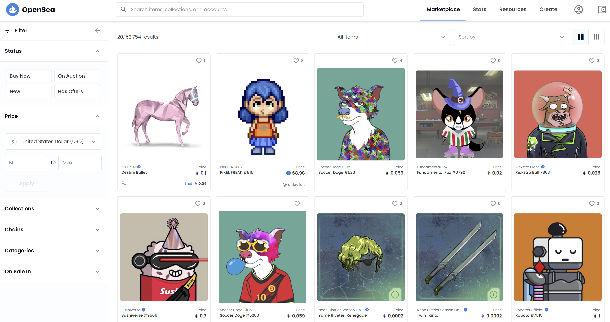
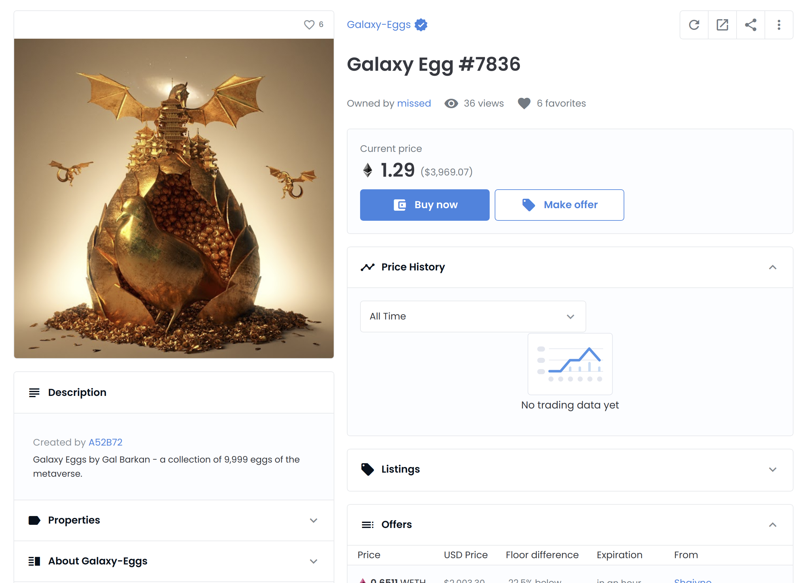

## Introduction

In this tutorial you will learn how to create a subgraph from an ERC-721 smart contract on Ethereum mainnet, deploy it to the Subgraph Studio, and then use the Subgraph Studio Playground to query the subgraph for information about the indexed transactions.


OpenZeppelin Subgraphs is a powerful library for easily indexing activity of OpenZeppelin Contracts. It simplies building subgraphs by supporting some of the most popular modules in OpenZeppelin Contracts, like `erc20`, `erc721`, `ownable` and so on. We shall be using `erc721` and `ownable` modules in this tutorial.

You can build a subgraph schema if you know the address of the smart contract. In this tutorial, you shall learn how to retrieve the smart contract address of some popular NFT collection using the OpenSea NFT marketplace.

The Subgraph Studio is where you can build and create subgraphs. You can add metadata to your graphs (even after deploying your subgraphs), deploy multiple versions of your subgraphs, as well as publish them to the decentralized Graph Explorer. You can also test your subgraphs in the Playground, where you can run graphql queries without incurring any querying fees. In this tutorial, you shall also learn how to create and deploy your subgraph to Subgraph Studio as well as query it using the Playground.

## Requirements

- You need to have a recent version of Node.js installed. We recommend using v14.17.6 LTS for compatibility.

## Project setup

Run the following command to install the Graph Protocol CLI globally. This is required to deploy your subgraph.

```text
npm i -g @graphprotocol/graph-cli@0.21.1
```

Because the latest version of the Graph Protocol CLI breaks compatibility with OpenZeppelin subgraphs, for this tutorial you will need to specifically install **v0.21.1** and not the latest version.

## Getting the NFT smart contract address

Head over to [OpenSea](https://opensea.io/assets), the largest NFT marketplace.



As you can see from the screenshot above, there are over 20 million NFTs on sale!

Click on the **Collections** tab on the left. There we can see many of the popular NFT collections like CryptoPunks, Art Blocks Curated, Galaxy-Eggs, and so on. Let's choose the **Galaxy-Eggs** NFT collection for this tutorial. Click on the **Galaxy-Eggs** link, which will take you to <https://opensea.io/collection/galaxyeggs9999>.


Click on any of the NFTs to view its display page:



From here you can click on the **Details** tab, to view the contract address for the NFT: <https://etherscan.io/address/0xa08126f5e1ed91a635987071e6ff5eb2aeb67c48>.

## Creating the project in Subgraph Studio

Now that you have the address of a smart contract that you want to index using the Graph Protocol, you can head over to the Subgraph Studio at <https://thegraph.com/studio/>.


Click on the **Connect button** at the top right side of the page. Choose a Metamask wallet to login with. Once authenticated, you will be at the main Studio page where you can create your first subgraph:


Click the "Create a Subgraph" button to begin. You need to give your subgraph a name. For now, give the name as _GalaxyEggNFT_ (this name is for display only and can be changed at any time). Once that's done, you can see details about the subgraph like your deploy key, the subgraph slug and status.


## Creating the subgraph

On your local machine or remote development environment, create a directory called `galaxyEggsNFT`, change into that directory, then initialize it as a new **npm** project by running:

```text
mkdir galaxyEggsNFT
cd galaxyEggsNFT
npm init --yes
```

Next, you need to install the OpenZeppelin Subgraphs package:

```text
npm install --save-dev @openzeppelin/subgraphs
```

To store the subgraph configuration, create a file called `subgraphconfig.json` with the following contents:

```json
{
  "output": "generated/",
  "chain": "mainnet",
  "datasources": [
    {
      "address": "0xa08126f5e1ed91a635987071e6ff5eb2aeb67c48",
      "startBlock": 13200000,
      "module": ["erc721", "ownable"]
    }
  ]
}
```

- **output**: the directory where your subgraph shall be stored
- **datasources**: an array of `datasource`, where each datasource defines the following properties:
  - **address** - smart contract address to create the subgraph from
  - **startBlock** (optional) - the block to start the subgraph indexing from, speeds up the indexing process
  - **module** - array of modules that we want to index

OpenZeppelin Subgraphs support the following modules:

- `accesscontrol`
- `erc20`
- `erc721`
- `governor`
- `ownable`
- `pausable`
- `timeblock`

Since NFTs are `erc721` modules, we shall use that for indexing, along with the `ownable` module. To build the subgraph, run the following command:

```text
npx graph-compiler --config subgraphconfig.json --include node_modules/@openzeppelin/subgraphs/src/datasources --export-schema --export-subgraph
```

This will output:

```text
- Schema exported to generated/schema.graphql
- Manifest exported to generated/subgraph.yaml
```

It also creates a directory named `generated` containing two files:

- `subgraph.yaml`: This stores the [subgraph manifest](https://thegraph.academy/developers/working-with-the-graph/)
- `schema.graphql`: This defines the data to be stored and how it can be queried using GraphQL

Now we are ready to deploy the subgraph.

## Deploying the subgraph

Run the following command to set the deploy key for your subgraph project:

```text
graph auth --studio <DEPLOY_KEY>
```

Replace `<DEPLOY_KEY>` with the deploy key from the Studio page <https://thegraph.com/studio/subgraph/galaxyeggnft/>. You should see the following output:

```text
Deploy key set for https://api.studio.thegraph.com/deploy/
```

Once that is done, we can run the following commands to deploy the subgraph to Subgraph Studio:

```text
cd generated
graph deploy --studio galaxyeggnft
```

You can choose `v1.0.0` when you are prompted for a version label. You should see the following output:

```text
✔ Version Label (e.g. v0.0.1) · v1.0.0
  Skip migration: Bump mapping apiVersion from 0.0.1 to 0.0.2 (graph-ts dependency not installed yet)
  Skip migration: Bump mapping apiVersion from 0.0.2 to 0.0.3 (graph-ts dependency not installed yet)
  Skip migration: Bump mapping apiVersion from 0.0.3 to 0.0.4 (graph-ts dependency not installed yet)
  Skip migration: Bump mapping specVersion from 0.0.1 to 0.0.2
✔ Apply migrations
✔ Load subgraph from subgraph.yaml
  Compile data source: erc721 => build/erc721/erc721.wasm
  Compile data source: ownable => build/ownable/ownable.wasm
✔ Compile subgraph
  Copy schema file build/schema.graphql
  Write subgraph file build/node_modules/@openzeppelin/contracts/build/contracts/IERC721Metadata.json
  Write subgraph file build/node_modules/@openzeppelin/contracts/build/contracts/Ownable.json
  Write subgraph manifest build/subgraph.yaml
✔ Write compiled subgraph to build/
  Add file to IPFS build/schema.graphql
                .. QmPDKw3SDB138wUFYYvzAN1GatHRX6NvFwnDcvDfZsjwYp
  Add file to IPFS build/node_modules/@openzeppelin/contracts/build/contracts/IERC721Metadata.json
                .. QmXVNNtLfETmLrarDMwR18Tk2kNUXyczLf7LdES4aFZkLi
  Add file to IPFS build/node_modules/@openzeppelin/contracts/build/contracts/Ownable.json
                .. QmVjhxbJvwq39tGZCNxTDuY6rjW5HYiHzCm9kQnm1bLJ1M
  Add file to IPFS build/erc721/erc721.wasm
                .. QmUKy3JTwyeYNUn5BMa7SAWj3C6PAx47XBJQNfNG1X6Jb4
  Add file to IPFS build/ownable/ownable.wasm
                .. QmQg39Jp9zLUdShCcXoYjrnkhevLLpYerT3RcvYaxgZPph
✔ Upload subgraph to IPFS

Build completed: QmYDdVUPh6br4VqrgQzhM2i4Pedw7ysvDmhovvYVcA1Nu2

Deployed to https://thegraph.com/studio/subgraph/galaxyeggnft

Subgraph endpoints:
Queries (HTTP):     https://api.studio.thegraph.com/query/8676/galaxyeggnft/v1.0.0
Subscriptions (WS): https://api.studio.thegraph.com/query/8676/galaxyeggnft/v1.0.0
```

You have now deployed the subgraph to your Subgraph Studio account!

It will trigger a syncing process, where The Graph nodes will inspect historical blocks of Ethereum mainnet blockchain to retrieve any data for this subgraph. New blocks are inspected as soon as they are mined. Wait for the syncing process to be completed.

You shall also have access to the Playground, where you can run your queries, like shown below.


**For now, you alone will have access to this subgraph in the Subgraph Studio. For others to be able to access your subgraph, you need to publish it to the Graph Network.**


Publishing meaning pushing your subgraph on-chain to either Ethereum mainnet or Ethereum Rinkeny testnet. This will allow you to see how your subgraph works in the [Graph Explorer](https://thegraph.com/explorer/).

For now, let's skip publishing this subgraph.

## Querying the NFT data

Your subgraph is composed of schema types called `Entities`, defined in `schema.graphql` file. For each Entity, The Graph will generate an `entity` and `entities` fields, as seen in <https://thegraph.com/studio/subgraph/galaxyeggnft>.

To retrieve all the Galaxy-Eggs NFTs created (along with their identifier and uri), use the below query in the Playground:

```graphql
{
  erc721Tokens {
    identifier
    uri
  }
}
```

You will get an output like:

```json
{
  "data": {
    "erc721Tokens": [
      {
        "identifier": "0",
        "uri": "ipfs://QmfB3KH8GuZA9xoTCNwwiMEMk9hZBUaUZnMMWKra57oUse/0.json"
      },
      {
        "identifier": "1",
        "uri": "ipfs://QmfB3KH8GuZA9xoTCNwwiMEMk9hZBUaUZnMMWKra57oUse/1.json"
      },

      ...

    ]
  }
}
```

Here `identifier` denotes the unique id used for an NFT. For example, in NFT **Galaxy-Eggs #2074**, **2074** is the identifier.

Note that we are using `erc721Tokens` and not `erc721Token` in the query. If we want to retrieve a specific NFT, we have to use `erc721Token`:

```graphql
{
  erc721Token(id: "0xa08126f5e1ed91a635987071e6ff5eb2aeb67c48/0x0") {
    identifier
    uri
  }
}
```

But in this case `id` field is mandatory and must be a string. It will output:

```json
{
  "data": {
    "erc721Token": {
      "id": "0xa08126f5e1ed91a635987071e6ff5eb2aeb67c48/0x0",
      "identifier": "0",
      "uri": "ipfs://QmfB3KH8GuZA9xoTCNwwiMEMk9hZBUaUZnMMWKra57oUse/0.json"
    }
  }
}
```

If you visit the above IPFS link, you will get the details of **Galaxy-Eggs #0** NFT:

```json
{
  "name": "Galaxy Egg #0",
  "description": "(art)tificial is an art studio that explores the boundaries of technology and art. Our first project is Galaxy Eggs - a generative collection of 9,999 Eggs of the metaverse that live on the Ethereum Blockchain. Our Art Director, Gal Barkan, has been creating futuristic and sci-fi art for the past 20 years - this collection is the culmination of a lifetime of work on one hand, and the beginning of a new chapter in taking part in the creation of the metaverse. For more info about (art)ificial and Galaxy Eggs, visit - artificial.art",
  "image": "ipfs://QmUM1uGBE6H8pQ2zQSUj2BTzbpLSvuX6jtpBCB38xSiz2q/"
}
```

To retrieve the NFT purchases, we shall use the `transactions` entity (along with its `id` field). Run the below query:

```graphql
{
  transactions {
    id
  }
}
```

You will get an output like:

```json
{
  "data": {
    "transactions": [
      {
        "id": "0x0003b95db41b4bdadddb234d4d932fdc26bf9890267073e488e4b6f9fdb27400"
      },
      {
        "id": "0x000a9c8ddadffcd8832723fd2227c98d5401df2f83f9297205386fc59e8de13b"
      },

      ...

    ]
  }
}
```

The value of each `id` is a valid transaction hash on Ethereum mainnet. As an example, if you view the first transaction hash ([0x0003b95db...](https://etherscan.io/tx/0x0003b95db41b4bdadddb234d4d932fdc26bf9890267073e488e4b6f9fdb27400)) on the Etherscan block explorer, you can see it is a purchase transaction of the NFT **Galaxy Egg #8331**!

You can get the details from the Playground using the query:

```graphql
{
  erc721Transfers(orderBy: timestamp, orderDirection: desc) {
    token {
      identifier
    }
    to {
      id
    }
    transaction {
      id
    }
  }
}
```

`orderBy` and `orderDirection` attributes can be used to sort the results by a specific field. In this example, let's sort it based on the purchase timestamps in descending order, meaning last purchases will come first in the result.

`id` field inside the `to` field, denotes the address to which the NFT is transferred.

You shall get the below output:

```json
{
  "data": {
    "erc721Transfers": [
      {
        "to": {
          "id": "0x98c2f3a23a967ed100b6c51dcab8e354804e05d1"
        },
        "token": {
          "identifier": "2174"
        },
        "transaction": {
          "id": "0x31663947a5619c75217d127caa7c128d868c5b4cc3d8145d9b78e0e9a6e4a155"
        }
      },

      ...

    ]
  }
}
```

You can view the transaction on Etherscan ([0x31663947a...](https://etherscan.io/tx/0x31663947a5619c75217d127caa7c128d868c5b4cc3d8145d9b78e0e9a6e4a155)). As you can see it's the sale of **Galaxy Eggs #2174** made by the account `0x98c2...05d1`, which is exactly what is in the output!

## Conclusion

Congratulations on finishing this tutorial! You have learned how to retrieve the smart contract address of an NFT collection from OpenSea. You also learned how to create and deploy a subgraph for an NFT collection on Subgraph Studio, as well as query the subgraph for specific information using GraphQL and the Subgraph Studio Playground.

## About the author

I'm Robin Thomas, a blockchain enthusiast with few years of experience working with various blockchain protocols. Feel free to connect with me on [GitHub](https://github.com/robin-thomas).
