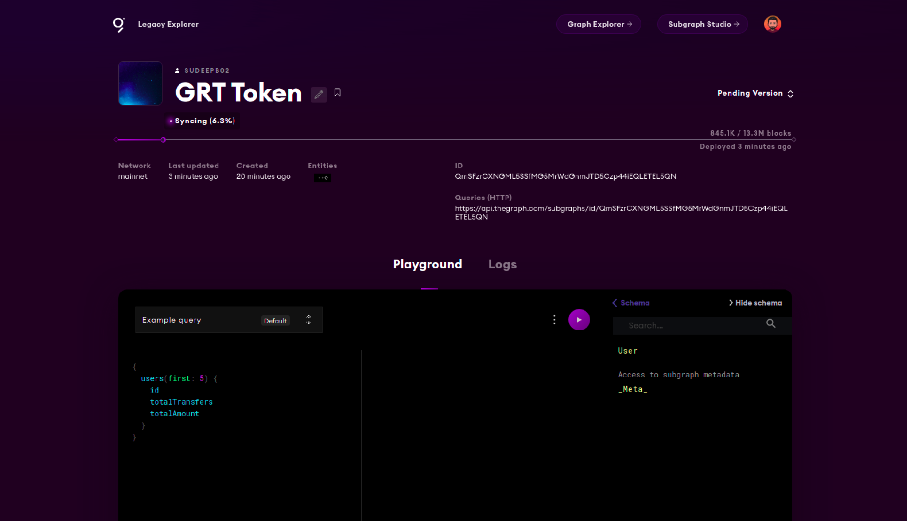

## Introduction

In this tutorial, we will learn how everything works in The Graph Network Subgraphs under the hood, right from the moment an event is emitted by a smart contract on the blockchain, to how it is indexed and then retrieved when a query hits the subgraph API endpoint.
In the process, we will also develop and deploy a simple subgraph on The Graph's hosted service for an ERC20 token - The Graph Network's GRT Token. The subgraph can be used to check the count of transfers from an address and the total amount of tokens transferred.

## Prerequisites

This tutorial is targeted at technical as well as non-technical individuals. However, some basic technical knowledge in the blockchain domain might help understand the concepts easily. You can go through the tutorial and try things on The Graph Explorer Playground, or follow hands-on with the steps as we progress through the tutorial.

## Requirements

If you want to complete this tutorial hands-on, you would need the following:

- [nodejs](https://nodejs.org/en/) v14+
- Any IDE ([VS Code](https://code.visualstudio.com) recommended)

## Getting started

_Ever wondered how Uniswap gets the data for it’s analytics site Uniswap.info? Obviously, all data is available on-chain but how exactly is it extracted and displayed on the dashboard? Similarly, the likes of Aave, Synthetix, Sushiswap, Pooltogether and a lot more dapps? Well, the answer is The Graph Protocol. Centralized data aggregators running their scripts and bots on blockchain nodes are a thing of the past._

The Graph Protocol is a decentralized data indexing protocol for Web 3. Think of it as Google for Web 3, but instead of Google crawling and indexing all the sites with its algorithm on its proprietary nodes, The Graph protocol does this in a decentralized way. How is this on-chain data extracted from the blockchain which has had millions of blocks in the past stored in a cryptic format? How is this data indexed, aggregated, queried and displayed on a dashboard like Uniswap? The key to this is **Events**. Let’s take a look at the journey of a subgraph query right from the point where an event is emitted.

_Before we dive into Subgraph queries, let’s learn more about events in Ethereum smart contracts._

These same concepts may apply to other EVM and non-EVM blockchains as well.

Events are primarily used to log data and return values as a transaction does not record a method's return values on its own. These events are subscribed by the dApp front-ends and update their UI, or notify users whenever an event of interest is emitted.

Another interesting use case for events is that they can be used to store data on Ethereum cheaply for off-chain use. When an event is emitted from a smart contract, the arguments are stored in the transaction log, which is a special data structure in the blockchain. These logs stay in the transaction logs forever as long as the blockchain is accessible, but they cannot be accessed from within the contracts themselves.

Using The Graph Protocol, it is possible to create Subgraphs which can derive meaningful data from events for analytics and data visualization. Though there is much more that you can do with the Subgraph, events play a major role in any Subgraph development.

For this tutorial, we will look at a simple transfer event from an ERC20 contract. We use the Graph Network GRT token which is deployed on Ethereum mainnet at address [0xc944E90C64B2c07662A292be6244BDf05Cda44a7](https://etherscan.io/address/0xc944E90C64B2c07662A292be6244BDf05Cda44a7)

```solidity
event Transfer(address indexed from, address indexed to, uint256 value);
```

Even if you don’t know Solidity or you’ve never read ERC20 contract code, you can still follow this tutorial without any difficulty. We will explain everything as we progress.

The above Transfer event is emitted by the ERC20 contract whenever a user sends some tokens to another address. It logs the `from` address, the `to` address and the `value` being sent.

```solidity
emit Transfer(sender, recipient, amount);
```

Once we have decided which contract(s) we need to watch and index data from, the next step is to develop and deploy the subgraph. The developer of the subgraph decides what and how to extract value from different events emitted from the smart contract. For this tutorial, let's say we want to know how many times an address has transferred tokens and what was the total amount of tokens transferred.

Let’s start by creating a Subgraph for the above contract using the Graph CLI tool and we will add our logic for achieving our goal. Install the Graph CLI using the command below:

Using npm:

```text
npm install -g @graphprotocol/graph-cli
```

Using yarn:

```text
yarn global add @graphprotocol/graph-cli
```

Visit the [Graph Hosted service dashboard](https://thegraph.com/legacy-explorer/dashboard) and login with your Github account. Create a new subgraph by clicking on the `Add Subgraph` button and name it `grt-token`. You can add other details for the subgraph or skip it for now.

Initialize the subgraph using the command below and enter all the details for the subgraph. Please refer to the screenshot below for help:

```text
graph init grt-token
```


This will create a new subgraph for us with some auto-generated code that will help us bootstrap our subgraph.

Open the Subgraph dashboard and copy the access token.


We will use this access token to authenticate ourselves with The Graph. The command to authenticate is `graph auth` and we need to select the hosted-service option when prompted.

```text
graph auth
```


Now we need to change to the project directory `grt-token` (which was generated using the `graph init` command) and deploy our subgraph to the explorer using the `yarn deploy` command.

```text
cd grt-token
yarn deploy
```


After the deployment is complete, you should be able to see the subgraph on your dashboard. The subgraph will be in Pending state until all the blocks are processed. You can see the current syncing status.

The Graph CLI generated a basic subgraph for us. Let’s open the code using an IDE. You can use any IDE of your choice, here I am using VS Code.

The project directory has the following structure:

```text
- abis
- generated
- node_modules
- src
    - mapping.ts
- package.json
- schema.graphql
- subgraph.yaml
- yarn.lock
```

Here, we have 3 main files that define our Subgraph - `subgraph.yaml`, `schema.graphql` and `mapping.ts`.

We check the `subgraph.yaml` file first which defines all the details about the subgraph such as the source contracts and events.


Each contract source defined under dataSources will be watched for various events that are emitted by the contract. Under eventHandlers, we can see the different types of events that are emitted by our ERC20 GRT token contract and the corresponding handler for that event.

If you are still confused about what a handler for an event is, head over to the `mapping.ts` file in the `src` directory. The first handler, `handleApproval` is auto-populated with some sample code and comments. To keep things simple, we will only focus on the Transfer event and its handler `handleTransfer` function which is currently empty.

```typescript
import { BigInt } from '@graphprotocol/graph-ts';
import {
  GraphToken,
  Approval,
  MinterAdded,
  MinterRemoved,
  NewOwnership,
  NewPendingOwnership,
  Transfer,
} from '../generated/GraphToken/GraphToken';
import { ExampleEntity } from '../generated/schema';

export function handleApproval(event: Approval): void {
  // Entities can be loaded from the store using a string ID; this ID
  // needs to be unique across all entities of the same type
  let entity = ExampleEntity.load(event.transaction.from.toHex());

  // Entities only exist after they have been saved to the store;
  // `null` checks allow to create entities on demand
  if (!entity) {
    entity = new ExampleEntity(event.transaction.from.toHex());

    // Entity fields can be set using simple assignments
    entity.count = BigInt.fromI32(0);
  }

  // BigInt and BigDecimal math are supported
  entity.count = entity.count + BigInt.fromI32(1);

  // Entity fields can be set based on event parameters
  entity.owner = event.params.owner;
  entity.spender = event.params.spender;

  // Entities can be written to the store with `.save()`
  entity.save();

  // Note: If a handler doesn't require existing field values, it is faster
  // _not_ to load the entity from the store. Instead, create it fresh with
  // `new Entity(...)`, set the fields that should be updated and save the
  // entity back to the store. Fields that were not set or unset remain
  // unchanged, allowing for partial updates to be applied.

  // It is also possible to access smart contracts from mappings. For
  // example, the contract that has emitted the event can be connected to
  // with:
  //
  // let contract = Contract.bind(event.address)
  //
  // The following functions can then be called on this contract to access
  // state variables and other data:
  //
  // - contract.allowance(...)
  // - contract.approve(...)
  // - contract.balanceOf(...)
  // - contract.decimals(...)
  // - contract.decreaseAllowance(...)
  // - contract.governor(...)
  // - contract.increaseAllowance(...)
  // - contract.isMinter(...)
  // - contract.name(...)
  // - contract.nonces(...)
  // - contract.pendingGovernor(...)
  // - contract.symbol(...)
  // - contract.totalSupply(...)
  // - contract.transfer(...)
  // - contract.transferFrom(...)
}

export function handleMinterAdded(event: MinterAdded): void {}

export function handleMinterRemoved(event: MinterRemoved): void {}

export function handleNewOwnership(event: NewOwnership): void {}

export function handleNewPendingOwnership(event: NewPendingOwnership): void {}

export function handleTransfer(event: Transfer): void {}
```

In simple terms, an event handler is a function or piece of code which is executed whenever the event for that handler is emitted. This is where exactly the journey of an event in the Subgraph starts after it is emitted by the smart contract. It is up to the developer of the subgraph to extract data from the contracts based on these different types of events emitted by the contract.

_How is this derived data from events stored, processed and retrieved whenever the data is requested via a query?_

Well, here comes the **Indexer**. An Indexer is a participant in The Graph Network whose primary job is to provide indexing and query processing services. These indexers run the subgraph on their node and process and store the subgraph data so that is readily available whenever it is requested. The same subgraph can be indexed by multiple indexers.

_Note: Indexers are incentivized for their service to the network. [Read more about Indexers.](https://thegraph.com/docs/indexing)_

The data that is extracted and derived from the events is stored in **Entities**. Head over to the `schema.graphql` file. We can see that an `ExampleEntity` is already defined with a few attributes such as `id`, `count`, `owner` and `spender`. We will replace this entity with our new entity `User` that will store data for an address such as `totalTransfers` and the `totalAmount` of tokens transferred from this address.

Update the code under `schema.graphql` as below. You can refer to the complete code at the [github repository here](https://github.com/sudeepb02/grt-token-subgraph).

```graphql
type User @entity {
  id: ID!
  totalTransfers: BigInt!
  totalAmount: BigInt!
}
```

Let’s understand what this GraphQL type is for. We defined a new entity `User` which will have the attributes `id` of type `ID`, `totalTransfers` and `totalAmount` which are of type `BigInt`. `ID` is a special data type (a string) which should be always unique. We will have the user address as its ID so each user is identified uniquely by its Ethereum address. The exclamation mark (**!**) after the data type means that the value will never be `null`.

Save the file and open `subgraph.yaml`. We will remove most of the auto-generated code to keep things simple. We remove all other entities which were imported by default. We also remove all the events and their handlers except for the Transfer event and its eventHandler. The final contents of the file should look as below:

`subgraph.yaml`

```yaml
specVersion: 0.0.2
schema:
  file: ./schema.graphql
dataSources:
  - kind: ethereum/contract
    name: GraphToken
    network: mainnet
    source:
      address: '0xc944e90c64b2c07662a292be6244bdf05cda44a7'
      abi: GraphToken
    mapping:
      kind: ethereum/events
      apiVersion: 0.0.5
      language: wasm/assemblyscript
      entities:
        - Transfer
      abis:
        - name: GraphToken
          file: ./abis/GraphToken.json
      eventHandlers:
        - event: Transfer(indexed address,indexed address,uint256)
          handler: handleTransfer
      file: ./src/mapping.ts
```

Once you've made the changes to `subgraph.yaml`, save the file. Next, open the `mapping.ts` file where we will store our logic for aggregating the user data. First, let's clean up by removing the auto-generated code. Just leave the transfer handler as it is and import `User` entity instead of `ExampleEntity`. The final code should be as below:

`mapping.ts`

```typescript
import { BigInt } from '@graphprotocol/graph-ts';
import { Transfer } from '../generated/GraphToken/GraphToken';
import { User } from '../generated/schema';

export function handleTransfer(event: Transfer): void {}
```

Now we can build and deploy to check if everything works as expected. The subgraph obviously won’t do anything as of now, but it is a good practice to build and test code frequently after main logical changes. Open your terminal and run the command

```text
yarn codegen && yarn deploy
```

After the deployment is complete, you should see the latest version under Pending on The Graph Explorer and its status as Syncing.



We just verified that there are no issues with the code and the deployment is also successful. Now let’s start with the main logic of our Subgraph - extracting data from the transfer events and storing it using our `User` entity.

Head over to the `mapping.ts` file. The `handleTransfer` function should be blank and look like below:

```typescript
export function handleTransfer(event: Transfer): void {}
```

This function accepts the `Transfer` event as `event` which we imported at the top of the file. We can access all the details of the Transfer event and some state from the transaction and block using this event object such as event parameters, block hash, gas price for the transaction, transaction hash, etc. For this tutorial, we will only focus on the `event.params` property as the emitted event provides us will all the data that we need: user address and amount of tokens transferred.

Let’s define our user object using the event params. If you recall the event signature, we can access the user address using the `from` field. Here’s the event signature for reference

```solidity
event Transfer(address indexed from, address indexed to, uint256 value);
```

But before we create a new `User` object with the given address, we need to check if the user already exists. We can check that using the `load` method on the `User` entity as below:

```typescript
let user = User.load(event.params.from.toHexString());
```

Here, the load method accepts the unique ID for the entity. As mentioned above, we access the user address using the `from` field from the event params as `event.params.from`. As the `ID` field is a string type, we need to convert this address to hex string using the function `toHexString()` as above.

What if the address does not exist already and the load fails? In that case, it returns a `null` value. This might happen in cases where it is the first time that user transferred some GRT tokens.
So we check if the user object is `null`, and if it is, we create a new `User` object with the user address as its key value i.e `ID`.

```typescript
if (user == null) {
  user = new User(event.params.from.toHexString());
  user.totalTransfers = BigInt.fromI32(0);
  user.totalAmount = BigInt.fromI32(0);
}
```

We also set the values of `totalTransfers` and `totalAmount` to 0. As both these attributes are defined as Big Integers in the subgraph schema, we have to convert them to `BigInt` from a 32-bit integer value using the above syntax.

Now whether the user is a new user or an existing one loaded from memory, we need to increment the value of `totalTransfers` and add the value of transfer amount to `totalAmount`.

```typescript
user.totalTransfers = user.totalTransfers.plus(BigInt.fromI32(1));
user.totalAmount = user.totalAmount.plus(event.params.value);
```

After all our operations, we need to save the updated values to the user entity using the save() method.

```typescript
user.save();
```

That’s it! You just developed your first subgraph. The final code in `mapping.ts` should be as below.

```typescript
import { BigInt } from '@graphprotocol/graph-ts';
import { Transfer } from '../generated/GraphToken/GraphToken';
import { User } from '../generated/schema';

export function handleTransfer(event: Transfer): void {
  let user = User.load(event.params.from.toHexString());
  if (user == null) {
    user = new User(event.params.from.toHexString());
    user.totalTransfers = BigInt.fromI32(0);
    user.totalAmount = BigInt.fromI32(0);
  }

  user.totalTransfers = user.totalTransfers.plus(BigInt.fromI32(1));
  user.totalAmount = user.totalAmount.plus(event.params.value);

  user.save();
}
```

Wasn’t it simple? Now let’s build and deploy our subgraph using the commands

```text
yarn codegen && yarn deploy
```

After the deployment is complete, you should see that the latest version is syncing under Pending tab. It might take some time for the subgraph to sync completely.

After the sync is complete, we can test our subgraph using the Graph Explorer Playground without having to use the API endpoints manually. This really helps for an easy test-build cycle. If you would like to integrate this subgraph to a front-end, you can use the Subgraph API endpoint which is visible at the top right next to our Subgraph details. For this tutorial, we will use the Graph explorer and Playground for testing.


We are finally at the last stage of our tutorial, where our subgraph receives a query request and returns the requested data. To view all the data that is available to query, we can check the Subgraph schema which is available to the right hand side of the Subgraph Playground. We can see our User entity under schema. Clicking on the entity will show us the attributes that are available.

If you didn't deploy the subgraph yourself, you can still test using the subgraph which I have deployed here: [Graph Token](https://thegraph.com/legacy-explorer/subgraph/sudeepb02/grt-token)


If you notice above, we already have an existing query for our subgraph in the Playground. To start with testing, let’s fire this simple query.

```graphql
{
  users(first: 5) {
    id
    totalTransfers
    totalAmount
  }
}
```

This query returns the first 5 users and their attributes. Click on the **Play** button and you can see the results


Next, we will get the total number of transfers and amounts for any arbitrary account. We will use the Binance8 address [0xf977814e90da44bfa03b6295a0616a897441acec](https://etherscan.io/address/0xf977814e90da44bfa03b6295a0616a897441acec) which holds around 1.99% of the total GRT token supply at the time of writing this tutorial. Feel free to replace this with your own address or any other address. The query for getting this data looks something like this:

```graphql
{
  user(id: "0xf977814e90da44bfa03b6295a0616a897441acec") {
    id
    totalTransfers
    totalAmount
  }
}
```

Whenever a query is processed by the Graph Hosted service, the indexers which are run by The Graph Network team fetch the requested data and return it as a response in JSON format. You can also apply multiple filters to sort and refine this data. You can read more about [GraphQL API Queries](https://thegraph.com/docs/developer/graphql-api) for details.

Here is the response received for the above query

```json
{
  "data": {
    "user": {
      "id": "0xf977814e90da44bfa03b6295a0616a897441acec",
      "totalAmount": "171797175419564760000000000",
      "totalTransfers": "6"
    }
  }
}
```


Wait, doesn't this seems weird? How come the Binance address has only 6 transfer in all? Let's verify if our subgraph is indexing and returning the correct data. We will use Etherscan address filter for this purpose.

Head over to [Etherscan](https://etherscan.io/token/0xc944e90c64b2c07662a292be6244bdf05cda44a7) and enter the GRT token address 0xc944e90c64b2c07662a292be6244bdf05cda44a7. If you follow this link, you should already be on the GRT token page.

On right hand side of the Transfers, Holders, Info... tab, enter the Binance8 address in the Filters search box.


Here you can confirm that the data returned is indeed true as there are only 8 transfers(out of total 15) with Binance8 as the `from` address. Now this is just a simple example to verify this manually which might not be relevant or even possible for other subgraphs/addresses.

You can play around with the subgraph by entering other addresses or firing more complex queries. Good luck!

## Conclusion

Congratulations on completing this tutorial. In this tutorial, we learned how subgraph queries work and the process of how events are used to develop a subgraph. So next time you visit a dashboard powered by The Graph Network or hit a query to a subgraph, think of the journey of that subgraph query!

## Next Steps

The Graph Protocol recently launced its decentralized network, where anyone can join as an **Indexer** by staking a certain amount of GRT tokens. It also introduced other set of participants in the network along with Indexers such as **Curators**, **Delegators**, **Query Markets**, **Mediators**, **Fisherman** and **Arbitrators**.

It is a long list of participants and each one plays a significant role in the process. The journey of a query gets even more complex with the introduction of all these participants. The Graph network is currently in the process of complete decentralization and all the subgraphs are migrating from hosted service to the decentralized markets. We will learn more about this in our next tutorial! Until then, you can master subgraph development by following our other tutorials.

## About the author

Hey! I'm Sudeep Biswas and I hope you enjoyed this tutorial. I am passionate about blockchain and decentralized technologies and I'm currently working as a blockchain developer. Check out my work and feel free to reach out: [Github](https://github.com/sudeepb02)
