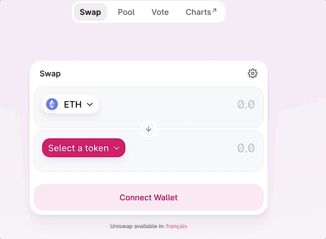
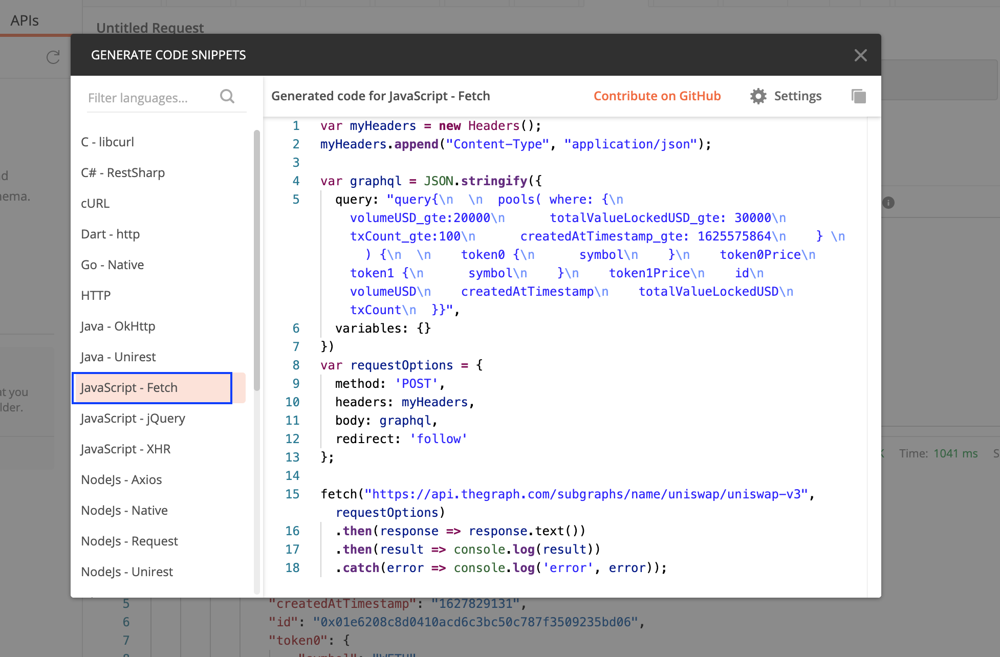

# Introduction

This tutorial is built to help non-technical people get a sense of how to interact with TheGraph and connect on-chain data into Google Sheets. I've been working on gathering crypto data in Google Sheets for a couple of years now and I found that sheets is a useful interface when filtering for new listed pairs on decentralized exchanges. In this tutorial you'll **learn how to find a UniswapV3 subgraph on The Graph, make a GraphQL request, translate the query in Javascript (Google Sheet's programming language) using Postman, and finally retrieve the pairs in the Sheet with a user-defined formula.**


# Prerequisites

For beginners with basic coding skills. This training assumes that you have a Gmail/Google account as we will be building upon Google Sheets. Also it would help if you have access to Postman to get an easier view on how to test a GraphQL request from TheGraph and transform it into Javascript code which is the Official programming language of Google Sheet .

- **GraphQL & Javascript knowledge are a plus.** Code can be written directly with the help of Postman and The Graph's website.
- **Postman's** software makes API development easier.
- Code :
  - uniswap.gs - for retrieving Uniswap's latest pair through The Graph API (later explained in the tutorial)
  - importJson.gs - for working with JSON objects in Google Sheets (later explained in the tutorial)

# First, what is Uniswap?

[Uniswap](https://academy.binance.com/en/articles/what-is-uniswap-and-how-does-it-work) is a **decentralized exchange protocol built on Ethereum.** To be more precise, it is an automated liquidity protocol. There is no order book or any centralized party required to make trades. Uniswap allows users to trade without intermediaries, with a high degree of decentralization and censorship-resistance.

This is how Uniswap’s Decentralized Exchange looks like:


# Getting familiar with TheGraph and GraphQL

[The Graph](https://graphql.org/) is a **decentralized protocol for indexing and querying data** from blockchains. It is able to query networks like Ethereum and since Uniswap is built on Ethereum, it will allow us to get its on-chain data.

## Finding the Uniswap V3 subgraph on The Graph

In this tutorial, we will be focusing on getting blockchain data on Version 3 of Uniswap. All you need to do is to search in TheGraph's explorer bar for Uniswap V3. The following picture shows you what TheGraph looks like and which subgraph we will be using:

- https://thegraph.com/legacy-explorer/subgraph/uniswap/uniswap-v3


## Building the GraphQL query

[GraphQL](https://en.wikipedia.org/wiki/GraphQL) is an **open-source data query and manipulation language for APIs,** and a runtime for fulfilling queries with existing data. GraphQL was developed internally by Facebook in 2012 before being publicly released in 2015.

On The Graph interface in playgroud mode, there is an example of a GraphQL query. This query gets the first 5 factories with id, poolCount, txCount and totalVolumeUSD, as well as the first 5 bundles with their id and ethPriceUSD.


For our purpose, we will just need to adjust a little the query to request pool pairs. We will be interested in filtering by constraints on the Number of Days the coin is active, the Volume ($), the Liquidity ($), and the number of Transactions. When you look at the pool parameters, you will find the following correspondence needed to build our constraints:

- Number of Days -> createdAtTimestamp
- Volume ($) -> volumeUSD
- Liquidity ($) -> totalValueLockedUSD
- Number of Transactions -> txCount

Now instead of using the standard (first:5) clause, we will need to build our GraphQL constraint there with the above variables. In order to do that we need to **build a "where" clause** where we tell the matching engine that we are looking for pool pairs created after a certain date (timestamp), with liquidity, volumes and number of transactions all greater than the amounts defined by the user.

In GraphQL to signal you need an amount **greater than,** you need to add \_**gte** at the end of your variable.

This is an example of how the constraint clause will look with theoretical values:

```graphql
where: {
      volumeUSD_gte:20000
      totalValueLockedUSD_gte:30000
      txCount_gte:100
      createdAtTimestamp_gte: 1625575864
    }
```

Subsequently in order to create the rest of the query, you need to display the symbols of the pair's tokens, prices, id (contract address), volume, liquidity, number of transactions and timestamp.

This is how the final graphQL query looks:

```graphql
query {
  pools(
    where: {
      volumeUSD_gte: 20000
      totalValueLockedUSD_gte: 30000
      txCount_gte: 100
      createdAtTimestamp_gte: 1625575864
    }
  ) {
    token0 {
      symbol
    }
    token0Price
    token1 {
      symbol
    }
    token1Price
    id
    volumeUSD
    createdAtTimestamp
    totalValueLockedUSD
    txCount
  }
}
```

You can replace the example query with this new query and press play in the playground. You should see the results.


## Testing model and translating the query into javascript using Postman

- [Download Postman](https://www.postman.com/downloads/)

Once you download Postman, you can open a new window like shown below:


To get the data in Postman, you will need to:

1.  Insert in the URL box the HTTP Query url from the Uniswap V3 subgraph (https://api.thegraph.com/subgraphs/name/uniswap/uniswap-v3)
2.  Change the GET into a POST request
3.  Copy/paste the above GraphQL query in Body and select GraphQL
4.  Click Send

You should get the same JSON table as on TheGraph.


# Connecting the model through Google Sheet

Once you confirmed that the query is functioning in Postman, you can transform the code into a Javascript Fetch request (for Google Sheet) using the Code button underneath the Save button.



The important part to save for the App Script in Google is:

```graphql
var graphql = JSON.stringify({
  query: "query{\n  \n  pools( where: {\n      volumeUSD_gte:20000\n      totalValueLockedUSD_gte: 30000\n      txCount_gte:100\n      createdAtTimestamp_gte: 1625575864\n    } \n		) {\n  \n    token0 {\n      symbol\n    }\n    token0Price\n    token1 {\n      symbol\n    }\n    token1Price\n    id\n    volumeUSD\n    createdAtTimestamp\n    totalValueLockedUSD\n    txCount\n  }}",
  variables: {}
})
var requestOptions = {
  method: 'POST',
  headers: {'Content-Type': 'application/json'},
  body: graphql,
  redirect: 'follow'
};
```

## Building the javascript function in Sheets

We want to have floating parameters in the function in order to filter new pairs based on our different parameters:

- Number of days since the pair was created : \[createdAtTimestamp_gte]
- Minimum volume in USD threshold : \[volumeUSD_gte]
- Minimum liquidity in USD threshold : \[totalValueLockedUSD_gte]
- Minimum number of transactions since creation date : \[txCount_gte]

Let's define an asynchronous function with those 4 parameters as inputs

```javascript
async function UNISWAP(days, volume, liquidity, tx_count) {}
```

1.  In order to make the TheGraph post request, we need a threshold date (createdAtTimestamp_gte) in UNIX timestamp format. We can compute it as shown in the below code.
2.  Then we just need to change the fixed parameters from the model with the floating parameters (making sure they are in string) in the variable graphql.
3.  Afterwards we can copy/paste the requestOptions variable from Postman
4.  Finally we call the URLfetch using the ImportJSONAdvanced function that was created for Google sheets (by Brad Jasper and Trevor Lohrbeer version 1.5), using the API endpoint from the Uniswap V3 subgraph, and the requestOptions as well as the standard parameters of the ImportJSONAdvanced function.

```javascript
// Only for access to files in which the add-on or script is used, rather than all of a user's spreadsheets

/**
 * @OnlyCurrentDoc
 */

// Adding description for the function
/**UNISWAP
 * Returns new tradable pairs on Uniswap
 *
 * =UNISWAP(5,10000,10000,100)
 *
 * @param {days}                    the number of Days since the pair is active
 * @param {volume}                  the minimum Volume ($)
 * @param {liquidity}               the minimum Liquidity ($)
 * @param {tx_count}                the number of Transactions existant since creation
 * @customfunction
 *
 * @return a table with all new tradable pairs on Uniswap and their number of Days since Active, the Volume ($), the Liquidity ($), the number of Transactions
 **/

async function UNISWAP(days, volume, liquidity, tx_count) {
  // [1] Computing the threshold date (createdAtTimestamp_gte) in UNIX timestamp format
  unix_day = Math.floor(Date.now() / 1000 - parseFloat(days) * 86400);

  // [2] Changing the fixed parameters from the model with the floating parameters (making sure they are in string format)
  var graphql = JSON.stringify({
    query:
      'query{\n  \n  pools( where: {\n      volumeUSD_gte:' +
      String(volume) +
      '\n      totalValueLockedUSD_gte: ' +
      String(liquidity) +
      '\n      txCount_gte:' +
      String(tx_count) +
      '\n      createdAtTimestamp_gte: ' +
      String(unix_day) +
      '\n    } \n		) {\n  \n    token0 {\n      symbol\n    }\n    token0Price\n    token1 {\n      symbol\n    }\n    token1Price\n    id\n    volumeUSD\n    createdAtTimestamp\n    totalValueLockedUSD\n    txCount\n  }}',
    variables: {},
  });

  // [3] Copy/Pasting the requestOptions variable from Postman javascript code
  var requestOptions = {
    method: 'POST',
    headers: { 'Content-Type': 'application/json' },
    payload: graphql,
    redirect: 'follow',
  };

  // [4] Calling the URLfetch using the ImportJSONAdvanced function (by Brad Jasper and Trevor Lohrbeer version 1.5) that was created for Google sheets
  return ImportJSONAdvanced(
    'https://api.thegraph.com/subgraphs/name/uniswap/uniswap-v3',
    requestOptions,
    '',
    'noInherit',
    includeXPath_,
    defaultTransform_,
  );
}
```

## Copy/Pasting the code in Google Sheet

Open a Google sheet where you wish to use the Uniswap function -> Go to **Tools › Script editor**


Replace the empty function with the code we just created.


Add the [ImportJSON script by Brad Jasper and Trevor Lohrbeer version 1.5](https://raw.githubusercontent.com/Eloise1988/ImportJSON/master/ImportJSON.gs)


Once you save the code, you need to activate the [Manual authorization scopes for Sheets](https://developers.google.com/apps-script/guides/services/authorization).

## Uniswap Formula

Once all of these steps are done, you should be able to request the newest tradable pairs on Uniswap, giving constraints on the Number of Days the pair has been active, the Volume ($), the Liquidity ($), and the number of Transactions.


- [Here is the access to the live template sheet](https://docs.google.com/spreadsheets/d/1tME9nMh79KzZP4Wmld7lezom6je4BOw_0T9ABf5GKXE/edit?usp=sharing)

For example, if I want to get the new Uniswap pairs where the pool was launched in the last 2 days, the daily Volume is greater than $1'000, the Liquidity is above $10'000 and there has been more than 10 Transactions since the launch.
The formula is:
**=UNISWAP(2,1000,10000,10)**

which returns a table (see GIF above) with all new tradable pairs on Uniswap and their number of days since active, volume ($), liquidity ($), the number of transactions, prices and coin symbols. There are plenty more functionalities that can be added through the TheGraph API.

# Conclusion

A user-friendly interface that interacts with The Graph protocols using Google Sheet. In this tutorial you have learned how to :

1.  Find a UniswapV3 subgraph on The Graph
2.  Make a GraphQL request
3.  Translate the query in Javascript (Google Sheet's programming language) using Postman
4.  Retrieve the latest pairs in the Sheet with a user-defined formula under your specific constraints

# About the author

Eloise gathers cryptocurrency data to help users import and value their crypto portfolio in Google Sheets. She publishes her work in [Medium](https://eloise88.medium.com/) and hopes you can benefit from it.

And for developers who wish to directly check her work on [Github](https://github.com/Eloise1988), she built the [COINGECKO](https://github.com/Eloise1988/COINGECKO) repository for pricing as well as the [CRYPTOBALANCE](https://github.com/Eloise1988/CRYPTOBALANCE) repository for balances, staking, DEX prices, etc.

Feedback is very welcomed. A [TELEGRAM chat](https://t.me/TheCryptoCurious) is also available for support. If this project adds any value to you and/or are looking for personalized coding on your Google Sheets, don’t hesitate to leave a message. Thank you so much for investing your time in reading this article. Take care of yourself & your family in these challenging times!

# References

- https://github.com/Eloise1988/THEGRAPH
- https://github.com/bradjasper/ImportJSON
