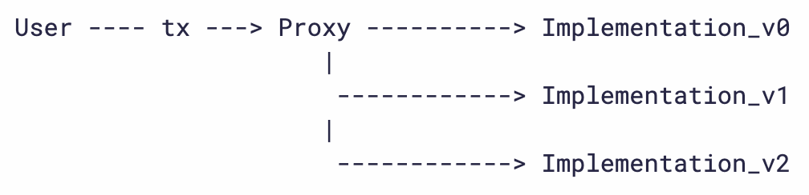
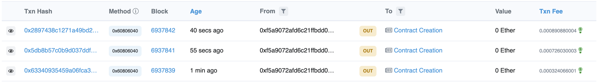
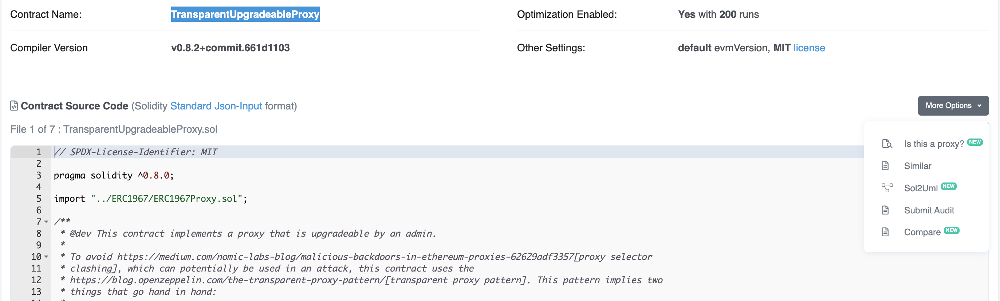
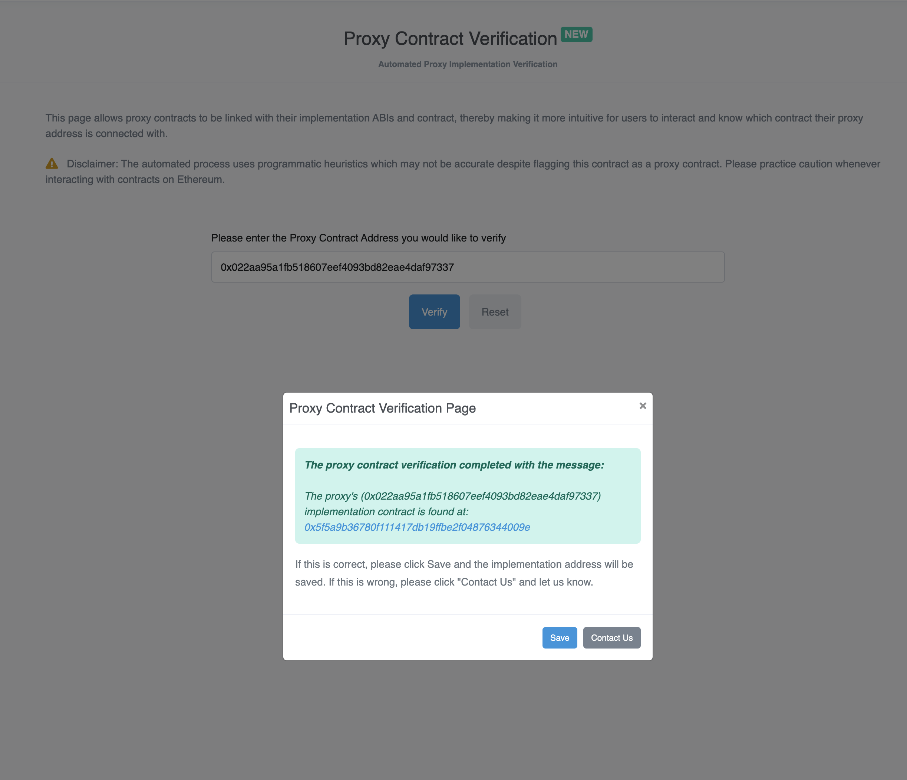
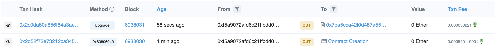

# Introduction

Smart Contracts are meant to be immutable! After all, that is a principal pillar on which decentralization rests. Why then do we have to need to create new versions of Smart Contracts (read upgrade)? Well, same reason why the V2 of software is better than V1. Duh! That was obvious, no?

OK! Granted. Why then do you not write another Smart Contract code and then redirect the users to a new version via the DApps frontend? Hmmm, fair point, until you have to take into account such things as:

- Tracking state changes.
- Developers interacting with the Smart Contract code.
- Easy Project Maintenance/Upgrade.

Just to mention a few reasons why upgrading a Smart Contract is necessary.

Now that the reason has been established, how then can a developer upgrade their Smart Contracts, knowing fully well that a Smart Contract once deployed to a Contract address cannot be deleted?

In this article, I’m going to demonstrate to you the **Transparent Proxy** pattern. To do this, we will build a simple Contract that we will upgrade to a new version. The Contract sets the price for a train ticket. Given that there are no rising Economic costs, the tickets cost the same wherever the destination, there is room provided for increasing the Ticket Price if ever there is the need. To do this, we will follow the steps:

- Write the code for v1 of the Train Ticket Smart Contract using Hardhat and deploy it to the Goerli Testnet.

- We will use an Open Zeppelin library called **hardhat upgrades** in the deployment scripts. The hardhat upgrades contain a method called **deployProxy**. This method ensures that when the contract is deployed, it creates a Proxy Contract as well.

- We will then write V2 of the Contract and then using hardhat upgrades, we will call the method **upgradeProxy** and point the deployed Contract to the proxy contract!
  The **upgradeProxy** method takes 2 args and any other args passed to the Contract call:

  ```typescript
  upgradeProxy(PROXY, Contract, [any args passed to the Contract])
  ```

---

# Prerequisites

If you have completed any of the Figment Pathways and deployed a contract to Polygon for example, you are ready for this article.
If you are yet to gain any such experience, writing and deploying a Smart Contract, kindly follow the Polygon pathway course [here](https://learn.figment.io/protocols/polygon).

This article assumes that you understand how to set up a Hardhat project. To get to up to speed, kindly read and complete the hardhat [tutorial](https://hardhat.org/tutorial/).

# Requirements

- You will need Metamask Private Key.
- You need to have a recent version of Node.js installed.
- You need to create an account on [Alchemy](https://www.alchemy.com/).

---

## Project setup

This is where we get into the Technical deets of upgrading Smart Contracts. We will rely on the Open Zeppelin Proxy patterns to understand the concept. It is important to note that upgrading Smart Contracts does not just mean adding code to an already existing Contract, in the example we are going to use for demonstration, we will write a Proxy Smart Contract that will point to the V2 of the contract V1. Where V2 is an updated version of V2 with all the functions still in use and more added, or some functions removed or an algorithm rewrite. The Proxy ensures that the same address is what points to V1, V2,... Vn of the said Smart Contract. This way, the user sends a txn to the Proxy Contract, which then interacts with whatever version it is pointed to. Yes, each version and the proxy are immutable!



## TrainTicketV1.sol

I have a standard practice of writing Smart Contracts in Remix and then initializing a Hardhat Project on my machine. Thus, we will write the TrainTicketV1 using Remix.

Here is TrainTicketV1.sol

```solidity
// SPDX-License-Identifier: GPL-3

pragma solidity ^0.8.14;

/// @title A Train Ticket Contract
/// @author Emma Odia
/// @notice This contract is used to demonstrate Upgrading Smart Contracts
/// @dev All function calls are currently implemented without side effects
/// @custom:experimental This is an experimental contract.
contract TrainTicketV1 {

    uint amount;
    address public owner;

    ///@notice Set the owner of the contract to the address calling this function
    ///@dev please note that once deployed in this state, any user can set themselves as owner
    ///@dev do not use this code in production
    function setOwner() public {
        owner = msg.sender;
    }

    ///@notice Set the Ticket Price. This is 1 GWEI 10 ^ 9
    function setTicketPrice() public {
        require(owner == msg.sender, "Only the owner can set price");
        amount = 10000000000;
    }

    ///@notice returns the ticket price
    ///@dev returns an int
    function getTicketPrice() view public returns (uint){
        return amount;
    }
}
```

Please note that this is for illustration purposes only and should not be deployed to production, especially given the reason that you do not want to give anyone the power to set the contract address and change ticket prices!

OK! Compile the contract in remix by using **CTRL + S**, once the code successfully compiles, that is a confirmation that the Smart Contract code works, and now we are going to set up a Hardhat Project and deploy the code to the Goerli testnet using Hardhat deploy script and Open Zeppelin Hardhat deploy.

## Hardhat Configuration

As stated in the prerequisites, this article assumes that you understand how to set up a Hardhat project, if you do not, kindly follow the Hardhat [guide](https://hardhat.org/tutorial/creating-a-new-hardhat-project.html) for creating a new hardhat project.

The steps are:

```text
$ mkdir upgradable-contract && cd upgradable-contract
$ npm init -y
$ npx hardhat
```

Select the option: **Create an empty hardhat.config.js**

If you used the guide above, then, Hardhat generated a **Greeter.sol** file in the Contracts dir. Delete the content and replace it with the TrainTicketV1 code above.

<Hint type="info">
  If you are familiar with writing Solidity, you will be surprised that the
  contract is not initiated with a Constructor argument. This was a gotcha
  moment for me too as I got to learn that Smart Contracts that are designed to
  be upgraded via the Transparent Proxy pattern are not initiated with a
  Constructor!
</Hint>

## Deploy Contract

We are going to deploy the Contracts to the Goerli Testnet. You can use any EOA via Metamask or Ganache UI, what you will need are the Private Keys and some ETH from the Goerli Faucet [here](https://goerlifaucet.com/)

N.B: You will need to have an Alchemy account to receive tokens from this faucet. This is fine anyway, as we will rely on Alchemy as a provider to deploy the Smart Contracts to Goerli.

Confirm that you have the follwing ready:

- Wallet Private Key (from Metamask preferably).
- Tokens from the Goerli Faucet.
- Sign in to [Alchemy](https://www.alchemy.com/), create a Project and get the API KEY for the Project.

We will add a dependency **[@openzeppelin/hardhat-upgrades](https://www.npmjs.com/package/@openzeppelin/hardhat-upgrades)** to the package.json file.

According to the [documentation](https://www.npmjs.com/package/@openzeppelin/hardhat-upgrades):

<Hint type="info">
  “You can use this plugin in a Hardhat script to deploy an upgradeable instance
  of one of your contracts via the deployProxy function.”
</Hint>

Seeing as we are installing dependencies, kindly throw in installing the dotenv library. Shsss… It is for secrets!

After the installation has been completed - which I’m certain you know how to do, or if you have forgotten, it is

```text
$ npm install --save-dev @openzeppelin/hardhat-upgrades dotenv
```

, now we are ready to write a script to deploy our Smart Contract to the Goerli Testnet.

To deploy to an actual network using Hardhat, we have to add a Network configuration to the `hardhat.config.js` file.
Deleted the `tasks` block of code, delete the hardhat-waffle dependency that came default with the file, add the required dependencies and update the module.exports config:

```solidity
require("@nomiclabs/hardhat-ethers");
require("@openzeppelin/hardhat-upgrades");
require('dotenv').config();

const ALCHEMY_API_KEY = process.env.ALCHEMY_API_KEY;
const EOA_PRIVATE_KEY = process.env.EOA_PRIVATE_KEY;

module.exports = {
  solidity: "0.8.14",
  networks: {
    goerli: {
      url: `https://eth-goerli.alchemyapi.io/v2/${ALCHEMY_API_KEY}`,
      accounts: [`${EOA_PRIVATE_KEY}`]
    }
  }
};
```

We will need the Alchemy API Keys and EOA Private Key hidden somewhere! As I mentioned earlier, it is a secret we will keep in a **.env** file! Remember to add **.env** to your **.gitignore** file if you are planning to push your code using a svm (software version manager such as git or tortoise) to any cloud service.

The Alchemy API KEY and the EOA Private Key are rendered to the hardhat config file using dotenv. Dotenv uses **process.env.EXAMPLE** to read files from the **.env** file.

It is in the hardhat configuration file **hardhat.config** that we also require the Hardhat upgrades and the hardhat ethers. Both are required for when we have to deploy the Smart Contract.

Now, we have the hardhat configuration ready, let’s compile the Contract to generate the artifacts and the cache dir.

```text
$ npx hardhat compile
```

When the contract is successfully compiled, a success message is returned to the terminal:
`Compiled 1 Solidity file successfully`

Next is our deploy script! Just so you recall, we are deploying the TrainTicketV1.sol Smart Contract which as already been compiled. Open the scripts folder and delete the sample scripts file created by Hardhat. Create a new file, you can name it `deploy_v1.js`, add the following code:

```typescript
const { ethers, upgrades } = require('hardhat');

async function main() {
  const Contract = await ethers.getContractFactory('TrainTicketV1');
  console.log('Deploying Train Tikcet v1...');

  const contract = await upgrades.deployProxy(Contract);
  await contract.deployed();

  console.log('Contract deployed to:', contract.address);
}

main()
  .then(() => process.exit(0))
  .catch(error => {
    console.error(error);
    process.exit(1);
  });
```

Let’s breakdown what happened here line by line:

```typescript
const { ethers, upgrades } = require('hardhat');
```

**ethers** is available to us as a class function on which we call the **getContractFactory** method. **upgrades** is also available via the hardhat library and we call the **deployProxy** method on it. As has been explained earlier, **deployProxy** is the magic function.

```typescript
await contract.deployed();
```

is to ensure we can read the deployed contract methods if we had a frontend for instance.

To deploy the Contract to the Goerli Testnet and experience the beauty of upgrading a contract using TransferProxy, run the following command:

```text
$ npx hardhat run scripts/deploy_v1.js --network goerli
```

It will return the console.log message prompts we added to the deploy_v1.js file

```text
Deploying Train Ticket v1...;
```

When successful, you will see the message below logged to the console:

```text
Contract deployed to: <contract.address>
```

## View Contract on Goerli

Open the Goerli Testnet Explorer: https://goerli.etherscan.io

Do not go to the Contract Address immediately, first look up the EOA that you used in deploying the Smart Contract and view the transactions (txns) that took place! Wait for it… You will find 3 (txns) and not 1! Haha! Fascinating!



Rank from top to bottom:

- 1. This is the **TransparentUpgradeableProxy**, this holds the Contract address where all new versions of Train Ticket will be interacted with.
- 2. This is the **ProxyAdmin** where all Transactions between upgrades and **TransparentUpgradeableProxy** will be routed.
- 3.This is the actual version 1 of the Train Ticket Contract!

To interact with the Contracts via etherscan, we will

- Verify and Publish the Smart Contract Code
- Verify the **TransparentUpgradeableProxy** and set it as a Proxy (i.e The Contract that will be interacted with.)

Via Etherscan, follow the steps to verify and publish the TrainTicketV1 contract. Once verification is done, go to the Proxy Contract (i.e **TransparentUpgradeableProxy**), open the Contract Tab and click on the dropdown button: **more options**



Click on: **Is this a Proxy?**

On the next screen, click on: **Verify**



Click: **Save**

The Contract is now verified and you have the **Read As Proxy** and **Write as Proxy** buttons!

Go test it LIVE! Here is my [implementation](https://goerli.etherscan.io/address/0x5f5a9b36780f111417db19ffbe2f04876344009e#code).

This is version 1 of the TrainTicket Smart Contract successfully deployed! We will deploy version 2 next. To do that, we need to

- Write **TrainTicketV2.sol**
- Compile the Contract.
- Write **deploy_v2.js** script.
- Deploy the Contract as a Proxy!

Just like eating sweet cake!

## TrainTicketV2.sol

```solidity
// SPDX-License-Identifier: GPL-3

pragma solidity ^0.8.14;

/// @title Train Ticket Contract V2
/// @author Emma Odia
/// @notice This contract is used to demonstrate Upgrading Smart Contracts. This is the V2
/// @dev All function calls are currently implemented without side effects
/// @custom:experimental This is an experimental contract.
contract TrainTicketV2 {

    uint amount;
    address public owner;

    ///@notice Set the owner of the contract to the address calling this function
    ///@dev please note that once deployed in this state, any user can set themselves as owner
    ///@dev do not use this code in production
    function setOwner() public {
        owner = msg.sender;
    }

     ///@notice Set the Ticket Price. This is 2 GWEI 10 ^ 9
     ///@dev The change made is the Price increase
    function setTicketPrice() public {
        require(owner == msg.sender, "Only the owner can set price");
        amount = 20000000000;
    }

    ///@notice returns the ticket price
    ///@dev returns an int
    function getTicketPrice() view public returns (uint){
        return amount;
    }
}
```

If you look closely, the only difference here is the new price set for purchasing Train Tickets! Inflation? I hope not!

Compile the Contract. It should compile successfully.

Next, the deploy script! Here is where it all gets interesting, watch closely. This time, name the file **deploy_v2.js**.

```solidity
const { ethers, upgrades } = require("hardhat");

const PROXY_CONTRACT = "0x022aA95A1fB518607eEF4093Bd82eAe4dAF97337";

async function main() {
  const Contract = await ethers.getContractFactory("TrainTicketV2");
  console.log("Deploying Train Ticket v2...");

  await upgrades.upgradeProxy(PROXY_CONTRACT, Contract)
  console.log("Contract Upgraded");
}

main()
  .then(() => process.exit(0))
  .catch((error) => {
    console.error(error);
    process.exit(1);
  });
```

I explained the method call **getContractFactory** on class **ethers**. What is different here is this:

> > We set the **PROXY_CONTRACT** address so that the new version of the Train Ticket contract can point to it.
> > The above is achieved when we call **upgradeProxy** method on **upgrades** class.

Deploy the new version!

```text
$ npx hardhat run scripts/deploy_v2.js --network goerli
```

Once, you have successfully deployed as confirmed from the messages logged to the console, go take a look at the new transactions on the address, this time you will find 2 transactions.



Rank from top to bottom:

- 1. This is the NEW ProxyAdmin where all Transactions between upgrades and **TransparentUpgradeableProxy** will be routed.
- 2. This is the actual version 2 of the Train Ticket Contract!

If you already realized that the **TransparentUpgradeableProxy** from the first deployment is where you contract is pointed to, then you are a-mazing!

All, you have to do now is:

- Verify and Publish the TrainTicketV2 contract
- Set as Proxy using the same steps as above!

Once that is complete, users are now interacting with V2 of your Smart Contract! You can upgrade as much as you want up to Vn…

---

# Conclusion

That my dear reader is how to upgrade a Smart Contract!

Here is my V2 [implementation](https://goerli.etherscan.io/address/0x53bbdb042997ddbf2be8116e6c6d3c9205026ab7#code).

Here is my Proxy Contract [implementation](https://goerli.etherscan.io/address/0x022aa95a1fb518607eef4093bd82eae4daf97337).

Thank you for reading this far! If you found the content useful, please kindly share it with your network.

You can find the complete source code [here](https://github.com/emmaodia/tutorials-code/tree/main/train-ticket).

Congratulations on finishing this guide! You have learned how to create an upgradable Smart Contract. If you successfully completed this guide, please, you are welcome to discuss it with other devs in the showcase channel of the Kafé Discord server. You can tag me @EM#0639

---

# About the Author

I'm @emmaodia, a solidity and javascript dev, with a fascination for EVM chians and Bridge Protocols. I'm very particular about sharing my knowledge of the blokchain.
If you enjoyed this guide, please connect with me on [GitHub](https://github.com/emmaodia) and discord @EM#0639.

---

# References

- Open Zeppelin has a great resource on explaining Proxy Contracts. You can learn about the various methods for upgrading Smart Contracts by reading the [article](https://docs.openzeppelin.com/upgrades-plugins/1.x/proxies).
